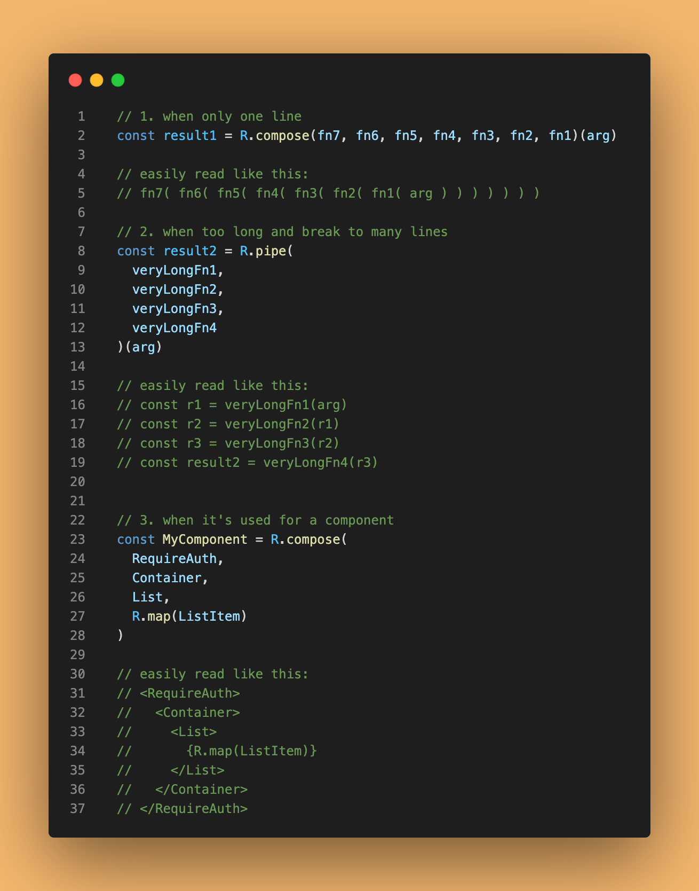
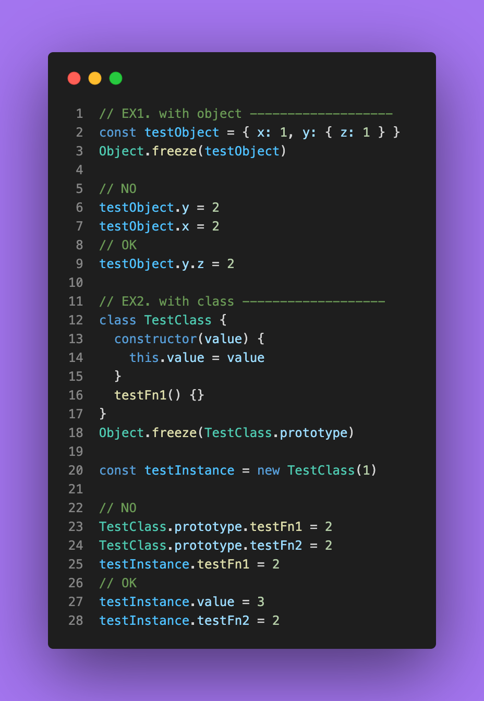

<style> 
.imgBox{
  display: flex; 
  flex-direction: column; 
  margin: 10%; 
  justify-content: center;
  border: 2px solid black;
}
</style>

<!-- --------------------- style --------------------- -->

##### <!-- ref -->

[#datastructure]: https://twitter.com/hashtag/DataStructure?src=hashtag_click
[#linkedlist]: https://twitter.com/hashtag/LinkedList?src=hashtag_click
[#javascript]: https://twitter.com/hashtag/JavaScript?src=hashtag_click
[#array]: https://twitter.com/hashtag/Array?src=hashtag_click
[#sort]: https://twitter.com/hashtag/sort?src=hashtag_click
[#v8]: https://twitter.com/hashtag/V8?src=hashtag_click
[#binarysearchtree]: https://twitter.com/hashtag/BinarySearchTree?src=hashtag_click
[#bst]: https://twitter.com/hashtag/BST?src=hashtag_click
[#jsmap]: https://twitter.com/hashtag/JSMap?src=hashtag_click
[#brave]: https://twitter.com/hashtag/Brave?src=hashtag_click
[#bat]: https://twitter.com/hashtag/BAT?src=hashtag_click
[#dijkstra's]: https://twitter.com/hashtag/Dijkstra?src=hashtag_click
[#algorithm]: https://twitter.com/hashtag/Algorithm?src=hashtag_click
[#shortedpath]: https://twitter.com/hashtag/ShortedPath?src=hashtag_click
[#codingtip]: https://twitter.com/hashtag/codingTip?src=hashtag_click
[#np]: https://twitter.com/hashtag/NP?src=hashtag_click
[#pos]: https://twitter.com/hashtag/PoS?src=hashtag_click
[#nodejs]: https://twitter.com/hashtag/Nodejs?src=hashtag_click
[#leetcode]: https://twitter.com/hashtag/LeetCode?src=hashtag_click
[#cors]: https://twitter.com/hashtag/CORS?src=hashtag_click
[#loop]: https://twitter.com/hashtag/loop?src=hashtag_click
[#recursion]: https://twitter.com/hashtag/recursion?src=hashtag_click
[#quicksort]: https://twitter.com/hashtag/quickSort?src=hashtag_click
[#cache]: https://twitter.com/hashtag/Cache?src=hashtag_click
[#blockchain]: https://twitter.com/hashtag/BlockChain?src=hashtag_click
[#consensus]: https://twitter.com/hashtag/Consensus?src=hashtag_click
[#poh]: https://twitter.com/hashtag/PoH?src=hashtag_click
[#solana]: https://twitter.com/hashtag/Solana?src=hashtag_click
[#deepclone]: https://twitter.com/hashtag/DeepClone?src=hashtag_click
[#browsers]: https://twitter.com/hashtag/browsers?src=hashtag_click
[#arithmetic]: https://twitter.com/hashtag/Arithmetic?src=hashtag_click
[#stack]: https://twitter.com/hashtag/Stack?src=hashtag_click
[#postfix]: https://twitter.com/hashtag/Postfix?src=hashtag_click
[#ithome]: https://twitter.com/hashtag/iThome?src=hashtag_click
[#rhs]: https://twitter.com/hashtag/RHS?src=hashtag_click
[#lhs]: https://twitter.com/hashtag/LHS?src=hashtag_click
[#event]: https://twitter.com/hashtag/Event?src=hashtag_click
[#dom]: https://twitter.com/hashtag/DOM?src=hashtag_click
[#prototype]: https://twitter.com/hashtag/prototype?src=hashtag_click
[#promise]: https://twitter.com/hashtag/Promise?src=hashtag_click
[#immutablejs]: https://twitter.com/hashtag/immutableJS?src=hashtag_click
[#immutable]: https://twitter.com/hashtag/Immutable?src=hashtag_click
[#fp]: https://twitter.com/hashtag/FP?src=hashtag_click
[#incentive]: https://twitter.com/hashtag/Incentive?src=hashtag_click
[#reclaiming_disk_space]: https://twitter.com/hashtag/Reclaiming_Disk_Space?src=hashtag_click
[#spv]: https://twitter.com/hashtag/SPV?src=hashtag_click
[#ramda]: https://twitter.com/hashtag/Ramda?src=hashtag_click
[#composition]: https://twitter.com/hashtag/Composition?src=hashtag_click
[#async]: https://twitter.com/hashtag/async?src=hashtag_click
[#composep]: https://twitter.com/hashtag/composeP?src=hashtag_click
[#composewith]: https://twitter.com/hashtag/composeWith?src=hashtag_click
[#web]: https://twitter.com/hashtag/web?src=hashtag_click
[#compose]: https://twitter.com/hashtag/Compose?src=hashtag_click
[#pipe]: https://twitter.com/hashtag/Pipe?src=hashtag_click
[#vulnerability]: https://twitter.com/hashtag/vulnerability?src=hashtag_click
[#prototype]: https://twitter.com/hashtag/Prototype?src=hashtag_click
[#freeze]: https://twitter.com/hashtag/freeze?src=hashtag_click
[#functor]: https://twitter.com/hashtag/Functor?src=hashtag_click
[#nft]: https://twitter.com/hashtag/NFT?src=hashtag_click
[#likecoin]: https://twitter.com/hashtag/LikeCoin?src=hashtag_click
[#audience]: https://twitter.com/hashtag/Audience?src=hashtag_click
[#creator]: https://twitter.com/hashtag/Creator?src=hashtag_click

<!-- ref -->

# [Daily Twitter](https://twitter.com/chiawei37995568)

## [2.22.2022](https://twitter.com/chiawei37995568/status/1495966071735857154) | [#Algorithm]

[1.](https://twitter.com/chiawei37995568/status/1495966071735857154)

> FIRST POST :)
>
> I switched to Software Engineer for 2 years.
> Recently study in data structure & algorithm.
>
> And join a study club, by now study in Block Chain. Just start from the first Bitcoin paper by Satoshi Nakamoto.
>
> I think more things will get the solution by BlockChain~

[2.](https://twitter.com/chiawei37995568/status/1495968642529660928)

> As mentioned above
>
> Our last book was "Information Architecture For the Web and Beyond".
>
> I think that's more like UX area in book, but by that I learned what key point designer care about & some methods to work through all the departments.
>
> And Document is very IMPORTANT :)

[3.](https://twitter.com/chiawei37995568/status/1496028872684765184)

> [#DataStructure]
>
> When to use [#LinkedList] instead of Array?
>
> If you have a data with known size and > NEED to insert and remove frequently,
> but DON'T need to random access any item and DON'T need speed when iterating.
>
> Use [#LinkedList] !

[See More in GitHub](https://github.com/ocup0311/Algorithm/blob/master/note/6_Linear%20Data%20Structure)

## [2.23.2022](https://twitter.com/chiawei37995568/status/1496416800174927872) | [#JavaScript]

> [#JavaScript] [#Array]
>
> The discussion changed me
> FROM always use array literal [ ] to create js array
> TO only when creating known-length array with copy items by
> new Array(length).fill(item)
>
> To create [ ] then push will need capacity growing too many times

[When to use new Array](https://coderwall.com/p/h4xm0w/why-never-use-new-array-in-javascript)

## [2.24.2022](https://twitter.com/chiawei37995568/status/1496833877113212929) | [#JavaScript]

> [#JavaScript] [#sort] [#V8]
>
> Before, for efficacy use Insertion Sort when length < 10 & Quick Sort when > 10.
> Let the result go unstable when > 10.
>
> Then change to Timsort in V8 v7.0 / Chrome 70.
>
> Finally it's all STABLE sorting now :)

[When to use new Array](https://v8.dev/blog/array-sort)

## [2.25.2022](https://twitter.com/chiawei37995568/status/1497136994706952193) | [#Algorithm]

> [#BinarySearchTree] [#BST]
>
> The traversal ways of Binary Search Tree are Breadth First Tree Traversal(BFT) & Depth First Tree Traversal(DFT).
> There are 3 ways for DFT (PreOrder, InOrder, PostOrder)
>
> If you use InOrder way, you'll get the sorted result!

[See More in GitHub](https://github.com/ocup0311/Algorithm/blob/master/note/7_Tree)

## [2.26.2022](https://twitter.com/chiawei37995568/status/1497578280404533251) | [#JavaScript]

> [#JavaScript]
>
> [Tool](http://latentflip.com/loupe/)
>
> ↑ ↑ ↑ A cool tool easy to learn [#JavaScript] runtime.
>
> I saw it again from the article below :)
>
> A simple description for [#JavaScript] runtime in bowser & Nodejs.

[JavaScript at runtime](https://github.com/Fandix/Fandix.github.io-/blob/main/source/_posts/NodeJS/how-dose-javascript-work.md)

## [2.28.2022](https://twitter.com/chiawei37995568/status/1498104963696066562) | [#JavaScript]

> [#JavaScript] [#JSMap]
>
> [#JavaScript] Object's key can only be a string. We can use Map instead for other key type.
>
> ex:
> const map = new Map()
> const obj = { x: 1 }
> map.set(obj, 5)
> console.log(map.get(obj))
> // 5
> console.log(map)
> // Map(1) { { x: 1 } => 5 }

[MDN](https://developer.mozilla.org/en-US/docs/Web/JavaScript/Reference/Global_Objects/Map)

## [3.1.2022](https://twitter.com/chiawei37995568/status/1498631561184694275) | [#BlockChain]

> [#Brave] [#BAT]
>
> Use Brave browser to earn ad fee as BAT for yourself.
> And you can sponsor who you really like.
> You also can add your channel such as Twitter and Github to Brave.
> Let others can sponsor you too :)

[ref1](https://publishers.basicattentiontoken.org/) [ref2](https://www.hankexploring.com/%E8%B3%BA%E9%8C%A2-brave%E7%80%8F%E8%A6%BD%E5%99%A8-%E8%B3%BA%E9%8C%A2/)

## [3.3.2022](https://twitter.com/chiawei37995568/status/1499312872941588483) | [#Algorithm]

> [#Dijkstra's] [#Algorithm] [#ShortedPath]
>
> Sometimes udemy teacher can't kwon what's bug with him.
> I show bug for his [#Dijkstra's] Algorithm :)
> I think the distance changed will NOT trigger heap.
> If the node in middle of tree, that'll may be NOT a minHeapTree anymore.
>
> I found two methods to resolve it: sort again OR enqueue one more after that.

  <div class="imgBox" >
    
    
  </div>

[Teacher's code](./src/code/Dijkstra_FromTeacher.js)
[Teacher's code (edit)](./src/code/Dijkstra_FromTeacher_EDIT.js)

[see more in my Github](https://github.com/ocup0311/Algorithm/blob/e78205f4256de25c1e3a316d7dc0d0f76205e7c3/code/graph/Digraph.js)

## [3.5.2022](https://twitter.com/chiawei37995568/status/1500106178185273350) | [#JavaScript]

> I think it doesn't matter to use ";" or not in [#JavaScript].
> The more thing is Code Consistency, at least in one project.
> And need a clear style to read even there's no semicolon.
>
> But sometimes semicolon stuck me when some kind of modifications, because I need to remove it.

[vote by JavaScript Daily](https://twitter.com/JavaScriptDaily/status/1499727967727099905?s=20&t=JV2BCAnGP8iAEeL2LxnwPQ)

## [3.7.2022](https://twitter.com/chiawei37995568/status/1500772137963225092)

> [#codingTip]
>
> It's easier to code by breaking down a big function into many small functions (steps).
> Then just ignore the detail of small function first.
> After write down the main structure, go back to fill in the detail step by step
>
> And it's also CLEAR and easy to understand.

## [3.9.2022](https://twitter.com/chiawei37995568/status/1501440169786089478) | [#Algorithm] | [#BlockChain]

[1.](https://twitter.com/chiawei37995568/status/1501440169786089478)

> [#NP] Problems: The problems you can't use Deterministic-Turing-Machine to get a solution in polynomial complexity time so far.
>
> Or you can use Non-Deterministic-Turing-Machine to do that.
> Thus, you need INFINITE CPU, or you're need 100% LUCKY for guessing. :)

[2.](https://twitter.com/chiawei37995568/status/1501533565661884421)

> For [#BlockChain]:
> Yesterday, I was just thinking about why can't we find a method to let ONLY few people do the BIG THING.
> Others can still own the full node or spv node and do the SMALL THING for verification.
> AND still keep the feature. (trustable, decentralizable,...)
>
> Today, I got that maybe the [#PoS] of ETH did it :)

[PoS](https://academy.binance.com/zt/articles/proof-of-stake-explained)

## [3.12.2022](https://twitter.com/chiawei37995568/status/1502575284905975810) | [#Algorithm]

> Sometimes also give an answer with my thought to other student in udemy course.
> Today is my first time to have a course in English.
> I think that's much more difficult for me 😂

  <div class="imgBox" >
    
  </div>

## [3.15.2022](https://twitter.com/chiawei37995568/status/1503706691032199173) | [#JavaScript]

> The most popular [#JavaScript] Engine [#V8] converts JS directly to machine code using just-in-time compilation before executing it.
>
> In addition to Chrome & Node. We also can embedded V8 into our C++ application to add new features for our custom JS.( Do Something like [#Nodejs] did )

## [3.16.2022](https://twitter.com/chiawei37995568/status/1504097872190795777) | [#Algorithm]

> The last thing today was to quick review [#Algorithm] by a papular Ironman-compitition-articles in IThome (almost 500 subscribers). (half-done today)
>
> Give some thoughts for those articles.
> And also give one solution of mine for one exam (like [#LeetCode] 20. Valid Parentheses).

  <div class="imgBox" >
    
    
  </div>

## [3.17.2022](https://twitter.com/chiawei37995568/status/1504464626515595264) | [#Web]

> As my friend discussing [#CORS] question, I study CORS all day :)
>
> And found a good article for sharing.
> [CORS 完全手冊](https://blog.huli.tw/2021/02/19/cors-guide-1/)
>
> Also made my note for that article here.
> [Note in Github](https://github.com/ocup0311/NOTE/blob/master/Web/note/CORS.md)

## [3.18.2022](https://twitter.com/chiawei37995568/status/1504805036899319812) | [#Algorithm]

> [#Algorithm]
>
> Got an idea!
> To avoid stack overflow problem, I can use [#loop] method instead [#recursion] method for the [#quickSort].

[see more in my Github](https://github.com/ocup0311/Algorithm/blob/master/code/sorting/quickSort/byLoop.js)

## [3.19.2022](https://twitter.com/chiawei37995568/status/1505224600661413888) | [#Web]

> Notice a situation when dealing [#CORS] Request with [#Cache].
>
> For example, when you use img tag for a CORS resource with cache, AND THEN you use js fetch the same resource, you may get a problem.
> Because of first request, you may cache a NO Access-Control-Allow-Origin response
>
> There're two solution:
>
> 1. use `Vary: Origin` to deal with different situation (but sometimes it doesn't work)
> 2. add `crossorigin="anonymous"` for img tag

[ref1](https://blog.techbridge.cc/2018/08/18/cors-issue/), [ref2](https://fetch.spec.whatwg.org/#cors-protocol-and-http-caches)

## [3.20.2022](https://twitter.com/chiawei37995568/status/1505565689834520578) | [#BlockChain]

> Today was the [#BlockChain] Study Circle day. We were talking about the [#Consensus] for BlockChain.
>
> Learned a cool and most topical consensus in these days -- Proof-of-History ([#PoH]) .
> And the first BlockChain to use PoH -- [#Solana]

[PoH](https://tokens-economy.gitbook.io/consensus/chain-based-proof-of-capacity-space/proof-of-history#description)

## [3.21.2022](https://twitter.com/chiawei37995568/status/1505834273387216903) | [#JavaScript]

> Use a more comprehensive method to [#DeepClone] in [#JavaScript].
> Because of some JSON.stringify features, we can't use it for all instances.
>
> (X) Symbol key & undefined value & cyclic reference

  <div class="imgBox" >
    
  </div>

[JS 深拷貝是什麼？如何實現？](https://ithelp.ithome.com.tw/articles/10223178)

## [3.24.2022](https://twitter.com/chiawei37995568/status/1506991343666892804) | [#Web]

> Review the way that Web works & how [#browsers] work today.
> By this we can know the overview of web work.
> For the User Experience(UX), we need to understand how to improve performance and perceived performance & how the browsers work.

[see more](https://developer.mozilla.org/en-US/docs/Web/Performance/How_browsers_work#navigation)

  <div class="imgBox" >
    
  </div>

## [3.25.2022](https://twitter.com/chiawei37995568/status/1507375846621089803) | [#Algorithm]

> [#Arithmetic], easily read by Infix for human. For computer, Prefix & Postfix are solutions.
> The [#Algorithm] use TWO [#Stack] for Prefix but ONE for Postfix.
>
> So usually [#Postfix] Notation is the way for computer.
>
> EX.
> Infix: `((a+(b*c))-(d/e))`
> Prefix: `-+a*bc/de`
> Postfix: `abc*+de/-`

[REF](https://magiclen.org/arithmetic/)

## [3.27.2022](https://twitter.com/chiawei37995568/status/1508098041668325385) | [#JavaScript]

> [#JavaScript] is passed by value.
> That's easy to think for PRIMITIVE types.
>
> For OBJECT, you can think like it's "passed by value of address-copy" (or another say "passed by sharing")
>
> Thus, the following code will come to the result.

  <div class="imgBox" >
    
  </div>

[REF1](https://ithelp.ithome.com.tw/articles/10191057), [REF2](http://dmitrysoshnikov.com/ecmascript/chapter-8-evaluation-strategy/comment-page-1/#comment-256132)

## [3.28.2022](https://twitter.com/chiawei37995568/status/1508432855936139265) | [#JavaScript]

> Review my message on [#iThome]. Remember something were called [#LHS] & [#RHS] LOOKUP for the [#JavaScript].
>
> At runtime, we need to LOOKUP for the variable.
> And thinking with ASSIGNMENT between variables:
> LHS: left variable, I need to assign to it
> RHS: right variable, I need to use it

  <div class="imgBox" >
    
  </div>

## [3.30.2022](https://twitter.com/chiawei37995568/status/1509192163800023042) | [#DOM]

> Review [#Event] of [#DOM]
> Briefly, it's in the order: Capture, Target, Bubbling.
> Common method to cancel:
>
> 1. preventDefault: cancel default action of element
> 2. stopPropagation: stop the flow(avoid all following events)
>
> But how to make Separation of concerns still the crucial thing!

[SEE MORE](https://github.com/ocup0311/NOTE/blob/master/FrontEnd/note/DOM.md)

## [3.31.2022](https://twitter.com/chiawei37995568/status/1509526231171354624) | [#JavaScript]

> I usually avoid using "this" in [#JavaScript] (by FP)
> But if necessary, I choose Arrow Function & "bind()".
> I think use "bind()" instead "call()" & "apply()" is more clean and don't need to remember the parameter.
> And prefer assigning new function.
>
> const fn2 = fn1.bind(this)
> fn2()

[SEE MORE](https://github.com/ocup0311/NOTE/blob/master/Language/JavaScript/note/base.md)

## [4.1.2022](https://twitter.com/chiawei37995568/status/1509820059958804480) | [#JavaScript]

> It's a little confuse for the name of [#JavaScript] [#prototype].
>
> That is "obj.prototype is not the prototype of obj"!
>
> Notice this THEN it's all clear :)
>
> AND use `Object.getPrototypeOf(obj)` instead `obj.__proto__`

  <div class="imgBox" >
    
  </div>

## [4.2.2022](https://twitter.com/chiawei37995568/status/1510255522708353035) | [#JavaScript]

> [#JavaScript]
>
> Oh-My-God interview question from my friend :)
>
> Is there one variable "i" satisfy for the following code:

```
if (i == 1 && i == 'OMG' && i == -1) {
  console.log("OMG, it's possible.")
}
```

  <div class="imgBox" >
    
  </div>

> And even you can change the global object in Browser (like Chrome)

  <div class="imgBox" >
    
  </div>

## [4.4.2022](https://twitter.com/chiawei37995568/status/1510885128201183234) | [#JavaScript]

> [#JavaScript]
> Note for common [#Promise] usage
> Execute immediately after "new Promise"!
>
> I. go next:
> "Promise.all" all Promise resolve
> "Promise.race" first Promise resolve
> "for await ... of" in order of array (even resolved)
>
> II. execute Promise in order
> "for( ){ await new Promise}"

  <div class="imgBox" >
    
  </div>

## [4.5.2022](https://twitter.com/chiawei37995568/status/1511321650436149248) | [#FP]

> For Functional Programming ([#FP]), we can use "[#Immutable] data structure" instead of copy data every time.
>
> Such as the [#JavaScript] library [#immutableJS], copy datas just above the mutated data.
>
> It's save more space and still immutable.

  <div class="imgBox" >
    
  </div>

[REF](https://ithelp.ithome.com.tw/articles/10187571)

## [4.7.2022](https://twitter.com/chiawei37995568/status/1512038592637730824) | [#FP]

> [#JavaScript]
>
> Currying is a useful concept with Functional Programming ([#FP]).
> That's to translate a function with multiple arguments to only one argument ( e.g. fn(a,b,c) --> fn(a)(b)(c) )

  <div class="imgBox" >
    
  </div>

> And reverse curry

  <div class="imgBox" >
    
  </div>

## [4.9.2022](https://twitter.com/chiawei37995568/status/1512823352138014720) | [#BlockChain]

> [#BlockChain] Study Circle day Today.
> [#Incentive] & [#Reclaiming_Disk_Space].
>
> My turn to have a presentation for Reclaiming Disk Space.
> I reacquainted that not only miners but everyone who deal with the bitcoin at least NEED to be a [#SPV] Node.

[PRESENTATION PPT](https://docs.google.com/presentation/d/1_xxZKado6A8TnAfyniyXhDIeCXIf4jiQMxbEENvtF70/edit?usp=sharing)

> And an interesting discussion for the Instability of Bitcoin Without the Block Reward.

[REF PAPTER](https://www.cs.princeton.edu/~arvindn/publications/mining_CCS.pdf)

## [4.10.2022](https://twitter.com/chiawei37995568/status/1513173722873884675) | [#FP]

> [#JavaScript] with Functional Programming ([#FP]) by [#Ramda].
>
> To deal with [#async] function in [#Composition], it's recommended to use [#composeWith] instead [#composeP].
>
> There are two methods:
>
> 1. composeWithAsync: ONLY for async function
> 2. composeWithAsyncMix: BOTH sync & async function

[REF-composeWithAsyncMix](https://stackoverflow.com/questions/33486989/handling-asynchronous-programming-with-ramda) | [REF-composeWithAsync](https://github.com/ramda/ramda/issues/3099)

  <div class="imgBox" >
    
  </div>

## [4.11.2022](https://twitter.com/chiawei37995568/status/1513370418664853504) | [#FP]

> [#JavaScript]
>
> [#Compose] vs [#Pipe] in Functional Programming ([#FP])
> The difference of them is only the order.
>
> And "WHEN TO USE" or "JUST USE ONE"?
>
> For Read in handy,
> I think maybe we can choose each one in its fitting situation.

  <div class="imgBox" >
    
  </div>

## [4.13.2022](https://twitter.com/chiawei37995568/status/1514170387214770179) | [#JavaScript]

> [#JavaScript] [#freeze]
>
> One of the way to prevent [#Prototype] Pollution [#vulnerability] is use "Object.freeze()"
>
> There are some test for "Object.freeze()":

  <div class="imgBox" >
    
  </div>

## [4.14.2022](https://twitter.com/chiawei37995568/status/1514624092670164993)

> [#JavaScript]
>
> To learn [#FP] [#Functor], try to real-freeze the value 🤣

  <div class="imgBox" >
    
  </div>

## [4.15.2022](https://twitter.com/chiawei37995568/status/1514823689791221760)

> [#BlockChain]

> A little thought:
>
> "Why don't we make [#NFT] + [#LikeCoin] ?"
>
> By now, the value of NFT is only we like it & expect it'll be raised in price.
>
> Why don't we put a REAL VALUE on it?
>
> Let it value by [#Audience] & also FEEDBACK to [#Creator].

> More detail like this:
>
> A platform to present REAL-VALUABLE [#NFT].
>
> #Audience can FEEDBACK to the NFT.
> (The mechanism like the [#LikeCoin])
>
> And I prefer the detail declared by [#Creator] when the NFT's created.
> (Presentation way, Profit sharing, etc.)

## [4.19.2022](https://twitter.com/chiawei37995568/status/1516414825987031042)

> Practice on [#LeetCode] two days.
>
> Once I tried to run a BIGGER Time Complexity Algorithm, it's return "Time Limit Exceeded".
> And if you try to use more Memory, that'll also be failed.
>
> So I think maybe we don't need to check Runtime & Memory Usage.
> Just need to pass by submit.
