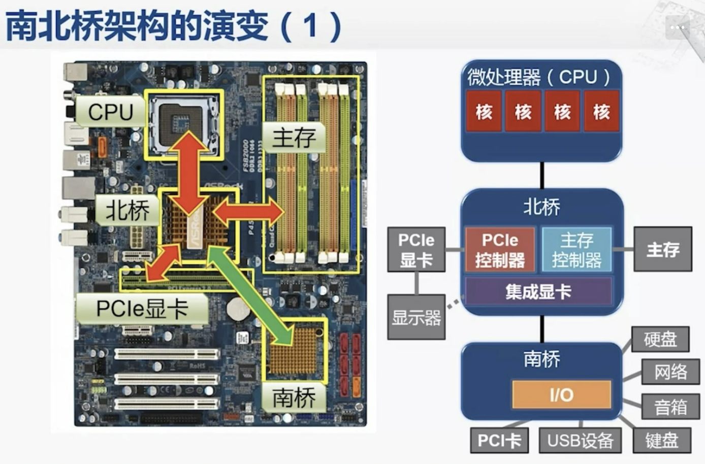
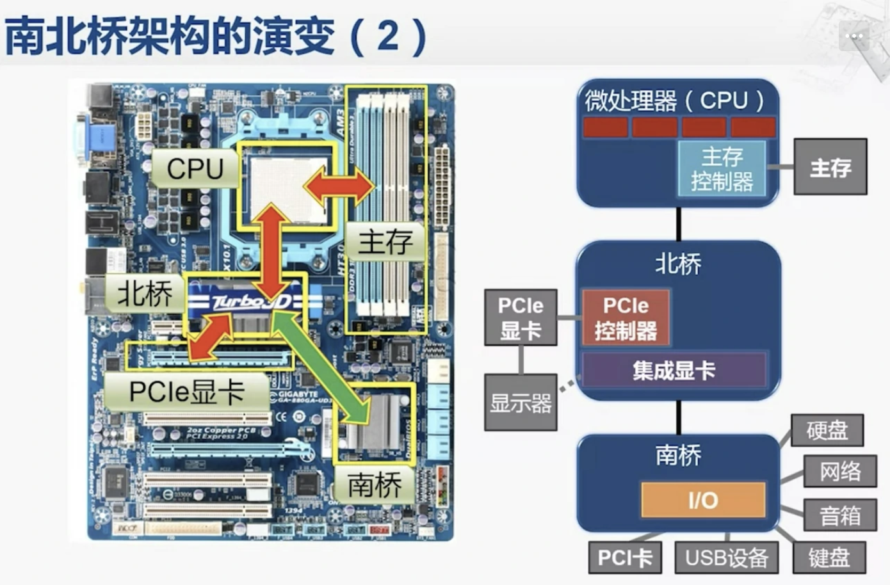
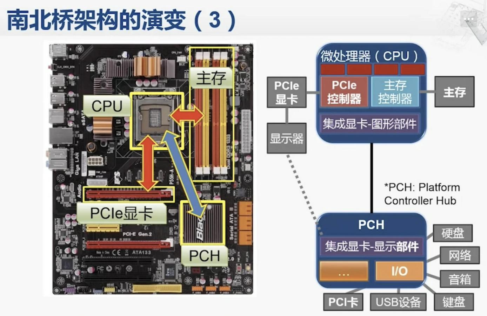
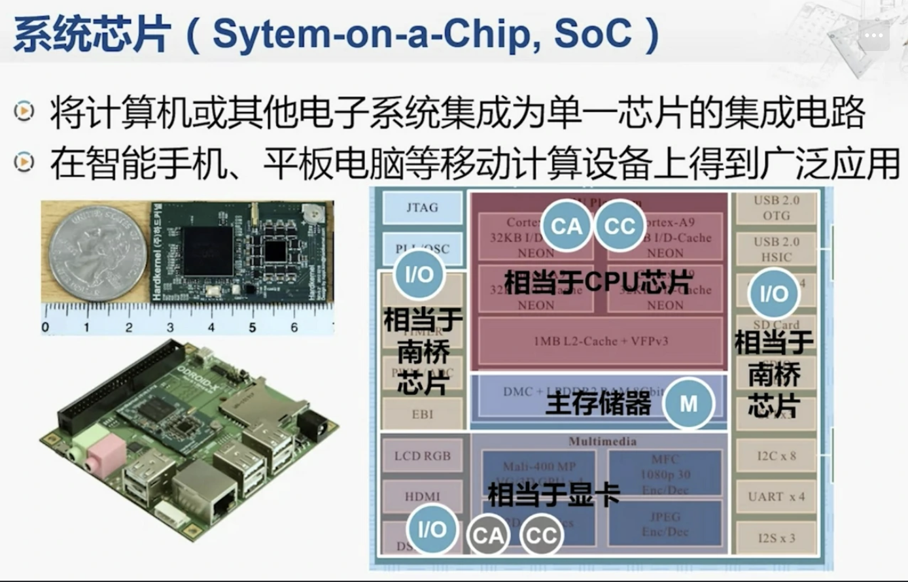
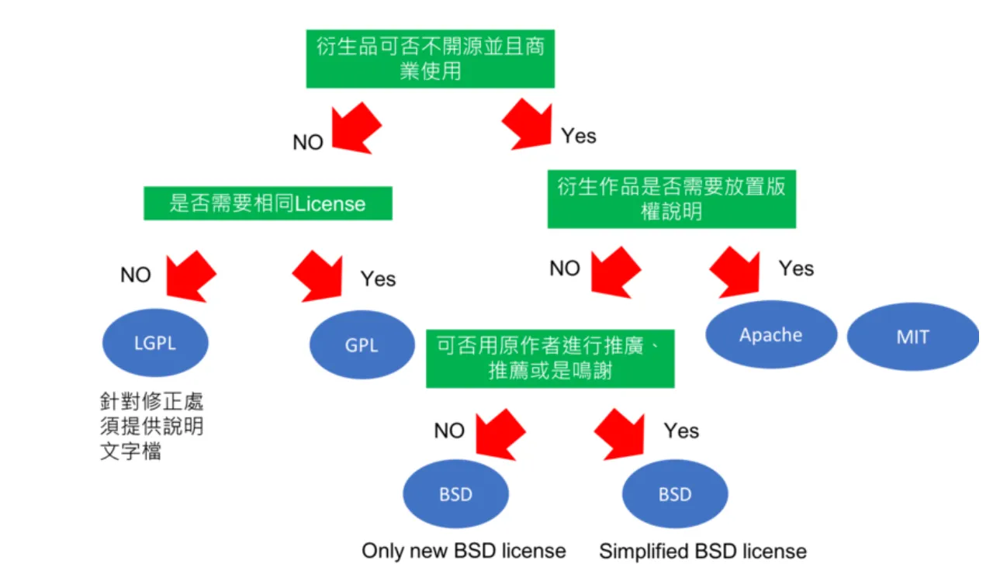

## # Xcode

- [安裝 Xcode 的正確姿勢](https://www.notion.so/Xcode-dfbe2d934ff84b2d84e34ffceef56fe0)

  ```shell
  $ gem install xcode-install
  $ xcversion install 14.0.1
  ```

## # ChatGPT

- [ChatGPT](https://chat.openai.com/chat)
- [ChatGPT VSCode Plugin](https://marketplace.visualstudio.com/items?itemName=JayBarnes.chatgpt-vscode-plugin)
- [ChatGPT LINE Bot](https://github.com/isdaviddong/chatGPTLineBot?fbclid=IwAR25gtlDC1DCSRQQovO4PtD3MJUxwxmq2TtK52kc8mLn_hnjx1hGmynd6CY)

  - [FB 貼文](https://www.facebook.com/DotNetWalker/posts/pfbid02HAjmCETiwDVpm8TjoDrSunRuYuuzuxLHEiusdsUq8qLVdJS8oRsBajHLwJQaUpKYl)
  - [另一個？](https://github.com/memochou1993/ai-assistant?fbclid=IwAR0IvjZWWA87jUGc1E2nFPNemJBXdcA_be6CLiHhcYG-BT1cxqttaG6Qg1U)

- [ChatGPT for Google](https://chrome.google.com/webstore/detail/chatgpt-for-google/jgjaeacdkonaoafenlfkkkmbaopkbilf)
- [ChatGPT Voice Input](https://github.com/sigglas/ChatGPTVoiceInput)

  - [FB 貼文](https://www.facebook.com/groups/DotNetUserGroupTaiwan/permalink/3047172475575850/)
  - [YT 演示](https://youtu.be/4ZWSgIo56_k)
  - [[Chrome 擴充] 簡單做一個自動填資料的小插件](https://ithelp.ithome.com.tw/articles/10286421)

- [ChatGPT-CodeReview](https://github.com/anc95/ChatGPT-CodeReview)

- [Visual ChatGPT](https://github.com/microsoft/visual-chatgpt)

  - 上傳圖片跟 ChatGPT 互動

- [pandagpt](https://www.pandagpt.io/)

  - 閱讀器，顯示資料來源
  - [YT 介紹](https://youtu.be/1BUGRySJwnI)

- [Chat with any PDF](https://www.chatpdf.com/?fbclid=IwAR3X8XPGuQGHS7dOWMj-oN1q52z-q-ECLIhieGYTQPCiMeFg02r62kIBmM8)

## # 網頁效能分析工具

- [Performance Insights - builder.io](https://www.builder.io/c/performance-insights?url=https%3A%2F%2Fskowt.io%2F)

  - 針對將 image, css, html, js 等進行優化後，網頁效能能再提高的比重進行分析

- [Lighthouse - chrome](https://chrome.google.com/webstore/detail/lighthouse/blipmdconlkpinefehnmjammfjpmpbjk/related?hl=zh-tw)

  - chrome 外掛，針對網頁渲染過程的每個步驟進行分析效能
  - 三大指標：FCP(First Contentful Paint) TBT(Total Blocking Time) TTI(Time to Interactive)，主要是 JS 造成的

## # 其他可玩項目

- [Learning Computer Engineering With Minecraft](https://betterprogramming.pub/learning-computer-engineering-with-minecraft-20b10fa285c4)

## # 計概暫存

- 計算到一半的東西才放 register，大部分時候還是會去 memory 取資料來進行計算 (但還是會在準備使用前，放入 register)

- [主要過程](https://www.coursera.org/learn/jisuanji-zucheng/lecture/8Xyeu/105-ji-suan-ji-zhi-xing-zhi-ling-de-guo-cheng)

- CPU

  - CU (Control Unit)：用來控制其他部件(ex. RAM)的動作
    (EX. 會負責發訊號給 RAM，告知要做 "READ")
  - PC (Program Counter)：用來存下一條指令的 RAM 位址
    (EX. 而位址是由 PC 傳給 MAR，再通過 Address Bus 傳給 RAM 的 MAR)

- BIOS (Basic Input/Output System)

  - 通常是「唯讀」，存放開機訊息

- 南北橋演變

  > 紅箭頭：擁塞
  > 綠箭頭：輕鬆

  - CPU 與外界溝通都需要通過「北橋」

    

  - CPU 直接與記憶體溝通

    

  - 將北橋主要功能合併進 CPU，CPU 內部傳輸速度比外部主機板快

    

  - 將主要功能變成單一芯片

    
    

## # 專案管理

- Azure Boards
- [Always sprinting?](https://cbh.bearblog.dev/always-sprinting/)

## # Linux

- `xargs`

  - `echo` 的反函數
  - [xargs is the inverse function of echo](https://dhashe.com/xargs-is-the-inverse-function-of-echo.html)

## # 案例解析

- 系統設計：

  - [How Slack Built a Distributed Cron Execution System for Scale](https://blog.bytebytego.com/p/how-slack-built-a-distributed-cron)

- SQL：

  - [The beauty of OLAP SQL](https://taki-mekhalfa.github.io/misc/2024/04/14/beauty_of_olap_sql.html)

## # 生活

- 大腦晶片
  - [Single brain implant restores bilingual communication to paralyzed man](https://arstechnica.com/science/2024/05/single-brain-implant-gives-paralyzed-man-bilingual-communication/)
  - [EXCLUSIVE TECHNOLOGY Elon Musk’s Neuralink Gets FDA Green Light for Second Patient, as First Describes His Emotional Journey](https://www.wsj.com/tech/neuralink-gets-fda-green-light-for-second-patient-as-first-describes-his-emotional-journey-a2707584?st=iemfrvz8kj2kcw1)

## # 其他工具

- 技術

  - [rive editor](https://editor.rive.app/file/loading2/292023)

    - 可以作互動動畫，大小很小，而且他的動畫可以合併，輕易整合到每個平台

  - [Open Policy Agent](https://engineering.linecorp.com/zh-hant/blog/open-policy-agent-authz-in-microservice/)

- 其他

  - [PlayPharase]: https://www.playphrase.me/

    - 以句子搜尋得到相關影片片段
    - 收費
    - 數種語言可選

  - [Not By AI]: https://notbyai.fyi/tw/

    - 用來標記創作作品為人類原創而非 AI

- 監控

  - [Real-time problem & outage monitoring](https://downdetector.com/)

    - 監控各大服務的狀態

## # License

- REF: [【概念筆記】什麼是軟體授權條款(Software License)? ](https://medium.com/@ellierellier/概念筆記-什麼是軟體授權條款-software-license-授權條款相關概念一次釐清-9d70e29f3a29)



## # 2FA

- [如何透過 Golang 開發 OAuth2 的 PKCE - 以 LINE Login 為例](https://engineering.linecorp.com/zh-hant/blog/pkce-line-login)
- [AWS: Custom authentication challenge Lambda triggers](https://docs.aws.amazon.com/cognito/latest/developerguide/user-pool-lambda-challenge.html)
- 簡訊只要運用 SS7 就有可能被攔截，所以 2FA 並不建議用簡訊來驗證

## # 資安

[PWN College](https://pwn.college/)
