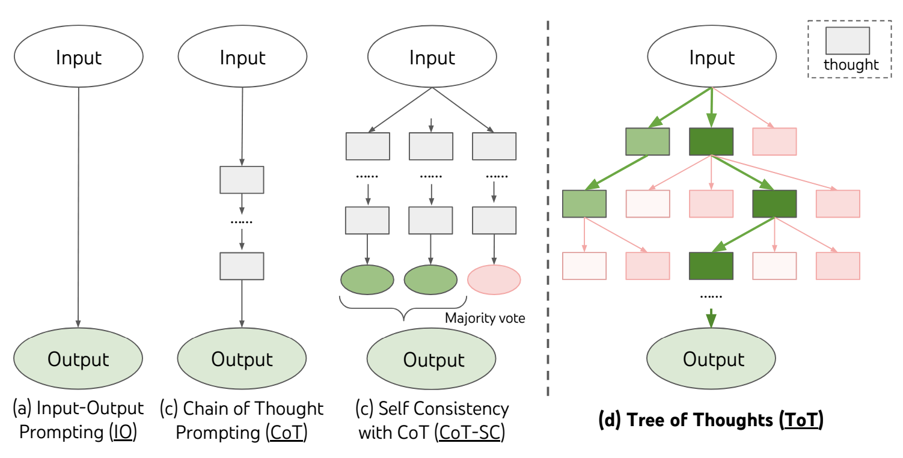
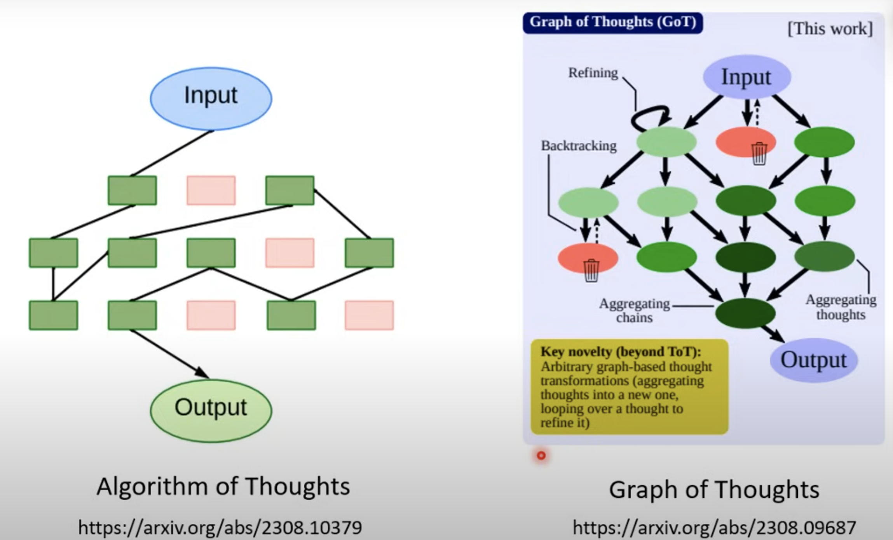
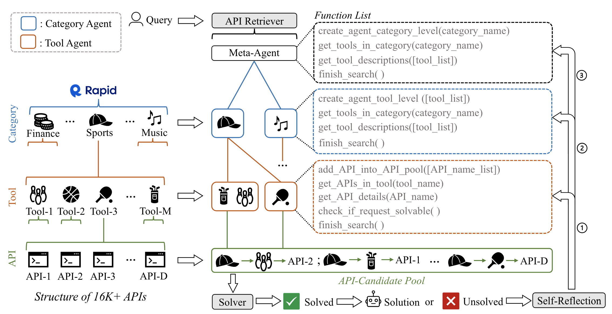
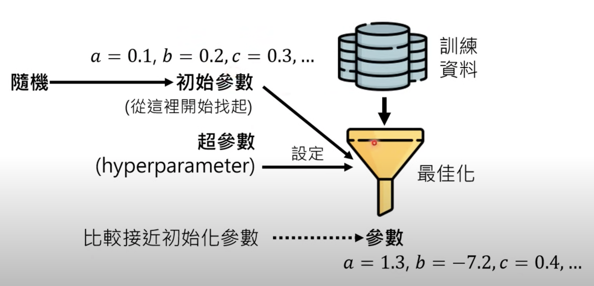
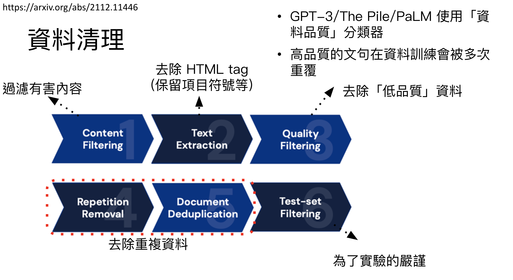
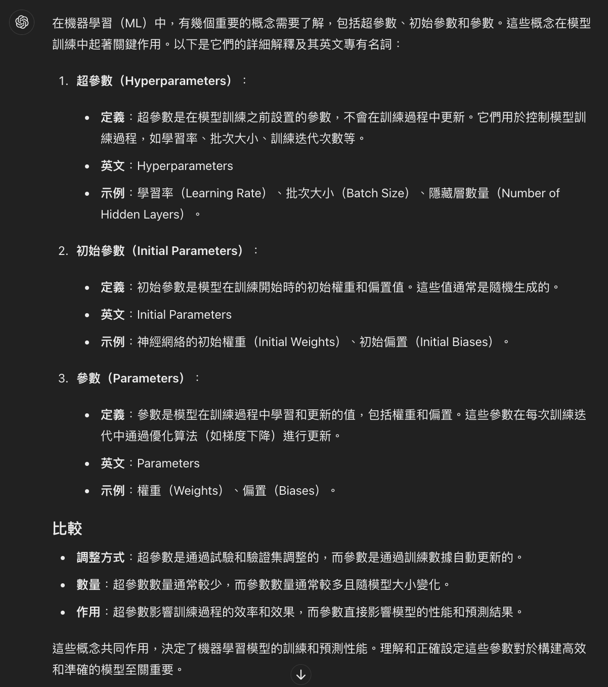

##### <!-- 收起 -->

<!----------- ref start ----------->

[Generative Agents: Interactive Simulacra of Human Behavior]: https://arxiv.org/pdf/2304.03442
[FrugalGPT: 來看看窮人怎麼用省錢的方式來使用]: https://youtu.be/vxxPtDCb9Go
[FrugalGPT: How to Use Large Language Models While Reducing Cost and Improving Performance]: https://arxiv.org/pdf/2305.05176
[AnyTool: Self-Reflective, Hierarchical Agents for Large-Scale API Calls]: https://arxiv.org/pdf/2402.04253
[Tree of Thoughts: Deliberate Problem Solving with Large Language Models]: https://arxiv.org/pdf/2305.10601
[生成式 AI 導論 2024 - 李弘毅]: https://youtu.be/AVIKFXLCPY8?list=PLJV_el3uVTsPz6CTopeRp2L2t4aL_KgiI
[跟李沐学 AI]: https://youtube.com/playlist?list=PLBGvQkBc2Hq_xInrqZ5Vang22P0ceqpNY&si=5hiNICohhwb40Ii_
[Andrew Ng]: https://www.andrewng.org/courses/
[生成式 AI 導論 - 作業]: https://speech.ee.ntu.edu.tw/~hylee/genai/2024-spring.php

<!------------ ref end ------------>

# Generative AI (生成式人工智慧)

> DATE: 6, 7 (2024)
> REF: [生成式 AI 導論 2024 - 李弘毅] | [生成式 AI 導論 - 作業] | [跟李沐学 AI] | [Andrew Ng]

## # 簡介

- 定義：機器產生複雜(近乎無法窮舉的)有結構的物件

- ML：大約是讓機器從資料中自動找出 function

  - Deep Learning (DL)：一種 ML 技術
    - Neural Nertwork：有非常大量參數的 function
      - Transformer：Neural Nertwork 的一種，目前 GPT 用的模型
  - Structured Learning (Generative Learning 概念的前身)

- 名詞：

  - Training = Learning
  - Testing = Inference
  - Autoregressive Generative：圖片用的
  - Self-Supervised Learning (自監督式學習)：AI 自己做網路爬蟲學習，不需人工介入
  - Supervised Learning (監督式學習)：人工指導訓練
  - Reinforcement Learning (增強式學習) (RL)
  - RLHF (Reinforcement Learning from Human Feedback) & RLAIF
  - Reward Model

- 名詞 2：

  - Agentic AI
  - Policy Network & Value Network
  - MAMBA Model & SSM (Selective State Space Model)

- Inference Optimization (推理增強 or 推理優化)

  - 不訓練模型，強化模型的方式
  - 種類簡介

    - In-Context Learning：沒有真的訓練到模型，而是提供範例，讓他讀懂輸入的範例後輸出
    - Constitution AI：可放在中間，將第一版回答先不輸出，先透過 Constitution AI 進行審視，再將審視後的回答輸出
    - Chain of Thoughts (CoT)：將問題拆解步驟，一步一步去問
    - Self-Consistency (SC)：自己問多次，選出最多數相同的回答，當作答案 (這件事可以讓 AI 自己做？該做幾次？)
    - CoT-SC：CoT 之後，最後結果才 SC
    - Tree of Thoughts (ToT)：CoT 後，並且每一步驟都

      - REF: [Tree of Thoughts: Deliberate Problem Solving with Large Language Models]

    - Algorithm of Thoughts (AoT)
    - Graph of Thoughts (GoT)
    - Program of Thoughts (PoT)：叫 AI 先列程式碼再執行，來解決問題 (例如算數學，叫他列出計算該題的程式碼，再執行取得答案)
    - Retrieval Augmented Generation (RAG)：讓他搜尋更多資料再回答
    - Exchange of Thoughts (EoT)：讓多個模型間互相討論 (可加入一個裁判模型判斷何時討論達共識後輸出)

    
    

- [AnyTool: Self-Reflective, Hierarchical Agents for Large-Scale API Calls]

  - 解釋 AnyTool 如何讓 LLM 快速選擇到適合的工具的原理

  

- Decoder-Only Model vs. Encoder-Decoder Model

- FrugalGPT

  - 簡介：LLM cascade。訓練 Scorer 模型，讓他判斷出最適合用來回答各類問題的模型，讓合適的模型做合適的事

  - 影片：[FrugalGPT: 來看看窮人怎麼用省錢的方式來使用]
  - 論文：[FrugalGPT: How to Use Large Language Models While Reducing Cost and Improving Performance]

- 打造未來專案團隊

  - 人類可以專注於：訓練出每個專業領域的模型，每個模型當作一個團隊，讓每個模型分工、互相合作討論去完成專案

  - 設計思路範例：[Generative Agents: Interactive Simulacra of Human Behavior]

    - Reflection: 自己內部的想法延伸，對事件的詮釋
    - Observation: 觀察外部的事件

## # ML

- 簡介：目標是找出模型參數 (Parameters)

  

- 兩個步驟

  - Training / Learning (訓練 / 學習)：設定超參數,透過最佳化找出參數

    - 首先給定一組函式的 Initial Parameters，餵以訓練資料，透過設定的 Hyperparameters 進行最佳化，得到一組從 Initial Parameters 修改而來的 Parameters
    - 其中人類不斷設定調整 Hyperparameters 來執行最佳化，以獲取最合理的 Parameters
    - 算力，即是用在最佳化過程中所需

  - Testing / Inference (測試 / 推論)：使用已訓練的參數進行測試 (生成)

- 三大階段

  - Pre-training (Self-Supervised Learning)

    - 自我學習，通過大量文字資料進行訓練

    - 資料清理 (filter)

      - 對訓練資料來源，先進行清理
      - 去除重複資料：一些重複的內容，如廣告詞，只當作一份資料來進行訓練。避免將其重複訓練，可能會加重生成該文字的比重

      

  - Instruction Fine-tuning (Supervised Learning)

    - 通過人類標註資料
    - 專才 vs 通才
    - 重點在於高品質的資料，不在數量 (數量級約 10k)
    - 更多高品質資料 -> 搶使用者 -> Meta LLaMA 釋出 -> 人人可訓練 LLM (建立在 LLaMA 之上)
    - Adapter 技巧：

      - EX. LoRA
      - 不改變 Pre-training 得到的參數，而再新增多的參數疊加上去
      - 通常數量遠小於 Pre-training 得到的參數
      - 優點能保留更多原貌較穩定，且資源消耗小很多

    - 精進生成過程，不問結果

      ```txt
      EX.
      這是蘋 -> 這是蘋果 Ｏ
      這是蘋 -> 這是蘋行 Ｘ
      ```

  - RLHF (Reinforcement Learning from Human Feedback)

    - 根據用戶反饋進行學習與調整
    - 簡單說，提高 & 降低 某種結果的生成機率
    - EX. Proximal Policy Optimization (PPO)、TRPO（Trust Region Policy Optimization）
    - RLAIF：使用 Reward Model 模擬人類反饋
    - RLHF -> RLAIF (當 AI 比人類更能判斷好壞)
    - 精進生成結果，不問過程

      ```txt
      EX.
      這是蘋果 Ｏ
      這是梨子 Ｘ
      ```

- 名詞

  - overfitting

    - 訓練成功，測試失敗
    - 訓練用的資料能成功辨別，但再拿其他資料來測試卻失敗
    - EX. 訓練結果判定黑色都是貓，黃色都是狗

  - Parameters

    - Hyperparameters (超參數)

      - 也就是工程師在調的參數
      - 用以執行最佳化過程的參數，而得到此模型函數的 Parameters

    - Initial Parameters (初始參數)

      - 預設的 Parameters，協助訓練出 Parameters
      - 有給定 Initial Parameters，最後訓練出的 Parameters 會較為接近 Initial Parameters
      - 最初隨機給定，重複訓練時再將之前得到的結果設為 Initial Parameters

    - Parameters (參數)

      - 訓練後生成的參數
      - 訓練好的模型函數中的參數

    

## # 其他補充

- 注意事項：

- 小技巧：

- 小工具：

- 補充學習：

---

## # 延伸討論

<!-- 路人推文有空研究 -->

- <details close>
  <summary>YT 留言有空研究</summary>

  <!-- 多變數廻歸分析 -->

  - <details close>
    <summary>多變數廻歸分析</summary>

    ```
    任何一條神經網路也是一個多變數廻歸分析，也是統計學迴歸分析的一環。我在40年前攻讀數理統計就涉及這些人工智能及多變量（含時間變量）的廻歸分析（向量/ 矩陣/ 線性代數/ 機率/ 取様….）。以便對一些事件做出精准智能的預測。所謂自我學習也只是用後面收集或模擬出的更新的資料去修正原先迥歸分析的參數而已。40 年前人工智慧就是數理統計的一大課題。馬斯克說得一點都沒錯-目前的人工智慧全部建立在數理統計的基礎上。從那時開始就不斷有各行各業的數據分析專業人士來我們數理統計這參與並學習迥歸分析。他們回去後就不斷建立了屬於他們行業內的多條神經網絡（行業內的迥歸模型）。在那時從事這類研究工作的數理統計的博士生全部被限制在晚上12 時過後才能使用國家級的超級計算機，否則我們兩三𠆤人一上線全部就大當機。我們那時也發展出一套類似挖礦機的方式，利用所有大量閒置的𠆤人電腦來提供其微小的算力，進而整合這些龐大的所謂分散型算力，但受限那時網路的不發達，很難把規模擴大。
    近幾十年隨計算機能力不斷提升，目前市面AI 所謂大模型，主要是著力於面對”服務大衆需要”的所謂生成式/ 語言等等的智能協作服務。就是把百行百業各個領域等等數以千萬千億計資料進行迥歸模型的建立及修正（所謂自我深度學習）而形成龐大的神經網絡。因此也不用太誇大眼下的AI , 這些理論早在40 年以前都已建構了理論基礎，而智能恊作早在各專業領域都已發展的非常完善，只是因過去算力不足只能在各自專業領域進行中小規模（變量數較少）的神經網絡建構。例如氣象預報就是早期最明顯的利用氣象專用超高速大電腦發展為成熟預測能力（AI)的例子，股票買賣決策也是智能恊作(AI/CIC)的典型。”把簡單數學上使用即存的規模資料或電腦模擬資料進行所謂的㢠歸分析/模型建構並藉此模型做可行的智能預判或恊作，包裝成醫學上複雜尚未完全掌握的神經網路的機制及作用原理”，不但瓢竊了數理統計在AI 發展的絕對地位，實在也是在誤導整𠆤AI 的發展。也會造成眼下一般人的過度期待和焦慮。應將AI 改稱作” CIC:Computer Intelligent Collaboration , 電腦智能恊作， 更為恰當。

    何謂知識？ 由經驗總結後（ 抽象具體化） ，就形成知識（用數字分析的表達方式就是去建構知識模型）。 形成知識後就可複製/ 傳承/ 預測/ 擴展。因此目前的AI 發展，就是在循人類文明發展至為重要的其中的一𠆤過程-只是採用了數位化的方式，將經驗知識化了。
    目前的AI 只是以數理統計為手段及方法論，以資訊及計算計工程為工具，進行數位型的經驗知識化的過程。人類有許多其他不同型態非常複雜的知慧，這種僅止於知識化的智慧， 其實離人類多型態的智慧還有非常巨大的距離。

    另外， 眼下AI 服務非專業大衆的大模型的各種數學理論及所謂的機器學習（參數修正）及深度學習（參數及變數的多層次增加及修正）。 早在40 年前相應的數學理論都已完備（但落實到實際應用上，如何解1 億 by 1 億的聯立方程組( 行列式計算）， 這需要極其龐大的平行計算能力，在那時期是完全不可能的） 。
    其實AI 最重要最關鍵的是各行各業各領域的專家組，而不是這些AI 搞編程的公司（ 他們只是依需求用已完善的數學統計理論加以電腦編程後，利用巨大算力去幫忙找出合適的模型並不斷予以完善）。
    只有各行各業各領域的專家組才知道在茫茫大海中的資料及訊息中，那些因素才是其所涉領域的関鍵變數，那些變數資料才是可做為他們收集分析建立模型的。例如氣象學/經濟學/股票買賣智能決策/ 醫學/ 藥學/ 農業生產/ 基因工程/ 化學工程/自動駕駛/飛彈防空系統/圖像識別及處理/ 建築結構力學/小樣品模擬模型（核爆/飛機失事）………..等等。
    此外服務大衆的語言學也是極度複雜的一門學課，其可能的變量變因會高達幾千萬𠆤， 再加上多層級過濾學習修正的模式，因此其涉及的變數算力就以億計， 所以才稱做大模型。 要取那些因素進行那一層分析，主要都是語言學家在主導。
    而這些眼下的AI 應用的公司， 只是利用已發展完備的數學統計理論在不同領域專家組的指導下，去有效的進行數拈收集整理分析並進而建立一個特定領域的模型，作為該特定領域的電腦智能恊作工具。
    另外面對服務大衆的生成式服務，也是要面對大衆各種不同的需求，因此其所需處理消化的資料也是天文數字的龐大，也要各行各業領域專家介入協助指導進而形成並建立大模型。
    其實生成式AI 可以理解成升級版的超級搜索引擎，傳統的搜索引擎，用関鍵字/詞，從數據庫內匹配/找出並羅列出可能所需資訊，現在進步升級到如果你給出更具體規範的需求，系統就能從數據庫內拼湊出並提供更完整的接近最終需求的服務內容。這只是把過往已存在的數據庫（已長年經各行業領域專家組維護並梳理過的）更完善的整理優化後予以呈現。而這𠆤更完善的過程使用了大量多層次的統計數字分析的手段， 把這個完善化的過程誇大的比擬成人類的思考及智慧（其誇大的目的-圈錢），將造成極大的誤導。
    其實生成式大模型， 就是用即存服務於大衆的大型搜索的資料庫，如google ， Bing 等等，以數理統計為核心，結合資訊工程及硬體工程為工具，而進行更貼切於使用者需求的優化過程和結果。所以生成式大模型最終會回到過往提供搜索服務的大型公司的對決。
    因此CIC 或是AI 是以特定領域專家組為主導，數理統計為核心，資訊工程及硬體工程都是配合的工具而已。 這樣的發展才會健康/ 不浪費/ 高效率/ 高精確度。

    但目前的發展方式， 以資訊工程及硬體工程來主導開發服務大衆的大模型，只是因為這方面天文級別的龐大算力需大資本投入，這是一𠆤比較理想的快速盈利回報的營運方式，但這種情況就會造成眼下嚴重的誤導及錯誤的認知，沒有效率及喪失精準度，甚至如當下出現諸多以提供算力及編程服務的所謂AI 公司出面圈錢的亂象。

    其實眼下的蓬勃發展是假象。 不管怎麽發展，從事這𠆤領域研究工作的人不能不具備相關數理統計的知識，也不能缺少專家組對資料的專業的選定/收集/整理。而資訊程序員和電腦只是工具。特別在早期各專業領域內的中小模型的智能發展和恊作，編程只是工具。但當算力上來後，服務大眾的類搜索引擎的生成式及語言大模型，就變得可行了， 但不管怎樣可行，仍是以數理統計為核心，更龐大的專家組仍是關鍵。 只是這種大模型下算力變成稀缺的主要投資成本， 使得這些編程及硬體人員不得不高舉這𠆤旗幟來圈錢， 如果這些編程及硬體人員拿不出這些算力（如果由國家直接投資），他們在整個AI(CIC) 的發展上，根本算不上什麼角色。但這一輪由算力提供方來主導的AI 發展，將會走得很偏，而且會很快撞牆。

    未來可能的發展模式：
    1） 資訊及硬體工程提供集中算力設備及模型編程的開放平台，供各領域的專家組使用。
    有點像當下晶片產業，各應用領域產業由專家組組成公司後，進行各領域的智能開發和應用（如晶片應用的design house，聯發科，海思等 ) , 而算力的提供及收費則由資訊及硬體工程提供（這需要密集资本投入，甚至國家力量投入，如台積電）。
    2） 由於網路的高度發展， 另外一種提供龐大算力的方式，是由巨量萬家萬戶閒置PC 𠆤人電腦參與分散型算力的提供，並予以整合，這也是需由資訊及硬體工程來實現的。
    ```

    </details>

  <!-- 輸出輸入計價、decoder-only -->

  - <details close>
    <summary>輸出輸入計價、decoder-only</summary>

    ```
    A -------------------------
    我覺得從大多數雲服務都是輸出計價輸入免費的考量來說的話
    這應該才是最主要的輸出較貴的理由
    至於為何輸入免費
    我覺得最合理的理由是 任何產品最終的結果都依定要輸出
    所以 在最終階段設下關卡收費很合理
    而在輸入處要求入場費會降低入場意願
    大多數的外國網路服務都走向面對體驗與開發者友善的路線
    所以通常輸入也會比較低或是不用錢
    我覺得這是我認為可理解且可接受理由
    B -------------------------
    輸入的embedding可以並行計算並且可以cache住，所以輸入很便宜，但是輸出每一步即使用了kv cache，也是需要前向一次的，所以輸出成本更高
    C -------------------------
    為什麼現在的大model都採用decoder-only的架構 而不是encoder-decoder
    D -------------------------
    從技術上來說輸出比輸入貴還是有道理的, 因為decoding需要多少個step只跟輸出長度有關, 跟輸入長度無關.
    ```

    </details>

  </details>

<!--  -->

- <details close>
  <summary></summary>

  </details>

---

## # <mark>TODO:待整理筆記</mark>

-
