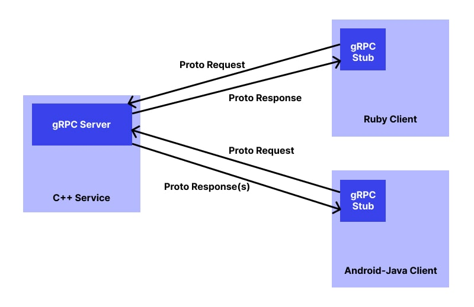
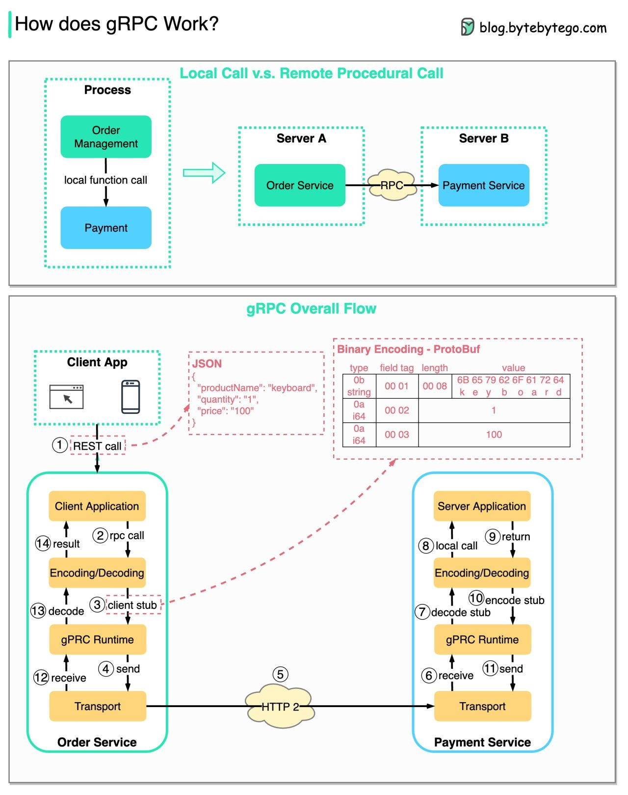
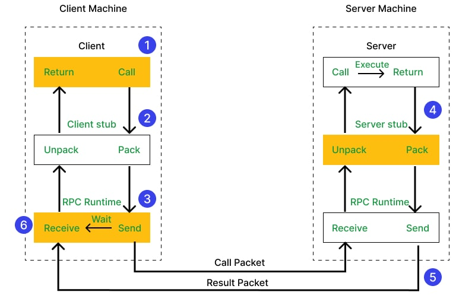
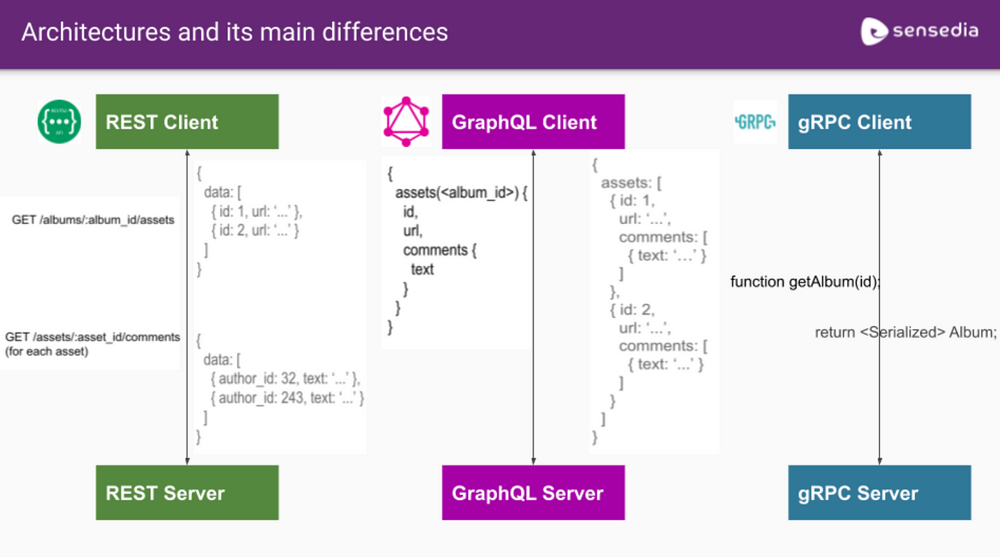
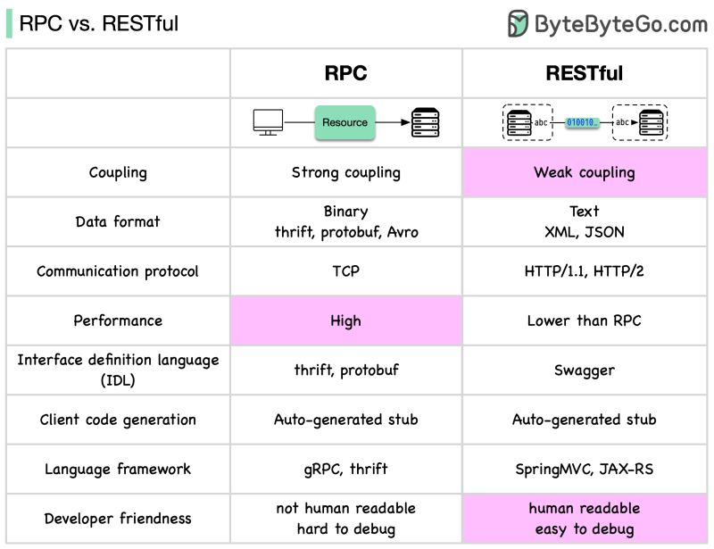

##### <!-- 收起 -->

<!----------- ref start ----------->

[How is GRPC different from REST?]: https://stackoverflow.com/q/43682366/13108209
[gRPC vs. REST: Comparing Key API Designs And Deciding Which One is Best]: https://www.wallarm.com/what/grpc-vs-rest-comparing-key-api-designs-and-deciding-which-one-is-best
[AWS: gRPC 與 REST 之間有何差異？]: https://aws.amazon.com/tw/compare/the-difference-between-grpc-and-rest/

<!------------ ref end ------------>

# gRPC

> DATE: 8 (2024)
> REF:

## # 小記

- REF：

  - [AWS: gRPC 與 REST 之間有何差異？]
  - [gRPC vs. REST: Comparing Key API Designs And Deciding Which One is Best]
  - [How is GRPC different from REST?]

- 必要條件：

  - 基於 HTTP/2
  - 使用協定緩衝區格式 (Protobuf)
  - 需要在 client / server 上配有 gRPC 軟體才能運作

- 行為特性：

  - 類似於使用 HTTP/2 連線的 RPC
  - client 呼叫 server 的一個 function
  - client / server 高度耦合
  - 可以是一元 (一對一)、伺服器串流 (一對多)，用戶端串流 (多對一) 或雙向串流 (多對多)
  - 在原型檔案中定義結構之後，gRPC 會產生 client & server 程式碼

- 適用情境：

  - 高效能系統
  - 高資料載入 (資料密集)
  - 即時或串流
  - 變動性較低
  - 微服務架構

- 案例：

  - 專門設計用於針對分散式資料中心的微服務架構建立高效能 API
  - 它更適合需要即時串流和大量資料載入的內部系統
  - 當 API 不太隨時間變更時，gRPC 也適合用在包含多種程式語言的微型服務架構

- 圖說：

  - 架構圖

    
    

  - RPC

    

  - 比較：

    
    
