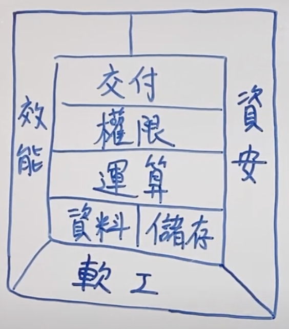

<!--  style  -->

###### <!-- ref -->

[成為看起來很強的後端]: https://youtu.be/HMX4KSDtfpw?list=PLS5AiLcCHgNxd341NwuY9EOpVvY5Z8VOs

 <!-- ref -->

# 隨筆

## 1. [成為看起來很強的後端]

  

    
  

- DataBase:

  - RDBMS(關聯式)：關聯性強，如 電商
  - 非關聯：快取、分散式系統

- 權限

  - 一般 Client to Server 比較複雜，Server to Server 較為簡單。

  - Authentication v.s. Authorization

    - Authentication（驗證）
      - 沒通過，給 401 Unauthorized（未授權）
    - Authorization（授權）
      - 沒通過，給 403 Forbidden(禁止)

  - Token

    - event-based：通常是一次性 (OTP one-time-password)
    - time-based：一般所指的 Token
    - static：設定好，不太會一直改變的（password）

  - 處理

    - 雜湊 (Hash)

      - 單向
      - 太簡單的容易被查表破解 (Rainbow Table)

    - 編碼 (Encode)

      - 雙向
      - 例如壓縮讓內容變小，好傳輸
      - 常用
        - base64 (0~9, a~z, A~Z, +=) (結尾通常 ==)
        - hex (16) (0~9, a~f)

    - 加密 (Encrypt)

      - 雙向＋鑰匙
        - 對稱式：加解密同把鑰匙 (ex. AES)
        - 非對稱式：鑰匙不同把 (ex. SSL)

  -

---

## 2. []

-
