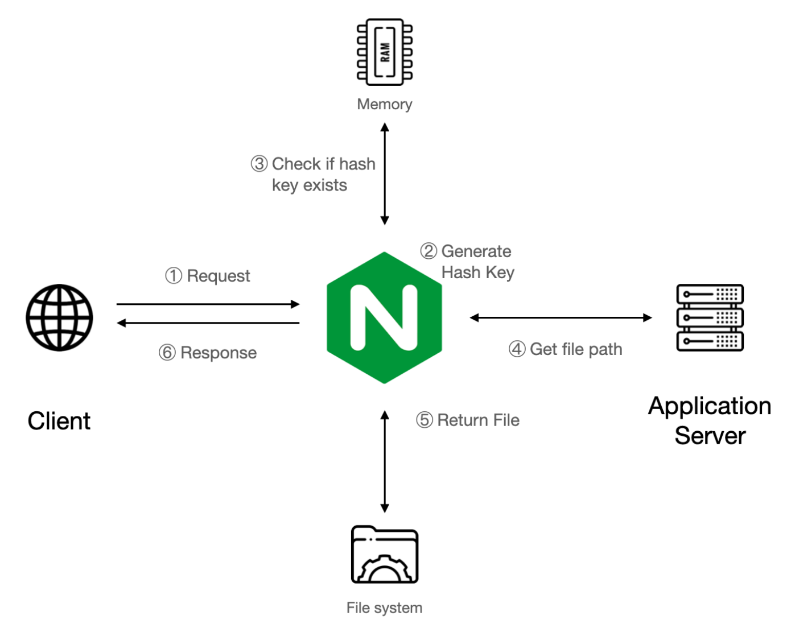
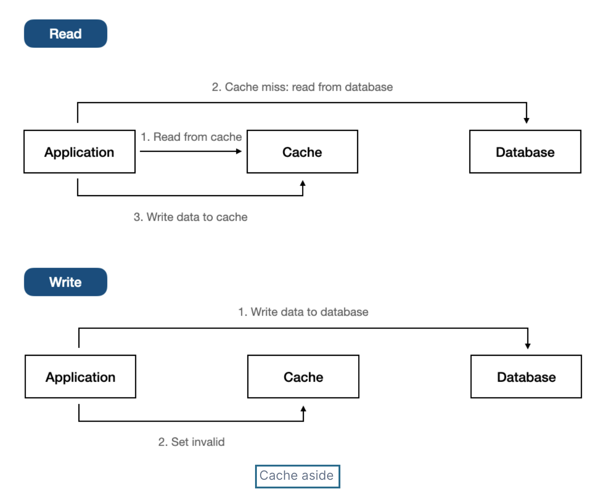
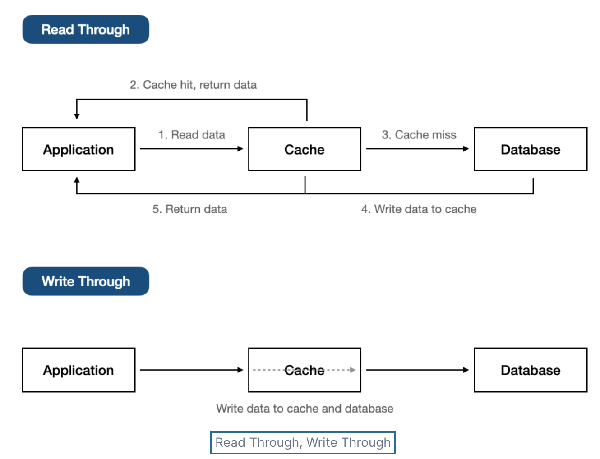
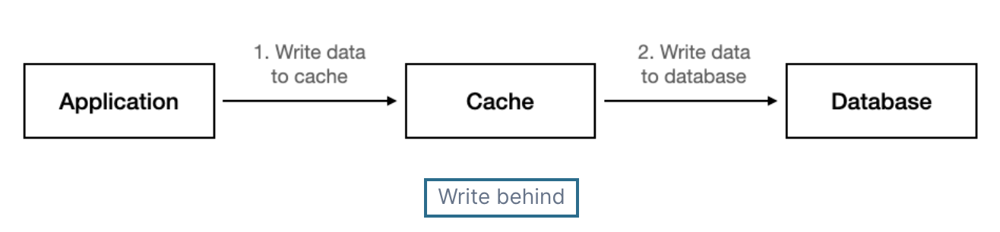

###### <!-- ref -->

[NGINX Performance Tuning Tips and Optimization Strategies]: https://www.cloudpanel.io/blog/nginx-performance/
[Performance Tuning – Tips & Tricks]: https://blog.nginx.org/blog/performance-tuning-tips-tricks
[Nginx 效能最佳化（吐血總結）]: https://github.com/0voice/cpp_backend_awsome_blog/blob/main/%E3%80%90NO.350%E3%80%91Nginx%20%E6%80%A7%E8%83%BD%E4%BC%98%E5%8C%96%EF%BC%88%E5%90%90%E8%A1%80%E6%80%BB%E7%BB%93%EF%BC%89.md
[深入理解 Nginx 讀書筆記 (第二章)]: https://super9.space/archives/2050
[Nginx 優化設定]: https://medium.com/@openthedidi2004/nginx-優化設定-3858c3597564
[深入探討 Nginx 的快取機制與效能調優技巧]: https://www.php.cn/zh-tw/faq/598035.html
[denji/nginx-tuning.md]: https://gist.github.com/denji/8359866
[Top Five Tips for NGINX Performance Tuning]: https://www.openlogic.com/blog/nginx-performance-tuning
[BREACH 攻擊]: https://securityalley.blogspot.com/2014/07/ssltls-breach.html
[Web Server & Nginx — (2)]: https://medium.com/starbugs/web-server-nginx-2-bc41c6268646
[HATEOAS：建構驅動的 REST API]: https://apifox.com/apiskills/hateoas-driven-rest-api/
[HATEOAS 驅動的 REST API]: https://restful.p2hp.com/learn/hateoas
[你的 REST 不是 REST？]: https://www.ithome.com.tw/voice/128528
[成為看起來很強的後端]: https://youtu.be/HMX4KSDtfpw?list=PLS5AiLcCHgNxd341NwuY9EOpVvY5Z8VOs

 <!-- ref -->

# 隨筆

## # [成為看起來很強的後端]

> DATE: 8 (2022)

<!-- 圖解 -->

- 

  
圖解

  

  

<!-- DataBase -->

- 

  
DataBase

  - RDBMS(關聯式)：關聯性強，如 電商
  - 非關聯：快取、分散式系統

  

<!-- 權限 -->

- 

  
權限

  - 一般 Client to Server 比較複雜，Server to Server 較為簡單。

  - Authentication v.s. Authorization

    - Authentication（驗證）
      - 沒通過，給 401 Unauthorized（未授權）
    - Authorization（授權）
      - 沒通過，給 403 Forbidden(禁止)

  - Token

    - event-based：通常是一次性 (OTP one-time-password)
    - time-based：一般所指的 Token
    - static：設定好，不太會一直改變的（password）

  - 處理

    - 雜湊 (Hash)

      - 單向
      - 太簡單的容易被查表破解 (Rainbow Table)

    - 編碼 (Encode)

      - 雙向
      - 例如壓縮讓內容變小，好傳輸
      - 常用
        - base64 (0~9, a~z, A~Z, +=) (結尾通常 ==)
        - hex (16) (0~9, a~f)

    - 加密 (Encrypt)

      - 雙向＋鑰匙
        - 對稱式：加解密同把鑰匙 (ex. AES)
        - 非對稱式：鑰匙不同把 (ex. SSL)

  

---

## # ExplainThis 小記

> DATE: 9 (2024)

##### # RESTful API

<!-- 避免做法 -->

- 

  
避免做法

  <!-- 濫用 GET / POST -->

  - 

    
濫用 GET / POST

    - 錯誤：濫用 GET 改資料、濫用 POST 更新資料
    - 正確：用 PUT/PATCH 更新、DELETE 刪除

    

  <!-- 過度巢狀的 URI -->

  - 

    
過度巢狀的 URI

    

  <!-- 動詞不要再加在 URI -->

  - 

    
動詞不要再加在 URI

    - 錯誤：[GET] /getUser
    - 正確：[GET] /user

    

  <!-- 濫用 HTTP status code -->

  - 

    
濫用 HTTP status code

    

  <!-- 缺乏 API 版本控制 -->

  - 

    
缺乏 API 版本控制

    - 若有更新 API 時，可能用到 cache 的舊版本

    

  

<!-- 其他補充 -->

- 

  
其他補充

  <!-- HATEOAS (Hypermedia as the Engine of Application State) -->

  - 

    
HATEOAS (Hypermedia as the Engine of Application State)

    <!-- REF -->

    - 

      
REF

      - [你的 REST 不是 REST？]
      - [HATEOAS：建構驅動的 REST API]
      - [HATEOAS 驅動的 REST API]

      

    <!-- 行為特性 -->

    - 

      
行為特性

      - Level 3 的 RESTful 標準
      - res 中包含相關聯的 url，讓 client 只需直接使用，而不在 client 自行組裝 url
      - 在後端，用自動化方式動態組裝對應的 url

      

    <!-- SOAP WSDL vs RESTful HATEOAS -->

    - 

      
SOAP <code>WSDL</code> vs RESTful <code>HATEOAS</code>

      - WSDL 主要目的是用來規定好格式，讓 client 按照那個格式溝通 API (C/S 耦合度較高)
      - HATEOAS 主要的目的是，讓 client 不用自己組裝要怎麼溝通 API (用來將 C/S 解耦)

      

    

  

##### # GraphQL

<!-- 避免做法 -->

- 

  
避免做法

  <!-- 過度查詢 (Over-fetching) -->

  - 

    
過度查詢 (Over-fetching)

    - 建議：

      - client 應該只請求必要的資料
      - server 應該設定預防措施

    

  <!-- 忽略 N+1 查詢問題 -->

  - 

    
忽略 N+1 查詢問題

    - 建議：使用資料加載技術（EX. DataLoader）來批量處理請求

    

  <!-- 缺少 查詢深度限制 設置 -->

  - 

    
缺少 查詢深度限制 設置

    - 狀況：

      - 用戶有機會出現過深巢狀查詢
      - 惡意攻擊
      - 無限遞迴查詢

    - 建議：server 設置查詢深度和複雜度的限制，確保資源消耗保持在可控範圍內 (EX. graphql-depth-limit)

    

  <!-- 權限控制處理不當 -->

  - 

    
權限控制處理不當

    - 由於靈活性和細粒度查詢特性，相對 REST 更容易產生 權限控制處理不當 問題，需要更加注意

    

  

<!-- 其他補充 -->

- 

  
其他補充

  <!-- REST vs gRPC vs GraphQL -->

  - 

    
<code>REST</code> vs <code>gRPC</code> vs <code>GraphQL</code>

    - 目前理解的適用情境：

      - REST：對外公開 API，可以依照各種需求靈活應用
      - gRPC：內部串接的專案，可以高度耦合，且高性能需求
      - GraphQL：整合內部要銜接的多種來源

    

  

##### # Nginx

<!-- Reverse Proxy -->

- 

  
Reverse Proxy

  

<!-- HTTP Cache -->

- 

  
HTTP Cache

  - 行為特性

    - RAM 只用來存放 key，實際資料都是放在 disk
    - 如果想用 RAM 存放完整 cache 則要使用其他工具 (EX. tmpfs)

  - 其他補充

    - `ngx_cache_purge`：設置用來針對特定 URL 進行快取清理 (並注意設定成僅內部使用 EX. internal、allow 127.0.0.1..etc)

  

  

<!-- Load Balance -->

- 

  
Load Balance

  - 可以針對不同 API 來設置不同演算法

  - 演算法選擇

    <!-- `round-robin` (預設) -->

    - 

      
<code>round-robin</code> (預設)

      - 平均輪流分配
      - 也可加上 `weight` 設定依照加權輪流分配 (Weight Round Robin)

      

    <!-- `least-connected` -->

    - 

      
<code>least-connected</code>

      - 導向目前最少連線數的 server

      

    <!-- `ip_hash` -->

    - 

      
<code>ip_hash</code>

      - 將同一個 client IP 對應的 hash 分佈，導向同一台 server

      

    <!-- `least_time` & `least_time last_byte` -->

    - 

      
<code>least_time</code> & <code>least_time last_byte</code>

      - 依照 server 回應速度，將請求分配給`歷史回應時間最短`的 server
      - least_time 只依據 `last` 歷史回應時間
      - least_time last_byte 依據 `every` 歷史回應時間
      - 做判斷也需額外開銷，因此適合在高負載場景，進行精細的分配

      

  

<!-- 常用配置 -->

- 

  
常用配置

  - 一般情況，設置為 `levels=1:2` (EX. 檔案 abcd123 存在 `/a/bc/abcd123`)
  - `worker_processes auto;` 通常 auto 或小於 CPU 數
  - `worker_connections` 通常設置為 1024 ~ 4096

    - 代表一個 Worker Process 可以開啟的最大同時連線數，包括與前後端的連接
    - 可用 `ulimit -n` 查詢 OS 有多少可用 File Descriptors，而必須 `worker_connections x worker_processes <= File Descriptors`
    - 若 OS 預設的 File Descriptors 太小，則可以調整 File Descriptors (EX. 以小中大型的 EC2 舉例，大約分別能負荷 `4096 ~ 8192`、`65536`、`100000 up`)

  

<!-- 其他補充 -->

- 

  
其他補充

  - 大流量高併發，效能 Nginx 優於 Apache

  <!-- 可設定 gzip 壓縮 -->

  - 

    
可設定 gzip 壓縮

    - 盡量避免壓縮`敏感訊息`，可能會受到 [BREACH 攻擊]

      - 因為同字元壓縮後，大小就會變小，只要熟悉壓縮演算法，並且攻擊讓使用者發送夠多請求，就能藉此一字字推測出來

    - 一般是用來壓縮 HTML、CSS、JS
    - 一般 nodejs 不適合做壓縮，更適合在 Nginx 處理
    - 可以透過 `log_format` 設定，在 log 紀錄每個請求的時間，進行分析如何配置，使請求耗時較短 (壓縮與否、壓縮等級..等)
    - `gzip_vary on`：會自動添加 `Vary: Accept-Encoding` header，目的是讓 Nginx 與 client 中間層 (EX. CDN)，可以根據是否有壓縮來做不同的 cache
    - 常用參數：`gzip_types`、`gzip_vary on`、`gzip_min_length 10240`、`gzip_comp_level 5`、`gzip_proxied`

    

  

<!-- 效能優化 -->

- 

  
效能優化

  - REF：

    - [Performance Tuning – Tips & Tricks]
    - [Top Five Tips for NGINX Performance Tuning]
    - [denji/nginx-tuning.md]
    - [深入探討 Nginx 的快取機制與效能調優技巧]
    - [Nginx 優化設定]
    - [Nginx 效能最佳化（吐血總結）]
    - [NGINX Performance Tuning Tips and Optimization Strategies]

  - 根據 CPU 核心數量，最多一核開一個 `worker_processes`，減少 context switching (可設為 `auto`，自動偵測 CPU 數量來設置)
  - 避免停用 `lingering_close`
  - `multi_accept`：高併發 on，反之 off
  - 記得設置各種 `timeout`
  - `log buffering`：當負載較大時，可以暫緩 log 寫入，集滿或時間到再一次性寫入，減少 I/O
  - 拆分多個 `location`，依照不同情況開啟不同 location (EX. 將基本 log 與更進一步的 log 分開，使流量大時只維持基本 log)

  

<!-- REF -->

- 

  
REF

  - [Web Server & Nginx — (2)]
  - [深入理解 Nginx 讀書筆記 (第二章)]

  

##### # Server-Side Cache

- 

  
使用時機

  - 複雜計算 (EX. Count(\*))
  - 讀多寫少

  

<!-- 設計模式 (maxmemory policy) -->

- 

  
設計模式 (maxmemory policy)

  <!-- Cache Aside (Lazy Loading) -->

  - 

    
Cache Aside (Lazy Loading)

    - 適用時機：讀多
    - 寫入時，使 Cache 失效

    

    

  <!-- Read/Write Through -->

  - 

    
Read/Write Through

    - 適用時機：讀多寫少
    - 透過 Cache 當中間層，當 Cache 沒資料時，也是透過 Cache 與 DB 同步，再由 Cache 回應
    - 同步更新 Cache & DB
    - 只要有寫入就會更新 Cache

    

    

  <!-- Write behind (Write Back) -->

  - 

    
Write behind (Write Back)

    - 適用時機：寫多
    - 寫入時只先寫入 Cache，之後再根據選擇的演算法去更新 DB

    

    

  

<!-- 淘汰策略 (Eviction Policy) -->

- 

  
淘汰策略 (Eviction Policy)

  - `NoEviction`、`LRU`(Least Recently Used)、`LFU`(Least Frequently Used)、`Random`、`TTL`(Time-to-Live)

  - `Volatile` & `Allkeys`

    - "只針對設置 TTL 的 key" vs "針對全部的 key"

  

<!-- 其他補充 -->

- 

  
其他補充

  - 常用 Redis、Memcached 等工具
  - 如果使用多個 Cache 節點，可注意將常用查詢複製到多個節點，並且將 TTL 設置不同

  

#####

- 

  

  

