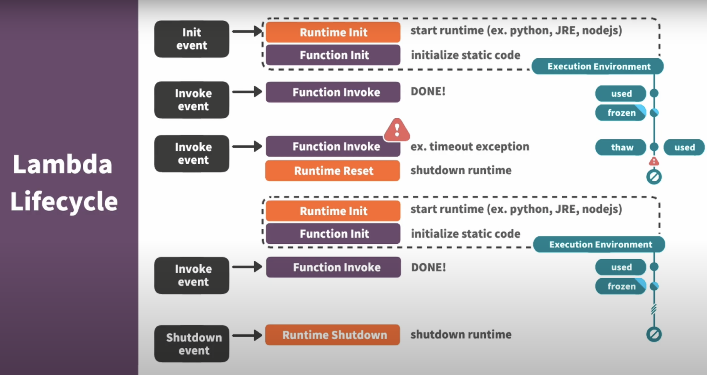
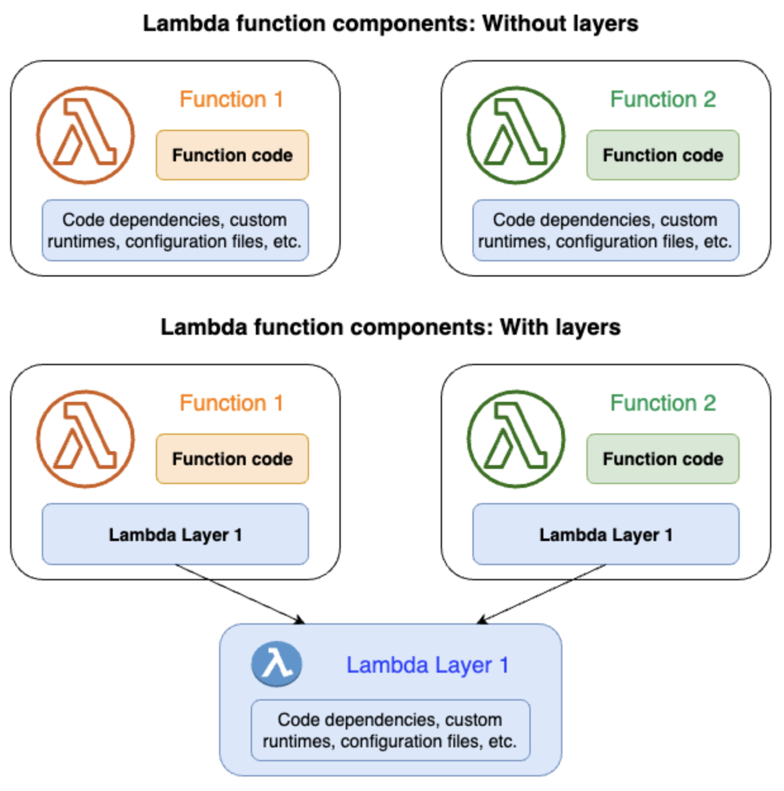

##### <!-- 收起 -->

<!----------- ref start ----------->

[Should you use Lambda containers?]: https://kreuzwerker.de/post/should-you-use-lambda-containers
[AWS Lambda 文件]: https://docs.aws.amazon.com/zh_tw/lambda/latest/dg/welcome.html
[Working with Lambda layers and extensions in container images]: https://aws.amazon.com/tw/blogs/compute/working-with-lambda-layers-and-extensions-in-container-images/
[Optimizing Lambda functions packaged as container images]: https://aws.amazon.com/tw/blogs/compute/optimizing-lambda-functions-packaged-as-container-images/
[AWS Lambda Layers 文件]: https://docs.aws.amazon.com/zh_tw/lambda/latest/dg/chapter-layers.html
[AWS Serverless Lambda 快速入門系列]: https://youtu.be/EIisRhkx5Bs?list=PLVVMQF8vWNCJU9ky3SWYt-Aq-5Zde9vp6

<!------------ ref end ------------>

# Serverless (AWS Lambda)

> DATE: 7 (2024)
> REF: [AWS Serverless Lambda 快速入門系列] | [AWS Lambda 文件]

## # 簡介

## # 安裝與設定

## # 基礎

- AWS Lambda Lifecycle

  - Initialization (Cold Start)

    - Init event 觸發初始化，形成一個 Execution Environment
    - Execution Environment 會保存一段時間

  - Invocation (Warm Start)

    - Invoke event 發送到已存在的 Execution Environment 執行 function
    - 狀態 frozen --> thaw

  - Shutdown

    - Shutdown event 將 Execution Environment 關閉

  

- AWS Lambda Layers

  - REF: [AWS Lambda Layers 文件]

  - 用以將共用的環境、依賴、前置邏輯等，做成 layer 讓不同 function 共用
  - 如果 Lambda function 引用 layer，Lambda 會將 layer 內容擷取到 runtime 中的 `/opt` 目錄
  - 需注意 layer 大小與數量限制
  - 只能用在以 `zip` 部署的方式

  

- Zip (S3) vs. Image (ECR)

  - 早期標準流程只能用 zip 儲存於 S3 (Layers 也是以 zip 方式儲存)
  - 後來加入可用 container 方式部署，將 image 存於 ECR
  - REF: [Should you use Lambda containers?]

- 使用 container image 部署 Lambda 的優化方式

  - REF:

    - [Optimizing Lambda functions packaged as container images]
    - [Working with Lambda layers and extensions in container images]

  - 使用 AWS 提供的 base images

    - 較穩定發行版、已包含 Lambda 必須工具
    - 較容易有 cache。因為在 pull image 時，可以只 pull layer，使用內建的，較高機率已經存有 cache

  - 將使用相同環境的 function 都放在同一個 ECR repo

    - 可減少傳送與儲存重複的 layer
    - 同上也能有更高機率的 cache

  - 同容器優化：multi-stage builds、常變動的放後面 build

- AWS SAM (Serverless Application Model)

  - 透過 AWS CloudFormation 來進行自動化管理 (也就是 CloudFormation 的超集)

## # 問題

<!--  -->

- 

  

  

## # 其他補充

- 注意事項：

  - Timeout 可調整的上限為 15 min
  - 搭配 API Gateway 需注意 API Gateway 的 Timeout 為 29 秒
  - Retry 策略都是另外定的，透過 SQS、API Gateway 等，或是手動做

- 小技巧：

- 小工具：

  - 

    

    

- 補充學習：

---

## # 踩雷實錄

---

## # 延伸討論

- 

  

  

---
