##### <!-- 收起 -->

<!----------- ref start ----------->

[InnoDB Architecture]: https://dev.mysql.com/doc/refman/9.0/en/innodb-architecture.html
[MySQL InnoDB 儲存引擎大觀]: https://www.jianshu.com/p/d4cc0ea9d097
[老生常談：MySQL 的體系結構]: https://generalthink.github.io/2022/04/06/mysql-architecture/
[從 Indexing 的角度切入 MySQL-Innodb 與 PostgreSQL 的效能比較]: https://tech-blog.cymetrics.io/posts/maxchiu/indexing/
[淺談 PostgreSQL 與 MySQL 的差異]: https://blog.kennycoder.io/2023/11/18/%E8%AB%87%E8%AB%87-Postgres-%E8%88%87-MySQL-%E7%9A%84%E5%B7%AE%E7%95%B0/
[MySQL 超新手入門系列文]: https://www.codedata.com.tw/database/mysql-tutorial-getting-started
[MySQL 儲存引擎與資料型態]: https://www.codedata.com.tw/database/mysql-tutorial-8-storage-engine-datatype/
[MySQL 資料庫引擎 InnoDB 與 MyISAM 有何差異?]: https://www.mysql.tw/2023/05/mysql-innodb-myisam-difference.html
[MVCC: Postgres vs MySQL vs Dolt]: https://www.dolthub.com/blog/2024-07-08-are-git-branches-mvcc/
[一起學習 Mysql 索引二（索引的高效能策略）]: https://mp.weixin.qq.com/s?__biz=MzI0MDEzODc5MA==&mid=2247483930&idx=1&sn=1514297d01e62af4185622c6f87ce99f
[MySQL 索引背後的資料結構與演算法原理]: http://blog.codinglabs.org/articles/theory-of-mysql-index.html
[MySQL ICP Doc]: https://dev.mysql.com/doc/refman/8.4/en/index-condition-pushdown-optimization.html
[MySQL 系列文]: https://ithelp.ithome.com.tw/users/20124671/articles
[ON UPDATE/DELETE 作用]: https://blog.csdn.net/u013636377/article/details/51313669
[MariaDB Error Codes]: https://mariadb.com/kb/en/mariadb-error-codes/
[Prisma Doc: Data Proxy]: https://www.prisma.io/docs/data-platform/data-proxy
[MySQL Doc: SHOW Statements]: https://dev.mysql.com/doc/refman/8.0/en/show.html
[validate_password]: https://dev.mysql.com/doc/refman/8.0/en/validate-password.html
[MySQL shell]: https://github.com/dbcli/mycli
[MySQL Doc: BINARY]: https://dev.mysql.com/doc/refman/8.0/en/cast-functions.html#operator_binary
[MySQL 函數 ｜鐵人]: https://ithelp.ithome.com.tw/articles/10034496
[MySQL Doc: Operator]: https://dev.mysql.com/doc/refman/8.0/en/non-typed-operators.html
[MySQL Doc: Date and Time Functions]: https://dev.mysql.com/doc/refman/8.0/en/date-and-time-functions.html
[MySQL Doc: Date]: https://dev.mysql.com/doc/refman/8.0/en/datetime.html
[DataType (from ntct)]: http://ftp.ntct.edu.tw/%E7%A0%94%E7%BF%92%E6%95%99%E6%9D%90/95%E5%B9%B4%E6%9A%91%E6%9C%9F%E7%A0%94%E7%BF%92/php&mysql+xoops/0710%E4%B8%8A%E8%AA%B2/%E6%AC%84%E4%BD%8D%E5%9E%8B%E6%85%8B.htm
[MySQL Doc: Server SQL Modes]: https://dev.mysql.com/doc/refman/8.0/en/sql-mode.html
[MySQL Doc: Precision Math]: https://dev.mysql.com/doc/refman/8.0/en/precision-math.html
[MySQL Doc: DataType]: https://dev.mysql.com/doc/refman/8.0/en/data-types.html
[MySQL issue answer]: https://bugs.mysql.com/bug.php?id=79808
[MySQL EXPLAIN Extra 解析]: https://www.modb.pro/db/409873
[MySQL doc: COUNT()]: https://dev.mysql.com/doc/refman/8.0/en/aggregate-functions.html#function_count
[MySQL 中 IS NULL、IS NOT NULL、!= 不能用索引？]: https://juejin.cn/post/6844903921450745863
[分析 COUNT(*)]: https://mp.weixin.qq.com/s/eh7G_J3a0JudZRR-wrElag
[Optimizing SELECT Statements]: https://dev.mysql.com/doc/refman/8.0/en/select-optimization.html
[Aggregate Function]: https://dev.mysql.com/doc/refman/8.0/en/aggregate-functions-and-modifiers.html
[String Functions]: https://dev.mysql.com/doc/refman/8.0/en/string-functions.html
[MySQL DOC: Character Sets, Collations, Unicode]: https://dev.mysql.com/doc/refman/8.0/en/charset.html
[What is the sorting algorithm behind ORDER BY query in MySQL?]: https://www.pankajtanwar.in/blog/what-is-the-sorting-algorithm-behind-order-by-query-in-mysql
[MySQL：排序（filesort）詳細解析]: https://zhuanlan.zhihu.com/p/101921329
[MySQL DOC: SELECT Statement]: https://dev.mysql.com/doc/refman/8.0/en/select.html
[MySQL DOC: ORDER BY Optimization]: https://dev.mysql.com/doc/refman/8.0/en/order-by-optimization.html
[Optimize Table 整理 MySQL 表空間]: https://www.796t.com/content/1545213008.html
[圖解｜索引覆蓋、索引下推以及如何避免索引失效]: https://zhuanlan.zhihu.com/p/481750465
[資料庫索引深入淺出(二)]: https://isdaniel.github.io/dbindex-2/
[MySQL 覆蓋索引詳解]: https://juejin.cn/post/6844903967365791752
[MySQL 面試：談談你對聚簇索引的理解]: https://blog.csdn.net/zhizhengguan/article/details/120834883?ops_request_misc=%257B%2522request%255Fid%2522%253A%2522168785250216800182784361%2522%252C%2522scm%2522%253A%252220140713.130102334..%2522%257D&request_id=168785250216800182784361&biz_id=0&utm_medium=distribute.pc_search_result.none-task-blog-2~all~top_click~default-2-120834883-null-null.142^v88^koosearch_v1,239^v2^insert_chatgpt&utm_term=%E8%81%9A%E7%B0%87%E7%B4%A2%E5%BC%95&spm=1018.2226.3001.4187
[詳解聚簇索引]: https://blog.csdn.net/crazzy_lp/article/details/84650621?ops_request_misc=&request_id=&biz_id=102&utm_term=%E8%81%9A%E7%B0%87%E7%B4%A2%E5%BC%95&utm_medium=distribute.pc_search_result.none-task-blog-2~all~sobaiduweb~default-1-84650621.142^v88^koosearch_v1,239^v2^insert_chatgpt&spm=1018.2226.3001.4187
[MySQL 底層為什麼要選用 B+樹作為索引的數據結構呢？]: https://blog.csdn.net/cckevincyh/article/details/119003282?spm=1001.2014.3001.5501
[平衡二叉樹、B 樹、B+樹、B*樹理解其中一種你就都明白了]: https://zhuanlan.zhihu.com/p/27700617
[資料庫層的核心 - 索引結構演化論 B+樹]: https://mark-lin.com/posts/20190911/
[聚簇索引]: https://blog.csdn.net/taoqilin/article/details/121230649?ops_request_misc=%257B%2522request%255Fid%2522%253A%2522168785250216800182784361%2522%252C%2522scm%2522%253A%252220140713.130102334..%2522%257D&request_id=168785250216800182784361&biz_id=0&utm_medium=distribute.pc_search_result.none-task-blog-2~all~top_positive~default-1-121230649-null-null.142^v88^koosearch_v1,239^v2^insert_chatgpt&utm_term=%E8%81%9A%E7%B0%87%E7%B4%A2%E5%BC%95&spm=1018.2226.3001.4187
[MySQL 開發規範參考]: https://mp.weixin.qq.com/s?__biz=MzUzNzAzMTc3MA==&mid=2247484130&idx=1&sn=4bae9fdac414a5ee3157b2f9d94f5592&scene=21#wechat_redirect
[Should You Run Your Database in Docker?]: https://vsupalov.com/database-in-docker/

<!------------ ref end ------------>

# MySQL

> DATE: 6, 7 (2023)
> UPDATE: 7, 10 (2024)
> REF: [MySQL 系列文] | [MySQL 超新手入門系列文] | [MySQL 索引背後的資料結構與演算法原理] | [一起學習 Mysql 索引二（索引的高效能策略）]

## # 版本備註

- 此筆記以 MySQL `InnoDB` 為主

## # 簡介

<!-- 定義：一般會把 `DBMS + Database` 這兩部分合稱 Database -->

- <details close>
  <summary>定義：一般會把 <code>DBMS + Database</code> 這兩部分合稱 Database</summary>

  - DBMS (Database Management System)

    - RDBMS： MySQL、Oracle、Microsoft SQL Server 等
    - NoSQL DBMS：MongoDB、Cassandra、Redis 等

  - SQL (Structured Query Language)
    - 用於溝通 Relational database 的標準語言

  <br>

  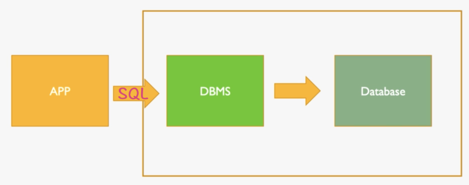

  </details>

<!-- 查詢執行順序 -->

- <details close>
  <summary>查詢執行順序</summary>

  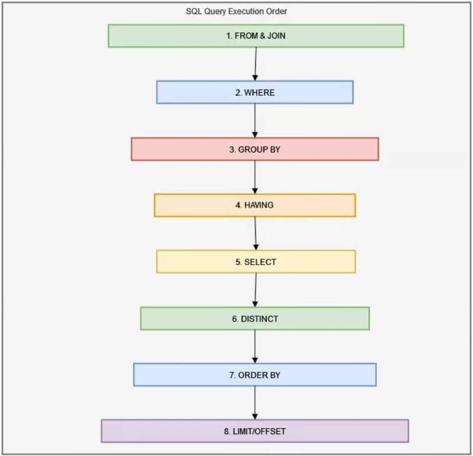

  </details>

<!-- ## # 安裝

TODO: 再修改整理

- 以`Homebrew`安裝
- 以`docker`啟動
- `mysql_secure_installation`進行安全設置

  - 設定每次連線所需的密碼
  - 設定是否開放遠端連線 --NO-> 只能在本機連線
  - 設定是否開放 test user --NO-> 只能用 root 連線

- `mysql -u root -p`進入 MySQL 介面

  - `-u <user>`：以該 user 身份執行
  - `-p`：輸入密碼

 -->

## # 基礎指令

<!-- 速記小抄 (Cheat Sheet) -->

- <details close>
  <summary>速記小抄 (Cheat Sheet)</summary>

  
  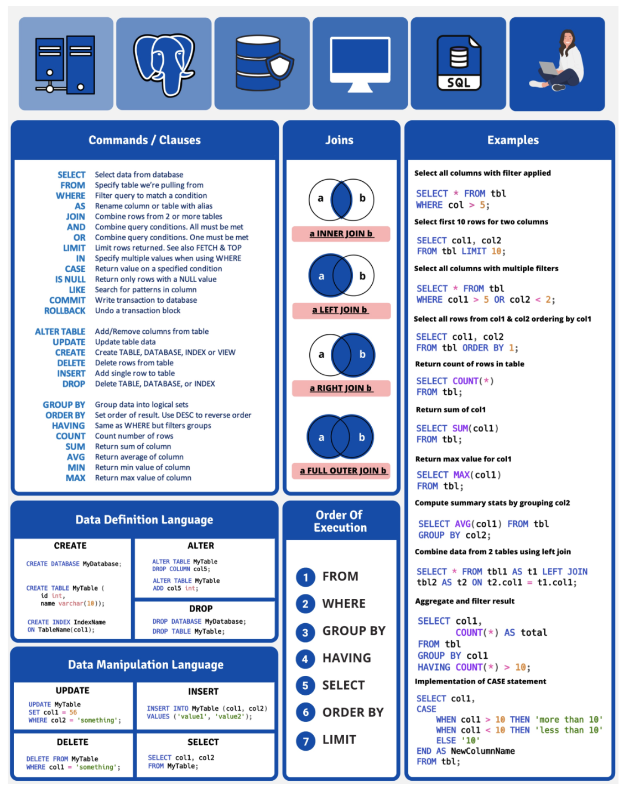

  </details>

<!-- 基本設定查詢 -->

- <details close>
  <summary>基本設定查詢</summary>

  <!-- SELECT VERSION(); -->

  - <details close>
    <summary><code>SELECT VERSION();</code></summary>

    - 查看 MySQL 版本

    </details>

  <!-- SELECT DATABASE(); -->

  - <details close>
    <summary><code>SELECT DATABASE();</code></summary>

    - 查詢目前正在 use 的 DB

    </details>

  <!-- DELIMITER symbol -->

  - <details close>
    <summary><code>DELIMITER symbol</code></summary>

    - 更改結尾的符號
    - 當前環境生效，若 exit 再回來則回覆成 `;`

    ```sql
    -- EX. 原本用 ; 結尾
    > SELECT * FROM users;

    -- 改成用 # 結尾
    > DELIMITER #
    > SELECT * FROM users#

    -- exit 後恢復 ;
    > exit
    $ mysql -r root -p
    > SELECT * FROM users;
    ```

    </details>

  <!-- DESCRIBE table; -->

  - <details close>
    <summary><code>DESCRIBE table;</code></summary>

    - 秀出該 table 的樣貌

    </details>

  <!-- SHOW WARNINGS; -->

  - <details close>
    <summary><code>SHOW WARNINGS;</code></summary>

    - REF: [MariaDB Error Codes]
    - 列出上一個操作所造成的 Error 或 Warning
    - 只要做新的 SQL 動作，前面的 warning 就消失了

    </details>

  <!-- SHOW VARIABLES; -->

  - <details close>
    <summary><code>SHOW VARIABLES;</code></summary>

    - 列出所有 DB server 中的變數設定
    - 設定方式：`SET var_name="var_value"`

    </details>

  <!-- SHOW CREATE DATABASE db_name; -->

  - <details close>
    <summary><code>SHOW CREATE DATABASE db_name;</code></summary>

    - [MySQL Doc: SHOW Statements]
    - 可以查詢該 database 的資訊 (CHARACTER SET, COLLATE, ENCRYPTION)
    - 同理可查 `SCHEMA`

    </details>

  </details>

<!-- CRUD -->

- <details close>
  <summary>CRUD</summary>

  <!-- INSERT INTO -->

  - <details close>
    <summary><code>INSERT INTO</code></summary>

    - `INSERT INTO table(col1, col2) VALUES(col1, col2);`，是按照順序來進行配對 column

    </details>

  </details>

<!-- Optimizing SELECT Statements -->

- <details close>
  <summary>Optimizing SELECT Statements</summary>

  - [Optimizing SELECT Statements]

  <!-- ORDER BY -->

  - <details close>
    <summary><code>ORDER BY</code></summary>

    - `DESC` 降冪 (預設為升冪)

      - 排序方式從 升冪 改為 降冪
      - EX. `SELECT * FROM employees ORDER BY salary DESC;`

    - `ORDER BY 1`

      - 依照 SELECT 的第一項 (EX. name) 來排序
      - EX. `SELECT name, salary FROM employees ORDER BY 1;`

    </details>

  <!-- LIMIT -->

  - <details close>
    <summary><code>LIMIT</code></summary>

    - 可用 `18446744073709551615` 確保列出 LIMIT 後全部內容
    - EX. `SELECT * FROM tbl LIMIT 95,18446744073709551615;`
    - REF: [MySQL DOC: SELECT Statement]

    </details>

  <!-- LIKE -->

  - <details close>
    <summary><code>LIKE</code></summary>

    <!-- `%` 省略 -->

    - <details close>
      <summary><code>%</code> 省略</summary>

      - EX. `SELECT * FROM table_name LIKE "%A";`
      - EX. `SELECT * FROM table_name LIKE "A%";`
      - EX. `SELECT * FROM table_name LIKE "%A%";`
      </details>

    <!-- `_` 省略數量 -->

    - <details close>
      <summary><code>_</code> 省略數量</summary>

      - 有幾個 `_` 就代表幾個 char
      - EX. `SELECT * FROM table_name LIKE "__A";`
      - EX. `SELECT * FROM table_name LIKE "A___";`
      </details>

    <!-- 預設不會區分大小寫 -->

    - <details close>
      <summary>預設不會區分大小寫</summary>

      - 可用 `BINARY` 區分大小寫
      - EX. `SELECT * FROM table_name WHERE col_name LIKE BINARY 'J%';`

      </details>

    <!-- 效能注意 -->

    - <details close>
      <summary>效能注意</summary>

      - 使用 `%`, `_` 等開頭，會無法使用 index

      </details>

    </details>

  </details>

<!-- Function -->

- <details close>
  <summary>Function</summary>

  <!-- String Function -->

  - <details close>
    <summary>String Function</summary>

    - [String Functions]

    - `CONCAT`、`CONCAT_WS`、`SUBSTR`、`REPLACE`、`REVERSE`、`CHAR_LENGTH`、`LOWER`、`UPPER`、`TRIM`、``

    </details>

  <!-- DateTime Function -->

  - <details close>
    <summary>DateTime Function</summary>

    - `NOW()`、`CURRENT_TIMESTAMP()`、`CURRENT_TIMESTAMP`

      - MySQL 中，都是回傳當下時區的時間
      - 需注意就算以數字格式呈現，也不是 TIMESTAMP，而是 DATETIME

    - `NOW()` vs `SYSDATE()`

      - `NOW()`、`CURRENT_TIMESTAMP()` 是執行準備開始的時間
      - `SYSDATE()` 是真正執行時的時間

      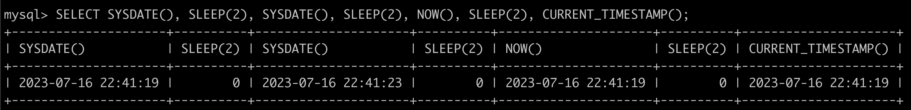

    - `DATEDIFF()`、`TIMESTAMPDIFF()`

      - `DATEDIFF()` 回傳「天數」
      - `TIMESTAMPDIFF()` 自己指定

    - [MySQL Doc: Date and Time Functions]

    </details>

  <!-- Information Function -->

  - <details close>
    <summary>Information Function</summary>

    - `CONNECTION_ID()`、`DATABASE()`、`LAST_INSERT_ID()`、`USER()`、`VERSION()`

    - `LAST_INSERT_ID()`

      - 同時插入多筆資料，會回傳第一筆的 id

      ```sql
      -- EX. 一次 INSERT a,b,c，但 LAST_INSERT_ID() 會回傳 a 的 id

      mysql> SELECT * FROM table1;
      +----+------+
      | id | col1 |
      +----+------+
      | 1  | x    |
      +----+------+

      mysql> INSERT INTO table1(col1) VALUES('a'),('b'),('c');

      mysql> SELECT * FROM table1;
      +----+------+
      | id | col1 |
      +----+------+
      | 1  | x    |
      | 2  | a    |
      | 3  | b    |
      | 4  | c    |
      +----+------+

      mysql> SELECT LAST_INSERT_ID();
      +------------------+
      | LAST_INSERT_ID() |
      +------------------+
      |                2 |
      +------------------+
      ```

    </details>

  <!-- Aggregate Function -->

  - <details close>
    <summary>Aggregate Function</summary>

    - [Aggregate Function]

    - `COUNT`、`DISTINCT`、`SUM`、`MAX`、`MIN`、`AVG`

    <!-- GROUP BY -->

    - <details close>
      <summary><code>GROUP BY</code></summary>

      - `HAVING`：類似於 `GROUP BY` 的 `WHERE`，但本質上不同

      </details>

    <!-- HAVING VS WHERE -->

    - <details close>
      <summary><code>HAVING</code> VS <code>WHERE</code></summary>

      - `WHERE`：查表時進行篩選
      - `HAVING`：對查詢結果進行篩選

      - 當在一般情形，直接以 `HAVING` 替代 `WHERE`，則會先返回結果才進行篩選，導致其掃表的範圍變大、返回的內容變多

        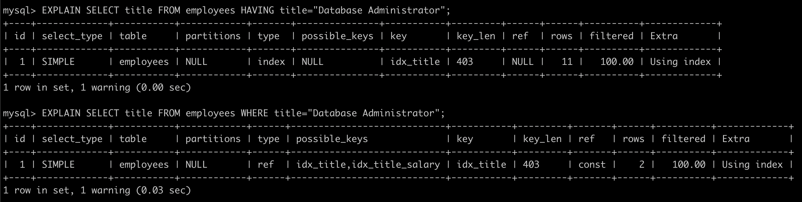

      </details>

    </details>

  <!-- Encryption and Compression Functions -->

  - <details close>
    <summary>Encryption and Compression Function</summary>

    - `MD5()`、`SHA1()`、`SHA2()`

    - `VALIDATE_PASSWORD_STRENGTH()`

      - 需先安裝 [validate_password]
      - 回傳密碼強度
      - 不會記錄在 shell 的 history

    </details>

  </details>

<!-- Operator -->

- <details close>
  <summary>Operator</summary>

  - [MySQL Doc: Operator]

  - `NOT`、`!=`、`LIKE`、`BINARY`、`AND`、`OR`、`BETWEEN`、`IN`、`CASE`

  - `BINARY`

    - 轉成 binary string，可以進行 byte by byte 的比較 (沒轉之前為 char by char，所以才無法區分大小寫)

    - 範例

      - 在查詢時才指定 COLLATE

        - EX. `SELECT * FROM table_name WHERE col_name LIKE BINARY 'J%';`

      - 在定義欄位時，同時定義預設的 COLLATE

        - EX. `CREATE TABLE table_name(col_name VARCHAR(5) BINARY);`

      ```sql
      -- 預設為 utf8mb4 時，以下兩兩同義：
      CHAR(10) BINARY
      CHAR(10) CHARACTER SET utf8mb4 COLLATE utf8mb4_bin

      CHAR(10) CHARACTER SET binary
      BINARY(10)
      ```

    - REF: [MySQL Doc: BINARY] | [MySQL 函數 ｜鐵人]

  - `BETWEEN`

    - 包含前後兩個
    - EX. `SELECT * FROM table_name WHERE col_name BETWEEN 1 AND 5;` 中，回傳資料包含 1 & 5

  - `CASE`

    ```sql
    -- EX. 依照分數分類為 1 ~ 5 顆星，並在查詢結果增加一個 col 為 stars

    SELECT *,
      CASE
        WHEN score>=8 THEN "*****"
        WHEN score>=7 AND score<8 THEN "****"
        WHEN score>=6 AND score<7 THEN "***"
        WHEN score>=5 AND score<6 THEN "**"
        ELSE "*"
      END AS stars
    FROM movie
    ```

  </details>

<!-- Index -->

- <details close>
  <summary>Index</summary>

  <!-- CREATE INDEX index_name ON table_name(title); -->

  - `CREATE INDEX index_name ON table_name(title);`

  <!-- SHOW INDEXES FROM table_name; -->

  - `SHOW INDEXES FROM table_name;`

  </details>

<!-- ALTER -->

- <details close>
  <summary><code>ALTER</code></summary>

  - `ALTER TABLE table_name MODIFY col_name TYPE_NAME;`

    - 更改 col 的 type
    - 需相容所有已存在的資料，才能改變

  </details>

<!-- JOIN -->

- <details close>
  <summary><code>JOIN</code></summary>

  <!-- 基本 -->

  - <details close>
    <summary>基本</summary>

    - `join buffer` 預設：256KB
    - `SHOW VARIABLES LIKE 'join_%';`

    </details>

  <!-- JOIN 的過程 -->

  - <details close>
    <summary>JOIN 的過程</summary>

    </details>

  <!-- `ON` vs `WHERE` -->

  - <details close>
    <summary><code>ON</code> vs <code>WHERE</code></summary>

    </details>

  <!-- FOREIGN KEY -->

  - <details close>
    <summary><code>FOREIGN KEY</code></summary>

    - EX. `FOREIGN KEY(table_name_id) REFERENCES table_name(id)`

    - 插入時，`table_name_id` 欄位會進行檢查，只能填入已存在的 `table_name.id`
    - 一些規範，不建議使用 `FOREIGN KEY`，因為會降低效能 (可能都會在 server 端進行檢查)

    </details>

  <!-- ON DELETE CASCADE -->

  - <details close>
    <summary><code>ON DELETE CASCADE</code></summary>

    - [ON UPDATE/DELETE 作用]

    </details>

  

  </details>

<!-- COLLATE -->

- <details close>
  <summary><code>COLLATE</code></summary>

  </details>

## # Data Type

- REF: [MySQL Doc: DataType] | [DataType (from ntct)]

<!-- Numeric Type -->

- <details close>
  <summary>Numeric Type</summary>

  <!-- Interger Types -->

  - <details close>
    <summary>Interger Types</summary>

    - `TINYINT`、`SMALLINT`、`MEDIUMINT`、`INT`、`BIGINT`
    - 1、2、3、4、8 byte
    - 可以使用 `UNSIGNED`
      - EX. `INT UNSIGNED`

    </details>

  <!-- Fixed-Point Types -->

  - <details close>
    <summary>Fixed-Point Types</summary>

    - `DECIMAL`、`NUMERIC`

    <!-- size (`DECIMAL(M,D)`) -->

    - <details close>
      <summary>size (<code>DECIMAL(M,D)</code>)</summary>

      - M 最多 65 digits
      - <mark>TODO: 此資料有點問題，待研究</mark> size：`M > D ? M + 2 : D + 2` byte
      - 應該是 M+2 byte，且 D <= M+2 ？
      </details>

    <!-- 範例 -->

    - <details close>
      <summary>範例</summary>

      - EX. `DECIMAL(5,2)`
      - precision 為 5 位數字 (digits)，scale 為 2 位小數 (decimals)
      - 範圍：-999.99 ~ 999.99
      </details>

    <!-- 簡寫 -->

    - <details close>
      <summary>簡寫</summary>

      - `DECIMAL(M)` 等於 `DECIMAL(M,0)`
      - `DECIMAL` 等於 `DECIMAL(10)`

      </details>

    - REF: [MySQL Doc: Precision Math]

    </details>

  <!-- Floating-Point Types (不準確) -->

  - <details close>
    <summary>Floating-Point Types (不準確)</summary>

    - `FLOAT`、`DOUBLE`
    - `FLOAT` 4 byte，`DOUBLE` 8 byte
    - 格式同 `DECIMAL`，但儲存方式不同，精準度也就不同

    </details>

  <!-- Bit-Value Type -->

  - <details close>
    <summary>Bit-Value Type</summary>

    - `BIT`
    - `BIT(M)`: M 可以 1 ~ 64

    <!-- 輸入範例 -->

    - <details close>
      <summary>輸入範例</summary>

      - `INSERT INTO table_name VALUE(b'11111111');`
      - `INSERT INTO table_name VALUE(0b11111111);`
      - `INSERT INTO table_name VALUE(x'FF');`
      - `INSERT INTO table_name VALUE(0xFF);`
      - `INSERT INTO table_name VALUE(255);`
      </details>

    <!-- 輸出範例 -->

    - <details close>
      <summary>輸出範例</summary>

      - `SELECT x, x+0, BIN(x), OCT(x), HEX(x) FROM table_name;`

        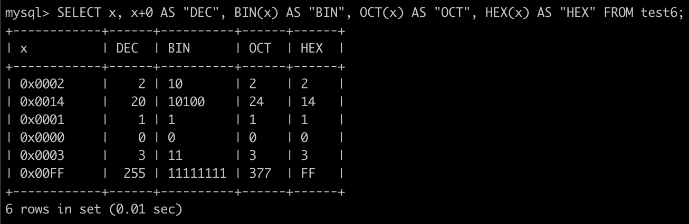

      </details>

    </details>

  </details>

<!-- Date Type -->

- <details close>
  <summary>Date Type</summary>

  - REF: [MySQL Doc: Date]

  - `DATE`、`TIME`、`YEAR`、`DATETIME`、`TIMESTAMP`
  - 盡量都按照完整格式書寫。若需使用簡寫，需再仔細研究地雷區
  - 有些可以超出一點 support 的範圍，但不建議也不保證

  <!-- DATE -->

  - <details close>
    <summary><code>DATE</code></summary>

    - `YYYY-MM-DD`
    - `1000-01-01` ~ `9999-12-31`
    - 3 byte

    </details>

  <!-- TIME -->

  - <details close>
    <summary><code>TIME</code></summary>

    - `HH:MM:SS`
    - `-838:59:59` ~ `838:59:59`
    - 3 byte
    - <mark>TODO:Q</mark> 為啥是 838 ？

    </details>

  <!-- YEAR -->

  - <details close>
    <summary><code>YEAR</code></summary>

    - `1901` ~ `2155`
    - 1 byte

    </details>

  <!-- DATETIME -->

  - <details close>
    <summary><code>DATETIME</code></summary>

    - `DATE` + `TIME` + microseconds
    - `YYYY-MM-DD HH:MM:SS`
    - `1000-01-01 00:00:00` ~ `9999-12-31 23:59:59`
    - 8 byte

    </details>

  <!-- TIMESTAMP -->

  - <details close>
    <summary><code>TIMESTAMP</code></summary>

    - `1970-01-01 00:00:01 UTC` ~ `2038-01-19 03:14:07 UTC`
    - 4 byte (INT SIGNED)
    - 時區問題

      - 以當下 SQL server 內設定的時區 (可改設定)，計算出 timestamp
      - version 8.0.22 後，可在 SQL 用 `CAST()` 直接轉

        - EX. `CAST(timestamp AT TIME ZONE INTERVAL '+00:00' AS datetime)`

    - 實用範例

      - 兩種寫法都可以使得每次 update 該 row 時，自動更新 update_at
      - `TIMESTAMP` 有時候會預設直接做此設定

      ```sql
      mysql> CREATE TABLE table_name(
                col_name1 INT,
                update_at TIMESTAMP
                  NOT NULL DEFAULT CURRENT_TIMESTAMP
                  ON UPDATE CURRENT_TIMESTAMP
              );

      mysql> CREATE TABLE table_name(
                col_name1 INT,
                update_at TIMESTAMP
                  NOT NULL DEFAULT NOW()
                  ON UPDATE NOW()
                );
      ```

      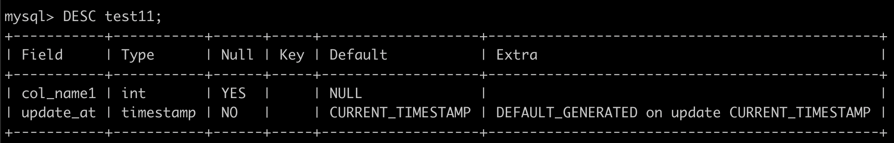

    </details>

  <!-- DATETIME vs TIMESTAMP -->

  - <details close>
    <summary><code>DATETIME</code> vs <code>TIMESTAMP</code></summary>

    - Datetime (1000 ～ 9999 年)，Timestamp (1970 ～ 2038 年)
    - For index, Timestamp 比 Datetime 快
    - 面臨的時區問題不同 (詳見注意事項)

    </details>

  </details>

<!-- String Type -->

- <details close>
  <summary>String Type</summary>

  <!-- `Binary strings` vs `Nonbinary strings` -->

  - <details close>
    <summary><code>Binary strings</code> vs <code>Nonbinary strings</code></summary>

    - Binary strings

      - `BINARY`、`VARBINARY`、`BLOB`、

    - Nonbinary strings

      - `CHAR`、`VARCHAR`、`TEXT`

    </details>

  <!-- `CHAR`、`VARCHAR` -->

  - <details close>
    <summary><code>CHAR</code>、<code>VARCHAR</code></summary>

    - 定義要使用幾個 char
    - type：1 byte
    - 英文字母：1 byte

    - `CHAR`

      - 0 ~ 255 char
      - 固定空間

    - `VARCHAR`

      - 0 ~ 65535 char
      - 固定最大可使用空間
      - 改變長度時，會需要重新分配空間

    - function

      - `CHAR_LENGTH()` 計算 char 長度
      - `LENGTH()` 計算 char 所使用空間 (但如果 CHAR(4) 存 'ab'，會回傳 2)

    </details>

  <!-- `BINARY`、`VARBINARY` -->

  - <details close>
    <summary><code>BINARY</code>、<code>VARBINARY</code></summary>

    - 定義要使用幾個 byte
    - `BINARY` 會補滿 0x00，所以用 `LENGTH()` 會回傳固定的

    </details>

  <!-- `BLOB`、`TEXT` -->

  - <details close>
    <summary><code>BLOB</code>、<code>TEXT</code></summary>

    - 儲存空間更大的 `VARBINARY`、`VARCHAR`
    - 2^8, 2^16, 2^24, 2^32 byte
    - 可以設定 `max_sort_length`，排序時，最多只會依照前面 max_sort_length 個去排序

    </details>

  <!-- `ENUM`、`SET` -->

  - <details close>
    <summary><code>ENUM</code>、<code>SET</code></summary>

    <!-- ENUM -->

    - <details close>
      <summary><code>ENUM</code></summary>

      - 實際上是儲存一個 index，可節省空間
      - 也可以在 insert 時，使用 index 編號

        ```sql
        -- EX. S, M, L = 1, 2, 3

        mysql> CREATE TABLE table1(title VARCHAR(5), size ENUM('S', 'M', 'L'));
        mysql> INSERT INTO table1(title, size) VALUE('hat', 1);
        ```

      - <mark>TODO:Q</mark> `ENUM` 在 insert & select 會比 `CHAR` 快？

      </details>

    <!-- SET -->

    - <details close>
      <summary><code>SET</code></summary>

      - 0 ~ 64 member

        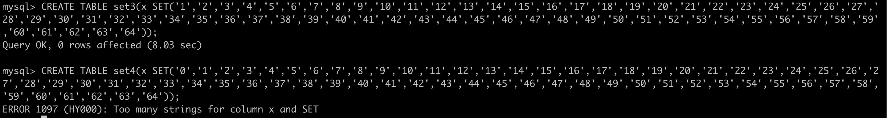

      - 如同 `ENUM`，也是儲存 index

      - 注意每個 member 之間，不能有空格

        ```sql
        -- EX. X
        mysql> INSERT INTO set1 VALUE("enum1, enum2");

        -- EX. O
        mysql> INSERT INTO set1 VALUE("enum1,enum2");
        ```

      - index 換算成二進位，剛好對應到有哪些 member

        - EX. 在 SET("L,M,S") 中，index 與 set 的關係

        | index | L   | M   | S   | set   |
        | ----- | --- | --- | --- | ----- |
        | 0     | 0   | 0   | 0   |       |
        | 1     | 0   | 0   | 1   | S     |
        | 2     | 0   | 1   | 0   | M     |
        | 3     | 0   | 1   | 1   | M,S   |
        | 4     | 1   | 0   | 0   | L     |
        | 5     | 1   | 0   | 1   | L,S   |
        | 6     | 1   | 1   | 0   | L,M   |
        | 7     | 1   | 1   | 1   | L,M,S |

      - <mark>TODO:</mark> EXPLAIN 一下使用 index 跟 明文時，是否有效率差異

      </details>

    </details>

  </details>

## # 底層研究

<!-- MyISAM VS InnoDB (現況預設：InnoDB) -->

- <details close>
  <summary>MyISAM VS InnoDB (現況預設：InnoDB)</summary>

  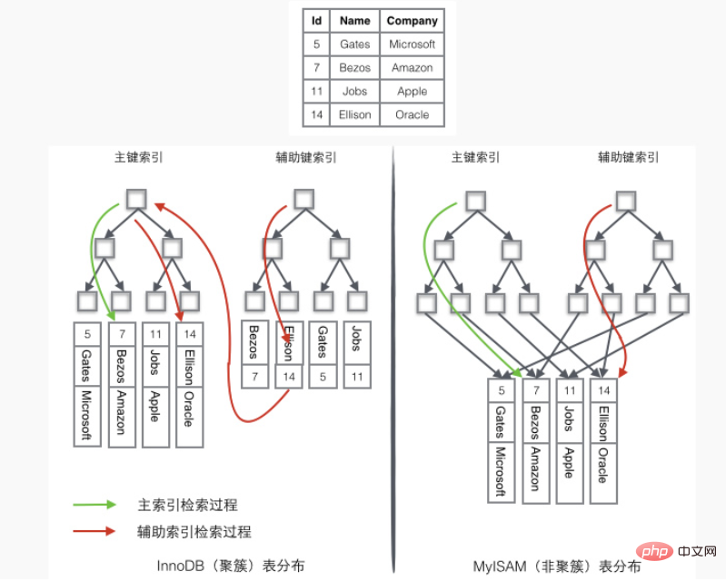
  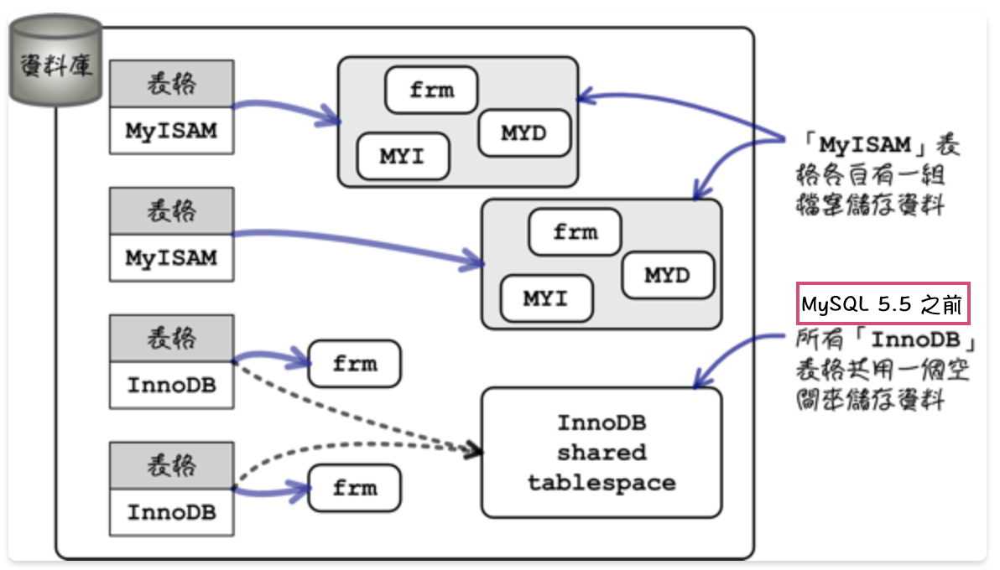

  - `Transactions`、`ACID`、`Row-level lock`、`Foreign key`

  - REF:

    - [老生常談：MySQL 的體系結構]
    - [MySQL InnoDB 儲存引擎大觀]
    - [MySQL 儲存引擎與資料型態]
    - [MySQL 資料庫引擎 InnoDB 與 MyISAM 有何差異?]

  </details>

<!-- InnoDB Architecture -->

- <details close>
  <summary>InnoDB Architecture</summary>

  <!-- In-Memory Structures -->

  - <details close>
    <summary>In-Memory Structures</summary>

    <!-- Buffer Pool -->

    - <details close>
      <summary>Buffer Pool</summary>

      - 簡介：InnoDB 引擎 In-Memory 區塊中，用於快取資料，從而減少 Disk I/O、加速讀寫操作

      <!-- 行為特性 -->

      - <details close>
        <summary>行為特性</summary>

        - 所有區塊都是以 page 為單位 (預設 16KB)
        - 不區分種類，將所有 page 串成 `LRU List`＆`Flush List` 兩個 List
        - `LRU List` 中，預設 old sublist 佔 37% (準備被淘汰的部分)
        - `Flush List` 中存放尚未被寫入 disk 的 page (dirty page)

        </details>

      <!-- 種類介紹 -->

      - <details close>
        <summary>種類介紹</summary>

        <!-- Pages -->

        - Pages：Data Pages、Index Pages、Undo Pages、change buffer Pages、AHI Pages、System Pages

        <!-- Change Buffer -->

        - <details close>
          <summary>Change Buffer</summary>

          - 針對`尚未被讀取至 memory 中的 Index page 的 INSERT、UPDATE、DELETE`，會先將更新存在 Change Buffer
          - 每當 Index page 被讀取至 memory，則會立刻與對應的 Change Buffer 進行合併
          - 達到 checkpoint 時，也會進行合併，必須先將對應的 Index page 讀取至 memory
          - 以 `B+ Tree` 結構存在

          </details>

        <!-- AHI (Adaptive Hash Index) -->

        - <details close>
          <summary>AHI (Adaptive Hash Index)</summary>

          - 用 `Hash Table` 來記錄常用的查詢位址

            ```
            // EX.

            key1 = 3 對應的 Index page 位址
            pk = 5 對應的 Data page 位址
            ```

          - 觸發條件 (符合「常用的查詢位址」的條件)

            - 連續以同樣的等值查詢條件查詢了 100 次
            - 並且透過此查詢訪問同一個 page 位址 N 次 (N = rows of page / 16)

          </details>

        </details>

      </details>

    <!-- Redo Log Buffer -->

    - <details close>
      <summary>Redo Log Buffer (預設 16 MB)</summary>

      - 參數：`innodb_log_buffer_size`
      - 當機時，Buffer Pool 中資料的恢復機制
      - 當資料寫入 Buffer Pool & redo log 中後，就會回應已完成寫入
        (redo log 的處理方式因 `innodb_flush_log_at_trx_commit` 設定而不同，預設立刻寫入 disk，若沒關閉 OS Cache 就還是有機會漏掉)
      - 此時被視為 dirty pages，放入 Flush List
      - redo log 中也會紀錄完整的資料，所以當機時可從 redo log 中找回，重寫入一次資料
      - 雖然 redo log 也寫入 disk，但因為寫入的位址是按照順序，不像寫入 DB 會切換位址，因此相對來說是很快的
      - 達到 checkpoint 時，會將 dirty pages 寫入 DB，並將 redo log 對應的資料空間釋放

      </details>

    <!-- Undo Log Buffer -->

    - <details close>
      <summary>Undo Log Buffer</summary>

      - 保存 Transaction 的舊版本資料，並支援 MVCC 的處理
      - 在 disk 中是紀錄在 Undo Tablespace
      - 也會產生對應的 undo page，也會將此操作記錄在 Redo Log
      - 只有在出現有需要 MVCC 處理的 Transaction 時，才會寫入 undo page，進而被安排寫入 Undo Tablespace

      </details>

    <!-- Data Dictionary (Meta Data) -->

    - <details close>
      <summary>Data Dictionary (Meta Data)</summary>

      - MySQL 8.0 以後，Data Dictionary 已經持久化，並且完全捨棄各自 table 的 `.frm` (統一在 `ibdata`)
      - INFORMATION_SCHEMA 的部分組成，即是在查詢時，才動態從 Data Dictionary 中讀取的資料 (還包括從其他地方獲取的 Meta Data)

      </details>

    <!-- Lock Information (Lock Table) -->

    - <details close>
      <summary>Lock Information (Lock Table)</summary>

      - 在處理 Memory-Level Locks，會針對 page-level 來進行 mutex lock (互斥鎖)

      - 操作 LRU List 與 Flush List 時，也會進行 shared read lock

      </details>

    </details>

  <!-- On-Disk Structures -->

  - <details close>
    <summary>On-Disk Structures</summary>

    <!-- Redo Log -->

    - <details close>
      <summary>Redo Log (預設 48 MB x 2)</summary>

      - 參數：`innodb_log_file_size`、`innodb_log_files_in_group`
      - 環狀結構：memory 中有指針記錄目前寫入位置，依序寫滿一個 file 繼續寫下一個 file，直到最後一個再循環回第一個 file
      - 設定考量：

        - 系統崩潰後的恢復：會進行完整 Redo Log 上的操作
        - Checkpoint 觸發：使用了 `innodb_log_file_size`x`innodb_log_files_in_group` 的 75% ~ 80%
        - 結論：設定太大，系統崩潰後的恢復時間太長。設定太小，會太常觸發 Checkpoint

      </details>

    <!-- Doublewrite Buffer -->

    - <details close>
      <summary>Doublewrite Buffer (預設 2 MB)</summary>

      - 資料真正寫入 Disk 前，會先將 page 寫入 Doublewrite Buffer
      - 因為預設下，Disk 一次性寫入 512 Byte，無法完全確保 page (16KB) 的原子性寫入
      - MySQL 8.0 後改為獨立的 File (.dblwr)，更之前是寫在 The System Tablespace 中

      </details>

    <!-- TableSpace -->

    - <details close>
      <summary>TableSpace</summary>

      <!-- 行為特性 -->

      - <details close>
        <summary>行為特性</summary>

        - 依照不同類型，可能對應一個 file，也可能對應數個 file 組成一個 TableSpace

        - TableSpace 實際上就是 File 層級的空間劃分 (.ibd)

          - EX. (A)兩個表各自使用 File-Per-Table Tablespace vs (B)將兩個表組成一個 General Tablespace
          - 在查詢介面時，都會看到兩個 table
          - 在 Disk 中，A 分兩個 IBD file，B 集中在一個 IBD file

        - 讀寫時，如同其他 data pages 那樣，一起在 buffer pool 中管理

        </details>

      <!-- 邏輯結構 -->

      - <details close>
        <summary>邏輯結構</summary>

        <!-- 以 `Segment` 為單位 -->

        - <details close>
          <summary>以 <code>Segment</code> 為單位</summary>

          - 可能有 Index Segment、Data Segment、Rollback Segment
          - 目前 Rollback Segment 統一在一個 Tablespace，可選擇 Undo Tablespace 或 System Tablespace
          - 如果有大型 BLOB/TEXT 等資料型態，會將太大的移到 Row 之外，組成另一個 Segment (動態拆分成更多 Segment 存放)

          </details>

        - 一個 `TableSpace` 可以有數個 `Segments`
        - 一個 `Segment` 包含 N x `Extents`(1 MB)
        - 一個 `Extent` 包含 64 x `Pages`(16 KB)
        - 一個 `Page` 包含 `Header`(38 B)、N x `Rows`、`Trailer`(8 B)

        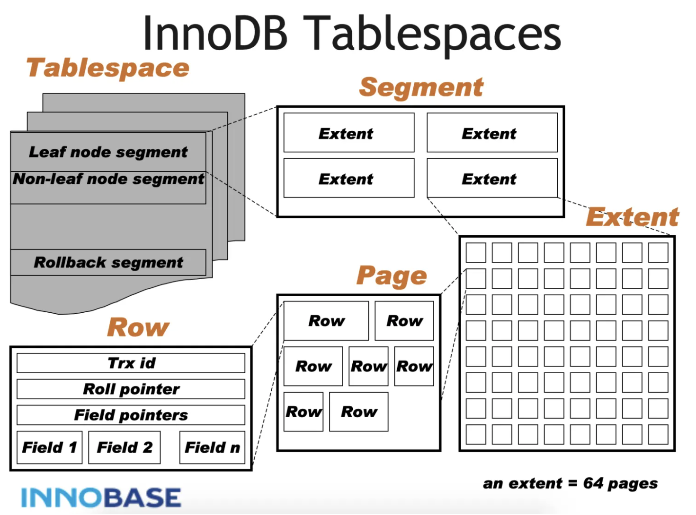

        </details>

      <!-- 物理結構 -->

      - <details close>
        <summary>物理結構</summary>

        <!-- 每個 IBD file，開頭會有 `FSP_HDR`、`IBUF_BITMAP`、`INODE` 等 MetaData 相關的 page -->

        - <details close>
          <summary>每個 IBD file，開頭會有 <code>FSP_HDR</code>、<code>IBUF_BITMAP</code>、<code>INODE</code> 等 MetaData 相關的 page</summary>

          - 簡述：INODE 描述 Segment，FSP_HDR 描述 Extent

          - `FSP_HDR`：只儲存前面 256 個 `XDES` (extent descriptors)，只管理最初的 256 個 Extents (超過的 XDES 會再生成新的 `XDES Pages` 來管理)

          - `IBUF_BITMAP`：標記 page 與 `Change Buffer` 關聯的資訊

          - `INODE`：包含 85 x `INODE entry`(192 B)，每個 INODE entry 描述一個 `FSEG` (File Segment)。同理一開始只有一個 INODE Page，超過才在後續擴充

          </details>

        - 緊接在後，主要會以 Extent 為單位，來分配空間

        <!-- 查詢方式 -->

        - <details close>
          <summary>查詢方式</summary>

          ```sql
          -- 得到 ID = num1
          select * from information_schema.innodb_sys_tables where name='test/t';

          -- 以 ID 查詢得到該 tablespace 的前四個 page
          select * from information_schema.innodb_buffer_page where SPACE=num1;
          ```

          </details>

        

        </details>

      <!-- 範例圖解 -->

      - <details close>
        <summary>範例圖解</summary>

        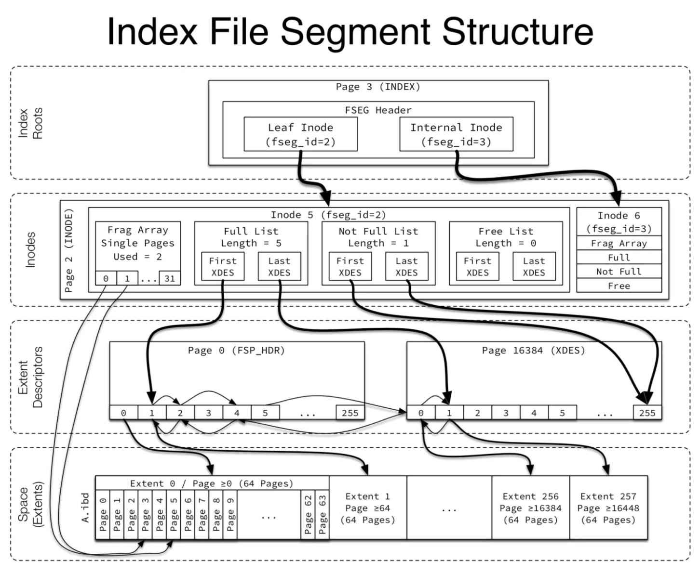
        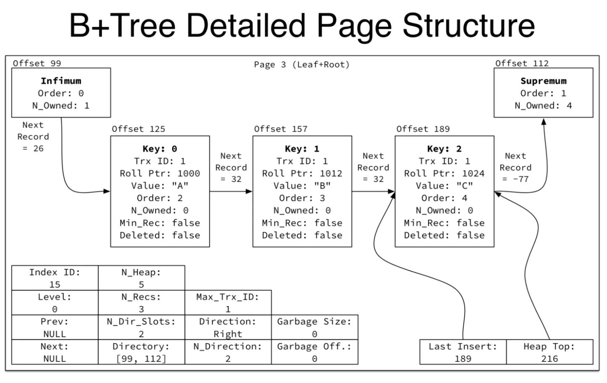
        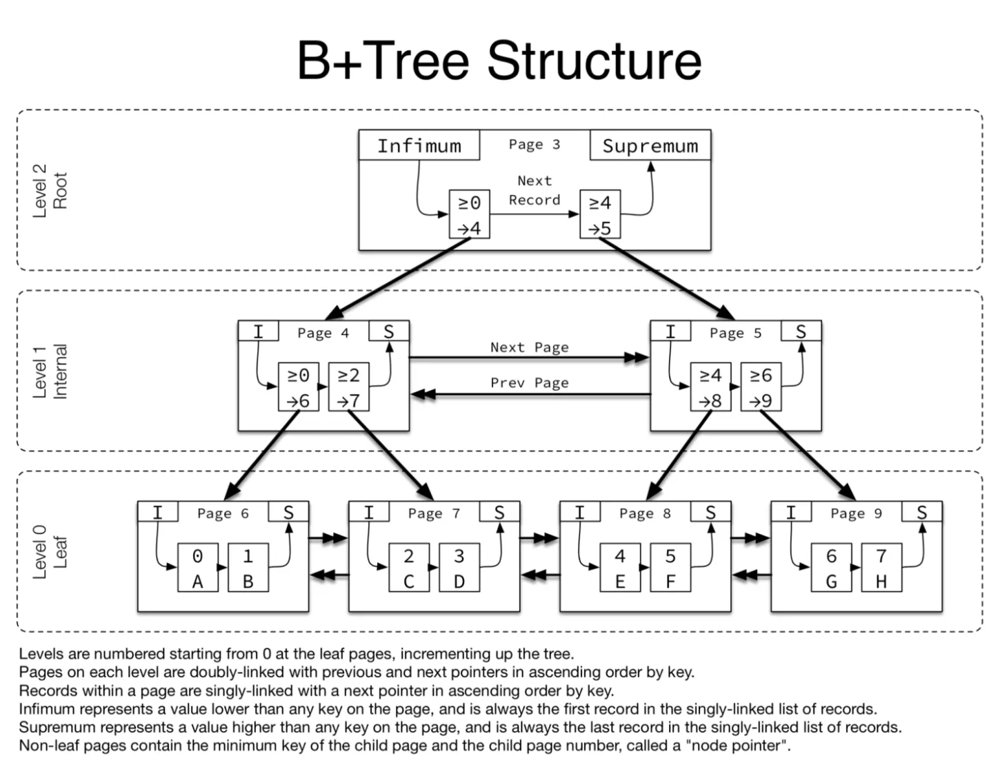
        

        </details>

      <!-- 種類介紹 -->

      - <details close>
        <summary>種類介紹</summary>

        - The System Tablespace、File-Per-Table Tablespaces、General Tablespaces、Undo Tablespaces、Temporary Tablespaces

        <!-- File-Per-Table Tablespaces -->

        - <details close>
          <summary><code>File-Per-Table Tablespaces</code></summary>

          - MySQL 5.5 之前，InnoDB 只有一個共享的 tablespace
          - 設定了 innodb_file_per_table ，則每個 table 都會產生一個獨立的 File-Per-Table Tablespace (tablename.ibd)
          - 推薦 innodb_file_per_table 開啟

          </details>

        <!-- General Tablespaces -->

        - <details close>
          <summary><code>General Tablespaces</code></summary>

          - 一張表的存在是 General 與 File-Per-Table 二選一
          - 可將關聯性高的數張小表，集中在一個 IBD file 管理，減少隨機 I/O
          - 集中後，要注意從單個表，改成以整個 Tablespace 來思考檔案大小

          </details>

        <!-- Temporary Tablespaces -->

        - <details close>
          <summary><code>Temporary Tablespaces</code></summary>

          - 在創建完成後，就跟來源 Tablespace 分開管理，想要有連動的更新都是另外再加上去
          - 分為 `Global` & `Session`
          - 可選擇 Memory、InnoDB、MyISAM 等引擎
          - Global 每次重啟都會自動重新創建，Session 只在當次存在
          - 創建時，預設使用 `REPEATABLE READ` 隔離級別

          </details>

        </details>

      </details>

    </details>

  <!-- 其他補充 -->

  - <details close>
    <summary>其他補充</summary>

    - memory 上的 data page 會對應到 disk 上的 data page，一次最少讀寫一個 page

    - `OS Cache` 通常不會開啟，因為跟 Buffer Pool 重複快取功能，而 Buffer Pool 更靈活

    <!-- innodb_buffer_pool_instances -->

    - <details close>
      <summary><code>innodb_buffer_pool_instances</code></summary>

      - 增加 instance 數量用來解決，多 threads 高併發效能
      - 官方建議在 Buffer Pool 大於 1GB 時，才開始考慮劃分實例
      - 建議一顆 CPU 只配一個 Buffer Pool
      - 指標

        - innodb_buffer_pool_size 1 ~ 8GB --> 1 ~ 4 instances
        - innodb_buffer_pool_size 8 ~ 32GB --> 4 ~ 8 instances
        - innodb_buffer_pool_size 32GB up --> 8 ~ 16 instances

      </details>

    <!-- `INFORMATION_SCHEMA` & `PERFORMANCE_SCHEMA` -->

    - <details close>
      <summary><code>INFORMATION_SCHEMA</code> & <code>PERFORMANCE_SCHEMA</code></summary>

      - 都是虛擬資料庫，其中的 table 沒有存在 disk，而是動態生成在記憶體中
      - INFORMATION_SCHEMA 是基於 Mata Data 動態查詢
      - PERFORMANCE_SCHEMA 則是動態即時收集的性能監控數據
      - 在一些操作中，例如規劃查詢計畫時，會參考到這些資訊 (一些統計數據)

      </details>

    </details>

  <!-- 圖解： -->

  - <details close>
    <summary>圖解</summary>

    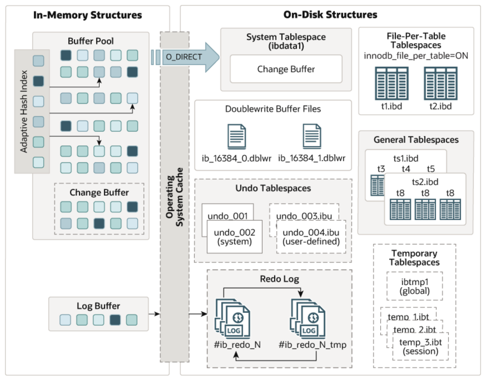

    </details>

  <!-- REF： -->

  - <details close>
    <summary>REF</summary>

    - [InnoDB Architecture]
    - [老生常談：MySQL 的體系結構]
    - [MySQL InnoDB 儲存引擎大觀]

    </details>

  </details>

<!-- B+ Tree -->

- <details close>
  <summary>B+ Tree</summary>

  - 因為資料庫存在 disk，選擇的重點在減少 I/O

    - 減少階數，減少 I/O
    - 盡量將每個 node 大小調整在 disk 的一個 block (EX. 4KB, 16KB..etc)，以減少 I/O
    - 盡量整理整齊，能放在同一個 block 以減少 I/O

  - 按順序連結，使順序遍歷更快

  - REF

    - [資料庫層的核心 - 索引結構演化論 B+樹]
    - [平衡二叉樹、B 樹、B+樹、B*樹理解其中一種你就都明白了]
    - [MySQL 底層為什麼要選用 B+樹作為索引的數據結構呢？]

  </details>

<!-- Index -->

- <details close>
  <summary>Index</summary>

  <!-- Clustered Index -->

  - <details close>
    <summary>Clustered Index</summary>

    - 一個 table 只能有一個 Clustered Index，所以應該慎選要給哪個 key 用，以發揮最大效能利益
    - key 選擇要點：不會改、常查詢、容量小、插入順序為遞增、重複率低

    - REF

      - [聚簇索引]
      - [詳解聚簇索引]
      - [MySQL 面試：談談你對聚簇索引的理解]

    </details>

  <!-- Covering Index -->

  - <details close>
    <summary>Covering Index</summary>

    - 只要 index 包含所有想查詢的 col，即為 Covering Index
    - 讓 index 中包含一些資料，使得查詢時可以直接從 index 取得資料
    - REF

      - [MySQL 覆蓋索引詳解]

    </details>

  <!-- Filter Index -->

  - <details close>
    <summary>Filter Index</summary>

    - 特化的 Covering Index，可以設定在 index 中存入的 Col，只符合特定條件的 value 才存入（並非所有的 Row 都存）
    - REF

      - [資料庫索引深入淺出(二)]

    </details>

  <!-- ICP (Index Condition Pushdown) -->

  - <details close>
    <summary>ICP (Index Condition Pushdown)</summary>

    - REF: [MySQL ICP Doc]
    - 索引條件下推（Index Condition Pushdown，ICP）
    - 預設開啟
    - 允許在 `存儲引擎層` 篩選條件，從而利用 index 過濾掉不符合的 row。而不需要將所有匹配的 index key 上傳到 `MySQL Server 層` 進行處理
    - `Extra: Using index condition` 即表示此查詢使用到 ICP
    - 關閉 ICP

      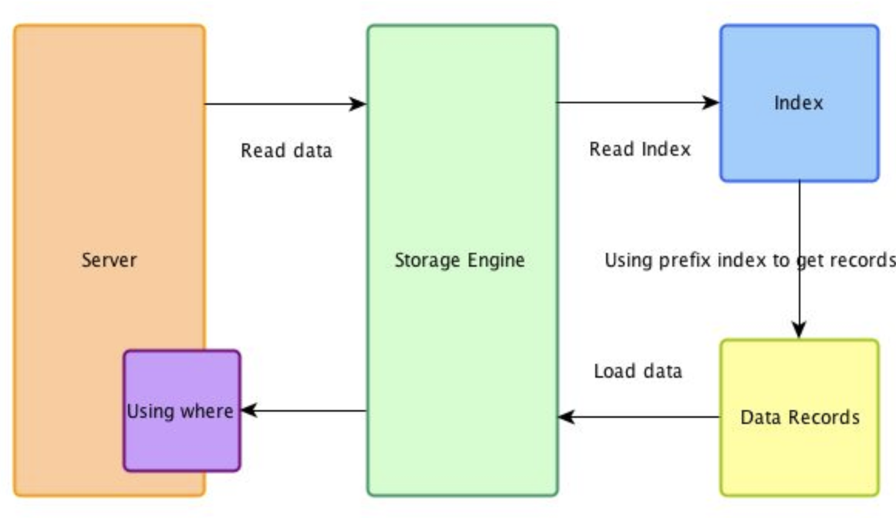

    - 使用 ICP

      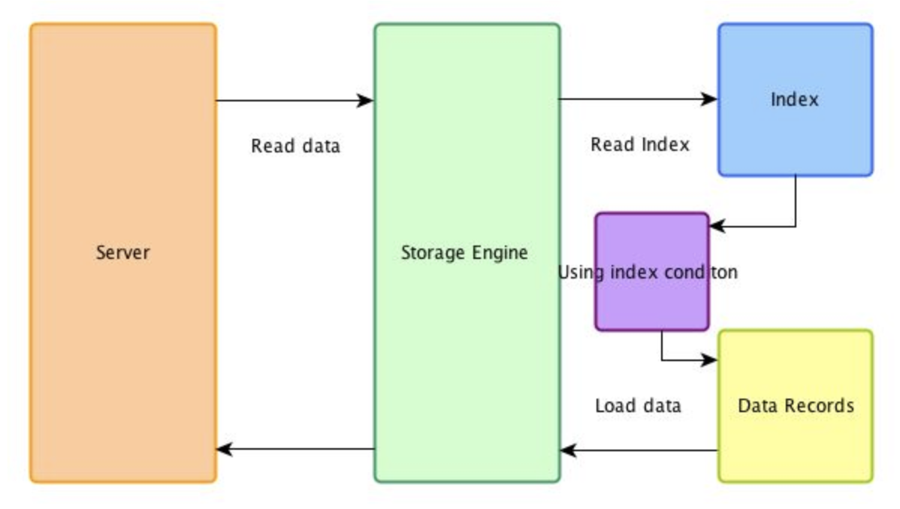

    - 範例

      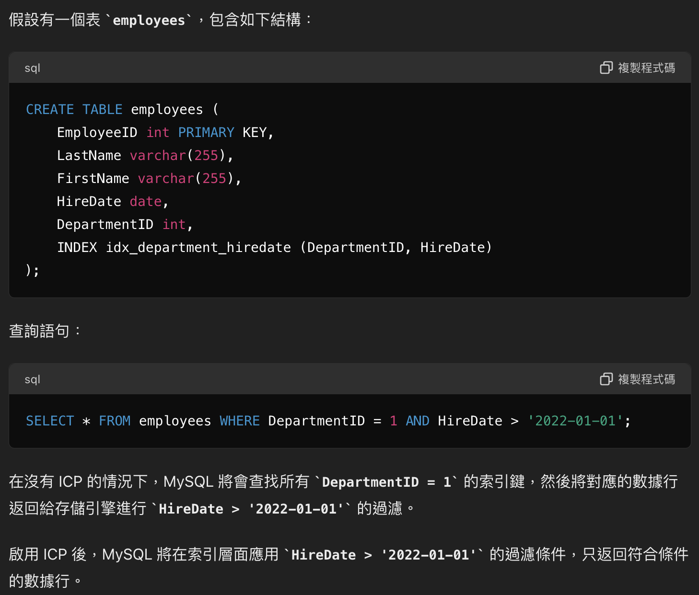

    </details>

  <!-- 其他 -->

  - <details close>
    <summary>其他</summary>

    - 需了解優化器自動選擇 index 的規則，自動選擇的並非一定就是最高效的，而是選擇 Cost Base Optimizer 最小的
    - 有時需把多餘的 index 刪除，才能讓其選中更高效的那一個 index
    - 優化器會將 possible_keys 都試一遍，因此一個查詢若有太多 possible_keys，也會變慢
    - 若在條件式中對 key 做運算，則會讓 index 失效。雖然新增了「函數索引」，但也是多建立一個 index

    </details>

  - REF: [圖解｜索引覆蓋、索引下推以及如何避免索引失效]

  </details>

<!-- Temporary Table (臨時表) -->

- <details close>
  <summary>Temporary Table (臨時表)</summary>

  <!-- 外部臨時表 -->

  - <details close>
    <summary>外部臨時表</summary>

    - 主動使用 `CREATE TEMPORARY TABLE` 建立
    - 位置：`disk`

    </details>

  <!-- 內部臨時表 -->

  - <details close>
    <summary>內部臨時表</summary>

    - 一些操作時，MySQL 自動建立 (EX. UNION, DISTINCT, view, derived tables, CTE, ORDER BY , GROUP BY)
    - 位置：`memory (HEAP)`、`disk`

      - 超過 `MAX_HEAP_TABLE_SIZE` 則由 memory 改放 disk

    </details>

  <!-- Disk 上的 Tablespace -->

  - <details close>
    <summary>Disk 上的 Tablespace</summary>

    <!-- session temporary tablespaces -->

    - <details close>
      <summary>session temporary tablespaces</summary>

      - 預設使用
      - 放在 `innodb_temp/`
      - 初始化 `temp_1.ibt` ~ `temp_10.ibt` 供使用
      - 用超過才會再增加 `temp_11.ibt`...
      - 只在一個 Session 中使用 (即每次重啟連線都會初始化)

      </details>

    <!-- global temporary tablespace -->

    - <details close>
      <summary>global temporary tablespace</summary>

      - 配置後重啟，會從使用 session 改為使用 global
      - 以 `innodb_temp_data_file_path` 進行配置

        ```ini
        # EX. filename : 初始大小 : 自動擴展 : max : 上限大小

        [mysqld]
        innodb_temp_data_file_path=ibtmp1:12M:autoextend:max:5G
        ```

      </details>

    </details>

  <!-- status label -->

  - <details close>
    <summary>status label</summary>

    - `Created_tmp_tables`
    - `Created_tmp_disk_tables`

    </details>

  </details>

<!-- MVCC -->

- <details close>
  <summary>MVCC</summary>

  - REF: [MVCC: Postgres vs MySQL vs Dolt]

  - GPT

    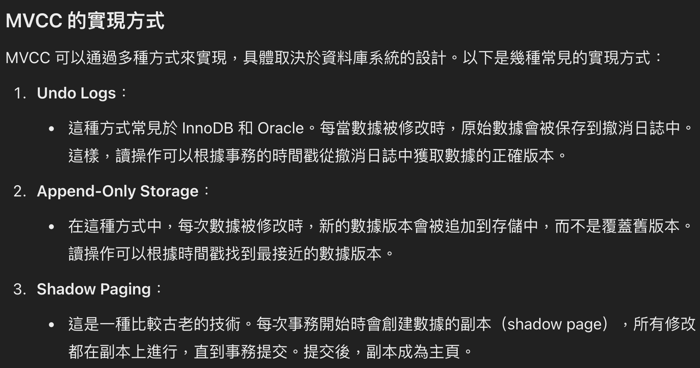

  </details>

## # 效能研究

<!-- 名詞解釋 -->

- <details close>
  <summary>名詞解釋</summary>

  - REF: [MySQL EXPLAIN Extra 解析]

  <!-- Extra -->

  - <details close>
    <summary>Extra</summary>

    - `Using where`：在 全表 中，使用 where
    - `Using index`：只在 index 中獲取資料，不用回表
    - `Using where; Using index`：在該 index 中，使用 where，且不用回表
    - `Using index condition`：使用到 ICP，在 index 中篩選好 WHERE 條件，只攜帶符合條件的 row 回表
    - `Using filesort`
    - `Using temporary`

    </details>

  <!-- type -->

  - <details close>
    <summary>type</summary>

    - `all`：跑了整個全表
    - `index`：跑了整個 index
    - `range`：數個 ref
    - `ref`：直達

    </details>

  </details>

<!-- 使用 sql function 查詢，對 index 的影響 ( EX. CONCAT ) -->

- <details close>
  <summary>使用 sql function 查詢，對 index 的影響 ( EX. CONCAT )</summary>

  - 用 `SELECT CONCAT(a, b)`，不影響是否使用 index
  - 用 `WHERE CONCAT(a, b)=""`，則無法直接使用 index 快速查詢
  - 也可以另外建一個 `CONCAT(a, b)` 的 index

  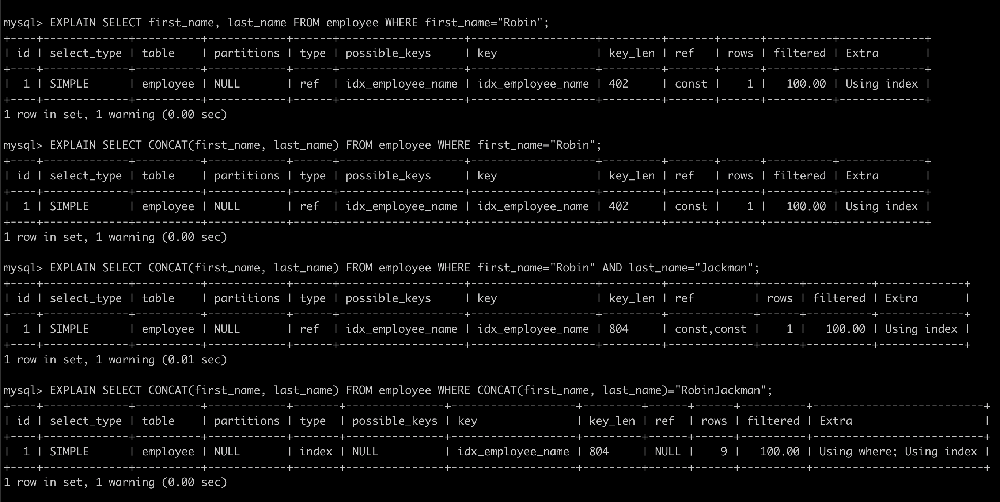

  - 數據解析：
    - type index 會進行 whole index 掃描
    - type ref 直接二分法搜尋該 index

  </details>

<!-- 使用 `ORDER BY` 查詢，是否選擇 index -->

- <details close><summary>使用 <code>ORDER BY</code> 查詢，是否選擇 index</summary>

  - REF: [MySQL DOC: ORDER BY Optimization]

  - 如果需要再去查全表，則不會使用 index，而是重新對資料做排序

  

  - 若加上 WHERE 只取得某個區間，會依照區間大小選用 index。區間需要多小？

    - 推測是直接判斷 head & tail，發現資料為回傳全表時，就直接不用 index

  

  </details>

<!-- GROUP BY 與 index -->

- <details close>
  <summary><code>GROUP BY</code> 與 index</summary>

  - 沒有 index，會 `Using temporary`，創建一個臨時表

    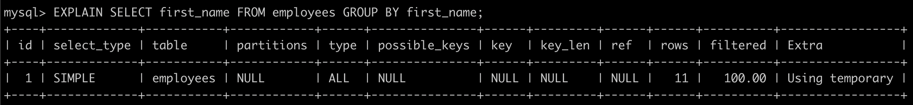

  - 有 index，會 `Using index`，使用 covering index

    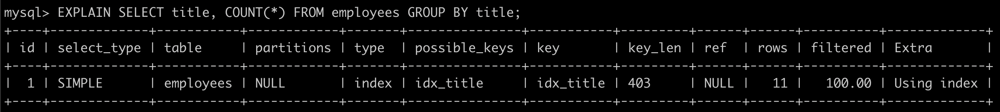

  </details>

<!-- COUNT(*) -->

- <details close>
  <summary><code>COUNT(*)</code></summary>

  - InnoDB 需要每次重新算，會掃描全表(or index)

  <!-- COUNT(col) -->

  - `COUNT(col)` 用來全掃描的表(or index)，COUNT() 的 col 是否包含 NULL，會影響是否每次都需做判斷，影響效能

  <!-- 簡介 COUNT() -->

  - <details close>
    <summary>簡介 COUNT()</summary>

    - `COUNT(*)`：所有 row，不論是不是 NULL
    - `COUNT(col)`：只計算該 col 不是 NULL 的 row 數量

    </details>

  <!-- MyISAM VS InnoDB -->

  - <details close>
    <summary>MyISAM VS InnoDB</summary>

    - MyISAM 有記錄 count 結果，InnoDB 需要每次重新算
    - 最大原因是： MyISAM 不支持 Transaction， InnoDB 支持 Transaction

      - 因此 InnoDB 若記錄 count 結果，沒意義。因為在不同 Transaction 中可能會改變，不精準。
      - 即便每次重新算，也只是得到在該計算次中的數量
      - MySQL InnoDB 可使用 `SHOW TABLE STATUS` 直接取得估算

    </details>

  <!-- InnoDB 解決方案 -->

  - <details close>
    <summary>InnoDB 解決方案</summary>

    - 可另開 table 存 conut，依照需求分兩種做法

      - `OLTP` (Online Transactional Processing)

        - 注重一致性，所以安排把 update count 包含在每次 Transaction 中

      - `OLAP` (Online Analytical Processing)

        - 只需用來分析，因此可以設定一個時間 update count 一次

    </details>

  - REF: [分析 COUNT(*)] | [MySQL doc: COUNT()]

  </details>

<!-- MAX, MIN 與 index -->

- <details close>
  <summary><code>MAX</code>, <code>MIN</code> 與 index</summary>

  - 沒有 index，會掃全表

    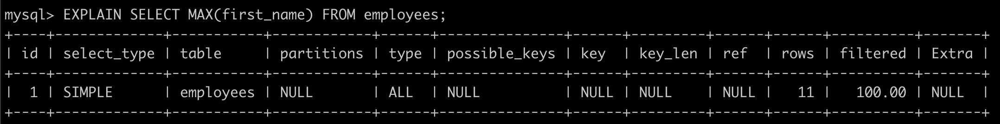

  - 有 index

    - `Select tables optimized away`，可以直接 O(1) 回傳
    - 因為 B+ Tree 會串成 linked list，還有 head & tail
    - REF: [MySQL issue answer]

    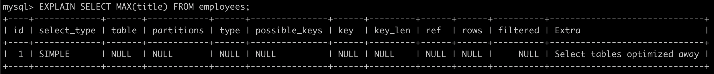

  </details>

<!-- IN vs OR -->

- <details close>
  <summary><code>IN</code> vs <code>OR</code></summary>

  - `IN` & `OR` 在效能上看起來是一樣的，只差別在閱讀性

    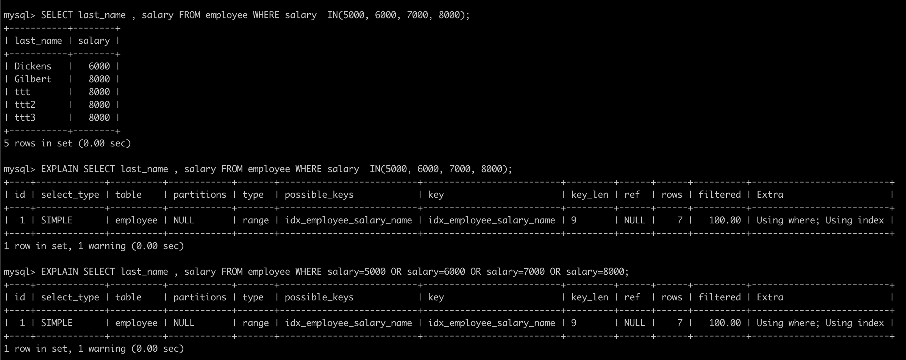

    - 其中 `rows` 解讀：4 個條件 ＋ 5 筆資料 － 2 種重複

  </details>

## # 問題集中區

<!-- Composite Primary Keys -->

- <details close>
  <summary>Composite Primary Keys</summary>

  <!-- AUTO_INCREMENT VS Composite Primary Keys -->

  - <details close>
    <summary>在使用 <code>AUTO_INCREMENT</code> 情況下，再設置 <b>Composite Primary Keys</b> 似乎沒有意義？</summary>

    - 是，因為 `AUTO_INCREMENT` 的 column 的每筆資料一定會不同

    </details>

  <!-- 電商限購商品 VS Composite Primary Keys -->

  - <details close>
    <summary>電商希望客戶只能購買一件同商品時，會用 <b>Composite Primary Keys</b> 來達成嗎？</summary>

    - 多：通常會在後端處理，因為這類型活動很難在一開始就設定好 DB

    </details>

  </details>

<!-- 生產環境 VS DELETE  -->

- <details close>
  <summary>生產環境，有什麼情況還是會用<code>DELETE</code>嗎？</summary>

  - 可能有些資料沒必要被救回，且資料庫資源有限，就會直接用 `DELETE`

  </details>

<!-- Table 應該都用複數？ -->

- <details close>
  <summary>Table 應該都用複數？</summary>

  - 是，MongoDB 還會自動幫你改成複數

  </details>

<!-- 中途更改某 col 的 Data type 有哪些問題？有哪些限制？DB 會做哪些動作？ -->

- <details close>
  <summary><mark>TODO:Q</mark> 中途更改某 col 的 Data type 有哪些問題？有哪些限制？DB 會做哪些動作？</summary>

  - 更改方式：`ALTER TABLE table_name CHANGE old_col_name new_col_name new_type;`

  </details>

<!-- COLLATE 是在哪個步驟上起作用？ -->

- <details close>
  <summary><mark>TODO:Q</mark> COLLATE 是在哪個步驟上起作用？</summary>

  </details>

<!-- Nonbinary strings 跟 binary strings 在儲存上，本質上有什麼差異？ -->

- <details close>
  <summary><mark>TODO:Q</mark> Nonbinary strings 跟 binary strings 在儲存上，本質上有什麼差異？</summary>

  - binary strings 是否只能輸入 ASCII 的內容？如果輸入中文，是否會自動轉成數個 byte？

  </details>

<!-- CHARACTER SET & COLLATE 一般會習慣設定整個 Database, Table, 還是針對個別 column 做設定？ -->

- <details close>
  <summary><mark>TODO:Q</mark>CHARACTER SET & COLLATE 一般會習慣設定整個 Database, Table, 還是針對個別 column 做設定？</summary>

  </details>

---

## # 其他補充

<!-- 注意事項 -->

- 注意事項：

  <!-- `AUTO_INCREMENT` & `PRIMARY KEY` & `UNIQUE` -->

  - <details close>
    <summary><code>AUTO_INCREMENT</code> & <code>PRIMARY KEY</code> & <code>UNIQUE</code></summary>

    - 只能有一個 column 設置 `AUTO_INCREMENT`，並且一定要設置為 KEY (PRIMARY 或 UNIQUE)
    - 若沒有其他 column 被設置為 PK，則此 column 就會直接成為 PK
    - 可以使用 `PRIMARY KEY(col1, col2)`，跟其他 column 一起成為 Composite Primary Keys
    - 即便使用 `UNIQUE`，也允許多筆資料都是 NULL

    </details>

  <!-- 大小寫敏感問題 -->

  - <details close>
    <summary>大小寫敏感問題</summary>

    - 環境不同，可能導致對大小寫敏感，有不同的結果

    </details>

  <!-- ORDER BY 的 Collation 的選擇 -->

  - <details close>
    <summary>ORDER BY 的 Collation 的選擇</summary>

    - 不同環境可能有不同的預設設定，需統一設定
    - [MySQL DOC: Character Sets, Collations, Unicode]

    </details>

  <!-- 一些淺規則可以透過 Server SQL Modes 調整 -->

  - <details close>
    <summary>一些淺規則可以透過 Server SQL Modes 調整</summary>

    - [MySQL Doc: Server SQL Modes]

    </details>

  <!-- TIMESTAMP vs DATETIME - 時區問題 -->

  - <details close>
    <summary><code>TIMESTAMP</code> vs <code>DATETIME</code> - 時區問題</summary>

    - REF: [MySQL Doc: Date]

    - <details close>
      <summary>DATETIME 在儲存時，並不會儲存時區資訊，但是會以 DB server 所設定的時區所得到的時間來儲存</summary>

      - 儲存時很容易出錯

      </details>

    - <details close>
      <summary>TIMESTAMP 在呈現時，會自動轉換成 DB server 所設定的時區</summary>

      <!-- 舊版解法： -->

      - <details close>
        <summary>舊版解法：</summary>

        - 需查看 DB server 所設定的時區，也可自己設定

          - `SET time_zone = "+08:00";`
          - `SET time_zone = 'Asia/Taipei';`

        - 每次都要檢查或設定很麻煩
        - 為了呈現改設定，可能會影響到其他地方

        </details>

      <!-- version 8.0.22 解法： -->

      - <details close>
        <summary>version 8.0.22 解法：</summary>

        - `CAST(timestamp AT TIME ZONE INTERVAL "+00:00" AS datetime)`
        - 直接寫在 SQL，不用管不同 server 不同設定
        </details>

      </details>

    </details>

<!-- 小技巧 -->

- 小技巧：

  <!-- UPDATE 技巧 -->

  - <details close>
    <summary><code>UPDATE</code>技巧</summary>

    - 可以先 `SELECT` 查看 `WHERE` 的條件是否符合需求，再將其改為 `UPDATE`

    </details>

  <!-- 查看一些優化的條件設定 -->

  - <details close>
    <summary><code>SHOW VARIABLES LIKE 'optimizer_switch';</code></summary>

    - 查看一下當前一些優化的條件設定，如： ICP 的狀態

    </details>

  <!-- OPTIMIZE TABLE -->

  - <details close>
    <summary><code>OPTIMIZE TABLE</code></summary>

    - [Optimize Table 整理 MySQL 表空間]
    - 可安排在離峰時段進行 OPTIMIZE TABLE，以整理 table，使減少查詢時 I/O 次數

    </details>

<!-- 小工具 -->

- 小工具：

  <!-- 學習工具 -->

  - <details close>
    <summary>學習工具</summary>

    </details>

  <!-- 開發工具 -->

  - <details close>
    <summary>開發工具</summary>

    - [MySQL shell]

      - shell 中自動補全跟提示

    </details>

<!-- 補充學習 -->

- 補充學習：

  <!-- 文件 -->

  - <details close>
    <summary>文件</summary>

    </details>

  <!-- 範例研究 -->

  - <details close>
    <summary>範例研究</summary>

    </details>

---

## # 踩雷實錄

---

## # 延伸討論

<!-- Database in Docker? -->

- <details close>
  <summary>Database in Docker?</summary>

  - [Should You Run Your Database in Docker?]

  </details>

<!-- MySQL 開發規範研究 -->

- <details close>
  <summary>MySQL 開發規範研究</summary>

  - [MySQL 開發規範參考]

  </details>

<!-- Stored Procedure -->

- <details close>
  <summary>Stored Procedure</summary>

  - 在資料庫 server 上保存的預編譯的程式，像是開客製化的 API，讓外部可以串接使用

  </details>

<!-- Filesort 屬於 Unstable Sort？ -->

- <details close>
  <summary>Filesort 屬於 Unstable Sort？</summary>

  - [MySQL：排序（filesort）詳細解析]
  - [What is the sorting algorithm behind ORDER BY query in MySQL?]
  - GPT：早期為 Quicksort，5.0 改為 Batched Key Access Filesort，此兩種皆為 unstable

  

  </details>

<!-- 「使用 SQL Function」 VS 「在 server 處理」 -->

- <details close>
  <summary>「使用 SQL Function」 VS 「在 server 處理」</summary>

  - 網路傳輸量？
  - 資料庫記憶體消耗？
  - 可能有些系統並不需要多建立一個 server？

  </details>

<!-- WHER 中使用 "!=" 可否使用 index -->

- <details close>
  <summary>WHER 中使用 "!=" 可否使用 index</summary>

  - 舊版不行，新版可以
  - 結論：本質上都是優化器去計算一下對應的二級索引數量佔所有記錄數量的比值，來決定是否使用 index
  - REF: [MySQL 中 IS NULL、IS NOT NULL、!= 不能用索引？]

  </details>

<!-- Data Proxy -->

- <details close>
  <summary>Data Proxy</summary>

  - [Prisma Doc: Data Proxy]

  </details>

<!-- PostgreSQL vs MySQL -->

- <details close>
  <summary>PostgreSQL vs MySQL</summary>

  - [淺談 PostgreSQL 與 MySQL 的差異]
  - [從 Indexing 的角度切入 MySQL-Innodb 與 PostgreSQL 的效能比較]

  </details>

---

## # 待整理筆記區

- `IFNULL()`、`CONVERT()`
