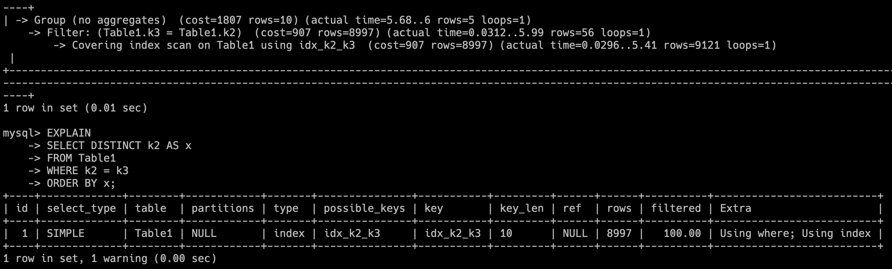

## [1148. Article Views I](https://leetcode.com/problems/article-views-i/description/)

- 我的解答：

  ```sql
  CREATE INDEX idx_aid_vid ON Views(author_id, viewer_id);

  SELECT author_id AS id
  FROM Views
  WHERE author_id = viewer_id
  GROUP BY author_id, viewer_id
  ORDER BY author_id;
  ```

- 說明：

  - 8.0 移除了 GROUP BY 的隱式排序，因此單純在 deduplication 時，效率幾乎跟 DISTINCT 一樣

    - 從 EXPLAIN 分析，兩者做相同的操作

  - 將兩個 col 一起 deduplication，可以提早在查詢時，就透過 index 進行篩選，更具有效率

    - 雖然 GROUP BY ＆ DISTINCT 執行方案無差，但 DISTINCT 會得到兩個 col 結果，與目的不符
    - 如果需要 COUNT 的情況，也必須用 GROUP BY

  - GROUP BY ＆ DISTINCT 沒必要同時使用 (除非是查詢有需求時)，否則有機會出錯

  - 先得到查詢結果集，再拿來進行 deduplication，有 sort-based & hash-based 兩種方式

    - 有 index 當然最快，因為已經排好
    - 若記憶體夠用，hash-based 會比較快
    - 資料量太大，就必須使用 sort-based，借助 disk 來完成

  - GROUP BY 主要還是用在需要「聚合計算」 (或是當「去重操作依賴的 col」與「想列出的 col」不同時)
  - 可能有資料庫或版本，不支援直接用別名 (EX. 必須用 ORDER BY author_id)
  - 如果需求改為大於一次重複，則只能用 GROUP BY + COUNT() 來篩選

- 其他解答：

  ```sql
  SELECT DISTINCT author_id AS id
  FROM Views
  WHERE author_id = viewer_id
  ORDER BY id;
  ```

  ```sql
  SELECT author_id AS id
  FROM Views
  WHERE author_id = viewer_id
  GROUP BY id
  ORDER BY id;
  ```

  - 需求改為大於一次重複，則 COUNT 為必要

  ```sql
  SELECT author_id AS id
  FROM Views
  WHERE author_id = viewer_id
  GROUP BY author_id, viewer_id
  HAVING COUNT(*) >= 1
  ORDER BY id;
  ```

  - UNION 需要重複查詢＆合併，更慢

  ```sql
  SELECT author_id AS id
  FROM Views
  WHERE author_id = viewer_id
  UNION
  SELECT author_id AS id
  FROM Views
  WHERE author_id = viewer_id
  ORDER BY id;
  ```

  - JOIN (與 UNION 類似)

  ```sql
  SELECT DISTINCT v1.author_id AS id
  FROM Views v1 JOIN Views v2
  ON v1.author_id = v2.viewer_id AND v1.article_id = v2.article_id
  ORDER BY id;
  ```

- [測試 "DISTINCT" 與 "GROUP BY" 使用情形](../code/sample02/distinct_vs_groupby/test.sql)：

  - 大部分情況 `DISTINCT` 與 `GROUP BY` 一樣的執行策略 ()

    - one key

    
    

    - 當 `DISTINCT` 與 `GROUP BY` 條件一樣時，也是只會執行一次

    
    
    

    - two key (而這裡的差異在於，使用 DISTINCT 的限制是，用來 deduplication 的必須跟 select 的 key 一樣)

    
    

  - 當 two key 在不同地方進行時，估算的 rows 就有些不同

    

  - 當 `DISTINCT` 與 `GROUP BY` 條件不同時，則會出現不同執行策略，且有機會出錯

    - 不同策略

    

    - 結果出錯

    
