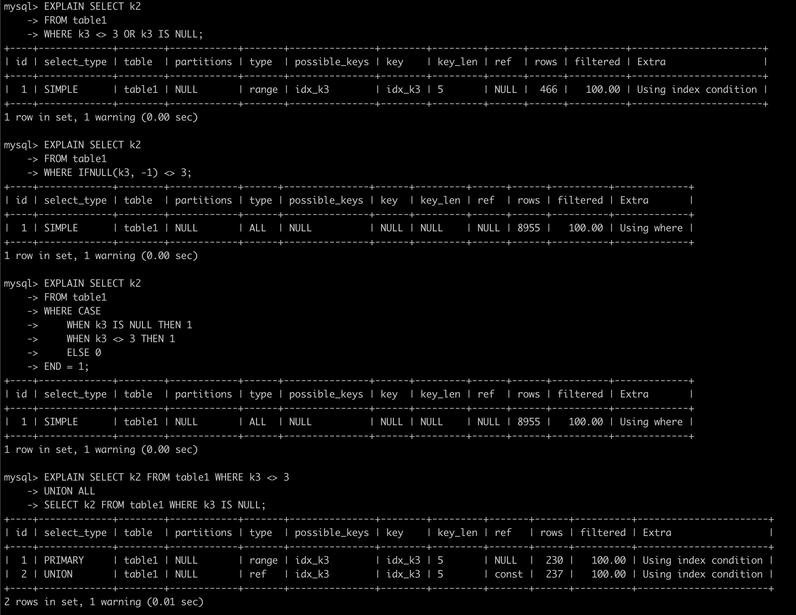
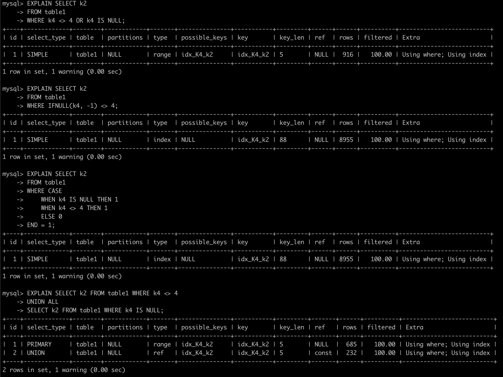
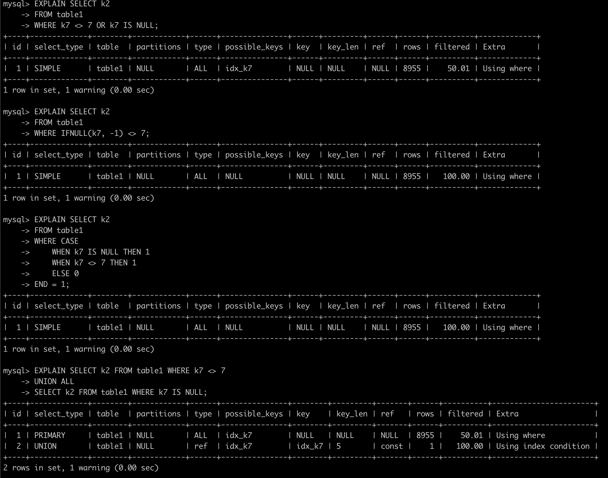

## [584. Find Customer Referee](https://leetcode.com/problems/find-customer-referee/description/)

- 我的解答：

  - 優點在於，能在 InnoDB 端，就對 index 進行篩選
  - 在 InnoDB 中，只能將 OR 條件分開做篩選。而在 MySQL server 中，才會再針對將 OR 條件合併起來做篩選
  - 即便只有 idx_rid 時，也能透過 ICP，相較其他方法更有效率
  - 當能被篩選掉的比例太小時，即便能使用 index 在效能上也沒有優勢

  ```sql
  CREATE INDEX idx_rid_name ON Customer(referee_id, name);

  SELECT name
  FROM Customer
  WHERE referee_id <> 2 OR referee_id IS NULL;
  ```

- 說明：

  - `<>` 與 `!=` 相同效果，前者較原生 sql
  - 因為 `NULL` 無法比較數值，一律返回 NULL 而不是 TRUE or FLASE，所以此種情況必須另外處理 NULL

- 其他解答：

  - `IFNULL` 或 `COALESCE`

    - 簡介：`IFNULL` 判斷為 NULL 後回傳替代值。`COALESCE` 回傳第一個非 NULL 值
    - 此時使用 IFNULL 即可，而不需要用到 COALESCE
    - 一些情況替代為 -1 比 0 可能更好 (0 可能常被賦予特殊用途)
    - 如果有適合的 index 時，應該避免在 WHERE 使用 function，以免無法有效使用 index
    - 也可以單獨為其做一個 Functional Index (但是只能單獨一個函式結果，而不能與 name 做成 Composite Index)

    ```sql
    SELECT name
    FROM Customer
    WHERE IFNULL(referee_id, -1) <> 2;

    SELECT name
    FROM Customer
    WHERE COALESCE(referee_id, -1) <> 2;
    ```

  - `UNION`

    - 使用 UNION 可以更精準使用 index，但需要在 MySQL server 中再進行合併
    - 可以讓兩個判斷條件，各自使用 index
    - 注意可能有重複的名字，所以不能用 UNION。但如果兩個篩選條件有機會篩選到同一個 row 時，則不能使用 UNION ALL。那麼此時則不能使用 UNION 的任何方法來完成查詢 (除非用 pk 來多進行一個判斷，可能更複雜更多步驟了)

    ```sql
    SELECT name FROM Customer WHERE referee_id <> 2
    UNION ALL
    SELECT name FROM Customer WHERE referee_id IS NULL;
    ```

  - `CASE`

    - 此方法也會導致無法有效使用 index

    ```sql
    SELECT name
    FROM Customer
    WHERE CASE
        WHEN referee_id IS NULL THEN 1
        WHEN referee_id <> 2 THEN 1
        ELSE 0
    END = 1;
    ```

- [測試 index 使用情形](../code/sample02/idx_with_fn/test.sql)

  
  
  
