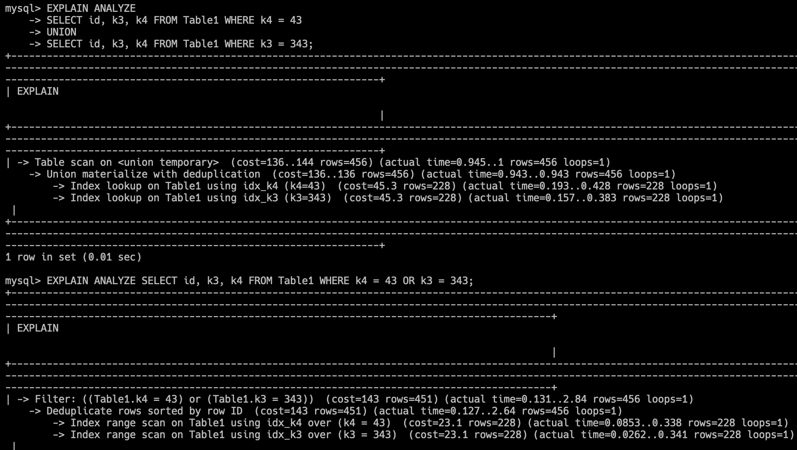

## [584. Find Customer Referee](https://leetcode.com/problems/big-countries/description/)

- 我的解答：

  ```sql
  -- name 為 pk
  CREATE INDEX idx_area_popu ON World(area, population);
  CREATE INDEX idx_popu_area ON World(population, area);

  SELECT name, population, area
  FROM World
  WHERE area >= 3000000

  UNION

  SELECT name, population, area
  FROM World
  WHERE population >= 25000000;
  ```

- 說明：

  - 大部分情況下，OR 涉及到不同 key 時，UNION 的效能更好 (各自使用 index 查詢)

    - 因為 OR 會使用 index_merge 方式，無法利用到 covering index
    - 當查詢無法使用 index 時，則 OR 會比 UNION 還快
    - 此方法勢必多維護 index，因此須也納入考量
    - 需注意到臨界點，剛好 temporary table 超過 memory 上限時，可能會有不同

  - 兩個篩選條件可能有重複的，所以必須用 `UNION`，而不能用 UNION ALL

  - 在實際案例時，可多注意一下 `>= 3000000` 與 `> 2999999`，效能上是否有影響 (EX. 剛好卡在分區界線，是否因此多查詢一個分區)

- 其他解答：

  - 一些邊緣案例，無法利用到 index 時，OR 會比 UNION 快
  - 如果會常出現邊緣案例，可考慮用此方法替代 (OR 只需要 one-key index)

  ```sql
  CREATE INDEX idx_area ON World(area);
  CREATE INDEX idx_popu ON World(population);

  SELECT name, population, area
  FROM World
  WHERE area >= 3000000 OR population >= 25000000;
  ```

  - 只給一個 index 選擇，可以使用到 covering index，但是對多個 key 進行 OR，也只能將整個 index 完整掃描一遍

  ```sql
  CREATE INDEX idx_area_popu ON World(area, population);

  SELECT name, population, area
  FROM World
  WHERE area >= 3000000 OR population >= 25000000;
  ```

- [測試 "OR" 與 "UNION" 使用情形](../code/sample02/union_vs_or/test.sql)：

  - idx_k3_k4, idx_k4_k3, idx_k3, idx_k4

    - 使用 index_merge 方式，則無法利用到 covering index

    
    

  - idx_k3_k4, idx_k3, idx_k4

    
    

  - idx_k3, idx_k4

    - 當使用 index 的情況相當時，兩者效能趨近相等 (此範例 UNION 依然略快)

    
    

  - idx_k3_k4, idx_k4_k3

    - 當 OR 被迫只有 two-key index 可用時，必須使用 `Using sort_union`，且無法利用 covering index，比 one-key index 還慢

    
    

  - no index

    - 不使用 index，反而因為 UNION 需要查表兩次而更慢

    
    

  - Range 篩選佔總資料量比例小: idx_k3, idx_k4

    
    

  - Range 篩選佔總資料量比例大: idx_k3, idx_k4

    - 當符合條件的資料，佔總資料的比例太大時，導致 index 失效

    
    

- REF：

  - [stackoverflow Answer: UNION vs OR](https://stackoverflow.com/questions/13750475/sql-performance-union-vs-or/13866221#13866221)
