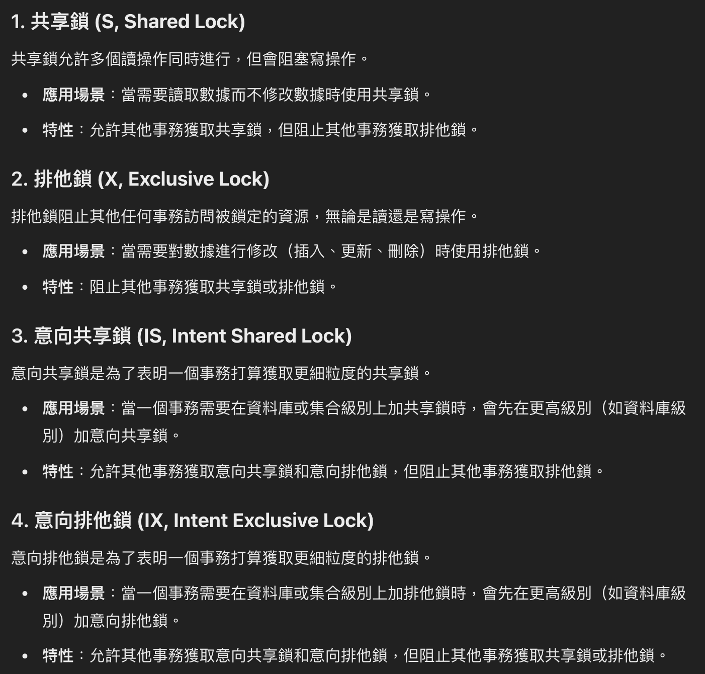

##### <!-- 收起 -->

<style> 
.imgBox{
  display: flex; 
  flex-direction: column; 
  margin: 5%; 
  justify-content: center;
  border: 2px solid black;
}
</style>

<!--  style  -->

###### <!-- ref -->

[mongoose index]: https://mongoosejs.com/docs/guide.html#indexes
[mongodb create index]: https://stackoverflow.com/questions/31991710/mongodb-auto-create-index-for-new-collections
[maxTimeMS (stackoverflow)]: https://stackoverflow.com/questions/67260458/mongodb-find-query-maxtimems
[WiredTiger Storage Engine 文件]: https://www.mongodb.com/docs/manual/core/wiredtiger
[What type of lock does MongoDB apply at the document level when reading or writing the document?]: https://dba.stackexchange.com/questions/334265/what-type-of-lock-does-mongodb-apply-at-the-document-level-when-reading-or-writi
[MongoDB 零基礎從入門到精通]: https://www.udemy.com/course/best-mongodb/
[MongoDB 官方課程]: https://learn.mongodb.com/catalog
[nosql data modeling techniques]: https://highlyscalable.wordpress.com/2012/03/01/nosql-data-modeling-techniques/
[text indexes]: https://www.mongodb.com/docs/manual/core/index-text/#text-indexes
[mongodb 基本原理：索引（indexes）]: https://blog.csdn.net/guangyacyb/article/details/104339183
[full text search engines]: https://www.mongodb.com/basics/full-text-search
[nosql 數據建模技術]: https://coolshell.cn/articles/7270.html
[mongodb limits and thresholds]: https://www.mongodb.com/docs/manual/reference/limits/
[everything you know about mongodb is wrong!]: https://www.mongodb.com/developer/products/mongodb/everything-you-know-is-wrong/
[bson1]: https://www.mongodb.com/docs/manual/reference/bson-types/
[bson2]: https://www.mongodb.com/basics/bson

 <!-- ref -->

# MongoDB

> DATE: 12 (2022)
> REF: [MongoDB 官方課程] | [MongoDB 零基礎從入門到精通]

## # 簡介

- Build for Speed
- Rich Document based queries
- Full index support
- Map/reduce for aggregation
- Replication and Failover
- Auto Sharding

## # BSON

> REF: [BSON1] | [BSON2]

- binary encoded Javascript Object Notation (JSON)

- 官網範例

  ```javascript
  // JSON:
  {"hello": "world"} →

  // BSON:
  \x16\x00\x00\x00           // total document size
  \x02                       // 0x02 = type String
  hello\x00                  // field name
  \x06\x00\x00\x00world\x00  // field value
  \x00                       // 0x00 = type EOO ('end of object')
  ```

- 測試範例

  ```javascript
  // 範例處理：
  const BSON = require('bson')
  const json = JSON.stringify(data)
  const bson = BSON.serialize(data)
  ```

  - `0x02`: String

    ```javascript
    const data = 'ab'
    // [17 00 00 00] [02] [30 00] [02 00 00 00] [61 00] [02] [31 00] [02 00 00 00] [62 00] [00]
    // [full size]  [str]  [k:0]  [value size]  [v:"a"] [str] [k:1]  [value size]  [v:"b"][end]

    const data = ['a', 'b']
    // [17 00 00 00] [02] [30 00] [02 00 00 00] [61 00] [02] [31 00] [02 00 00 00] [62 00] [00]
    ```

  - `0x03`: Object

    ```javascript
    const data = { ab: 'ab' }
    // [10 00 00 00] [02] [61 62 00] [03 00 00 00] [61 62 00] [00]
    // [full size]  [str]  [key:ab]  [value size] [value:"ab"] [end]
    ```

  - `0x04`: Array

    ```javascript
    const data = { ab: ['ab'] }
    // [18 00 00 00] [04] [61 62 00] [0f 00 00 00] [02] [30 00] [03 00 00 00] [61 62 00] [00] [00]
    // [full size]   [obj]  [k:ab] [obj value size][str] [k:0] [arr value size][v:"ab"] [end] [end]
    ```

  - `0x07`: ObjectId

    ```javascript
    const data = { a: new mongoose.Types.ObjectId('61360a570af2d32e2c7c55d5') }
    // [14 00 00 00] [07] [61 00] [61 36 0a 57 0a f2 d3 2e 2c 7c 55 d5] [00]
    // [full size]   [id] [key:a] [value: id(61360a570af2d32e2c7c55d5)] [end]
    ```

  - `0x09`: Date

    ```javascript
    const data = { ab: new Date(1) }
    // [11 00 00 00] [09] [61 62 00] [01 00 00 00 00 00 00 00] [00]
    // [full size]  [date]  [key:ab]     [value: 1]            [end]

    const data = { ab: new Date(MAX_DATE) }
    // [11 00 00 00] [09] [61 62 00] [00 00 dc c2 08 b2 1e 00] [00]
    // [full size]  [date]  [key:ab] [value: 8640000000000000] [end]
    ```

  - `0x10`: Number

    ```javascript
    const data = { ab: 1 }
    // [0d 00 00 00] [10] [61 62 00] [01 00 00 00] [00]
    // [full size]  [num]  [key:ab]   [value:1]    [end]
    ```

## # 慣用方法

| O                         | X            | 原因               |
| ------------------------- | ------------ | ------------------ |
| `updateMany`, `updateOne` | ~~`update`~~ | Ｘ會覆蓋掉整個 doc |
| `replaceOne`              | ~~`update`~~ | Ｏ一次覆蓋一筆 doc |
| `insertMany`, `insertOne` | ~~`insert`~~ | Ｏ返回 insertID    |

## # 注意默認值

- `insertMany`(`{ordered:true}`)：照順序 insert，遇到 err 則後半段停止

## # Index

> REF: [mongodb 基本原理：索引（Indexes）]

- Primary Index

  - 系統預設會建立一個以`_id`排序的 index

- Secondary Index

  - 種類：

    - `unique`：所有的 doc，該 `index key` 的 `value` 不能有重複

      ```shell
      # EX.
      # 若有重複 title + year 組合，則無法建立此 index
      # index 建立後，若給他重複的 title + year 組合，則插入或更新會失敗
      > db.movie.createIndex({ title: 1, year:1 }, { unique: true })

      # EX. 重複 title + year 組合：
      # A: { _id: 1, title: "La vita è bella", year:"1997" }
      # B: { _id: 2, title: "La vita è bella", year:"1997" }
      # --> A, B 重複
      ```

    - TTL Indexes

      - `expireAfterSeconds`

      ```shell
      # 當超過該 doc 的 createAt 10 秒後，會自動刪除該 doc
      > db.people.createIndex({ createAt: 1 }, { expireAfterSeconds: 10 })
      ```

    - [Text Indexes]

      ```sh
      # EX.
      > db.movie.createIndex({ title: 'text' })
      > db.movie.find({ $text: { $search: 'room' } })
      ```

  - 建立：

    - code 設定

      - mongodb

        - `db.collection.createIndex()`
        - `db.collection.createIndexes()`

      - mongoose

        - `Schema.index()`：啟動時自動呼叫 `createIndex()` (生產環境建議設定 `autoIndex: false` 則會關閉此方法)
        - `Model.createIndexes()`

    - 平台設定：可以查看有哪些建議的 index，再直接點擊設定

    - 若已經存在的 Index，再次使用 `createIndex()` 不會重複建立

    - REF: [mongoose index] | [Mongodb create index]

  - 範例：

    - 建立：`db.movie.createIndex({ year: 1 })`
    - 刪除：`db.movie.dropIndex({ year: 1 })`
    - 查詢：`db.movie.getIndexes()`

    - 未建立 index

    ```shell
    > db.movie.explain('executionStats').find({ year: { $gte: 2015 } })
    {
      ...,
      executionStats: {
        executionSuccess: true,
        nReturned: 747,
        executionTimeMillis: 16,
        totalKeysExamined: 0,
        totalDocsExamined: 28795,
        executionStages: {
          stage: 'COLLSCAN',      # --> 直接去 collection 查詢
          filter: { year: { '$gte': 2015 } },
          nReturned: 747,
          executionTimeMillisEstimate: 0,
          works: 28797,
          advanced: 747,
          needTime: 28049,
          needYield: 0,
          saveState: 28,
          restoreState: 28,
          isEOF: 1,
          direction: 'forward',
          docsExamined: 28795
        }
      },
      ...
    }
    ```

    - 建立以 year 排序的 index

    ```shell
    > db.movie.createIndex({ year: 1 })
    year_1

    > db.movie.explain('executionStats').find({ year: { $gte: 2015 } })
    {
      ...,
      executionStats: {
        executionSuccess: true,
        nReturned: 747,
        executionTimeMillis: 1,
        totalKeysExamined: 747,
        totalDocsExamined: 747,
        executionStages: {
          stage: 'FETCH',
          nReturned: 747,
          executionTimeMillisEstimate: 0,
          works: 748,
          advanced: 747,
          needTime: 0,
          needYield: 0,
          saveState: 0,
          restoreState: 0,
          isEOF: 1,
          docsExamined: 747,
          alreadyHasObj: 0,
          inputStage: {
            stage: 'IXSCAN',        # --> 改用 index 查詢
            nReturned: 747,
            executionTimeMillisEstimate: 0,
            works: 748,             # --> 所需步驟變少
            advanced: 747,
            needTime: 0,
            needYield: 0,
            saveState: 0,
            restoreState: 0,
            isEOF: 1,
            keyPattern: { year: 1 },
            indexName: 'year_1',
            isMultiKey: false,
            multiKeyPaths: { year: [] },
            isUnique: false,
            isSparse: false,
            isPartial: false,
            indexVersion: 2,
            direction: 'forward',
            indexBounds: { year: [ '[2015, inf.0]' ] },
            keysExamined: 747,
            seeks: 1,
            dupsTested: 0,
            dupsDropped: 0
          }
        }
      },
      ...
    }
    ```

## # 其他

- Within a single `mongod` instance, `timestamp` values are always unique.
- 新增時，若 `_id` 已存在該 `collection`，則新增失敗
- `mongosh` 是以 `TS` 撰寫的專案

- `atomic operators`

  - 如 `$set`, `$gt`.. 等等

  ```shell
  # EX.
  > db.user.updateOne({ _id: 1 }, { $set: { name: 'B' } })
  ```

- `projection`

  - 設定需要獲取的欄位 ( `_id` 默認 1 )

  ```shell
  # EX.
  > db.user.find({})
  [{ _id: 1, name: 'A', age: 30 }]
  > db.user.find({},{name: 1})
  [{ _id: 1, name: 'A' }]
  > db.user.find({},{name: 1, _id: 0})
  [{ name: 'A' }]
  ```

- [MongoDB Limits and Thresholds]

  - 16 MB / doc
  - 100 levels of nesting

- `mongoimport`

  - `-d`：database
  - `-c`：collection
  - `--jsonArray`：檔案裡的資料為多筆 doc
  - `--drop`：先 drop 該 collection 再重建

  ```shell
  # EX.
  $ mongoimport < .json 路徑 > -d < database name > -c < collection name > --jsonArray --drop
  ```

- `$size`+`$gt`

  - `$size`：array length
  - `$gt`：大於
  - `$expr`：用於 aggregation expressions

  ```shell
  # EX.

  # 尋找有 2 個 actors 的
  > db.movie.find({ actors: { $size: 2 } })

  # 尋找大於 2 個 actors 的
  # 1. 錯誤寫法
  > db.movie.find({ actors: { $size: { $gt: 2 } } })
  # 2. 正確寫法
  > db.movie.find({ $expr: { $gt: [{ $size: '$actors' }, 2] } })
  ```

- `sort` 是對 `find` 結果進行排序，即便放在 `limit` 之後也一樣

  ```shell
  # EX. 以下兩者結果相同
  > db.movie.find().sort({ imdb_score: 1 }).limit(3)
  > db.movie.find().limit(3).sort({ imdb_score: 1 })

  # 使用 aggregate 才會依照順序執行
  # 先 { $limit: 3 } 再進行 { $sort: { imdb_score: 1 } }
  > db.movie.aggregate([{ $limit: 3 }, { $sort: { imdb_score: 1 } }])
  ```

- `$`：update 時，find 出來的 `$` 為第一層 array 的 index

  ```shell
  # data
  # {
  #   _id: 8,
  #   B: [
  #     { _id: 16, C: [ { _id: 15 }, { _id: 39 } ] },
  #     { _id: 14, C: [ { _id: 37 }, { _id: 34 } ] }
  #   ]
  # }

  # 下列的 $ = 1
  # 因為 "B.C._id":37 在 B[1]
  > db.test.updateOne({ 'B.C._id': 37 }, { $set: { 'B.$.C.2.catch': true } })
  {
    _id: 8,
    B: [
      { _id: 16, C: [ { _id: 15 }, { _id: 39 } ] },
      { _id: 14, C: [ { _id: 37 }, { _id: 34 }, {catch: true} ] }
    ]
  }
  ```

- `db.test.explain("executionStats")`

  ```shell
  # 可回傳 DB 執行的相關資訊，如執行時間等
  > db.movie.explain('executionStats').find({ year: { $gte: 2015 } })
  {
    ...,
    executionStats: {
      executionSuccess: true,
      nReturned: 747,
      executionTimeMillis: 16,
      totalKeysExamined: 0,
      totalDocsExamined: 28795,
      executionStages: {
        stage: 'COLLSCAN',
        filter: { year: { '$gte': 2015 } },
        nReturned: 747,
        executionTimeMillisEstimate: 0,
        works: 28797,
        advanced: 747,
        needTime: 28049,
        needYield: 0,
        saveState: 28,
        restoreState: 28,
        isEOF: 1,
        direction: 'forward',
        docsExamined: 28795
      }
    },
    ...
  }
  ```

- `maxTimeMS`

  - 若設定 `maxTimeMS` 則超時後，會執行 `db.killOp()`，並回傳 `ExceededTimeLimit` 錯誤 (沒有預設)
  - REF: [maxTimeMS (stackoverflow)]

## # 延伸討論

- WiredTiger 引擎

  - 引入 `Document-Level Lock`

    - `S` (Shared), `X` (Exclusive), `IS` (Intent Shared), `IX` (Intent Exclusive)
    - REF: [What type of lock does MongoDB apply at the document level when reading or writing the document?]

    

  - 引入 `MVCC`

  - REF: [WiredTiger Storage Engine 文件]

- [Everything You Know About MongoDB is Wrong!]
- [NOSQL 數據建模技術]([NOSQL DATA MODELING TECHNIQUES])
  - `Document database` group indexes by field `names`, as opposed to [Full Text Search Engines] that group indexes by field `values`.

## # 待解決問題集中區

- <mark>Q: 如何查詢某個更新，需要維護幾個 index?</mark>
- <mark>Q: 為何當回傳資料數量太多筆時，使用 index 反而變慢？因為分頁的關係，導致去找 index 的次數變多？因為 index 並非複製一份 doc，所以每筆都需再回 collection 撈？</mark>

```
是不是 index 中是只有紀錄資料在 collection 中的位置，
再依照從 index 獲得位置去 collection 撈資料？

影片 4:35 中所說的「查了 index」，是不是指上述的步驟？

另外，以回傳一個 year 區間的例子來看，
是否他只需到 index 中查詢到 頭尾，就可以直接遍歷一次呢？
```

```
我使用 version 6.0 測試排序時發現一件事，
在想是否新版本中，MongoDB 改善了排序速度，
使得即便使用 index 也可能反而使 `find().sort()` 變慢了？

不過測試中，若是使用兩個參數來排序的情況下，(EX. `{ year: 1, title: 1 }`)
使用 index 將會比直接在 collection 中查詢來得快一些些。
因此在想，是否要至少超過兩個排序參數才建議建立 index？


或是有哪個推薦的資源詳細介紹 index 的使用時機與設計？
```

```
1. 在 find({name: "Jack", age: 20}) 中，使用 name_1 與 age_1 是不是速度是差不多的？

2. 他是以什麼為依據來評估應該要選擇用 age_1 而不是其他方案呢？

3. 當有好幾種方案時，他需要去評估該使用哪種方案，是不是會拖慢速度？抑或是，評估時所花時間少到可忽略不計？還是因為通常會用 queryHash, planCacheKey 來記著，所以不會太常需要重新評估？

4. 也不太明白 planCacheKey 的機制，我以 find({name: "Jack", age: 20}) 實測發現，當我只有 age_1 index 時，與只有 name_1 時，planCacheKey 是一樣的。
```

# 未整理問題暫存

; -------------------------------------------------------------

Q1: pipeline 底層做法?
https://www.udemy.com/course/best-mongodb/learn/lecture/13340016#questions
ref: https://www.mongodb.com/docs/manual/aggregation/

剛在想一個問題, mongodb aggregate 會是 pipeline 一條條跑, 還是他會按照 pipeline 的條件直接做一次處理。
例如這個他會先搜尋出來後, 再弄成只拿 10 筆, 還是一開始就只搜尋 10 筆
limit num 會不會有差別

; -------------------------------------------------------------

Q2:
https://www.udemy.com/course/best-mongodb/learn/lecture/13237654#questions

; -------------------------------------------------------------

Q3
https://www.udemy.com/course/best-mongodb/learn/lecture/13340918#questions

ref:
https://mongoing.com/archives/2214
https://unix.stackexchange.com/questions/11544/what-is-the-difference-between-opt-and-usr-local
https://stackoverflow.com/questions/13827915/location-of-the-mongodb-database-on-mac
https://source.wiredtiger.com/develop/arch-data-file.html

mongodb data 位置

                          Intel Processor	                Apple M1 Processor

Data Directory /usr/local/var/mongodb /opt/homebrew/var/mongodb
Configuration file /usr/local/etc/mongod.conf /opt/homebrew/etc/mongod.conf
Log directory /usr/local/var/log/mongodb /opt/homebrew/var/log/mongodb

```
The .wt files cannot be “converted” to readable text files, since they’re stored in very specific format, with compression, with encryption (if applicable), etc.
```

那我的理解, 要是用 mongodump 之後產生的 .bson 備份 是不是就沒加密, 可以直接解讀?

.wt 跟 .bson 有什麼差別?

; -------------------------------------------------------------

authentic 真正的 -ation 動作 --> 認證
author 作者 authorize 作者批准 -ation 動作 --> 授權

; -------------------------------------------------------------

Q4
https://www.udemy.com/course/best-mongodb/learn/lecture/13355184#questions

ref:
https://www.mongodb.com/docs/manual/tutorial/install-mongodb-on-os-x/#:~:text=argument%20%2D%2Dbind_ip-,WARNING,-Before%20binding%20to

如何用 brew services + authentication

```
// 不行:
brew services start mongodb --auth --port 27017 --dbpath /usr/local/var/mongodb
```

; -------------------------------------------------------------

Q5

Q 測試從 shell create index 跟在平台新增的差異
從 shell 新增, 也會出現在平台上。

Q 測試從 mongoose 新增 index

; -------------------------------------------------------------

Q6
https://www.udemy.com/course/best-mongodb/learn/lecture/13422594#content

必讀 REF :https://www.mongodb.com/docs/manual/replication/

Atlas: https://www.mongodb.com/docs/atlas/review-replica-set-metrics/
https://ondrej-kvasnovsky.medium.com/mongodb-replica-set-on-local-macos-f5fc383b3fd6
https://gist.github.com/davisford/bb37079900888c44d2bbcb2c52a5d6e8

有效: https://stackoverflow.com/questions/68975769/brew-services-cant-start-service-get-bootstrap-failed-5-input-output-error

https://silvae86.github.io/2021/03/04/migrate-mongodb-from-single-to-replicaset/#activate-the-new-replica-set
改 /usr/local/etc/mongod.conf (不能有註解?)
launchctl unload -w ~/Library/LaunchAgents/homebrew.mxcl.mongodb-community.plist
launchctl load -w ~/Library/LaunchAgents/homebrew.mxcl.mongodb-community.plist

A replica set in MongoDB is a group of mongod processes that provide redundancy and high availability.
; -------------------------------------------------------------

Q7

REF:
https://www.mongodb.com/docs/manual/sharding/

shard sql vs nosql 差在哪?

; -------------------------------------------------------------

不建議用 $lookup

bucket patterns - iot
