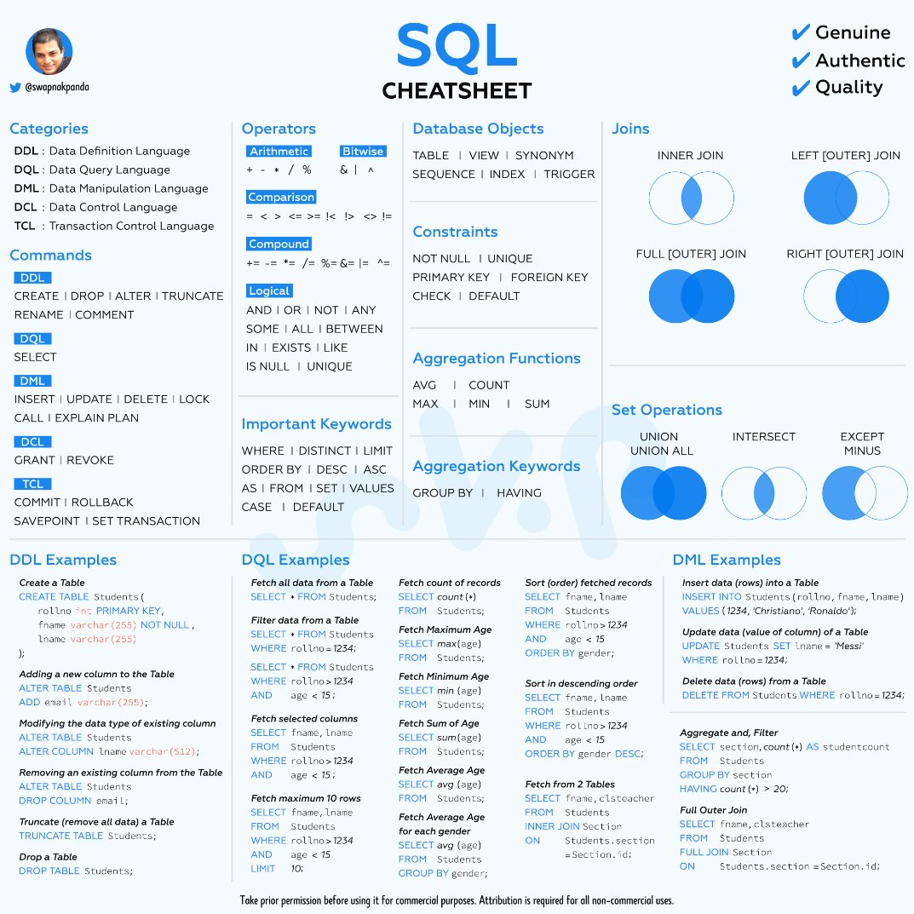

##### <!-- 收起 -->

<!----------- ref start ----------->

[Optimizing SELECT Statements]: https://dev.mysql.com/doc/refman/8.0/en/select-optimization.html
[Aggregate Function]: https://dev.mysql.com/doc/refman/8.0/en/aggregate-functions-and-modifiers.html
[String Functions]: https://dev.mysql.com/doc/refman/8.0/en/string-functions.html
[MySQL DOC: Character Sets, Collations, Unicode]: https://dev.mysql.com/doc/refman/8.0/en/charset.html
[What is the sorting algorithm behind ORDER BY query in MySQL?]: https://www.pankajtanwar.in/blog/what-is-the-sorting-algorithm-behind-order-by-query-in-mysql
[MySQL：排序（filesort）詳細解析]: https://zhuanlan.zhihu.com/p/101921329
[MySQL DOC: SELECT Statement]: https://dev.mysql.com/doc/refman/8.0/en/select.html
[MySQL DOC: ORDER BY Optimization]: https://dev.mysql.com/doc/refman/8.0/en/order-by-optimization.html
[Optimize Table 整理 MySQL 表空間]: https://www.796t.com/content/1545213008.html
[圖解｜索引覆蓋、索引下推以及如何避免索引失效]: https://zhuanlan.zhihu.com/p/481750465
[資料庫索引深入淺出(二)]: https://isdaniel.github.io/dbindex-2/
[MySQL 覆蓋索引詳解]: https://juejin.cn/post/6844903967365791752
[MySQL 面試：談談你對聚簇索引的理解]: https://blog.csdn.net/zhizhengguan/article/details/120834883?ops_request_misc=%257B%2522request%255Fid%2522%253A%2522168785250216800182784361%2522%252C%2522scm%2522%253A%252220140713.130102334..%2522%257D&request_id=168785250216800182784361&biz_id=0&utm_medium=distribute.pc_search_result.none-task-blog-2~all~top_click~default-2-120834883-null-null.142^v88^koosearch_v1,239^v2^insert_chatgpt&utm_term=%E8%81%9A%E7%B0%87%E7%B4%A2%E5%BC%95&spm=1018.2226.3001.4187
[詳解聚簇索引]: https://blog.csdn.net/crazzy_lp/article/details/84650621?ops_request_misc=&request_id=&biz_id=102&utm_term=%E8%81%9A%E7%B0%87%E7%B4%A2%E5%BC%95&utm_medium=distribute.pc_search_result.none-task-blog-2~all~sobaiduweb~default-1-84650621.142^v88^koosearch_v1,239^v2^insert_chatgpt&spm=1018.2226.3001.4187
[MySQL 底層為什麼要選用 B+樹作為索引的數據結構呢？]: https://blog.csdn.net/cckevincyh/article/details/119003282?spm=1001.2014.3001.5501
[平衡二叉樹、B 樹、B+樹、B*樹理解其中一種你就都明白了]: https://zhuanlan.zhihu.com/p/27700617
[資料庫層的核心 - 索引結構演化論 B+樹]: https://mark-lin.com/posts/20190911/
[聚簇索引]: https://blog.csdn.net/taoqilin/article/details/121230649?ops_request_misc=%257B%2522request%255Fid%2522%253A%2522168785250216800182784361%2522%252C%2522scm%2522%253A%252220140713.130102334..%2522%257D&request_id=168785250216800182784361&biz_id=0&utm_medium=distribute.pc_search_result.none-task-blog-2~all~top_positive~default-1-121230649-null-null.142^v88^koosearch_v1,239^v2^insert_chatgpt&utm_term=%E8%81%9A%E7%B0%87%E7%B4%A2%E5%BC%95&spm=1018.2226.3001.4187
[MySQL 開發規範參考]: https://mp.weixin.qq.com/s?__biz=MzUzNzAzMTc3MA==&mid=2247484130&idx=1&sn=4bae9fdac414a5ee3157b2f9d94f5592&scene=21#wechat_redirect
[Should You Run Your Database in Docker?]: https://vsupalov.com/database-in-docker/

<!------------ ref end ------------>

# MySQL

## # <mark>待整理筆記區</mark>

- ch1 ~ 4 快速回憶

  - 指令

    - `SELECT DATABASE();`：查詢目前正在 use 的 DB

    - `DELIMITER symbol`：更改結尾的符號

      - 當前環境生效，若 exit 再回來則回覆成 `;`

      ```sql
      # EX. 原本用 ; 結尾
      > SELECT * FROM users;

      # 改成用 # 結尾
      > DELIMITER #
      > SELECT * FROM users#

      # exit 後恢復 ;
      > exit
      $ mysql -r root -p
      > SELECT * FROM users;
      ```

    - `DESCRIBE table;`：秀出該 table 的樣貌

    - `SHOW WARNINGS;`：列出上一個操作所造成的 Error 或 Warning

    -

  - 常識

    - **Column** 欄位、**Row** 資料
    - Type 三大類：**Numeric**、**String**、**Date**

  - 注意

    - `INSERT INTO`

      - `INSERT INTO table(col1, col2) VALUES(col1, col2);`，是按照順序來進行配對 column
      - 可一次 INSERT 多筆

    - `AUTO_INCREMENT` & `PRIMARY KEY`

      - 只能有一個 column 設置 `AUTO_INCREMENT`，並且一定要設置為 KEY (PRIMARY 或 UNIQUE)
      - 若沒有其他 column 被設置為 PK，則此 column 就會直接成為 PK
      - 可以使用 `PRIMARY KEY(col1, col2)`，跟其他 column 一起成為 Composite Primary Keys

    - `UNIQUE`

      - 允許多筆資料都是 NULL

  

- ch5 ~ 7 快速回憶

  - 指令

    - [String Functions]

      - `CONCAT`、`CONCAT_WS`、`SUBSTR`、`REPLACE`、`REVERSE`、`CHAR_LENGTH`、`LOWER`、`UPPER`

    - [Optimizing SELECT Statements]

      - `ORDER BY`

        - `DESC` 降冪 (預設為升冪)

          - 排序方式從 升冪 改為 降冪
          - EX. `SELECT * FROM employees ORDER BY salary DESC;`

        - `ORDER BY 1`

          - 依照 SELECT 的第一項 (EX. name) 來排序
          - EX. `SELECT name, salary FROM employees ORDER BY 1;`

      - `LIMIT`

        - 可用 `18446744073709551615` 確保列出 LIMIT 後全部內容
        - EX. `SELECT * FROM tbl LIMIT 95,18446744073709551615;`
        - REF: [MySQL DOC: SELECT Statement]

      - `LIKE`

        - `%` 省略

          - EX. `SELECT * FROM users LIKE "%A";`

        - `_` 省略數量，有幾個 `_` 就代表幾個 char

          - EX. `SELECT * FROM users LIKE "__A";`

        - `BINARY`

          - 可以區分大小寫
          - EX. `SELECT * FROM users WHERE name LIKE BINARY 'J%';`

    - [Aggregate Function]

      - `COUNT`、`DISTINCT`、`SUM`、`MAX`、`MIN`、`AVG`

      - `GROUP BY`

        - `HAVING`：類似於 `GROUP BY` 的 `WHERE`

  - 常識

    - 使用 SQL Function (EX. REPLACE 等)，並不會更新資料

  - 注意

    - 環境不同，可能導致對`大小寫敏感`有不同的結果
    - ORDER BY 需注意 Collation 的選擇，不同環境可能有不同的預設設定
      - [MySQL DOC: Character Sets, Collations, Unicode]

  - 效能

    - 使用 sql function 查詢，對 index 的影響 ( EX. CONCAT )

      - 用 `SELECT CONCAT(a, b)`，不影響是否使用 index
      - 用 `WHERE CONCAT(a, b)=""`，則無法直接使用 index 快速查詢
      - 也可以另外建一個 `CONCAT(a, b)` 的 index

      

      - 數據解析：
        - type index 會進行 whole index 掃描
        - type ref 直接二分法搜尋該 index

    - 使用 order by 查詢，是否選擇 index

      - REF: [MySQL DOC: ORDER BY Optimization]

      - 如果需要再去查全表，則不會使用 index，而是重新對資料做排序

      

      - 若加上 WHERE 只取得某個區間，會依照區間大小選用 index。區間需要多小？

      

    - `GROUP BY` 沒有 index 可以用時，會 `Using temporary`，創建一個臨時表

  - 討論

    - 「使用 SQL Function」 VS 「在 server 處理」

      - 網路傳輸量
      - 資料庫記憶體消耗
      - 可能有些系統並不需要多建立一個 server？

    - Stored Procedure

      - 在資料庫 server 上保存的預編譯的程式，像是開客製化的 API，讓外部可以串接使用

    - 避免 `COUNT(*)` 的原因是因為 `*` 無法使用 covering index，而會導致全表掃描

    - Filesort 屬於 Unstable Sort？

      - [MySQL：排序（filesort）詳細解析]
      - [What is the sorting algorithm behind ORDER BY query in MySQL?]

      - GPT：早期為 Quicksort，5.0 改為 Batched Key Access Filesort，此兩種皆為 unstable

      

-

## # 簡介

- 定義：一般會把 `DBMS + Database` 這兩部分合稱 Database

  - DBMS (Database Management System)

    - RDBMS： MySQL、Oracle、Microsoft SQL Server 等
    - NoSQL DBMS：MongoDB、Cassandra、Redis 等

  - SQL (Structured Query Language)
    - 用於溝通 Relational database 的標準語言

  <br>

  

## # 安裝

<mark>TODO:</mark> 再修改整理

<!-- - 以`Homebrew`安裝
- 以`docker`啟動
- `mysql_secure_installation`進行安全設置

  - 設定每次連線所需的密碼
  - 設定是否開放遠端連線 --NO-> 只能在本機連線
  - 設定是否開放 test user --NO-> 只能用 root 連線

- `mysql -u root -p`進入 MySQL 介面

  - `-u <user>`：以該 user 身份執行
  - `-p`：輸入密碼

- chatGPT ref
  
  
   -->

## # 慣用方法

| O   | X   | 原因 |
| --- | --- | ---- |

## # 注意默認值

## # 問題集中區

<!-- Composite Primary Keys -->

- <details close>
  <summary>Composite Primary Keys</summary>

  <!-- AUTO_INCREMENT VS Composite Primary Keys -->

  - <details close>
    <summary>在使用 <code>AUTO_INCREMENT</code> 情況下，再設置 <b>Composite Primary Keys</b> 似乎沒有意義？</summary>

    - 是，因為 `AUTO_INCREMENT` 的 column 的每筆資料一定會不同

    </details>

  <!-- 電商限購商品 VS Composite Primary Keys -->

  - <details close>
    <summary>電商希望客戶只能購買一件同商品時，會用 <b>Composite Primary Keys</b> 來達成嗎？</summary>

    - 多：通常會在後端處理，因為這類型活動很難在一開始就設定好 DB

    </details>

  </details>

<!-- 生產環境 VS DELETE  -->

- <details close>
  <summary>生產環境，有什麼情況還是會用<code>DELETE</code>嗎？</summary>

  - 可能有些資料沒必要被救回，且資料庫資源有限，就會直接用 `DELETE`

  </details>

<!-- Table 應該都用複數？ -->

- <details close>
  <summary>Table 應該都用複數？</summary>

  - 是，MongoDB 還會自動幫你改成複數

  </details>

---

## # 其他補充

<!-- 注意事項 -->

- 注意事項：

<!-- 小技巧 -->

- 小技巧：

  <!-- UPDATE 技巧 -->

  - <details close>
    <summary><code>UPDATE</code>技巧</summary>

    - 可以先 `SELECT` 查看 `WHERE` 的條件是否符合需求，再將其改為 `UPDATE`

    </details>

  <!-- 查看一些優化的條件設定 -->

  - <details close>
    <summary><code>SHOW VARIABLES LIKE 'optimizer_switch';</code></summary>

    - 查看一下當前一些優化的條件設定，如： ICP 的狀態

    </details>

  <!-- OPTIMIZE TABLE -->

  - <details close>
    <summary><code>OPTIMIZE TABLE</code></summary>

    - [Optimize Table 整理 MySQL 表空間]
    - 可安排在離峰時段進行 OPTIMIZE TABLE，以整理 table，使減少查詢時 I/O 次數

    </details>

<!-- 小工具 -->

- 小工具：

  <!-- 學習工具 -->

  - <details close>
    <summary>學習工具</summary>

    </details>

  <!-- 開發工具 -->

  - <details close>
    <summary>開發工具</summary>

    </details>

<!-- 補充學習 -->

- 補充學習：

  <!-- 文件 -->

  - <details close>
    <summary>文件</summary>

    </details>

  <!-- 範例研究 -->

  - <details close>
    <summary>範例研究</summary>

    </details>

---

## # 踩雷實錄

---

## # 延伸討論

<!-- Database in Docker? -->

- <details close>
  <summary>Database in Docker?</summary>

  - [Should You Run Your Database in Docker?]

  </details>

<!-- MySQL 開發規範研究 -->

- <details close>
  <summary>MySQL 開發規範研究</summary>

  - [MySQL 開發規範參考]

    - B+ Tree

      - 因為資料庫存在 disk，選擇的重點在減少 I/O

        - 減少階數，減少 I/O
        - 盡量將每個 node 大小調整在 disk 的一個 block (EX. 4KB, 16KB..etc)，以減少 I/O
        - 盡量整理整齊，能放在同一個 block 以減少 I/O

      - 按順序連結，使順序遍歷更快

      - REF

        - [資料庫層的核心 - 索引結構演化論 B+樹]
        - [平衡二叉樹、B 樹、B+樹、B*樹理解其中一種你就都明白了]
        - [MySQL 底層為什麼要選用 B+樹作為索引的數據結構呢？]

    - Index

      - Clustered Index

        - 一個 table 只能有一個 Clustered Index，所以應該慎選要給哪個 key 用，以發揮最大效能利益
        - key 選擇要點：不會改、常查詢、容量小、插入順序為遞增、重複率低

        - REF

          - [聚簇索引]
          - [詳解聚簇索引]
          - [MySQL 面試：談談你對聚簇索引的理解]

      - Covering Index

        - 前提要是 Clustered Index
        - REF

          - [MySQL 覆蓋索引詳解]

      - Filter Index

        - 特化的 Covering Index，可以設定在 index 中存入的 Col，只符合特定條件的 value 才存入（並非所有的 Row 都存）
        - REF

          - [資料庫索引深入淺出(二)]

      - ICP

        - 索引條件下推（Index Condition Pushdown，ICP）
        - 過濾的動作由下層的存儲引擎層通過使用索引來完成，而不需要上推到 Server 層進行處理
        - 預設開啟

      - [圖解｜索引覆蓋、索引下推以及如何避免索引失效]

      - 其他

        - 需了解優化器自動選擇 index 的規則，自動選擇的並非一定就是最高效的，而是選擇 Cost Base Optimizer 最小的
        - 有時需把多餘的 index 刪除，才能讓其選中更高效的那一個 index
        - 優化器會將 possible_keys 都試一遍，因此一個查詢若有太多 possible_keys，也會變慢
        - 若在條件式中對 key 做運算，則會讓 index 失效。雖然新增了「函數索引」，但也是多建立一個 index

  </details>

---
