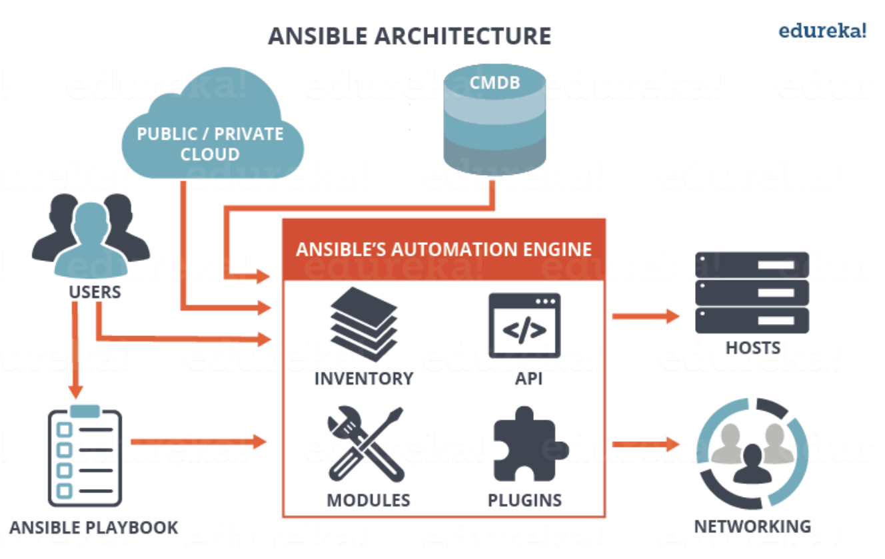
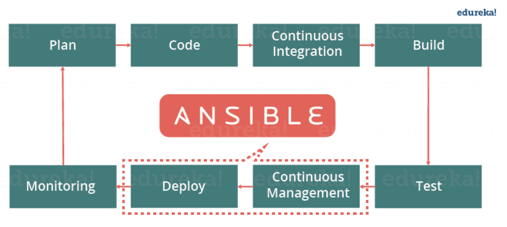
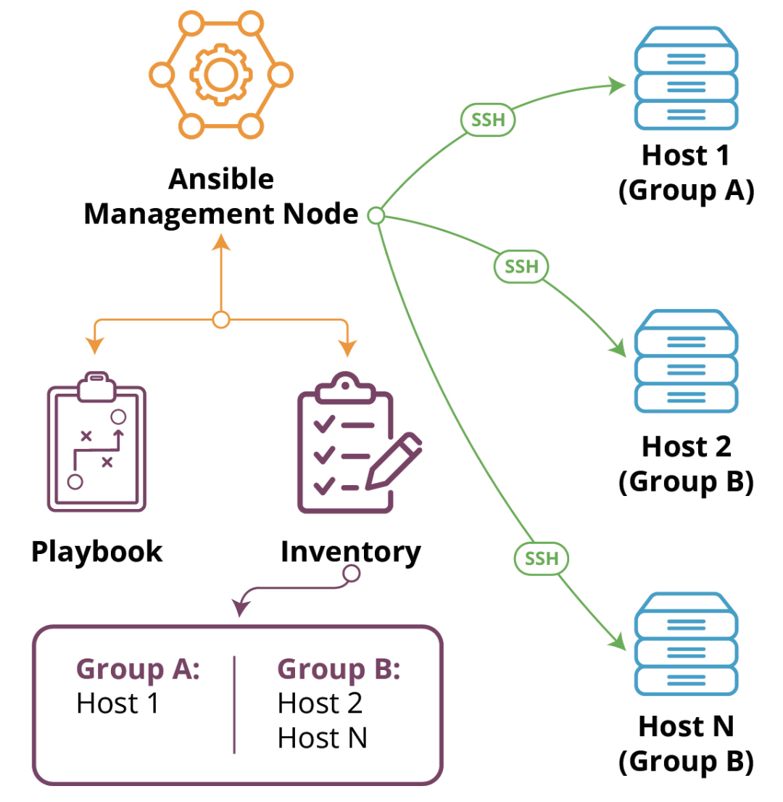

##### <!-- 收起 -->

<!----------- ref start ----------->

[.cfg 優先度]: https://docs.ansible.com/ansible/latest/reference_appendices/config.html#the-configuration-file
[變數優先度]: https://docs.ansible.com/ansible/latest/playbook_guide/playbooks_variables.html#understanding-variable-precedence
[Common Return Values]: https://docs.ansible.com/ansible/latest/reference_appendices/common_return_values.html
[vagrant-ansible 腳本]: ../../Vagrant/src/code/sample07-ansible/README.md
[Ansible Doc]: https://docs.ansible.com/ansible/latest/
[YAML Doc]: https://yaml.org/
[Index of all Modules]: https://docs.ansible.com/ansible/latest/collections/index_module.html
[Ansible Collections]: https://github.com/ansible-collections
[Ansible-lint is not available. Kindly check the path or disable validation using ansible-lint]: https://github.com/ansible/vscode-ansible/issues/763
[Ansible 入門]: https://www.youtube.com/playlist?list=PLfQqWeOCIH4BDoRx8lpXXl4hqSD4GSDU5
[官方 Best Practices]: https://docs.ansible.com/ansible/latest/tips_tricks/ansible_tips_tricks.html
[Understanding variable precedence]: https://docs.ansible.com/ansible/latest/playbook_guide/playbooks_variables.html#understanding-variable-precedence
[Ansible - Edureka]: https://www.edureka.co/blog/what-is-ansible
[How can I manage keyring files in trusted.gpg.d with ansible playbook since apt-key is deprecated?]: https://stackoverflow.com/q/71585303/13108209

<!------------ ref end ------------>

# Ansible

> DATE: 6 (2024)
> REF: [Ansible 入門] | [Ansible - Edureka]

## # 簡介



<!-- DevOps 定位 -->

- <details close>
  <summary>在 DevOps 中的定位</summary>

  - 部署＆持續管理的工具

  

  </details>

<!-- Operation of Ansible -->

- <details close>
  <summary>基本操作的模式</summary>

  - 一台管理者依照 Inventory & playbook 配置，透過 ssh 去管理所有機器

  

  </details>

## # 安裝與設定

<!-- 已製作成 vagrant-ansible 腳本 -->

- <details close>
  <summary>參考 vagrant-ansible 腳本</summary>

  - 相關設定已製作成 [vagrant-ansible 腳本]，在 vagrant 啟動時直接安裝設定完成，可參考其中細節

    - 安裝 ansible
    - 在 `/etc/hosts` 中設定 ip:name 配對
    - 設定使用 ssh key 連線
      - 生成 ssh key
      - 傳送公鑰給其他 node
      - 在 `~/.ssh/config` 中設定連線所需私鑰
      - 關閉 node 密碼登入功能

  </details>

## # 基礎

<!-- 啟動方式 -->

- <details close>
  <summary>啟動方式</summary>

  - `ansible -i inventory.ini -m ping`
  - `ansible-playbook playbook.yml -i inventory.ini`
  - 注意
    - 每個 host 不會按照順序執行，是並行，所以呈現的內容並非有序

  </details>

<!-- Core -->

- <details open>
  <summary>Core</summary>

  <!-- Inventory -->

  - <details close>
    <summary>Inventory</summary>

    <!-- 設定每台主機的資訊 -->

    - <details close>
      <summary>設定每台主機的資訊</summary>

      </details>

    <!-- 固定名稱資料夾 -->

    - <details close>
      <summary>固定名稱資料夾 <code>group_vars</code> & <code>host_vars</code></summary>

      - `group_vars`

        - 只對放 inventory.ini 中 group 名稱有效
        - EX. `all.yml`, `web.yml`

      - `host_vars`

        - 只對放 inventory.ini 中 host 名稱有效
        - EX. `ansible-node1.yml`

      - 註：
        - 名稱、相對位置固定不能錯
        - 資料夾內檔案名稱參照 inventory 中的命名
        - 優先順序：範圍越小越優先 (EX. host > group > all) (REF: [Understanding variable precedence])

      </details>

    <!-- 可使用 `.ini`, `.yml`, `.json` 等格式 -->

    - <details close>
      <summary>可使用 <code>.ini</code>, <code>.yml</code>, <code>.json</code> 等格式</summary>

      - 若沒副檔名會自動辨識
      - 除了 `.ini`，需用 `hosts`, `children` ([範例](../src/code/sample01/inventory/test/hosts.yml))

      </details>

    </details>

  <!-- playbook -->

  - <details close>
    <summary>playbook</summary>

    <!-- 設定每台主機要執行的 Task -->

    - <details close>
      <summary>設定每台主機要執行的 Task</summary>

      </details>

    <!-- 主要構成 -->

    - <details close>
      <summary>主要構成</summary>

      - hosts:
      - remote_user:
      - tasks:
        - name:
        - [plugin (module)]:

      </details>

    <!-- 基本用法 -->

    - <details close>
      <summary>基本用法</summary>

      <!-- vars -->

      - <details close>
        <summary><code>vars</code></summary>

        <!-- 優先順序： `vars_files 後者` > `vars_files 前者` > `vars` -->

        - <details close>
          <summary>優先順序： vars_files 後者 > vars_files 前者 > vars</summary>

          - [變數優先度] (下面優先度最高)

          </details>

        <!-- 位於 `vars` 變數底下 -->

        - <details close>
          <summary>位於 <code>vars</code> 變數底下</summary>

          - EX. `vars.my_var`

            ```yml
            vars:
              greetings: 'Hello~~'
            ```

            ```sh
            -->
            vars:{
              greetings: 'Hello~~'
            }
            ```

          </details>

        <!-- "lazy" variables：vars 中記載為算式，並非計算後的值 -->

        - <details close>
          <summary>"lazy" variables：vars 中記載為算式，並非計算後的值</summary>

          - 需注意是可以被後續動作覆蓋掉的，被覆蓋後就沒有算式了

          </details>

        <!-- 變數層級 -->

        - <details close>
          <summary>變數層級</summary>

          - `vars.hostvars.my_host_name` 包含 host 的預設資訊 (如 inventory 內所設定)
          - `vars.hostvars.my_host_name.ansible_facts` 包含從 host 收集的資訊

          </details>

        <!-- 變數會攤開在 `vars`，而可直接使用，無需層層連結 -->

        - <details close>
          <summary>變數會攤開在 <code>vars</code>，而可直接使用，無需層層連結</summary>

          - 所有 `vars.hostvars.my_host_name` 中的變數
          - `vars.hostvars.my_host_name.ansible_facts` 本身
          - 部分 `vars.hostvars.my_host_name.ansible_facts` 內的變數 (加上前綴 `ansible_`)

          </details>

        <!-- 在 task 階段新增變數於 `vars.hostvars.my_host_name` -->

        - <details close>
          <summary>在 task 階段新增變數於 <code>vars.hostvars.my_host_name</code></summary>

          - `register`：將 task 的 Return Values 註冊為變數
          - `set_fact`：新增靜態變數

          </details>

        </details>

      <!-- loop -->

      - <details close>
        <summary><code>loop</code></summary>

        - `{{ item }}`：為關鍵字，代表該次 loop 到的變數

        <!-- `with_items`、`with_nested`..etc 建議轉移成使用 `loop`+`query` -->

        - <details close>
          <summary>建議使用 <code>loop</code>+<code>query</code></summary>

          - `with_items`、`with_nested`..etc 建議轉移成使用 `loop`+`query`
          - > In most cases, loops work best with the loop keyword instead of with_X style loops. The loop syntax is usually best expressed using filters instead of more complex use of query or lookup.
          - EX. `with_nested` --> `loop: "{{ query('nested', list_1, list_2, list_3) }}"`
          - query 已經包含 `wantlist=True`

          </details>

        </details>

      <!-- when -->

      - <details close>
        <summary><code>when</code></summary>

        - 預設為 and
        - `or` 需要另外寫

          ```yml
          # EX. and
          when:
            - condition1
            - condition2

          # EX. or
          when: (condition1) or (condition2)
          ```

        </details>

      <!-- gather_facts -->

      - <details close>
        <summary><code>gather_facts</code></summary>

        - 預設 true
        - 收集 remote host 的資訊
        - 可在 task 使用 `setup` 或 `gather_facts`，再次收集更新 (即便設置 false)
        - 幾種變數寫法，EX.

          - `ansible_distribution`
          - `ansible_facts.distribution`
          - `ansible_facts['distribution']`

        </details>

      <!-- block -->

      - <details close>
        <summary><code>block</code></summary>

        - 處理 error 的其中一種方式
        - 如同 JS 的 try..catch
        - block 區塊中，若有 error 不會直接結束，但會跳過該 block 內後續內容，繼續往下執行

        <!-- 可搭配 `rescue`, `always`, `handlers` 處理 -->

        - <details close>
          <summary>可搭配 <code>rescue</code>, <code>always</code>, <code>handlers</code> 處理</summary>

          - `handlers`
            - 另外獨立出來，層級與 `tasks` 相同
            - 相較於直接使用 `rescue`，可以處理更多細節，但不論是否有 error 都會執行
            - 使用方式
              - `notify` 連結到對應 handler
              - 要有 changed 才能觸發 handler (範例刻意使用 changed_when: true 讓其有 changed)
              - `rescue` 需設置為 `meta: flush_handlers`
              - 會執行該 block 中出現 error 前的所有 handler

          </details>

        </details>

      </details>

    </details>

  <!-- Plugin (以前為 Module) -->

  - <details close>
    <summary>Plugin (以前為 Module)</summary>

    - Task 的執行內容
    - 現在 Module 被分類為一種 Plugin，主要是用在 VM 上執行的 Task
    - 可在 [Index of all Modules] 查詢 TODO:

    </details>

  </details>

<!-- 語法相關 -->

- <details close>
  <summary>語法相關</summary>

  <!-- yaml -->

  - <details close>
    <summary>yaml</summary>

    - 記得冒號後要空格
    - 三種格式：

      - key-value
      - list

        ```yml
        # 等同於 JSON： ["a", "b", "c"]

        - a
        - b
        - b
        ```

      - dictionary

        ```yml
        # 等同於 JSON： "dic": {"a": 1, "b": 2, "c": 3}

        dic:
          aa: 1
          bb: 2
          cc: 3
        ```

    </details>

  <!-- 常用指令 -->

  - <details close>
    <summary>常用指令</summary>

    - 加上 `-vv`, `-vvv`, `-vvvv` 可以印出 debug 資訊
    - `--tree` 將輸出指定到 folder 中保存

      - EX. `ansible all -m gather_facts --tree ./facts`：將 gather_facts 內容輸出到 `./facts/` 中保存

    </details>

  </details>

<!-- ansible.cfg -->

- <details close>
  <summary><code>ansible.cfg</code></summary>

  - 設定 config

  <!-- 優先順序，由上往下開始查詢，找到即使用該檔案 -->

  - <details close>
    <summary>優先順序，由上往下開始查詢，找到即使用該檔案</summary>

    - 設定在環境變數 ANSIBLE_CONFIG 的位置 (`export ANSIBLE_CONFIG=xxx/xxx/ansible.cfg`)
    - 當前 shell 所在位置 (`./ansible.cfg`)
    - home (`~/.ansible.cfg`)
    - `/etc/ansible/ansible.cfg`

    </details>

  - REF: [.cfg 優先度]

  </details>

<!-- PLAY RECAP TODO: -->

- <details close>
  <summary>PLAY RECAP</summary>

  - ok：執行成功，沒變動
  - changed：執行成功，有變動
  - unreachable
  - failed：執行失敗 (rescued)
  - skipped：不符合判斷條件，而跳過的內容 (EX. when)
  - rescued：出現錯誤，而執行的內容 (EX. block ... rescue)
  - ignored

  </details>

<!-- Return Values -->

- <details close>
  <summary>Return Values</summary>

  - [Common Return Values]: 幾乎所有 module 都會有的
  - 獨有的則在個別的文件中

  </details>

<!-- Ansible Vault -->

- <details close>
  <summary>Ansible Vault</summary>

  - 以指令 `ansible-vault` 來執行
  - 可以針對 file 或 string 進行對稱式加密
  - 可手動輸入
  - 可在 ansible.cfg 設定 `vault_password_file` 指定密碼位置 (建議將密碼檔案設為 600 權限)

  </details>

<!-- 模組化 -->

- <details open>
  <summary>模組化</summary>

  <!-- Roles -->

  - <details close>
    <summary>Roles</summary>

    - 將 tasks 組合成模組，拆分出來成一個 role
    - 專案內的用法需對照資料夾結構、命名
    - 注意新版用法 TODO:
      - include(dynamic) vs. import(static)
      - import 看似舊版用法

    </details>

  <!-- Collections -->

  - <details close>
    <summary>Collections</summary>

    - 可以包含 playbooks, roles, modules, plugins

    - 可以直接使用整個 Collection，也可以單獨使用某個 Collection 中的一小部分

    - 算是為原本龐大的 module 開發解套，更早版本全部內容都在官方 repo 中，開發新功能需要很久才能發佈，Collections 提供讓第三方可以直接發佈內容的平台

    </details>

  <!-- Ansible Galaxy -->

  - <details close>
    <summary>Ansible Galaxy</summary>

    - Ansible 的資源共享和管理平台，主要用來分享和下載 Roles、Collectiions，由社群和官方提供的預配置模板

    - 上傳到平台的內容，會進行一些認證，檢查符合規格、最佳實作、功能可用..等，但依然需注意安全性
    - 常用操作：

      <!-- ansible-galaxy role init roles/demo -->

      - <details close>
        <summary><code>ansible-galaxy role init roles/demo</code></summary>

        - 可以直接幫你在 roles/demo 建立一個 role 模板

        </details>

      <!-- ansible-galaxy install -r requirements.yml -->

      - <details close>
        <summary><code>ansible-galaxy install -r requirements.yml</code></summary>

        - TODO: 做一個範例
        - 可依照 `requirements.yml` 配置下載所需 role
        - `requirements.yml` 可放在主目錄或個別 role
        - 可下載 Ansible Galaxy 平台的內容，也可直接從其他來源下載 (EX. github)
        - 下載到 `~/.ansible/roles/`

        </details>

    </details>

  </details>

## # 基本 Module

<!-- Files: `file`, `copy`, `template`, `unarchive`, `fetch` -->

- <details close>
  <summary>Files: <code>file</code>, <code>copy</code>, <code>template</code>, <code>unarchive</code>, <code>fetch</code></summary>

  <!-- copy -->

  - <details close>
    <summary>copy</summary>

    - 不會直接創建 folder
    - `backup`：被覆蓋的檔案都會保留紀錄
    - 跟 `fetch` 相反

    </details>

  <!-- template -->

  - <details close>
    <summary>template</summary>

    - 需用 `Jinja` 寫 (`.j2`)
    - 可以製作 template 依照 host_vars 的變數帶入生成各自 host 的 file

    </details>

  <!-- 注意 -->

  - <details close>
    <summary>注意</summary>

    - `become_method: ansible.builtin.sudo` 只是指定方法，依然需要搭配 `become: true` 才能使用
    - `File permissions unset or incorrect.`：需要設定 mode
    - 若沒指定 owner，則因為使用 sudo，都會變成 root
    - directory 記得開 x 權限
    - 需釐清每個設定檔案的參數，所指的是 controller or node 上的內容 (有些參數可以設定為指何者 EX. remote_src)

    </details>

  </details>

<!-- System: `ping`, `gather_facts`, `user`, `group`, `service`, `systemd` -->

- <details close>
  <summary>System: <code>ping</code>, <code>gather_facts</code>, <code>user</code>, <code>group</code>, <code>service</code>, <code>systemd</code></summary>

  <!-- user -->

  - <details close>
    <summary>user</summary>

    - `present`

      - 自動建立 `/home/user/`

    - `absent`

      - `remove` 將 `/home/user/` 刪除

    - `password`

      - 必須是經過 hash 處理
      - 可用 `password_hash('sha512')` 處理，可能需另外安裝 `passlib`
      - 按往例會放在 env 等，不會放在 code

    </details>

  </details>

<!-- Packaging: `yum`, `apt`, `package`, `pip`, -->

- <details close>
  <summary>Packaging: <code>yum</code>, <code>package</code>, <code>pip</code></summary>

  <!-- 可用 gather_facts 判斷，針對不同發行版做處理 -->

  - <details close>
    <summary>可用 gather_facts 判斷，針對不同發行版做處理</summary>

    - 自己寫處理方式

    </details>

  <!-- 也可用 `package` 無腦針對不同發行版 -->

  - <details close>
    <summary>也可用 <code>package</code> 無腦針對不同發行版</summary>

    - 已經針對一些常用的發行版做處理，不需再自行判斷
    - 但不包含所有發行版
    - 但可能相同套件，在不同發行版的 name 不同，則無法使用

    </details>

  <!-- 需注意 Requirements 標註所需的前置安裝項目 -->

  - <details close>
    <summary>需注意 Requirements 標註所需的前置安裝項目</summary>

    </details>

  </details>

<!-- Net Tools: `get_url`, `uri` -->

- <details close>
  <summary>Net Tools: <code>get_url</code>, <code>uri</code></summary>

  - 通常會有 `checksum` 可使用，可到各自的官網查詢 (EX. python.org 查詢 python 的 checksum)

  </details>

<!-- Commands: `command`, `shell`, `raw` -->

- <details close>
  <summary>Commands: <code>command</code>, <code>shell</code>, <code>raw</code></summary>

  - 都是可以用來直接執行 command，但有不同限制
  - EX. command 不能用：環境變數、operation (`<`, `>`, `|`, `;`, `&`)..等

  </details>

<!-- Utilities: `debug`, `set_fact` -->

- <details close>
  <summary>Utilities: <code>debug</code>, <code>set_fact</code></summary>

  </details>

## # Ansible UI

> An framework for controlling, securing, managing your Ansible automation

<!-- AWX vs. Ansible Tower -->

- <details close>
  <summary>AWX vs. Ansible Tower</summary>

  - AWX：免費的網頁版 ansible UI
  - Ansible Tower：收費版 UI
  - AWX 由 RedHat 贊助的開源專案，新功能在 AWX 上實現、測試後，好用會被合併進 Ansible Tower
  - Ansible Tower 中也包含自己開發的功能，則是 AWX 上所沒有的

  </details>

<!-- 提醒下次摸索時需注意： -->

- <details close>
  <summary>提醒下次摸索時需注意：</summary>

  - 可能須改：`create_preload_data=False`
  - AWX 上面寫的內容，會合進 project 原始碼，還是額外的執行？
  - workflow template (AWX template = Ansible playbook)

  </details>

## # 問題

<!-- ansible-lint bug? -->

- <details close>
  <summary>ansible-lint bug?</summary>

  - 不知為何已經使用 `ansible.builtin.yum` 寫法，但 ansible-lint 依然顯示 `Use FQCN for builtin module actions (ansible.builtin.yum)`

  </details>

## # 其他補充

- 注意事項：

  <!-- v2.10 的升級為大更新 -->

  - <details close>
    <summary>v2.10 的升級為大更新</summary>

    - Module 被拆分出來到不同 repo，只剩下常用的主要功能在主要 repo 中
    - 剩下的被歸類為 Plugin，由第三方開發維護，被放在 [Ansible Collections]
    - v2.9 的寫法會在執行時被自動對照轉換為新的，依然可以執行

      - EX. `mysql_user` --> `community.mysql.mysql_user`
      - 有趣的是，用 v2.10 語法，在 v2.9.27 軟體也能執行

    - 更新必須刪除舊版本重新安裝，不可直接升級
    - Ansible Collections 有些會隨安裝 Ansible 一起安裝，有些需另外安裝 `ansible-galaxy collection install [COLLECTIONS]`

    </details>

  <!-- 變數命名與輸出不完全同 -->

  - <details close>
    <summary>變數命名與輸出不完全同</summary>

    - EX. 輸出 `ansible_facts` 時
      - 呈現為 `ansible_facts: { ansible_distribution ...}`
      - 其實變數命名為 `ansible_facts.distribution`

    </details>

- 小技巧：

  <!-- 新版文件 module 查詢方法 -->

  - <details close>
    <summary>新版文件 module 查詢方法</summary>

    - 新版文件沒有分類很難查，可以先找一個出來再從 see also 找相關
    - 或是知道名稱直接搜尋

    </details>

- 小工具：

  - <details close>
    <summary></summary>

    </details>

- 補充學習：

  <!-- 文件 -->

  - <details close>
    <summary>文件</summary>

    - [Ansible Doc]
    - [YAML Doc]

    </details>

  <!-- Best Practices -->

  - <details close>
    <summary>Best Practices</summary>

    - [官方 Best Practices]

    </details>

- 冷知識：

  - Ansible 被 RedHat 收購

---

## # 踩雷實錄

<!-- vscode Ansible 插件 -->

- <details close>
  <summary>vscode Ansible 插件</summary>

  - 安裝 vscode Ansible 插件後，還得自行安裝 Ansible-lint，否則報錯 [Ansible-lint is not available. Kindly check the path or disable validation using ansible-lint]

  </details>

<!-- 以自己管理 trusted.gpg.d 方式執行 apt 安裝 -->

- <details close>
  <summary>以自己管理 trusted.gpg.d 方式執行 apt 安裝</summary>

  - 指定 apt repo 時不能用 `ansible_architecture` 變數。這會顯示如 x86_64 形式，而不是所需要的 amd64
  - GPG keys 格式：

    - 透過 curl 下載下來的 GPG key 是 ASCII 格式
    - apt will not accept ASCII GPG keys saved with .gpg extension
    - 而 ansible 找不到提供 `--dearmor` 方法，將 ASCII 轉為 binary (只想到可直接用 command 寫)
    - 並非只能用 `.gpg` 的 GPG key，`.asc` 也能用 (直接將輸出設為 .asc 格式即可)

  - REF: [How can I manage keyring files in trusted.gpg.d with ansible playbook since apt-key is deprecated?]

  </details>

---

## # 延伸討論

- <details close>
  <summary></summary>

  </details>

---
