##### <!-- 收起 -->

<!----------- ref start ----------->

[Vagrant/sample06-docker]: ../../Vagrant/src/code/sample06-docker/
[docker init]: https://docs.docker.com/reference/cli/docker/init/
[Docker Daemon 的 Unix Socket & TCP Socket]: https://dockertips.readthedocs.io/en/latest/docker-blog/docker-sock.html
[RedHat NAT Doc]: https://docs.redhat.com/en/documentation/Red_Hat_Enterprise_Linux/4/html/Security_Guide/s1-firewall-ipt-fwd.html#s1-firewall-ipt-fwd
[Docker: What's Under the Hood?]: https://www.codementor.io/blog/docker-technology-5x1kilcbow
[七天用 Go 寫個 docker]: https://zhuanlan.zhihu.com/p/113926966
[Github Actions Triggering by other repository]: https://github.com/orgs/community/discussions/26323#discussioncomment-3343871
[Docker Hub Automated builds]: https://docs.docker.com/docker-hub/builds/how-builds-work/
[Github Actions]: https://docs.github.com/en/actions
[compose file version]: https://docs.docker.com/compose/history/
[sysdig]: https://sysdig.com/
[CVE]: https://cve.mitre.org/
[Snyk]: https://snyk.io/
[Trivy]: https://github.com/aquasecurity/trivy#how-to-pronounce-the-name-trivy
[Remote Development]: https://code.visualstudio.com/docs/remote/remote-overview
[Docker Bench Security]: https://github.com/docker/docker-bench-security
[docker manifest]: https://docs.docker.com/engine/reference/commandline/manifest/
[Kubernetes 停止支持 Docker 了？]: https://youtu.be/VTFjIfOLP8c
[Don't Panic: Kubernetes and Docker]: https://kubernetes.io/blog/2020/12/02/dont-panic-kubernetes-and-docker/
[OCI]: https://opencontainers.org/
[Docker rootless mode]: https://docs.docker.com/engine/security/rootless/
[docker 容器技术从入门到精通]: https://www.udemy.com/course/docker-china/learn/lecture/27213604#overview
[課堂筆記]: https://dockertips.readthedocs.io/en/latest/
[setup docker on manjaro linux]: https://credibledev.com/setup-docker-on-manjaro-linux/
[host pid of a process running in a docker container]: https://www.baeldung.com/linux/docker-container-process-host-pid
[OrbStack (課推)]: https://orbstack.dev/
[minikube (宇推)]: https://dhwaneetbhatt.com/blog/run-docker-without-docker-desktop-on-macos
[掛載 docker.sock 的用意？]: https://ephrain.net/docker-%E6%8E%9B%E8%BC%89-var-run-docker-sock-%E7%9A%84%E7%94%A8%E6%84%8F%EF%BC%9F/
[Buildx]: https://docs.docker.com/build/architecture/
[How to remove intermediate images from a build after the build?]: https://stackoverflow.com/questions/50126741/how-to-remove-intermediate-images-from-a-build-after-the-build
[Dockerfile reference]: https://docs.docker.com/engine/reference/builder/
[Migrate to Compose V2]: https://docs.docker.com/compose/migrate/
[學習範本]: https://github.com/stars/ocup0311/lists/docker-%E7%AF%84%E4%BE%8B%E5%AD%B8%E7%BF%92
[RAFT]: http://thesecretlivesofdata.com/raft/
[Play with Docker]: https://labs.play-with-docker.com/
[鳥哥 iptables]: https://linux.vbird.org/linux_server/centos6/0250simple_firewall.php#netfilter
[初探 IPTABLES 流動之路 - 以 Docker 為範例]: https://www.hwchiu.com/docs/2020/iptables-1
[Docker - iptables 小知識]: https://www.gss.com.tw/blog/%E6%AF%8F%E6%97%A5%E5%B0%8F%E7%9F%A5%E8%AD%98-19-docker-%E7%B6%B2%E8%B7%AF%E7%AF%87-3-iptables
[Multi-platform 文件]: https://docs.docker.com/build/building/multi-platform/

<!------------ ref end ------------>

# Docker

> DATE: 4, 5 (2023)
> REF: [Docker 容器技术从入门到精通] | [課堂筆記]

## # 測試環境

- <details close>
  <summary>Ubuntu & Manjaro VM @Intel Core i5 macOS v13.0.1 | docker v23.0.6</summary>

  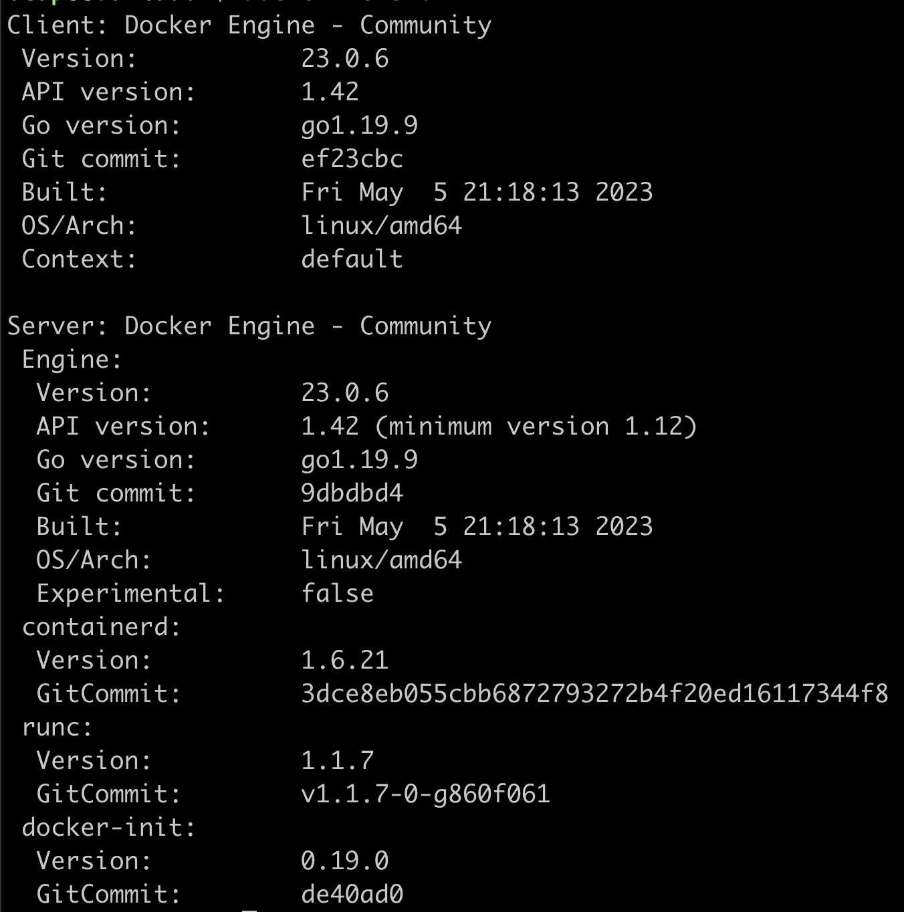

  </details>

## # 簡介


<!-- OCI -->

- <details close>
  <summary>OCI（Open Container Initiative）</summary>

  - [OCI]

  - 由 Google、Docker、Red Hat 等聯合發起

  - 致力於容器技術的標準化

    - runtime spec

      - 規定容器的基本操作：下載鏡像，創建容器，啟動容器等

    - image spec

      - 主要定義鏡像的基本格式

  </details>

<!-- container & image -->

- <details close>
  <summary>container & image</summary>

  - container 可視為執行中的 image，其在 image layer 上加上`read-write`，形成 container layer

    

  - 執行中的 container 可以再輸出為 image，保留當下的狀態

  </details>

<!-- 「container 即 process」 -->

- <details close>
  <summary>「container 即 process」</summary>

  - 範例：

    - 啟動一個 ngmix container 的步驟如下：
    - 由 containerd-shim 先產生一個 process，也就是建立一個 container (PID 18728)
    - 再從 18728 fork 出 ngnix
    - `docker container exec -it` 出一個 shell，也是從 18728 fork 出來

    

  

  </details>

## # 安裝與設定

<!-- 不同 OS 差異 -->

- <details close>
  <summary>不同 OS 差異</summary>

  - mac: Docker Desktop (不推)、[OrbStack (課推)]、[minikube (宇推)]
  - manjaro: [Setup Docker on Manjaro Linux]
  - ubuntua: 可以使用 `get-docker.sh`

  </details>

<!-- 啟動 container -->

- <details close>
  <summary>啟動 container</summary>

  - `docker container run -it -u $(id -u):$(id -g) --name container_name image_name`
  - `-u $(id -u):$(id -g)`以設定使用 builder user 在 docker 中執行，未指定則為 root
  - container 裡的 root 是另外建立可用來使用 container 內部的權限的 user。跟主機 root 為不同的 user

    
    

  </details>

<!-- rootless mode -->

- <details close>
  <summary>rootless mode</summary>

  - [Docker rootless mode]
  - version 20.10 以上
  - 需設定 docker.sock 位置

    - rootless 是在個別 user 上運行 Docker Daemon
    - 需將 docker.sock 設定成使用個別 user 的

    ```sh
    $ export DOCKER_HOST=unix:///run/user/1000/docker.sock
    ```

  </details>

<!-- Swarm -->

- <details close>
  <summary>Swarm</summary>

  - 環境搭建可使用 [Vagrant/sample06-docker]，啟動三台 VM 供學習
  - 必須開啟的 port: `TCP port2376`, `TCP port2377`, `TCP and UDP port7946`, `UDP port4789`

  </details>

<!-- 踩雷 -->

- <details close>
  <summary>踩雷</summary>

  - 似乎是在同一台 mac 上啟動的兩台 linux VM 同時安裝時，其中一台出現此狀況，過一陣子後，在安裝就通過了

    ```sh
    E: Could not get lock /var/lib/dpkg/lock-frontend. It is held by process 23606 (unattended-upgr)
    E: Unable to acquire the dpkg frontend lock (/var/lib/dpkg/lock-frontend), is another process using it?
    ```

    

  - 執行 `sudo docker container run -it manjarolinux/base`

    - 出現錯誤：

      ```sh
      ERRO[0131] error waiting for container:

      docker: Post "http://%2Fvar%2Frun%2Fdocker.sock/v1.42/containers/6e0067bf32173e5e55907b38eaa071632453d45700ed46e8fffb121dcabd6242/start": dial unix /var/run/docker.sock: i/o timeout.
      ```

    - manjaro 的 terminal 卡住了，VM 整個黑頻無法排解
    - 目前只能以「還原」來解決
    - 後來將記憶體從 4GB 改為 8GB，就正常了（但不確定是否只是剛好，還是真的需要這麼高配置）

  - docker-buildx

    - manjaro 需再自行下載 `sudo pacman -Sy docker-buildx`

  - [Migrate to Compose V2]

    - ubuntu 下載最新 docker 時，已下載 V2
    - `sudo apt-get install docker-compose-plugin`
    - Compose V1 已經不維護了
    - 指令更改`docker-compose`-->`docker compose`

  </details>

## # 基本操作

<!-- 速記小抄 (Cheat Sheet) -->

- <details close>
  <summary>速記小抄 (Cheat Sheet)</summary>

  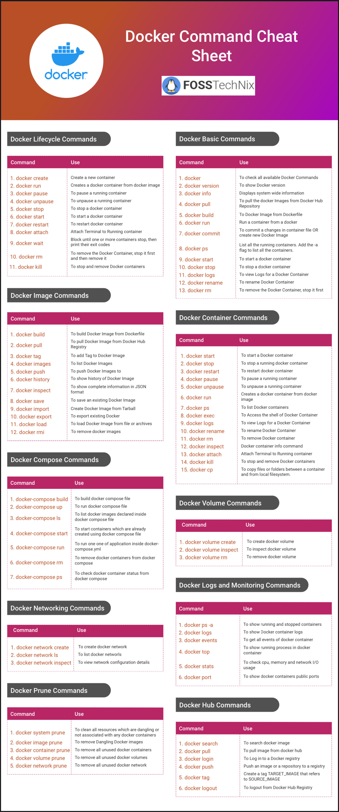

  </details>

<!-- image -->

- <details close>
  <summary>image</summary>

  <!-- 建立 image 的各種方法 -->

  - <details close>
    <summary>建立 image 的各種方法</summary>

    

    - Build、Commit --> Save、Push

    <!-- Registry -->

    - <details close>
      <summary>Registry</summary>

      - Docker Hub, Quay, Harbor..等等
      - `docker search <搜尋關鍵字>`：預設從 Docker Hub 上搜尋
      - `docker search quay.io/<搜尋關鍵字>`：指定 Registry

      

      </details>

    <!-- docker image build -->

    - <details close>
      <summary><code>docker image build</code></summary>

      <!-- 延伸問題： -->

      - <details close>
        <summary>延伸問題：</summary>

        - Ｑ：dockerfile 裡面寫的某些 apt-get 是在什麼階段下載？包成 image 時、pull image 時、container run 時?

          - 在 build image 時，會將 apt-get 的東西存在 image 中

        - Ｑ：在 image build 時，會使用 cache，那麼其是以哪些內容來進行 hash？

          

        - Ｑ：若環境一樣，dockerfile & 使用到的任何 file 都一樣，是否最後 build 出來的 image ID 也會一樣？

          - 測試：即便在同台機器，將前一次的 image、cache 全刪除後，再 build 一次，image ID 已經改變為不相同

          - 研究過程：

            

            - 但我會疑惑的點是，因為我用 `docker container ls -a` 並沒查到 intermediate container ，所以我才以為他已經關掉了（當我 apt-get 失敗時，我是可以查到那個 intermediate container 的）

          - 結論：因為 intermediate container 的 container ID 也有 cache，所以 image ID 會不同

        </details>

      <!-- 範例研究： -->

      - <details close>
        <summary>範例研究：</summary>

        - `FROM ubuntu:20.04 RUN apt-get update..`，會啟動一個 ubuntu:20.04 的 container，在 container 中 run `apt-get`
        - 若沒有 ubuntu:20.04 的 image 則會自動 pull

        ```dockerfile
        # EX.
        FROM ubuntu:20.04
        RUN apt-get update && \
            DEBIAN_FRONTEND=noninteractive apt-get install --no-install-recommends -y python3.9 python3-pip python3.9-dev
        COPY hello.py /hello.py
        CMD ["python3", "/hello.py"]
        ```

        </details>

      </details>

    <!-- docker image push -->

    - <details close>
      <summary><code>docker image push</code></summary>

      - 預設不會自動將最新一次 push 同步更新到 latest，得另外 push 一個 latest 版本
      - 預設會直接用新的覆蓋掉 Registry 上舊的 image

      </details>

    <!-- docker container commit -->

    - <details close>
      <summary><code>docker container commit</code></summary>

      - 每次產生的 image ID 都不同
      - 開發中不常使用 `docker container commit`，推測只用在臨時測試與快速修補，最終還是會用 dockerfile 寫完整來使用

      </details>

    </details>

  <!-- image build -->

  - <details close>
    <summary>image build</summary>

    <!-- image build 的架構已更新 (改用 Buildx/BuildKit) -->

    - <details close>
      <summary>image build 的架構已更新 (改用 Buildx/BuildKit)</summary>

      <br>

      

      <br>

      - `Buildx` (client) + `BuildKit` (server)
      - `builders`: BuildKit 的 instance
      - [Buildx]

        - 包含 創建 ＆ 管理 builders 的公共建設(utilities)
        - manjaro 需再自行下載 `sudo pacman -Sy docker-buildx`

      <br>

      

      <!-- 與舊版 build 比較 -->

      - <details close>
        <summary>與舊版 build 比較</summary>

        - cache

          - 舊：當下完全無使用，即刻刪除
          - 新：Least Recently Used（LRU），一段時間未使用才刪除

          

        - build context

          - 舊：會將整個 folder 打包
          - 新：只當需要時，buildkit 才向 buildx 請求

        - builder
          

        - 是否還需要 `.dockerignore` ？

          - 疑惑：因為其作法改為當有需求時，buildkit 才會向 buildx 發送請求。而不像舊的方式會直接打包整個資料夾過去
          - 解答：需要，因為實際專案中會在 Dockerfile 直接 `COPY` 整個資料夾，資料夾內的一些內容會需要 ignore

        - <mark>TODO:</mark> 已知手動刪除 cache、builder。手動刪除 intermediate image/container 待研究

          - 手動刪除 cache、builder 請查 `docker buildx` & `docker builder`
          - [How to remove intermediate images from a build after the build?] 可事先以 LABEL 方式標註，來做刪除。但不知未標註時該如何刪除。

        </details>

      <!-- Multi-platform images (buildx) -->

      - <details close>
        <summary>Multi-platform images (buildx)</summary>

        - 可以在一台電腦上，直接 build 各種硬體架構的 image
          (EX. 在 amd64 的主機上也可以 build 給 arm64 使用的 image)

        - 須先用 container 開一個 `docker-container` driver 的 builder

          - REF：[Multi-platform 文件]

          - 快速使用：`docker buildx create --use`

        - build 完後，並不會出現在 image ls 中，可加 `--push` 直接上傳

        ```sh
        # 建立 docker-container driver 的 builder 並切換過去使用
        $ docker buildx create --use

        # EX. build 出 linux/arm/v7,linux/arm64/v8,linux/amd64 三種架構的 image
        $ docker buildx build --push --platform linux/arm/v7,linux/arm64/v8,linux/amd64 -t <image_name> <folder_name>
        ```

        </details>

      </details>

    <!-- Dockerfile -->

    - <details close>
      <summary>Dockerfile</summary>

      - `FROM` 挑選原則：

        - 盡量官方、開源
        - 盡量精簡小巧 (常用 Alpine Linux，非常輕量的 Linux)
        - 固定版本

      - `RUN`

        - RUN 一次會產生一層 layer，因此盡量將指令集中在一個 RUN，縮小空間 (用 `&& \` 連)
        - 我認為應該只在以功能性或刻意分層時，才寫在不同 RUN（不知實作時是否會有這種需求？）
        - 一些中間過渡所需的軟體，可在使用完後刪除以節省空間（但須寫在同一 RUN 才有用）

      - `ADD` vs `COPY`

        - `ADD` 會自動解壓縮，`COPY` 不會
        - `ADD` 可以從 URL 加過來，`COPY` 只能複製本地檔案
        - `COPY` 會複製檔案權限， `ADD` 不會
        - 推薦：`COPY` 優先，因為功能單一且透明

      - `ARG` vs `ENV`

        - `ARG` 用在 build，`ENV` 會帶進 container

        <!-- 敏感訊息，建議用 secret 方式 -->

        - <details close>
          <summary>敏感訊息，建議用 secret 方式</summary>

          - 以 `--mount=type=secret,id=my_secret` 告知要使用 secret
          - 默認會放在 container 的 /run/secrets/my_secret
          - 將 token 寫在 my_token 檔案中
          - 以 `--secret id=my_secret, src=my_token` 將 secret 帶入用來 build 的那個 container(EX. alpine) 中

          ```dockerfile
          FROM alpine
          RUN --mount=type=secret,id=my_secret git clone https://$(cat /run/secrets/my_secret)@github.com/...
          ```

          ```sh
          $ docker image build --secret id=my_secret, src=my_token .
          ```

          </details>

      - `ENTRYPOINT`＋`CMD`

        - 兩者都只有最後一個生效
        - 使用方式：`ENTRYPOINT` 為該指令的進入點，`CMD` 為 container run 的默認指令

        - 兩種格式：Shell & Exec

          - Shell:

            ```dockerfile
            CMD echo "hello world"
            ```

          - Exec: (推薦)

            ```dockerfile
            CMD ["echo", "hello world"]
            ```

      - `LABEL`

        - EX. Name & Version 。只會標註在 metadata 中，而不會直接顯示在 image 上，因此 build 的時候依然需要指定

      - `USER`

        - 須先有 user 才能指定

      </details>

    <!-- Multi-stage builds -->

    - <details close>
      <summary>Multi-stage builds</summary>

      - 前面的過渡層不會保存在 image 中，可以大大降低 image 空間

      </details>

    </details>

  </details>

<!-- 資料保存 -->

- <details close>
  <summary>資料保存 (Volume & Mount)</summary>

  <!-- Data Volume vs. Bind Mount -->

  - <details close>
    <summary><code>Data Volume</code> vs. <code>Bind Mount</code></summary>

    <!-- Data Volume -->

    - <details close>
      <summary>Data Volume</summary>

      - 由 Docker 管理(/var/lib/docker/volumes/)
      - 推薦使用 Data Volume 來儲存資料

      </details>

    <!-- Bind Mount -->

    - <details close>
      <summary>Bind Mount</summary>

      - 自訂任意本機位置
      - 可以用在搭建特殊環境，以操作 host 的檔案

        - 如果 target (container 上) 不是空資料夾，則 container 中，該資料夾中原有的內容會被屏蔽
        - EX. 搭建 gcc 編譯環境，用來編譯 host 上的檔案
        - EX. 用 vscode 的 Dev Containers 套件，搭建專案開發環境，以 container 開啟 host 上的專案 folder

      </details>

      

    </details>

  <!-- `--mount` VS `--volume` -->

  - <details close>
    <summary><code>--mount</code> VS <code>--volume</code></summary>

    - 幾乎是一樣的，兩者都可以指定成 `volume` 或 `bind mount`
    - `--mount` 是較新的語法，有針對某些部分做改變
    - 推薦使用 `--mount`，較易於理解

    </details>

  <!-- 其他 -->

  - <details close>
    <summary>其他</summary>

    <!-- 預設 container 內部儲存 -->

    - <details close>
      <summary>預設使用 container內部 儲存，而未設定 Volume 或 Mount</summary>

      - container stop，資料還在
      - container rm，資料不在

      </details>

    <!-- mac 存在 Docker Desktop VM -->

    - <details close>
      <summary>mac 存在 Docker Desktop VM</summary>

      

      </details>

    - 連結後，檔案並非 host & container 兩個檔案同步，而是直接操作本機的一個檔案
    - 也可以直接在 container 刪除 host 的檔案

    - <mark>TODO:Q</mark> 所有方法都是，只有掛載？也就是只有在掛載的位置上有儲存資料？

      - 目前簡單測試 `sshfs` 方式也是只有設定為 volume 端有資料，若將那台 host 斷開連線，則其他 host 無法讀寫資料，且會卡住。

    </details>

  <!-- 總結＆推薦 -->

  - <details close>
    <summary>總結＆推薦</summary>

    - 沒作設定，`container rm` 後內部資料就消失
    - 純儲存，優先用 `Data Volume` (因為只掛到本機 /var/lib/docker/volumes/ 上)
    - 用於搭建開發環境，才用 `Bind Mount` 掛載到開發資料夾
    - 指令，用 `--mount` (因為書寫方式較易於理解)

    </details>

  </details>

<!-- Network -->

- <details close>
  <summary>Network</summary>

  <!-- bride -->

  - <details close>
    <summary>bride</summary>

    - Docker Daemon 自動創建一個 `bridge`(也就是 `docker0`)
    - 每開一個 container，docker0 就產生一個 `veth` 跟 container 對接
    - 往外部連接時，透過 `Nat` 轉成 host 的 ip

    

    - 手動建立的 bridge 有 DNS 功能，內建 (docker0) 的沒有

      - EX. `docker container exec -it box1 ping box2` 可用 box2 取代他的 ip

    </details>

  <!-- host -->

  - <details close>
    <summary>host</summary>

    - 直接建立在 host 上

    </details>

  <!-- none -->

  - <details close>
    <summary>none</summary>

    - 沒有與外部網路連接

    </details>

  <!-- Docker 所使用的 network 技術： -->

  - <details close>
    <summary>Docker 所使用的 network 技術：</summary>

    - 端口轉發（port forwarding），是靠 `iptables` 完成的
    - 不同的容器通過 `Network namespace` 進行了隔離
      （<mark>TODO:</mark> 沒模擬成功，尚未找出原因）

    </details>

  </details>

<!-- healthcheck -->

- <details close>
  <summary>healthcheck</summary>

  - 會偏好寫在 Dockerfile、run、docker-compose.yml 哪一層？

    <!-- 思考過程： -->

    - <details close>
      <summary>思考過程：</summary>

      - 我認為更喜歡寫在 Dockerfile，但現成 image 大部分沒寫 healthcheck
      - 也可能當要組成更健全的架構時，都會再另外寫一層 Dockerfile？
      - 寫在 Compose 中，可以搭配依賴做不同的檢查

      </details>

    <!-- 結論： -->

    - <details close>
      <summary>結論：</summary>

      - 將各自需要的固定一致的檢查寫在 Dockerfile
      - 將針對不同環境或需要依賴搭配的策略性檢查寫在 Compose

      </details>

  </details>

<!-- 安全性檢查 -->

- <details close>
  <summary>安全性檢查</summary>

  <!-- 檢查執行環境 -->

  - <details close>
    <summary>檢查執行環境</summary>

    </details>

  <!-- Docker 相關內容檢查 -->

  - <details close>
    <summary>Docker 相關檔案檢查</summary>

    - [Docker Bench Security]

      - 簡介：將其 clone 到本機，執行 `docker-bench-security.sh`，就會對本機上 docker 所有內容進行掃描 (image, container, compose..)

      - 範例畫面

        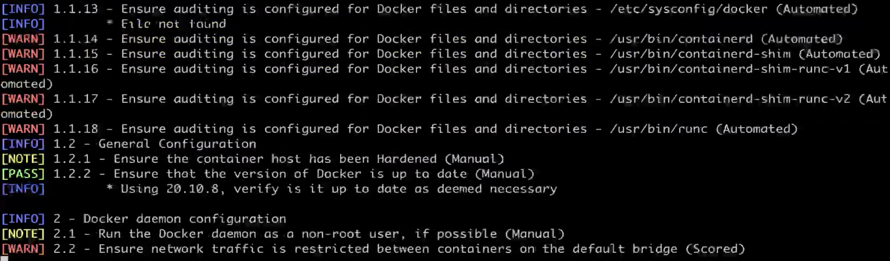

    </details>

  <!-- CVE：程式碼漏洞掃描 -->

  - <details close>
    <summary>CVE：程式碼漏洞掃描</summary>

    - [CVE] (Common Vulnerabilities and Exposures)

      - C(critical), H(high), M(medium), L(low)
      - 不存在沒有漏洞的程式，依照自己需求取捨

      <!-- 線上服務：Snyk -->

      - <details close>
        <summary>線上服務：Snyk</summary>

        - [Snyk]

        - 簡介：在 Snyk 網站上，選擇線上的 repo 讓他掃描整個 repo

        - 對開源專案免費，掃描私有專案需付費

        - 範例畫面

          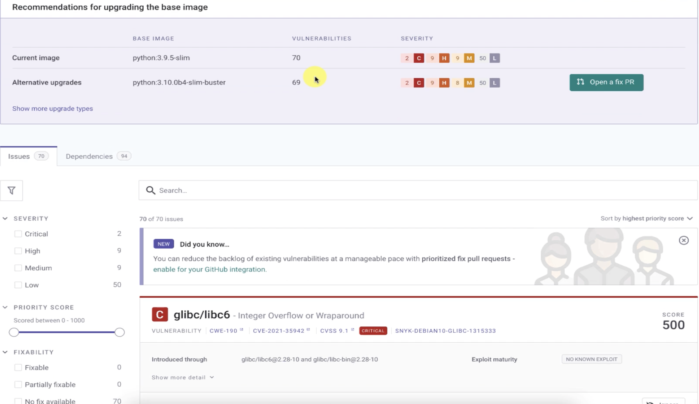

        </details>

      <!-- 本地軟體：Trivy -->

      - <details close>
        <summary>本地軟體：Trivy</summary>

        - [Trivy]

        - 簡介：下載到本機，用他的指令對本機 repo 掃描

        - 範例畫面

          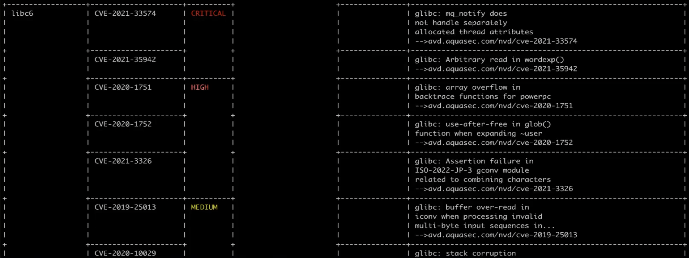

        </details>

    </details>

  <!-- runtime 動態監控 -->

  - <details close>
    <summary>runtime 動態監控</summary>

    - [sysdig]：付費

      - 功能不只 runtime 部分

    </details>

  </details>

## # Compose

<!-- 版本問題 -->

- <details close>
  <summary>版本問題</summary>

  - `compose file` 跟 `docker compose CLI` 的 version 是指兩件事
  - Compose V2 已經合併 compose file 版本，所以 .yml 中不用再定義版本 ([compose file version])

  </details>

<!-- 指令規則 -->

- <details close>
  <summary>指令規則</summary>

  - 先 Options 後 Commands

    ```sh
    # EX. 先 -f 後 ps
    $ docker compose -f /folder/docker-compose.yml ps
    ```

  - 進行背景執行 `-d`

    ```sh
    # 需注意 -d 是 up 的 Options，所以須加在 up 之後
    $ docker compose -f /folder/docker-compose.yml up -d
    ```

  - 將 `up` 前面的所有 Options 整個想像成一包 compose name，接下來的所有操作，都需要先輸入那整串之後，再使用 Commands

    ```sh
    # EX. 以此 up 的 compose
    $ docker compose -f /folder/docker-compose.yml up -d
    # 使用 stop 時，需如下指令
    $ docker compose -f /folder/docker-compose.yml stop
    ```

  </details>

<!-- 更新 compose -->

- <details close>
  <summary>更新 compose</summary>

  - 修改已經 up 的 compose，可以不先停止，直接再下一次 `up` 指令更新。但一些特殊變化需再加上 Options 來處理
    (`docker compose up --help`查看 Options)

    ```sh
    # EX. 有需要重新 build，則需加上 --build，會自動檢查是否有需要更新 build 的需求
    $ docker compose up -d --build
    ```

  - 常用更新指令：
    - `--remove-orphans`：有移除 service 時
    - `--build`：有更改 dockerfile 時
    - `restart`：有更改 volume 時

  </details>

<!-- 小細節 -->

- <details close>
  <summary>小細節</summary>

  <!-- env -->

  - <details close>
    <summary>env</summary>

    - 環境變數默認使用`.env`檔案，並在`.yml`中以 `${ENV_NAME}` 方式來使用

    </details>

  <!-- network -->

  - <details close>
    <summary>network</summary>

    - 默認自動建立一個 network 把所有 service 連起來
    - docker compose 會將 service name 也寫進 DNS

    </details>

  <!-- scale -->

  - <details close>
    <summary>scale</summary>

    - `--scale flask=3` 是指總共 3 個，而不是再增加 3 個
    - 自動做了 load balance

    </details>

  <!-- depends_on -->

  - <details close>
    <summary><code>depends_on</code></summary>

    - 等待以下 service 啟動，才進行啟動此 service
    - 也可設定依賴在該 service 的 condition
      (EX. 處在 healthy)
    - 不會追蹤狀態，只在 run 時做依賴
      (EX. 若啟動後，被依賴的 service 轉為 unhealthy，依賴的 service 並不會動態調整)

    </details>

  </details>

## # Swarm


<!-- node -->

- <details close>
  <summary>node</summary>

  - 預設 manager 本身也可當作一個 worker 使用
  - `docker swarm init` 之後，會得到加入該 swarm 的 token
  - 可透過 `docker swarm join-token <manager/worker>` 來查詢加入新 manager/worker 的 token

  </details>

<!-- service -->

- <details close>
  <summary>service</summary>

  - `docker service create` 來建立 service
  - 一個 service 可包括多個 replica (container)
  - 某個 replica 的 container exit，會自動補開 container
  - 各種 ID 關係

    - `docker service ls` 中，service id
    - `docker service ps` 中，task id
      
    - `docker container ls`中，container id
      

  </details>

<!-- network -->

- <details close>
  <summary>network</summary>

  

  - 當加入新 node 後，會同步在該 node 上建立所有的 overlay network

  <!-- overlay -->

  - <details close>
    <summary><code>overlay</code></summary>

    - 稱為「東西走向」

    - 用在 node 之間的內部網路連接

    - 使用 VXLAN + UDP 來實現

    - 使用 VIP (virtual ip) 進行 service 內部 load balance

      - 當有 service 的 container 使用到 overlay 時，會自動建立一個用來 load balance 的空間，在其中建立 VIP
      - 用來在 service 的 replica 間進行 load balance
      - 一個 service 對應一個 VIP，每個 VIP 透過 iptables + ipvs 轉發給多個 replica
      - EX. 圖中 lb-mylay

        

    - 研究方法：

      - 可在本機用 `sudo tcpdump -i enp0s8 port 4789` 捕抓 VXLAN 封包，以進行測試
        - enp0s8 是對外接口
        - port 4789 為 VXLAN

    </details>

  <!-- docker_gwbridge -->

  - <details close>
    <summary><code>docker_gwbridge</code> (gate way bridge)</summary>

    - 稱為「南北走向」

    - 對外部的網路連接

    </details>

  <!-- ingress -->

  - <details close>
    <summary><code>ingress</code></summary>

    

    - 也屬於 overlay，提供給「外部訪問內部」使用
    - 從外部進來的封包會透過 `ingress overlay` 進行轉發
    - 其中的 Load Balance 屬於
      - stateless (EX. 無法將同一個 user 都導向同一個 node)
      - Layer 3(TCP)，而非 Layer 4(DNS)
      - 解法：可另外配置 Nginx 或 HAProxy LB proxy 等來達到目的

    <!-- 步驟： -->

    - <details close>
      <summary>步驟：</summary>

      - 使用 -p 5566:80 轉 port，iptables 中的 `DOCKER-INGRESS` chain 會將 local 的 port 5566 轉發到 `docker_gwbridge` 的 port 5566
      - 透過 `ingress-sbox` 連接 `ingress overlay` & `docker_gwbridge`
      - 從`docker_gwbridge` port 5566 進來的會被做一個 MARK
      - 被 MARK 的內容會被 ipvs 進行隨機 load blance 通過 ingress overlay 傳到各個 replica

      </details>

    <!-- 研究方法： -->

    - <details close>
      <summary>研究方法：</summary>

      - `sudo iptables -vnL -t nat`

        - 用於列出 NAT 表格中的規則，並提供詳細的封包和字節計數信息。這對於了解網絡地址轉換規則的配置和效果非常有用。

      - iptables

        - [Docker - iptables 小知識]

        - 可以看到有一條 Chain `DOCKER-INGRESS` 做了 `tcp dpt:8080 to:172.27.0.2:8080`，也就是將 local 的 8080 轉到 `docker_gwbridge` 的 8080

      - `docker run -it --rm -v /var/run/docker/netns:/netns --privileged=true nicolaka/netshoot nsenter --net=/netns/ingress_sbox `

        - 利用 mount 到本機 docker 的命名空間中，開一個 container 來研究 ingress-sbox 內部運作方式
        - `iptables -vnL -t mangle` 查到從`docker_gwbridge`該 port 進來的會被做一個 MARK：`tcp dpt:8080 MARK set 0x102`

        - 使用 `ipvsadm` 可以看到 `MARK set 0x102` 的內容會被進行隨機 load blance 到各個 replica

      - ipvs

        

        - 用來實現 load blance (stateless 分配)
        - `ipvsadm`

      </details>

    </details>

  </details>

<!-- docker stack -->

- <details close>
  <summary><code>docker stack</code>進行 compose</summary>

  - swarm 的 compose
  - 一樣需下載 docker compose，使用 .yml
  - 需使用已經 build 好的 image

  </details>

<!-- secret -->

- <details close>
  <summary>secret</summary>

  <!-- 建立方式： -->

  - <details close>
    <summary>建立方式：</summary>

    - 明文寫入

      - EX. `echo 123 | docker secret create my_pass -`
      - 末端的 `-` 代表 stdin

    - 使用檔案

      - EX. `docker secret create my_pass my_pass.txt`

    - 在 compose 中設定

      ```yml
      secrets:
        my_pass:
          file: my_pass.txt
      ```

    </details>

  - `docker secret inspect`只會看到其資訊，不會顯示 secret 本身
  - secret 可放進 container 中 `/run/secrets/`
  - 約定俗成以 env 存 secret 的 filename，如：
    `-e MY_PASSWORD_FILE=/run/secrets/my_pass`

  <!-- 一般步驟： -->

  - <details close>
    <summary>一般步驟：</summary>

    - 建立 secret
    - 以`--secret MYSECRET`使 container 帶入
    - 約定俗成以 env 設定 secret 的 file

    </details>

  </details>

<!-- 同步演算法：RAFT -->

- <details close>
  <summary>同步演算法：RAFT</summary>

  - [RAFT] 共識算法，用於分佈式系統中的一致性協議

  - 三個角色：Leader、Candidate、Follower

  <!-- 總結兩個關鍵 -->

  - <details close>
    <summary>總結兩個關鍵</summary>

    - timeout 為隨機 150 ~ 300 ms，可以形成時間差
    - 有 term 大小之分，可以確定誰才是最新的 Leader

    </details>

  <!-- 簡述過程 -->

  - <details close>
    <summary>簡述過程</summary>

    - Log Replication
      - 透過心跳傳遞同步
      - Leader 先將更新內容放進 log，收到多數 Follower 也存好 log，才會正式更新資料，並回傳 client
    - Leader Election
      - 隨機 150~300 ms 沒收到心跳，就會成為 Candidate，投給自己並叫別人投你，該 term 中還沒投票的就會投給你
      - 收到多數票就成為 Leader，開始收發心跳
    - 遇到 Partition (網路被分開)
      - 當 Partition 被修復，看到更高的 term 的 Leader，較小的 term Leader 會自己下台
      - small term node 都會 roll back 到最後一次 commit，再跟新 Leader 同步

    </details>

  </details>

## # CICD

<!-- Docker Hub Automated builds -->

- <details close>
  <summary>Docker Hub Automated builds</summary>

  - [Docker Hub Automated builds]：已改為收費

  </details>

<!-- Github Actions -->

- <details close>
  <summary>Github Actions</summary>

  - [Github Actions]
  - [Github Actions Triggering by other repository]

  <!-- default -->

  - <details close>
    <summary>default</summary>

    - 默認慣例 `.yml` 會放在 `.github/workflows/`

    </details>

  <!-- 以事件來驅動 action -->

  - <details close>
    <summary>以事件來驅動 action</summary>

    - EX. 可設定在 `git push` 或 `pull request` ..等之後觸發 workflow

    </details>

  <!-- 名詞 -->

  - <details close>
    <summary>名詞</summary>

    <!-- job -->

    - <details close>
      <summary><code>job</code></summary>

      - A set of steps in a workflow that execute on the same runner
      - 數個 job 可以並行，也可設定成依賴

      </details>

    <!-- runner -->

    - <details close>
      <summary><code>runner</code></summary>

      - A server that runs your workflows when triggered
      - 可設定要在什麼虛擬環境中執行

      </details>

    <!-- step -->

    - <details close>
      <summary><code>step</code></summary>

      - `run:` shell script 或 `uses:` action
      - 必須一步接著一步來

      </details>

    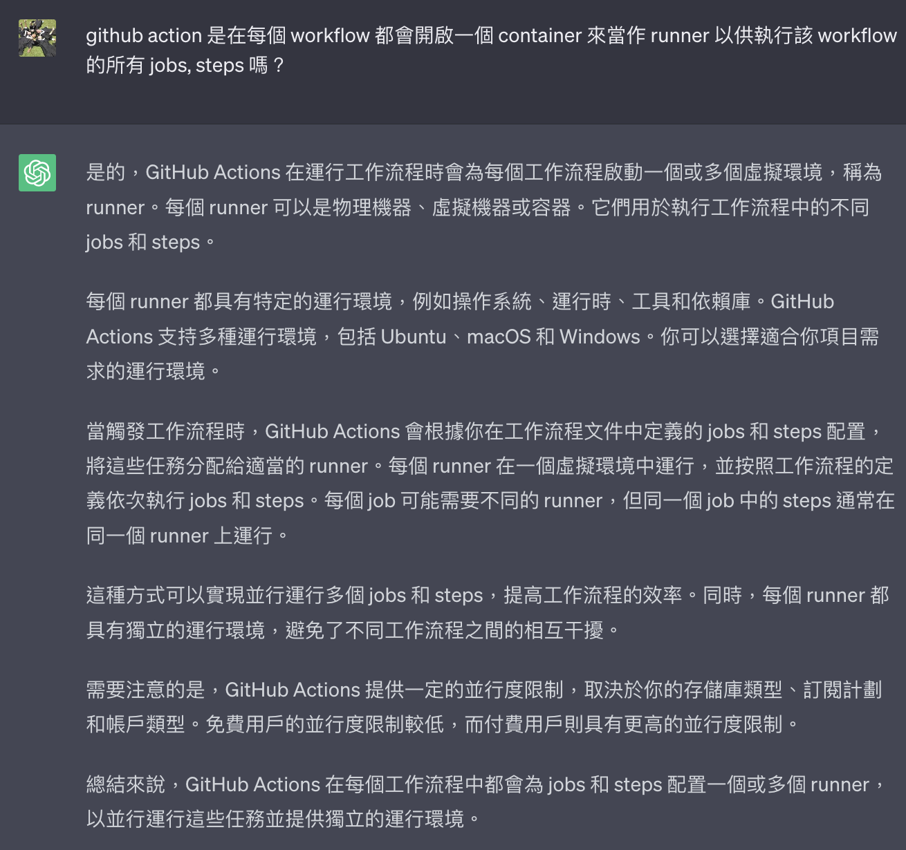

    </details>

  <!-- 其他 -->

  - <details close>
    <summary>其他</summary>

    - 修改 workflow name 之後，所有包括已結束的 action，其 workflow name 的顯示都會改變

    - `.yml` 裡的 shell script 會自動將換行接起來，不需 `\`，也可以使用 `run: |`

      ```yml
      # 第一種
      run:
        echo "1" &&
        echo "2"

      # 第二種
      run: |
        echo "1"
        echo "2"
      ```

    - Github 的 Marketplace 中，有提供開源的 Action，可直接以 `uses:` 來使用

    - muti-platform build 可以無需額外使用 QEMU，但是 QEMU 支援的 platform 還是比較多的。(但其中三個有 Error：linux/mips64,linux/mips64le,linux/riscv64)

    - 可以設定 step id，就可以用 `${{ steps.<step_id>.outputs.<property> }}` 來取得該 step 中的輸出

    - <mark>TODO:Q</mark> 不知為何 .yml 中只設定 build & push，但是 docker hub 上的下載數也有增加

    </details>

  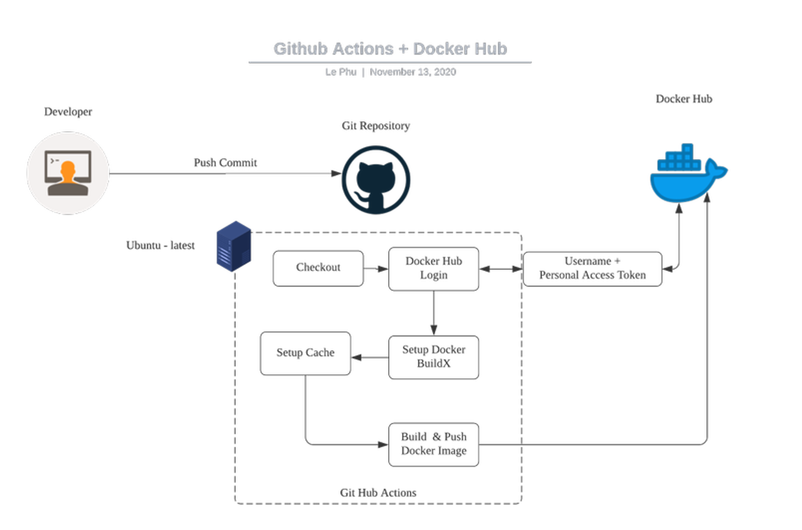
  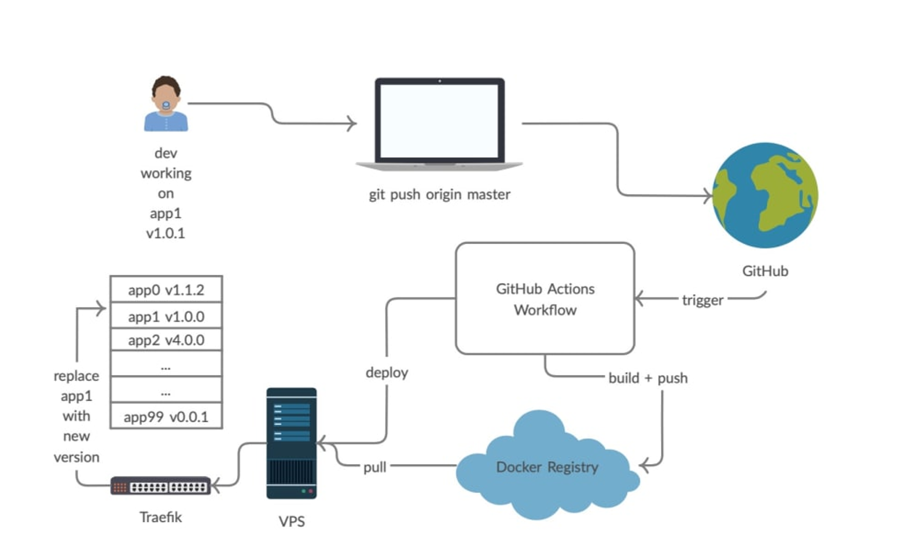

  </details>

## # 問題集中區

<!-- 加入成為 swarm 的新 node 時，背後的網路如何通訊？ -->

- <details close>
  <summary>加入成為 swarm 的新 node 時，背後的網路如何通訊？</summary>

  - <mark>TODO:Q</mark> 使用 `docker swarm join --token <TOKEN> <IP>:<PORT>` 在新主機加入成為 swarm 的新 node 時，背後的網路如何通訊？使用廣播？

  </details>

## # 其他補充

<!-- 注意事項 -->

- 注意事項：

  <!-- 盡量練習新的指令 -->

  - <details close>
    <summary>盡量練習新的指令</summary>

    - 以後版本若要完全捨棄舊版指令時，才不用改一堆腳本
    - EX.`docker container run`取代`docker run`
    - EX.`docker container rm`取代`docker rm`
    - EX.`docker container stop`取代`docker stop`
    - EX.`docker container ls`取代`docker ps`

    </details>

  <!-- 盡量不要用 attach 模式 -->

  - <details close>
    <summary>盡量不要用 attach 模式</summary>

    - 取代方式：使用`-d`detach 模式、`logs`輸出、`exec`開`shell`輸入

      ```shell
      # EX.
      $ docker container run -d image_name
      $ docker container logs container_name
      $ docker container exec -it container_name shell_name
      ```

    - attach 很難關掉：有些情況`ctr+p ctr+q`沒作用，`ctr+c`之後又會把 container stop

    - 使用 exec 開 shell 輸入，才不會影響到 container 原本的運作 (EX. 使用 exit 時，只是關閉該 shell)

    </details>

  <!-- 盡量不要設定為 root user -->

  - <details close>
    <summary>盡量不要設定為 root user</summary>

    <!-- 風險：`container root` 搭配 `Volume` 就可以擁有 `本機 root` 權限 -->

    - <details close>
      <summary>風險：<code>container root</code> 搭配 <code>mount</code> 就可以擁有 <code>本機 root</code> 權限</summary>

      - 因為 docker demaen 是 root 在運行
      - 但應該得用 `rootless` 才能真正解決，但將 container 內部設成其他 user 能有雙重保險 (避免自己犯錯)

      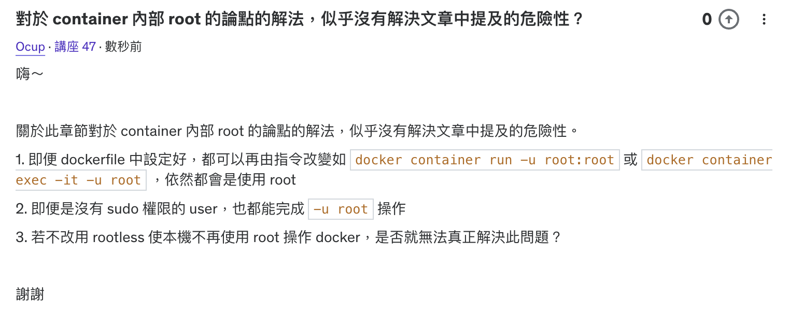

      </details>

    <!-- 設定方式： -->

    - <details close>
      <summary>設定方式：</summary>

      - 可在 dockerfile、container run 中設定
      - 設定內部 user UID 時，也要符合外部的 user

      </details>

    </details>

<!-- 小技巧 -->

- 小技巧：

  <!-- docker image rm $(docker images -q) -->

  - <details close>
    <summary><code>docker image rm $(docker images -q)</code></summary>

    </details>

  <!-- scratch：空的 image -->

  - <details close>
    <summary>scratch：空的 image</summary>

    - 不能 `pull`，可用在搭建 base image 時，由 `FROM scratch` 開始

    </details>

  <!-- Alpine Linux -->

  - <details close>
    <summary>Alpine Linux</summary>

    - 非常輕量的 Linux
    - 常用 Alpine Linux 來當 container 的底層

    </details>

<!-- 小工具 -->

- 小工具：

  <!-- 學習工具 -->

  - <details close>
    <summary>學習工具</summary>

    - [Play with Docker]：UI 操作，快速模擬 docker

    </details>

  <!-- 開發工具 -->

  - <details close>
    <summary>開發工具</summary>

    - [Remote Development]

      - <mark>TODO:</mark> 找時間將此 vscode 套件融入開發使用
      - 使用 docker 建立開發環境，來開發遠端的檔案
      - [參考這節課 6:00](https://www.udemy.com/course/docker-china/learn/lecture/27236572)

    - [Docker Bench Security]

      - 安全性檢查
      - 藉由訪問整個主機中的 docker 的相關檔案，來協助檢查使用 docker 執行環境
      - 須先啟動 container 再進行檢查
      - 並非只檢查個別專案的檔案

      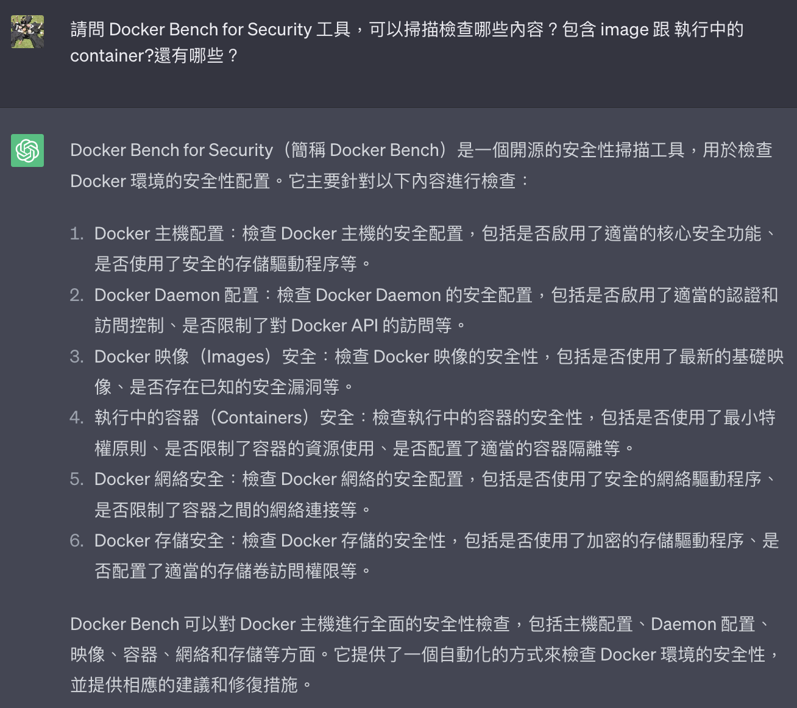

    </details>

<!-- 補充學習 -->

- 補充學習：

  <!-- 文件 -->

  - <details close>
    <summary>文件</summary>

    - [Dockerfile reference]

    </details>

  <!-- 範例研究 -->

  - <details close>
    <summary>範例研究</summary>

    - [學習範本]

    </details>

  <!-- iptables -->

  - <details close>
    <summary>iptables</summary>

    - [鳥哥 iptables]

      

    - [初探 IPTABLES 流動之路 - 以 Docker 為範例]

      

    </details>

  <!-- rootless mode -->

  - <details close>
    <summary>rootless mode</summary>

    - [Docker rootless mode]
    - version 20.10 以上

    </details>

  <!-- 實驗新功能 -->

  - <details close>
    <summary>實驗新功能</summary>

    - [docker manifest]: 可用來查詢 docker hub 上 image 詳細資訊..等等

    - [docker init]: 有一些常用專案類型的初始化模板可用

    </details>

  <!-- NAT -->

  - <details close>
    <summary>NAT</summary>

    - [RedHat NAT Doc]

    </details>

---

## # 踩雷實錄

<!-- 並非可以完全只使用 docker build -->

- <details close>
  <summary>並非可以完全只使用 <code>docker build</code> 取代 <code>buildx</code></summary>

  - [Buildx] 文件中提到，新版本中 `docker build` 會默認使用 `Buildx`
  - 事實上使用 `docker build` 確實是使用 `Buildx` 來進行 biuld 的行為
  - 但是並非可以完全使用 `docker build` 來代替 `docker buildx build` ！！
  - 例如使用 `--platform` 時，只能以 `docker buildx build` 來執行

  </details>

---

## # 延伸討論

<!-- host process VS container process -->

- <details close>
  <summary>host process VS container process</summary>

  - [Host PID of a Process Running in a Docker Container]
    解釋 host process VS container process
  - <mark>TODO:</mark> 照著範例走一次

  </details>

<!-- docker.sock -->

- <details close>
  <summary>docker.sock</summary>

  > [掛載 docker.sock 的用意？] | [Docker Daemon 的 Unix Socket & TCP Socket]

  - <mark>TODO:</mark> 研究哪些情況該用與不用 `docker.sock`
  - <mark>TODO:</mark> 更深入研究 `docker.sock` ＆ `Docker daemon`

  </details>

<!-- docker.socket 跟 docker.service 的關係 -->

- <details close>
  <summary>docker.socket VS docker.service</summary>

  - <mark>TODO:</mark> 研究 docker.socket 跟 docker.service 的關係

  

  </details>

<!-- Docker or Podman -->

- <details close>
  <summary>Docker or Podman</summary>

  - REF：

    - [Don't Panic: Kubernetes and Docker]
    - [Kubernetes 停止支持 Docker 了？]

  - 摘要：

    - CRI (container runtime interface)

      - (2020) 支持 CRI 的 container runtime 只有 `containerd` 跟 `cri-o`

    - k8s kubelet CRI 演進

      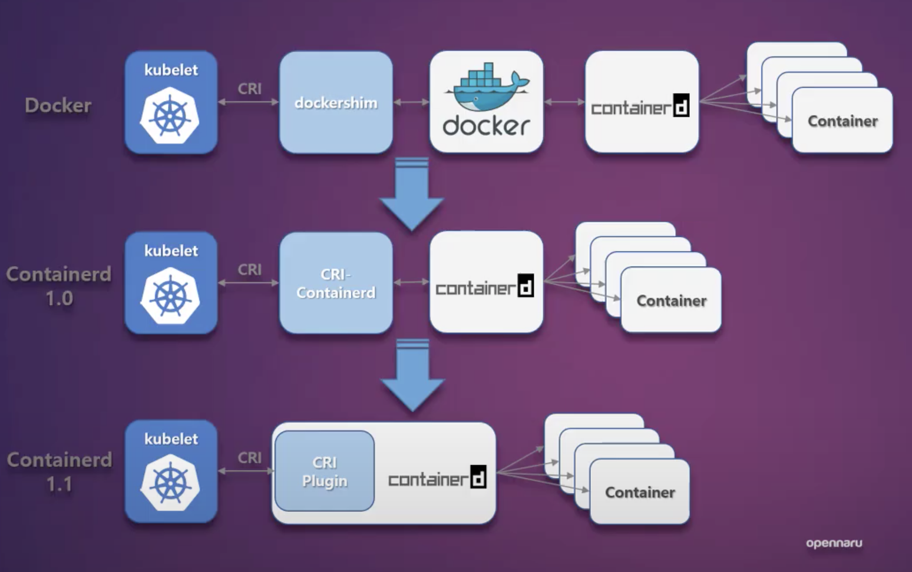

    - k8s 不維護 `dockershim`，dockershim 是 kubelet 與 docker 的 CRI 接口

  </details>

<!-- containerd -->

- <details close>
  <summary>containerd</summary>

  - 一個開源的 container runtime
  - docker 即是使用 containerd

  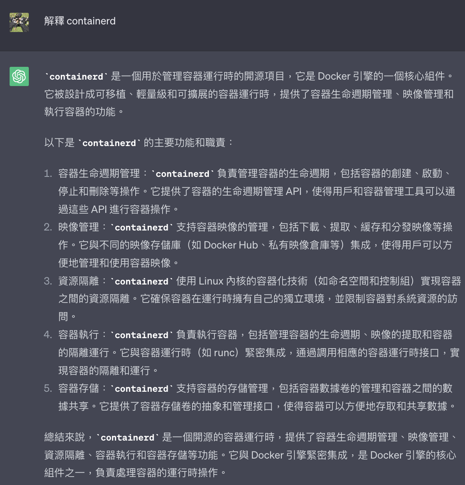

  </details>

---

## <mark>TODO:</mark>

- 再研究 docker version 跟 docker info 裡的資訊
- client-server 的分工
- 研究在 windows 中的 container 中的 ctr+c 不會傳給下一層的問題
- 在 container 的 terminal 中，ctr+c 無法退出 container

  - 因為那個是在 shell 裡頭，ctr+c 無法退出 shell
  - 而在 nginx 中，是用 ctr+c 結束他的 entrypoint

- process 的關係

- 設定不傳 signal 給 container

  - `docker attach --sig-proxy=false 304f5db405ec`
  - https://stackoverflow.com/questions/19688314/how-do-you-attach-and-detach-from-dockers-process

- [七天用 Go 寫個 docker]
- [docker 原始碼？](https://github.com/moby/moby)

  - https://stackoverflow.com/questions/22272401/what-does-it-mean-to-attach-a-tty-std-in-out-to-dockers-or-lxc

- [Docker: What's Under the Hood?]

- 範例研究： `--restart unless-stopped`

- 做一個包含自動補全等齊全功能的環境的 image，方便不斷測試學習使用

- 學習時常用網路指令

  - `ping`, `ip a`, `curl`, `dig`

  - `telnet`

    - 測試 port 的連通性、是否可達
    - `telnet google.com 80`

  - `tracepath` (`traceroute`, windows:`TRACERT.EXE`)

    - 路徑探測追蹤
    - `tracepath google.com`

  - `brctl`

    - 可以查看 bridge 相關訊息
    - `brctl show`

  - `ip route`

    - 查看路由規則
    - 範例

      - 查看順序為 `10.0.1.0/24` --> `172.18.0.0/16` --> `default`

      ```sh
      $ ip route
      default via 172.18.0.1 dev eth1
      10.0.1.0/24 dev eth0 scope link  src 10.0.1.12
      172.18.0.0/16 dev eth1 scope link  src 172.18.0.4
      ```

  - `iptables`

    - 查看 iptable 轉發規則
    - `sudo iptables --list -t nat`
    - `sudo iptables -t nat -nvxL`

- `/etc/resolv.conf`: 存放 DNS Server 的 ip (nameserver)

  - ubuntu: `systemd-resolve --status`
  - mac: `scutil --dns`

- 複習章節： 61, 65, 68, 91, 92, 95,
