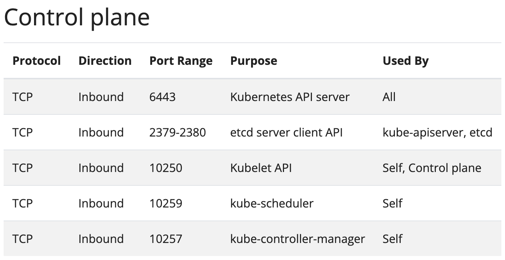

##### <!-- 收起 -->

<!----------- ref start ----------->

[CKA 考試完全指南（2022 版）]: https://www.udemy.com/course/k8s-chinese/
[Play with Kubernetes]: https://labs.play-with-k8s.com/
[kubeadm 官方]: https://kubernetes.io/docs/setup/production-environment/tools/kubeadm/create-cluster-kubeadm/
[Kubernetes Best practices (官方)]: https://kubernetes.io/docs/setup/best-practices/

<!------------ ref end ------------>

# Kubernetes

> DATE: 6 (2023)
> REF: [CKA 考試完全指南（2022 版）] | [Kubernetes Best practices (官方)]

### # 測試環境

- 

  

  

---

### # 簡介

- Container Orchestration：管理編排多個 container 的工具
- Google 在 2015 開源釋出
- 基本架構

  - Kubernets Master (control plane)

    - API Server (kubectl)
    - etcd (/etc distributed)：分散式鍵值存儲系統
    - Controller Manager
    - Scheduler

  - Worker Node

    - Kubelet：管理該 Node 的 Pod
    - Kube Proxy：管理該 Node 的 Pod Network
    - Container Runtime (Pod)

  
  

- 集群搭建工具

  - 稱作 cluster deployment tools 或 cluster provisioning tools
  - 用於簡化 K8s 集群的部署和初始化過程，快速建立 Kubernets Master
  - 常用工具選擇比較

    - kubeadm
    - microk8s
    - minikube

    - 我的解讀：microk8s 跟 minikube 只有單節點 Kubernets Master，要多節點需要另外用其他工具來處理。kubeadm 直接包含這部分

    

---

### # 安裝與設定

- kubeadm

  - [kubeadm 官方]

  - Ports & Protocols

    

  -

---

### # 基本操作

---

### # 問題集中區

- 

  

  

---

## # 其他補充

<!-- 注意事項 -->

- 注意事項：

<!-- 小技巧 -->

- 小技巧：

<!-- 小工具 -->

- 小工具：

  <!-- 學習工具 -->

  - 

    
學習工具

    - [Play with Kubernetes]：UI 操作，快速模擬 Kubernetes

    

  <!-- 開發工具 -->

  - 

    
開發工具

    

<!-- 補充學習 -->

- 補充學習：

  <!-- 文件 -->

  - 

    
文件

    

  <!-- 範例研究 -->

  - 

    
範例研究

    

---

## # 踩雷實錄

---

## # 延伸討論

- 

  

  

---
