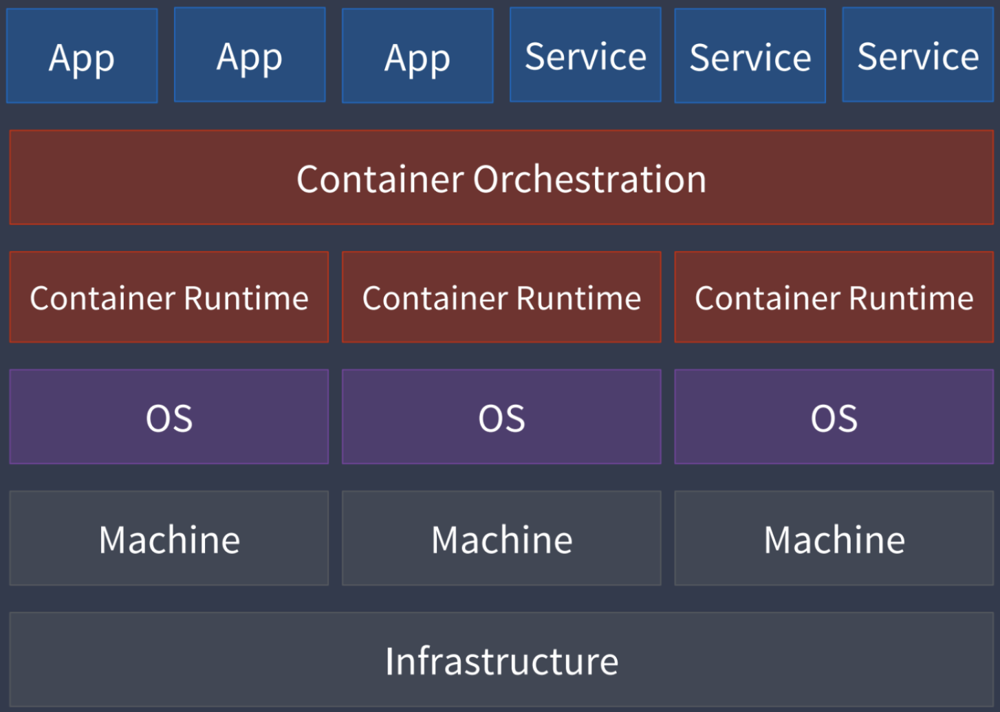
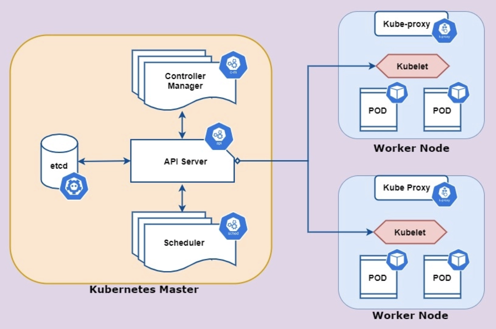
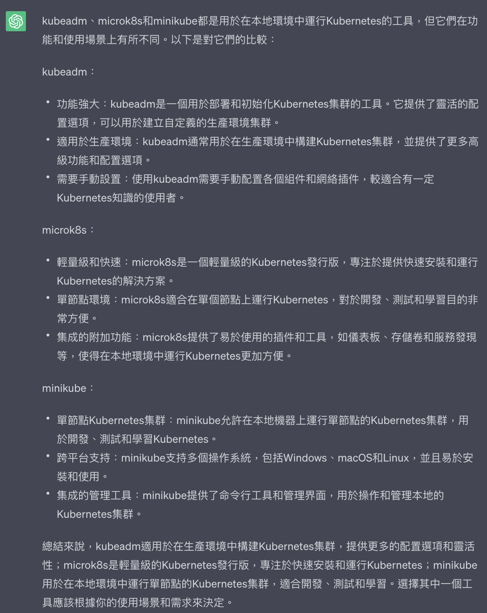
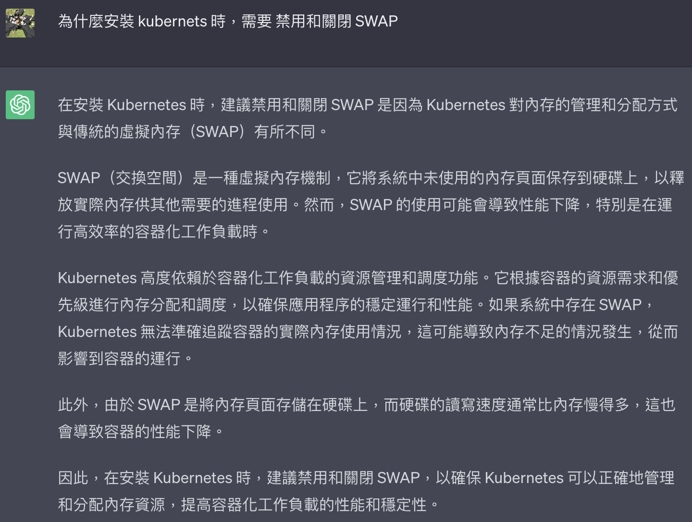
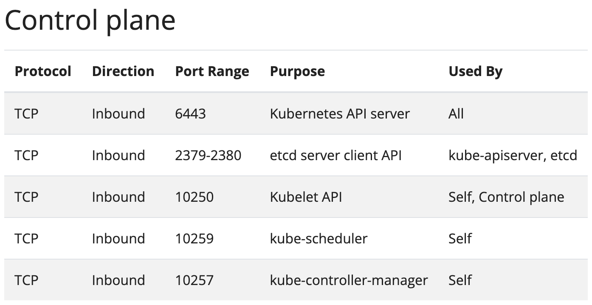
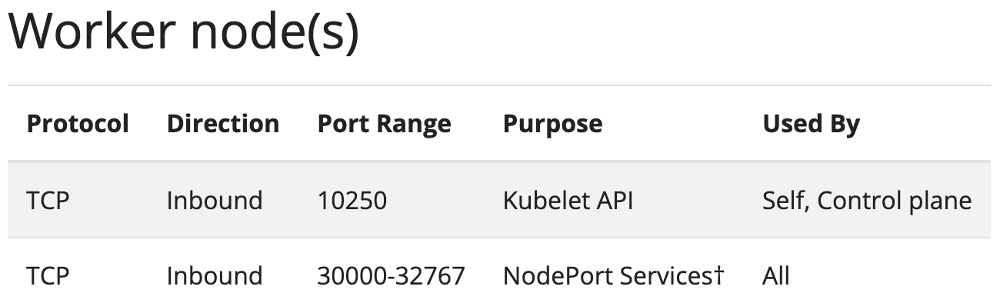
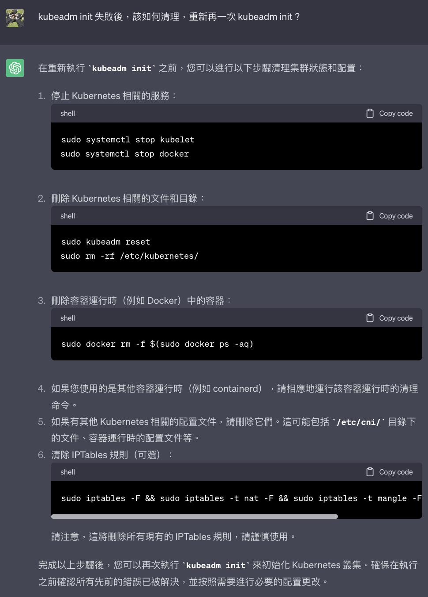
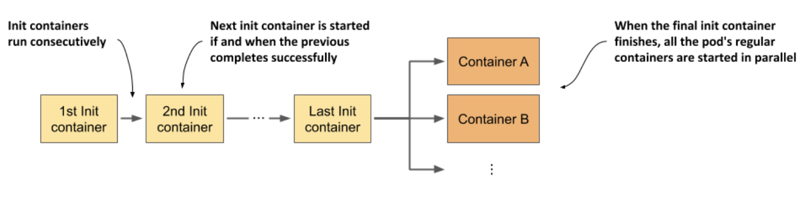
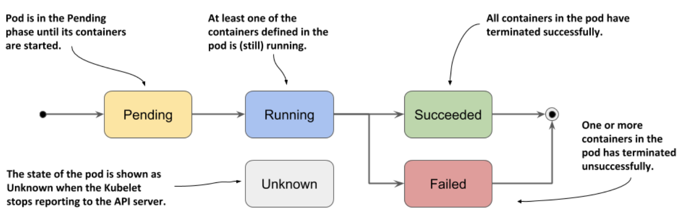

##### <!-- 收起 -->

<!----------- ref start ----------->

[Pod Lifecycle 文件]: https://kubernetes.io/docs/concepts/workloads/pods/pod-lifecycle/#pod-phase
[SIGTERM vs SIGKILL: What's the Difference?]: https://linuxhandbook.com/sigterm-vs-sigkill/
[kubeadm-ha repo]: https://github.com/TimeBye/kubeadm-ha
[Creating Highly Available Clusters with kubeadm]: https://kubernetes.io/docs/setup/production-environment/tools/kubeadm/high-availability/
[K8s 原始碼研究]: https://github.com/Kevin-fqh/learning-k8s-source-code
[Feature Gates]: https://kubernetes.io/docs/reference/command-line-tools-reference/feature-gates/
[Kubernetes: Static Pods]: https://yuminlee2.medium.com/kubernetes-static-pods-734dc0684f31
[Static Pods 文件]: https://kubernetes.io/docs/tasks/configure-pod-container/static-pod/
[鐵人 Static Pods]: https://ithelp.ithome.com.tw/articles/10235803
[Using Static Pods in Kubernetes]: https://www.linkedin.com/pulse/using-static-pods-kubernetes-christopher-adamson-14joc/
[kubeadm init/join and ExternalIP vs InternalIP]: https://medium.com/@aleverycity/kubeadm-init-join-and-externalip-vs-internalip-519519ddff89
[Can we run kubectl form worker/minion node?]: https://stackoverflow.com/q/36078305/13108209
[Why kubectl is required to be installed on every node while setting up cluster using kubeadm?]: https://serverfault.com/questions/1031966/why-kubectl-is-required-to-be-installed-on-every-node-while-setting-up-cluster-u
[［回答］kubeadm init/join 設定 external/internal IPs]: https://github.com/kubernetes/kubeadm/issues/1987#issuecomment-569074463
[10-kubeadm.conf located under different folder]: https://github.com/kubernetes/kubeadm/issues/1575
[Network Policy 插件]: https://kubernetes.io/docs/concepts/cluster-administration/addons/
[Kubectl autocomplete 文件]: https://kubernetes.io/docs/reference/kubectl/cheatsheet/#kubectl-autocomplete
[kubeadm configuration 文件]: https://godoc.org/k8s.io/kubernetes/cmd/kubeadm/app/apis/kubeadm/v1beta2
[CKA 考試完全指南（2022 版）]: https://www.udemy.com/course/k8s-chinese/
[Play with Kubernetes]: https://labs.play-with-k8s.com/
[kubeadm 官方]: https://kubernetes.io/docs/setup/production-environment/tools/kubeadm/create-cluster-kubeadm/
[Kubernetes Best practices (官方)]: https://kubernetes.io/docs/setup/best-practices/
[apt-key is deprecated]: https://itsfoss.com/apt-key-deprecated/
[Linux 如何永久儲存 iptables 的設定？]: https://magiclen.org/iptables-save-permanently/
[K8sGPT]: https://k8sgpt.ai/

<!------------ ref end ------------>

# Kubernetes

> DATE: 6 (2023) , 7 (2024)
> REF: [CKA 考試完全指南（2022 版）] | [Kubernetes Best practices (官方)] | [K8s 原始碼研究]

## # 簡介

- Container Orchestration：管理編排多個 container 的工具
- Google 在 2015 開源釋出
- 基本架構

  - Kubernets Master (control plane)

    - API Server (kubectl)：Server
    - etcd (/etc distributed)：分散式 key-value DB
    - Controller Manager：管理不同的 Controller
    - Scheduler：調度決定 Pod 在哪一個 Node 上運行

  - Worker Node

    - Kubelet：管理該 Node 的 Pod
    - Kube Proxy：管理該 Node 的 Pod Network
    - Container Runtime (Pod)

  
  

- 集群搭建工具

  - 稱作 cluster deployment tools 或 cluster provisioning tools
  - 用於簡化 K8s 集群的部署和初始化過程，快速建立 Kubernets Master
  - 常用工具選擇比較

    - kubeadm
    - microk8s
    - minikube

    - 我的解讀：microk8s 跟 minikube 只有單節點 Kubernets Master，要多節點需要另外用其他工具來處理。kubeadm 直接包含這部分

    

---

## # 安裝與設定

- [參考腳本](../../Vagrant/src/code/sample08-K8s/README.md)

- 安裝 kubeadm

  - [kubeadm 官方]

    - 基於 Debian 和 Red Hat
    - 至少 2GB RAM
    - 至少 CPU 2 核心
    - Node 限制：

      - 需能互連
      - 不能有重複的 Host name、MAC address、product_uuid （尤其是 VM 需要檢查）

        - `/sys/class/dmi/id/product_uuid`

      - 開啟所需 port

        - 用 `netcat` 檢查，EX. `nc 127.0.0.1 6443`

      - 禁用 SWAP

        - SWAP：為記憶體管理技術，當物理記憶體不夠時，能借用一部分硬碟來儲存部分記憶體內容
        - 因為 K8s 就是要用容器化方式來擴展，藉由硬體資訊來判斷如何分配，資源不夠就分配到其他硬體，而無需再用 SWAP 這種技術來緩解，反而使用了 SWAP 會讓 K8s 誤判硬體資源

          

    - 安裝 `CRI- container runtime`、`kubeadm`、`kubelet`、`kubectl`

      - 注意版本相容

    - CGroup Driver

      - `container runtime` 和 `kubelet` 需使用相同的 CGroup Driver

  - 步驟

    - 安裝必須的基本工具

    - 關閉 SWAP

    - 設定 Ports

      - REF: [Linux 如何永久儲存 iptables 的設定？]

      - 所有默認端口都可以重新配置

        
        

      - `iptables` 設定防火牆，以較早設定的為主

        - 因為符合條件後就會按照設定往下一步，所以更後面的設定就不會被經過

        ```sh
        # EX. 先設定 ACCEPT 再設定成 DROP，則為 ACCEPT
        $ sudo iptables -A INPUT -p tcp --dport 22 -j ACCEPT
        $ sudo iptables -P INPUT DROP
        $ sudo iptables -A INPUT -p tcp --dport 22 -j DROP
        $ sudo iptables -L INPUT
        Chain INPUT (policy DROP)
        target     prot opt source               destination
        ACCEPT     tcp  --  anywhere             anywhere             tcp dpt:ssh
        DROP       tcp  --  anywhere             anywhere             tcp dpt:ssh

        # EX. 再將 ACCEPT 刪除後，則為 DROP
        $ sudo iptables -D INPUT 1
        $ client_loop: send disconnect: Broken pipe
        ```

    - 設定所需 Kernel modules

      - 新增在 `/etc/modules-load.d/containerd.conf`
      - `overlay`：提供容器以 overlay 掛載文件系統，從而實現容器之間的隔離和效率
      - `br_netfilter`：用於在容器網絡之間進行橋接和網絡封包過濾

    - 設定 Kernel 網路參數

      - 新增在 `/etc/sysctl.d/kubernetes.conf`
      - 設定使 K8s 可以使用 `iptables` 跟 `ip forward`

    - 加入 apt repo

      - 有兩種方式設定 apt key，但 [apt-key is deprecated]，建議都改成用 `gpg` 自己管理

    - 安裝 containerd

    - 安裝 kubeadm、kubelet、kubectl

    - 調整為使用 `Systemd` 管理 Cgroup (而不使用 cgroupfs)

      - 新版預設也已經改為使用 Systemd
      - 優點：一致、穩定、兼容

    - 鎖定版本，避免自動升級

      - 透過 `apt-mark hold` 可以鎖定版本
      - 使用特定版本的金鑰，更新版本也須記得更新金鑰

  - 安裝後啟動前，此時 kubelet 每隔幾秒就會重啟，因為它陷入一個等待 kubeadm 指令的死循環

- 初始化

  - 步驟

    - `kubeadm init`

      - 快速範例：`sudo kubeadm init --apiserver-advertise-address=192.168.56.10  --pod-network-cidr=10.244.0.0/16`
      - `--apiserver-advertise-address`：設定對外 API 的 ip
      - `--pod-network-cidr`：設定內部 Pod 網域 (cidr: Classless Inter-Domain Routing)
      - 更多選項可改為寫在 config，EX. `sudo kubeadm init --config $CONFIG_FILE`
        - REF: [kubeadm configuration 文件]

    - 配置 kubeconfig

      ```sh
      mkdir -p $HOME/.kube
      sudo cp -i /etc/kubernetes/admin.conf $HOME/.kube/config
      sudo chown $(id -u):$(id -g) $HOME/.kube/config
      ```

    - shell 自動補全

      - REF: [Kubectl autocomplete 文件]

      ```sh
      # EX. Bash 自動補全設定

      source <(kubectl completion bash)
      echo "source <(kubectl completion bash)" >> ~/.bashrc
      ```

    - 部署 Network Policy (CNI) (Flannel、Calico、Weave、Cilium..etc)

      - REF: [CNI 插件]
      - CNI (Container Network Interface)
      - 選擇一個 CNI 插件，按官方說明操作
      - EX. Flannel 適合學習環境

        - 下載 yml 模板進行修改，符合自己的配置

          - 確保 network 與 `–pod-network-cidr` 配置的一致 (EX. `"Network": "10.244.0.0/16"`)
          - 確保 kube-flannel 容器的 args，有 `--iface=enp0s8` (enp0s8 是 `–apiserver-advertise-address` 名稱)

        - `kubectl apply -f flannel.yaml`

    - 將 worker node 加入集群 (cluster)

      - 一樣透過 config：`sudo kubeadm join --config $CONFIG_FILE`
      - 在 master 中輸出 Token & CA 公鑰

        - Token & 公鑰 的搭配，讓 node 可以被驗證加入
        - Token 有時效性，預設為 24h，可自訂時間
        - 也可用 generate 先生成範本，在需要時才創建該 Token

        ```sh
        TOKEN=$(kubeadm token create --ttl 30m)
        PUBKEY_HASH=$(openssl x509 -in /etc/kubernetes/pki/ca.crt -pubkey -noout | \
                    openssl pkey -pubin -outform DER | \
                    openssl dgst -sha256 | \
                    awk '{print $2}')
        ```

  - 初始化時，會自動偵測硬體有沒有符合最低標準，太低則會報錯不做初始化
  - 發生初始化錯誤時，可使用 `sudo kubeadm init --v=5` 來看更詳細錯誤
  - 主要動作：使用 `/etc/kubernetes/manifests` 中的 .yml 來建立 control plane (以一個 static Pods 的形式)

- 踩雷

  - 初始化失敗後，需要手動做許多方面的清理，才能再次 init

    - 此次我主要清了 GPT 所提步驟 1 2 3 5

    

  - `install.sh` 最後步驟安裝 kubelet, kubeadm, kubectl，無法一次成功

    - 因為有修改到 `/etc/apt/sources.list.d/`，使 apt repo 有改變，所以需要再次 `apt update`

    ```sh
    # 錯誤訊息如下
    E: Unable to locate package kubelet
    E: Unable to locate package kubeadm
    E: Unable to locate package kubectl
    E: No packages found
    ```

  - `kubectl version` --> `The connection to the server localhost:8080 was refused - did you specify the right host or port?`

    - 這個問題出在於 master 還沒進行 `kubeadm init`，而 worker node 基本上不需要安裝 kubectl

  - 使用 systemd：`/etc/systemd/system` --> `/usr/lib/systemd/system`

    - REF: [10-kubeadm.conf located under different folder]
    - 新版 10-kubeadm.conf 位址從 `/etc/systemd/system` 改為 `/usr/lib/systemd/system`

  - 設定 Internal IPs 的方法

    - 首選：是用 `--config`
    - 也可配置在 `/usr/lib/systemd/system/kubelet.service.d/10-kubeadm.conf` 中
    - REF:

      - [［回答］kubeadm init/join 設定 external/internal IPs]
      - [kubeadm init/join and ExternalIP vs InternalIP]

  - `detected that the sandbox image "registry.k8s.io/pause:3.8" of the container runtime is inconsistent with that used by kubeadm.It is recommended to use "registry.k8s.io/pause:3.9" as the CRI sandbox image.`

    - REF: [issue1](https://github.com/kubernetes/minikube/issues/18694) | [issue2](https://github.com/kubernetes/kubernetes/issues/125910)
    - 因為 containerd 初始化產生的 `/etc/containerd/config.toml` 配置為 3.8，而 K8s v1.30 下載的預設 image 為 3.9
    - 可能是 linux 的版本影響
    - 暫時解法：修改 `/etc/containerd/config.toml` 為 3.9

---

## # 基本概念

- CNI (Container Network Interface)

  - 由 CNCF（Cloud Native Computing Foundation）管理的開源項目，旨在簡化容器網路管理

- API Server

  - REST API
  - 將一切都視為 API Object 形式
  - Client/Server 架構 (透過 kubectl、API、其他 client UI 與 server 溝通)
  - 主要操作方式是 Declarative Configuration：先定義好 Manifest 檔案 (YAML/JSON)，再透過 `kubectl apply -f file.yml` 執行

- Static Pods

  - 原理：透過 `Kubelet` 建立的 pod，而不是透過 API Server

  - 行為特性

    - 即使 API Server 故障也不影響
    - 執行中的 kubelet 會定期掃描配置的目錄中的變化 (EX. /etc/kubernetes/manifests)，並維持 Static Pod 與配置同步
    - Kubelet 創建並運行 Static Pod 之後，會自動生成對應的 Mirror Pod，並將其上報到 API Server，因此可用 kubectl 來查看狀態

  - 使用步驟：

    - 查詢所使用的 config

      - `ps -aux | grep kubelet`
      - (EX. `--config=/var/lib/kubelet/config.yaml`)

    - 查詢 Static Pod 的位址

      - `cat /var/lib/kubelet/config.yaml | grep static`
      - (EX. `staticPodPath: /etc/kubernetes/manifests`)

    - 將 Pod 配置檔放置在 staticPodPath 裡

      - `cp pod.yml /etc/kubernetes/manifests/pod.yml`

    - 重啟 kubelet

      - `sudo systemctl restart kubelet.service`

  - 管理方式：

    - 簡介：可使用一個遠端位址，統一管理多台 node 上，相同的 Static Pod
    - 行為特性：

      - Kubelet 改為定時向遠端位址掃描配置檔變化
      - 當遠端機器斷開，執行中的 Static Pod 會繼續運行，直到 Kubelet 再次連上配置檔才會進行更新

    - 設定方式：

      - 在 Kubelet config 加入以下內容 (`/etc/default/kubelet` 或 `/etc/sysconfig/kubelet`)

        ```
        KUBELET_EXTRA_ARGS="--cluster-dns=10.254.0.10 --cluster-domain=kube.local --manifest-url=<manifest-url>"
        ```

      - 重啟 kubelet

        ```sh
        sudo systemctl daemon-reload
        sudo systemctl restart kubelet
        ```

  - 適用情境

    - 搭建完成 API Server 前的前置作業 (scheduler、controller-manager、etcd)
    - 特別需求需要 node 上 kubelet 的 fs 權限來完成
    - 需要確保高可用性，要能維持在 node 上運作的基礎依賴

  - REF：

    - [Static Pods 文件]
    - [Using Static Pods in Kubernetes]
    - [鐵人 Static Pods]
    - [Kubernetes: Static Pods]

- Init Containers

  - 用來做初始化的 container
  - 按照順序等待單一個 Init Container 執行結束，才會進入下一步驟
  - 若是一個不會執行完畢的任務，則會停在那個階段，不會進行下一步驟
  - 所有 initContainers 都執行結束，才會執行 containers (containers 會同步執行所有 container)

  

  - **注意** 與 Sidecar 的差異：設定 `restartPolicy: Always` 的 Init Container

- Sidecar Container

  - `v1.29beta` 後，[Feature Gates] 已預設 `SidecarContainers=true`
  - 使得 Init Container 設定 `restartPolicy: Always` 後，成為一個 Sidecar Container
  - 將可以在整個 life cycle 中持續運行
  - 在主要 Containers 都關閉後，Sidecar Container 才進行關閉

- Pod Lifecycle

  - REF: [Pod Lifecycle 文件]

  - Pod phase

    - Pending：Pod 已被 API Server 接受
    - Running：Pod 已分配到 Node、所有容器都已創建、至少還有一個正常啟動或在啟動路上 (可能有失敗的在重試)
    - Succeeded：Pod 的所有容器已成功終止
    - Failed：Pod 中至少有一個容器已失敗
    - Unknown：無法取得 Pod 的狀態

    

  - 行為特性：

    - Pod 本身不會重新自動部署

    - Pod (由 UID 定義) 永遠不會被 “重新調度” 到不同 Node；但可以被新的、幾乎相同的 Pod 替代

    - 替代 Pod 的 `.metadata.name` 可以相同，但 `.metadata.uid` 會不同

    - 執行 `kubectl delete pod`，kubelet 收到通知，首先會發送 `SIGTERM` 給 container，在 `grace period Timer` 超過後還沒完成終止才發送 `SIGKILL`

    - `Kubernetes 1.27 up`，kubelet 會在刪除 regular Pod 前更新狀態為 terminal phase (Failed/Succeeded)，確保最終狀態被記錄。隨後，kubelet 向 API Server 發送刪除請求，完成 Pod 的刪除操作

    - 由 API Server 將 Pod 標記為 Failed 後，超過 `podEvictionTimeout` (預設 5 min) 才會真的從 API Server 刪除

  - container states (Waiting -> Running -> Terminated)

  - 相關參數：

    - `terminationGracePeriodSeconds`

      - 預設 30
      - 設定 grace period Timer

    - `restartPolicy`

      - 預設 Always (Always、OnFailure、Never)
      - exponential backoff delay (10s, 20s, 40s, …)，上限 300s
      - 有任何 container 進入 backoff 時，pod 狀態為 `CrashLoopBackOff`

    - `--force` + `--grace-period=0`

      - 確保執行強制刪除，兩者一起使用
      - `--force`：立刻從 API Server 上的紀錄移除
      - `--grace-period=0`：kubelet 會立刻發送 SIGKILL 給容器 (略過 SIGTERM)

    - `postStart` & `preStop`

      - container hook
      - `postStart`：Running 後執行
      - `preStop`：Terminated 前執行

    - `readinessGates`：可自訂義狀態

  - SIGTERM vs SIGKILL

    - SIGTERM：進行正常終止程序
    - SIGKILL：直接砍掉
    - REF: [SIGTERM vs SIGKILL: What's the Difference?]

  - 舉例

    - 若沒有設定好處理 SIGTERM 的 container，則會直接等到 grace period Time 結束，被 SIGKILL
    - nginx vs busybox：nginx 有處理，busybox 沒處理，所以 nginx 很快處理完則可以完成終止

## # 基本操作

- kubectl

  - `dry-run`

    - 可以演練執行，分為在 Server-side/Client-side 兩種
    - Server-side：測試在該 Server 環境是否可執行

      - EX. `kubectl apply -f config.yml --dry-run=server`

    - Client-side：測試在書寫格式上是否正確

      - 也可用來將指令配置輸出成配置檔
      - EX. `kubectl run web --image=nginx --dry-run=client -o yaml > nginx.yml`

  - `diff`

    - 可以將指定配置檔 (EX. new-file.yml)，與集群中當前運行的配置做比對
    - 可以預先得知該配置檔是否能在當前環境執行 (EX. 有些配置與運行中的配置有衝突，若沒有先移除可能無法執行)
    - EX. `kubectl diff -f new-file.yml`

  - `-v`

    - 可以查看到指令使用 API 的細節
    - 1~10 不同等級，數字越高回傳越多訊息
    - 常用 `-v=6`

  - `proxy`

    - 用於在本地創建一個 HTTP 代理，允許用戶通過這個代理訪問 K8s API Server (方便開發，因為 proxy 自動處理好驗證內容，而可以直接在本地 call API)
    - 默認只有綁定 localhost
    - `--address`：指定代理綁定的網路接口位址
    - `--accept-hosts`：設置允許的主機名或 IP 通過代理訪問 K8s API Server

    ```sh
    # EX. 1 允許 192.168.55.10:8080

    $ kubectl proxy --address='192.168.55.10' --port=8080 --accept-hosts='192.168.55.10' &

    # EX. 2 允許所有接口的 8080

    $ kubectl proxy --address='0.0.0.0' --port=8080 --accept-hosts='^.\*$' &
    ```

  - `get`、`describe`、`-watch`、`config get-context`、``

---

## # 問題集中區

<!-- 哪些 node 需要安裝 kubectl -->

- <details close>
  <summary>哪些 node 需要安裝 kubectl</summary>

  - REF:

    - [Why kubectl is required to be installed on every node while setting up cluster using kubeadm?]
    - [Can we run kubectl form worker/minion node?]

  </details>

<!-- iptables 配置回頭再更詳細研究 -->

- <details close>
  <summary>iptables 配置回頭再更詳細研究</summary>

  </details>

---

## # 其他補充

<!-- 注意事項 -->

- 注意事項：

  - 注意規範命名規則 (EX. pod name 不能大寫)

<!-- 小技巧 -->

- 小技巧：

  - 查 log：`sudo journalctl -u kubelet -f`

<!-- 小工具 -->

- 小工具：

  <!-- 學習工具 -->

  - <details close>
    <summary>學習工具</summary>

    - [Play with Kubernetes]：UI 操作，快速模擬 Kubernetes

    </details>

  <!-- 開發工具 -->

  - <details close>
    <summary>開發工具</summary>

    - [K8sGPT]

    </details>

<!-- 補充學習 -->

- 補充學習：

  <!-- 文件 -->

  - <details close>
    <summary>文件</summary>

    </details>

  <!-- 高可用 kubeadm 的搭建 -->

  - <details close>
    <summary>高可用 kubeadm 的搭建</summary>

    - [Creating Highly Available Clusters with kubeadm]
    - [kubeadm-ha repo]

    </details>

---

## # 踩雷實錄

---

## # 延伸討論

<!-- CGroup Driver -->

- <details close>
  <summary>CGroup Driver</summary>

  - container runtime 和 kubelet 需使用相同的 CGroup Driver
  - 使用不同的會造成哪些問題？

  </details>

---

## # <mark>待整理筆記</mark>

- DaemonSet

- 其他細節

  - 可以將 service 對應的 Pod 刪除，service 還在，但實際上沒東西在跑
  - 將 Pod 運行的 node 關機，並不會自動改到其他 node 上運行？
  -
