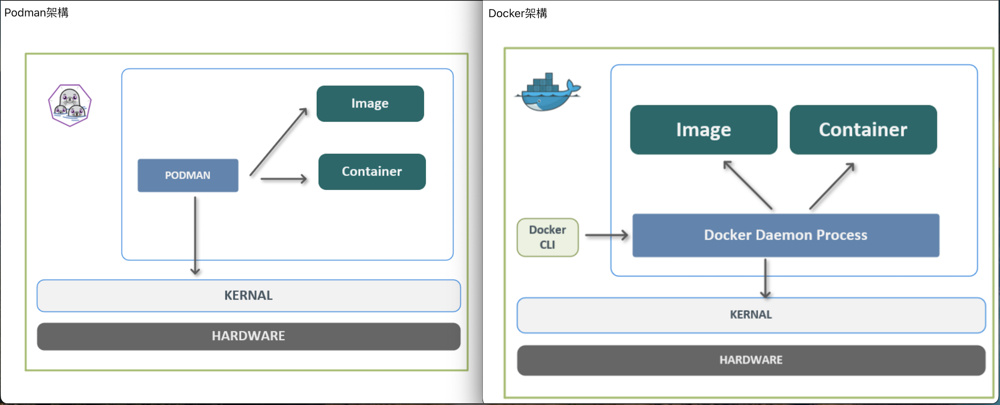
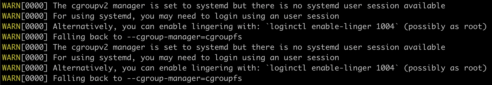
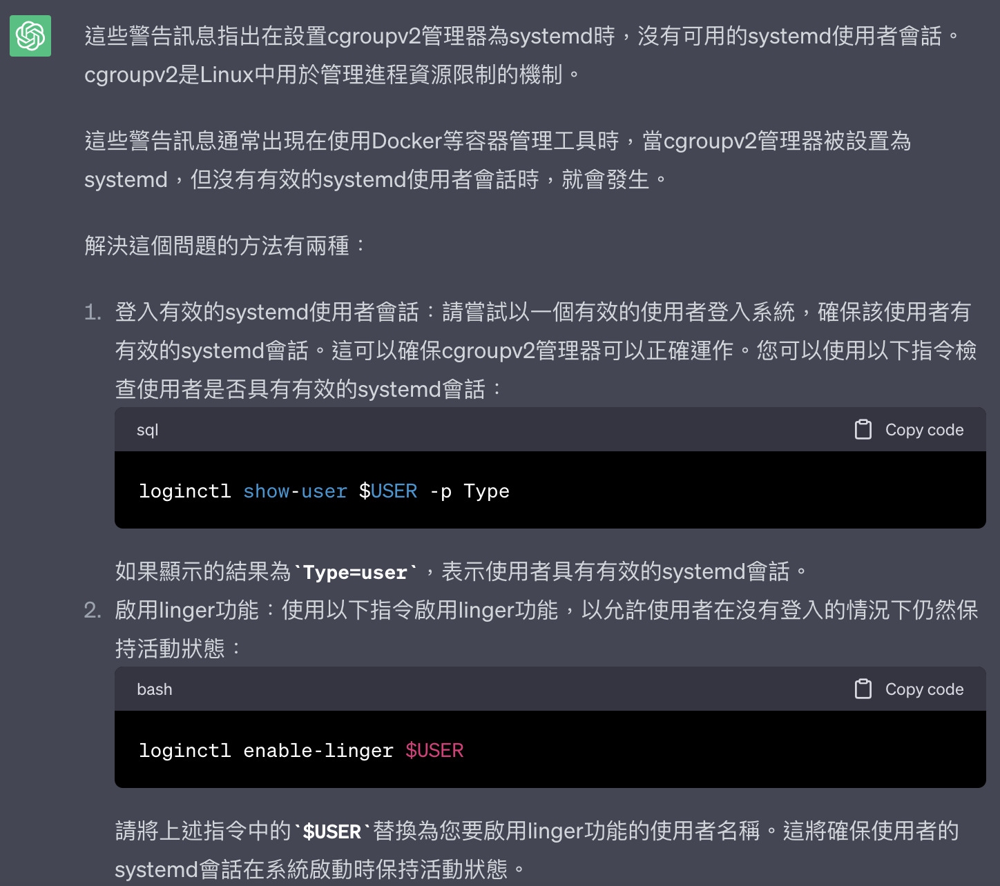

##### <!-- 收起 -->

<style> 
.imgBox{
  display: flex; 
  flex-direction: column; 
  margin: 5%; 
  justify-content: center;
  border: 2px solid black;
}
</style>

<!------------  style  ------------>

<!----------- ref start ----------->

[Podman 官網]: https://podman.io/
[OCI]: https://opencontainers.org/
[Docker rootless mode]: https://docs.docker.com/engine/security/rootless/
[docker 容器技术从入门到精通]: https://www.udemy.com/course/docker-china/learn/lecture/27213604#overview
[課堂筆記]: https://dockertips.readthedocs.io/en/latest/

<!------------ ref end ------------>

# Podman

> DATE: 5 (2023)
> REF: [Podman 官網] | [Docker 容器技术从入门到精通] | [課堂筆記]

## # 簡介

- 符合 [OCI] 標準容器的容器引擎
- Red Hat 推出的開源軟體
- Daemon-less
- Root-less （新版 Docker 也有：[Docker rootless mode]）



## # 安裝與設定

- Ubuntu 20.10 之後的版本才有 podman

## # 問題集中區

## # 其他補充

<!-- 注意事項 -->

- 注意事項：

  - <details close>
    <summary></summary>

    </details>

<!-- 小技巧 -->

- 小技巧：

<!-- 小工具 -->

- 小工具：

<!-- 補充學習 -->

- 補充學習：

---

## # 踩雷實錄

<!-- search 無結果 -->

- <details close>
  <summary>search 無結果</summary>

  - 需在 `/etc/containers/registries.conf` 檔案中，設定 `unqualified-search-registries`
  - EX. `unqualified-search-registries = ['docker.io']`，則可以搜尋到 `docker.io` 上的 image，同理也須設定其他的 registry 才會有該結果
  - 常用的 registry 有：["docker.io", "quay.io", "gcr.io", "registry.redhat.io"]

  </details>

<!-- 切換 user 問題 -->

- <details close>
  <summary>切換 user 問題</summary>

  <!-- 解決過程 -->

  - <details close>
    <summary>解決過程</summary>

    <!-- 直接以 `su demo` 切換，執行 podman 會出錯： -->

    - <details close>
      <summary>直接以 <code>su demo</code> 切換，執行 podman 會出錯：</summary>

      - 此為 `cgroup` 的問題

      ```sh
      ERRO[0000] XDG_RUNTIME_DIR directory "/run/user/1000" is not owned by the current user
      ```

      </details>

    <!-- 改用 `su -l demo` 切換來解決 -->

    - <details close>
      <summary>改用 <code>su --login demo</code> 切換來解決，作用如下</summary>

      - 加載 demo 的環境變量

        - EX. .bash_profile、.bashrc、.profile 所定義

      - 切換到 demo 主工作目錄 (home)

      - 啟動 demo 的默認 shell

        - 使所有的 shell 初始化腳本被執行 (EX. .bashrc、.profile)
        - 並模擬用戶從頭開始登錄的狀態

      </details>

    <!-- `su --login demo`，遇到以下問題 -->

    - <details close>
      <summary><code>su --login demo</code>，遇到以下問題</summary>

      

      </details>

    <!-- 以 `loginctl enable-linger $USER` 來開啟 linger 解決 -->

    - <details close>
      <summary>以 <code>loginctl enable-linger $USER</code> 來開啟 linger 解決</summary>

      - 可能是因為沒有真正登入到 demo，而是在 ocup 切換到 demo 的關係
      - 因為當登入 ocup 時，無需開啟 ocup 的 linger，也不會有 error

      

      </details>

    </details>

  <!-- 相關名詞簡介 -->

  - <details close>
    <summary>相關名詞簡介</summary>

    <!-- cgroups -->

    - <details close>
      <summary>cgroups</summary>

      - 允許將 process 分組，並對這些組施加資源限制
      - 可達到：資源隔離、資源控制、層次結構、動態調整、統計和監控
      - 資源如：CPU、memory、I/O、網路頻寬..

      </details>

    <!-- su --login -->

    - <details close>
      <summary>su --login</summary>

      - 讓 su 啟動一個全新的登錄會話，並模擬用戶登錄時的環境，包括加載用戶的環境變量、配置文件等

      </details>

    <!-- linger -->

    - <details close>
      <summary>linger</summary>

      - 允許普通用戶在沒有活躍登入會話的情況下保持他們的 systemd 服務啟動

      </details>

    </details>

  </details>

---

## # 延伸討論

- <details close>
  <summary></summary>

  </details>

## <mark># TODO: 待整理</mark>

- Root-less

  - 因為不在 root 執行，所以會有一些**權限**不同

    - EX. 不能使用 1024 以下的 port

  - image & container 都是在個別 user 中

    - <mark>TODO:Q</mark> 使用多個 user，則要好幾份 image 佔空間，該怎麼處理？會有什麼使用時機會需要在不同 user 中，使用同一個 image 嗎？

- 可直接建立 pod

  - 在同一個 pod 等於在同一個 `Network namespace`

    - EX. 同一個 pod 中的所有 container 會有一樣的 ip
