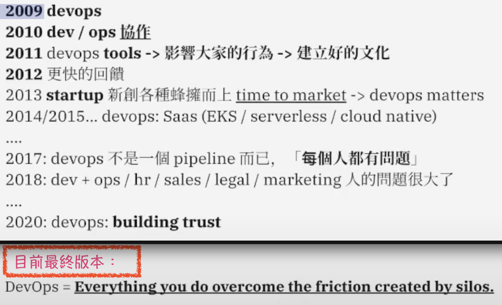

##### <!-- 收起 -->

<!----------- ref start ----------->

[DevOps ｜水球潘]: https://youtu.be/8PEsi2N1gc4
[Vagrant]: https://youtu.be/4nK_S-mU6_o?list=PLfQqWeOCIH4B6YAEXMr6cx4AfnKNBLbZO
[Ansible]: https://youtu.be/K0e7tjh3NFk?list=PLfQqWeOCIH4BDoRx8lpXXl4hqSD4GSDU5
[Prometheus]: https://prometheus.io/
[LibreNMS]: https://www.librenms.org/
[Zabbix]: https://www.zabbix.com/
[sysdig]: https://sysdig.com/
[Terrascan]: https://blog.devops.dev/security-first-devsecops-empowerment-with-terrascan-0434d365a2ff

<!------------ ref end ------------>

# DevOps

## # 定義

- 

  
Patrick: Everything you do overcome the friction created by silos.

  - DevOps 之父 Patrick 對 DevOps 描述的演進

    

    - REF: [DevOps ｜水球潘]

  

## # 工具

<!-- 環境監控 -->

- 

  
環境監控

  - [LibreNMS]

    

  - [Zabbix]

    

  - [Prometheus]

    

  - [Sysdig]

    

  - [Terrascan]

  

<!-- 系統管理 -->

- 

  
系統管理

  - [Vagrant]

  - [Ansible]

  

