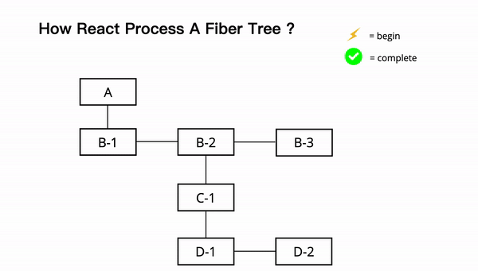
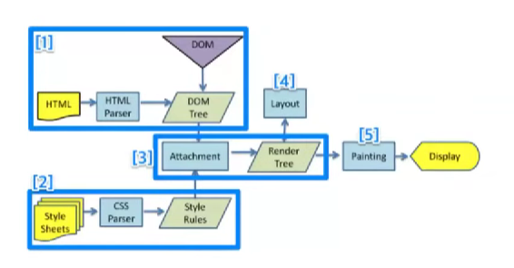
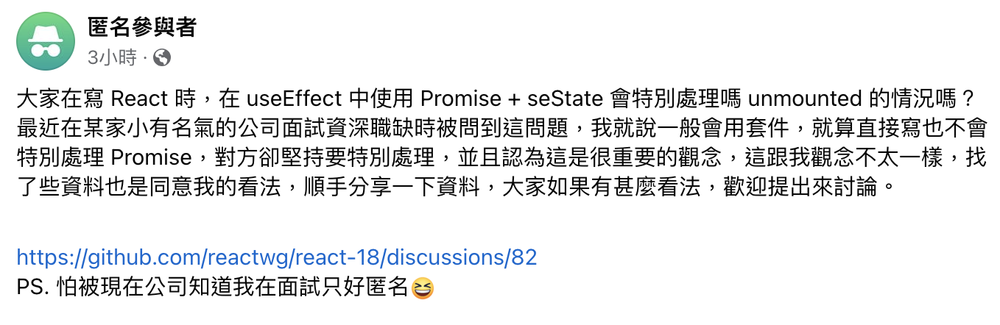

##### <!-- 收起 -->

<!----------- ref start ----------->

[Multipart Namespace Components: Addressing RSC and Dot Notation Issues]: https://ivicabatinic.from.hr/posts/multipart-namespace-components-addressing-rsc-and-dot-notation-issues
[在 useEffect 中使用 Promise + seState 會特別處理嗎 unmounted 的情況嗎？]: https://www.facebook.com/groups/f2e.tw/permalink/8209556222415004/
[Update to remove the "setState on unmounted component" warning]: https://github.com/reactwg/react-18/discussions/82
[React 文件：使用 TypeScript]: https://zh-hans.react.dev/learn/typescript
[《React 思維進化》 筆記系列]: https://medium.com/@linyawun031/react-dom-virtual-dom-與-react-element-af47110e2ec4
[Advanced React Component Design with TypeScript]: https://medium.com/漸強實驗室-crescendo-lab-engineering-blog/advanced-react-component-design-with-typescript-b679b85ad719
[Intersection Observer]: https://developer.mozilla.org/zh-CN/docs/Web/API/Intersection_Observer_API
[Object.is]: https://developer.mozilla.org/zh-CN/docs/Web/JavaScript/Reference/Global_Objects/Object/is
[Rspack]: https://rspack.dev/zh/
[webpack]: https://webpack.docschina.org/concepts/
[Vite]: https://cn.vitejs.dev/guide/
[React Compiler]: https://react.dev/learn/react-compiler
[Bundlephobia]: https://bundlephobia.com/
[簡化模擬 useState 行為]: ../src/code/useStateMock.js
[The Rules of React]: https://gist.github.com/sebmarkbage/75f0838967cd003cd7f9ab938eb1958f
[各種格式轉換]: https://transform.tools/html-to-jsx
[The how and why on React’s usage of linked list in Fiber to walk the component’s tree]: https://angularindepth.com/posts/1007/the-how-and-why-on-reacts-usage-of-linked-list-in-fiber-to-walk-the-components-tree
[In-depth explanation of state and props update in React]: https://angularindepth.com/posts/1009/in-depth-explanation-of-state-and-props-update-in-react
[Inside Fiber: in-depth overview of the new reconciliation algorithm in React]: https://angularindepth.com/posts/1008/inside-fiber-in-depth-overview-of-the-new-reconciliation-algorithm-in-react
[YT: React.js Deep Dive]: https://youtu.be/7YhdqIR2Yzo?list=PLxRVWC-K96b0ktvhd16l3xA6gncuGP7gJ
[Why React Context is Not a "State Management" Tool (and Why It Doesn't Replace Redux)]: https://blog.isquaredsoftware.com/2021/01/context-redux-differences/
[react-reconciler]: https://www.npmjs.com/package/react-reconciler
[圖解 React]: https://7km.top/main/macro-structure/
[mini-react 翻譯？]: https://github.com/lizuncong/mini-react
[Introducing the React Profiler]: https://legacy.reactjs.org/blog/2018/09/10/introducing-the-react-profiler.html
[Profile a React App for Performance]: https://kentcdodds.com/blog/profile-a-react-app-for-performance
[React as a UI Runtime]: https://overreacted.io/react-as-a-ui-runtime/
[Getting Closure on React Hooks]: https://www.swyx.io/hooks
[互動式視覺化 React hooks 時間軸]: https://julesblom.com/writing/react-hook-component-timeline
[A (Mostly) Complete Guide to React Rendering Behavior]: https://blog.isquaredsoftware.com/2020/05/blogged-answers-a-mostly-complete-guide-to-react-rendering-behavior/
[Mark's Dev Blog]: https://blog.isquaredsoftware.com/series/blogged-answers/
[React 開發者一定要知道的底層機制 — React Fiber Reconciler]: https://medium.com/starbugs/react-開發者一定要知道的底層架構-react-fiber-c3ccd3b047a1
[state structure]: https://zh-hans.react.dev/learn/choosing-the-state-structure
[React 18 effect 函式執行兩次的原因及 useEffect 常見情境]: https://medium.com/@linyawun031/react-react-18-effect-函式執行兩次的原因及-useeffect-常見情境-2dc65c18b64b
[React 18 新功能之自動批次更新]: https://juejin.cn/post/7153814771937067044
[Learn React 文件]: https://react.dev/learn
[React Profiler]: https://max80713.medium.com/使用-react-profiler-來觀察-react-web-app-的渲染狀況並進行效能優化-bde15fe3d267
[why-did-you-render]: https://segmentfault.com/a/1190000023031115

<!----------- ref end ----------->

# React

> DATE: 8, 9 (2024)
> REF: [Learn React 文件] | [Mark's Dev Blog] | [YT: React.js Deep Dive]

## # 基本概念

<!-- Fiber Tree -->

- <details close>
  <summary>Fiber Tree</summary>

  <!-- REF -->

  - <details close>
    <summary>REF</summary>

    - [React 開發者一定要知道的底層機制 — React Fiber Reconciler]
    - [Inside Fiber: in-depth overview of the new reconciliation algorithm in React]
    - [The how and why on React’s usage of linked list in Fiber to walk the component’s tree]
    - [Fiber Object](../src/code/fiber.types.ts.md)

    </details>

  <!-- 行為特性 -->

  - <details close>
    <summary>行為特性</summary>

    - `Fiber`：An unit of work for React to process
    - 改為 `Fiber`，使 render work 可切分成 `chunks`，因此可加入 `Scheduler` 按照優先程度調配 work 順序，因此也可重做 work，也可丟棄不需要的 work
    - 改變：Stack (recursion) -> `Linked List (workLoop)`。因此可隨時中斷再繼續，也可調整插入優先 work
    - Diff 改用 `heuristic algorithm`，使得 O(n³) -> `O(n)`

    </details>

  <!-- 結構分析 -->

  - <details close>
    <summary>結構分析</summary>

    - 轉換過程：`JSX` -> `React Elements` (tree) -> `Fiber Nodes` (tree)

    - Linked List 指向：`child` 指向第一個子節點，`sibling` 指向下一個兄弟節點，`return` 指向要返回的父節點

    - DFS：`child` -> `self` -> `sibling` (最後可以直接 return 回父節點)

    </details>

  <!-- 其他補充 -->

  - <details close>
    <summary>其他補充</summary>

    - 與以前的 VDOM Tree 結構不一樣，因為現在使用 Fiber object 而稱為 Fiber Tree
      (但其實就是 VDOM 的部分，但有在討論用哪個名詞較為恰當，目前查到的用詞幾乎都是稱呼 VDOM，筆記中我也直接稱為 `VDOM`)

    </details>

  <!-- 圖片說明 -->

  - <details close>
    <summary>圖片說明</summary>

    

    </details>

  </details>

<!-- Rendering -->

- <details close>
  <summary>Rendering</summary>

  <!-- REF -->

  - <details close>
    <summary>REF</summary>

    - [A (Mostly) Complete Guide to React Rendering Behavior]
    - [互動式視覺化 React hooks 時間軸]
    - [In-depth explanation of state and props update in React]

    </details>

  - 一般提到的 Render 是指 Reconciler 的 `render phase`

  <!-- 名詞解釋 -->

  - <details close>
    <summary>名詞解釋</summary>

    <!-- Render -->

    - <details close>
      <summary>Render</summary>

      - 定義：在 React 中指的是製作 VDOM
      - 細節：

        - 也就是會執行一遍 Functional Component 內部的 render logic
        - 沒使用 Hook 優化的計算都會再計算一次
        - 如果 child 的 component type & key 相同，則會直接將計算結果更新在舊有的 Fiber object

      - 解釋：

        - 為了避免與 VDOM Render 搞混，React 官方將 `browser rendering` 稱為 `painting`
        - 而在更新 real DOM 之後，瀏覽器就會重新繪製螢幕，這個過程原本應該稱為 `browser rendering`

      </details>

    <!-- Reconciliation -->

    - <details close>
      <summary>Reconciliation</summary>

      - 定義：re-render 後，VDOM 會先與 last VDOM 做比對，再將差異更新到 real DOM 的過程

      </details>

    </details>

  <!-- 渲染流程 -->

  - <details close>
    <summary>頁面渲染流程</summary>

    - 流程：`Scheduler` -> `Reconciler` -> `Renderer`

    <!-- Scheduler -->

    - <details close>
      <summary>Scheduler</summary>

      - 按照優先程度調配 Reconciler 執行 work 的順序

      </details>

    <!-- Reconciler -->

    - <details close>
      <summary>Reconciler</summary>

      - `render phase`

        - (1)製作 VDOM (2)比較新舊 VDOM 差異
        - 非同步
        - 主要目的：生成 `Fiber Tree` & `Effect List`
        - `Fiber Tree` 生成：JSX -> React Elements (tree) -> Fiber Nodes (tree)

        <!-- re-render 細節 -->

        - <details close>
          <summary>re-render 細節</summary>

          - `workInProgress tree` 生成：每個 node 各自帶有 `side effects` 的 Fiber Tree
          - `Effect List` 生成：workInProgress tree 與 current tree 比較差異，得出需要執行的 side effects 列表 (因而不用再遍歷 Tree)
          - `current tree` 更新：最後將 workInProgress tree 更新到 current tree

          </details>

      - `commit phase`

        - 套用到 real DOM (但不管 browser render 的執行)
        - 同步
        - 執行 side effect：`DOM 操作`、`部分 lifecycle method`
        - 更新 DOM 需要一氣呵成不中斷，才不會造成視覺上的不連貫
        - 此階段也就是更新圖中 DOM Tree 的部分

          

      </details>

    <!-- Renderer -->

    - <details close>
      <summary>Renderer</summary>

      - 負責將變化的元件渲染到各種介面的畫面上

      </details>

    </details>

  <!-- 行為特性 -->

  - <details close>
    <summary>行為特性</summary>

    - `setState`、`dispatch` 後，會先檢查是否為新的 state

    - 確認為新的 state 後，會觸發 queue a re-render，先將狀態更新放進一個 queue

    <!-- 單一事件下會一起只做一次更新 (Automatic Batching：v18 前後為兩種版本) -->

    - <details close>
      <summary>單一事件下會一起只做一次更新 (Automatic Batching：以 v18 前後區分為兩種 作用範圍)</summary>

      - REF: [React 18 新功能之自動批次更新]

      - 作用範圍

        - before：every single `React event`
        - after：every single event loop tick (包含 `setTimeout`、`await` 等等)

      <!-- EX. -->

      - <details close>
        <summary>EX.</summary>

        - before：3 次 render (0 & 1 / 2 / 3)
        - after：2 次 render (0 & 1 / 2 & 3)

        ```js
        const [counter, setCounter] = useState(0)

        const onClick = async () => {
          setCounter(0)
          setCounter(1)

          const data = await fetchSomeData()

          setCounter(2)
          setCounter(3)
        }
        ```

        </details>

      </details>

    - parent 的狀態更新後，整個 parent 底下的 VDOM 都會 re-render
    - re-render 不代表 re-create Fiber object (可能會將計算結果更新 old Fiber object)
    - 如果 child 使用 React.memo()，則會先進行 props 的比較，再決定是否 re-render

    </details>

  <!-- 避免作法 -->

  - <details close>
    <summary>避免作法</summary>

    <!-- 避免在 Component 內部創建其他 Component type -->

    - <details close>
      <summary>避免在 Component 內部創建其他 Component type</summary>

      ```js
      // X 錯誤
      function ParentComponent() {
        function ChildComponent() {}

        return <ChildComponent />
      }

      // O 正確
      function ChildComponent() {}
      function ParentComponent() {
        return <ChildComponent />
      }
      ```

      </details>

    <!-- 避免在 render logic 中 setState -->

    - <details close>
      <summary>避免在 render logic 中 setState</summary>

      ```js
      // X 錯誤
      function Parent() {
        const [state, setState] = useState()
        setState()

        return <Child />
      }

      // O 正確
      function Parent() {
        const [state, setState] = useState()
        const handleClick = () => {
          setState()
        }

        return <Child onClick={handleClick} />
      }
      ```

      </details>

    </details>

  <!-- 其他補充 -->

  - <details close>
    <summary>其他補充</summary>

    - VDOM re-render 在一般情況下都算可接受範圍，而且 React 就是靠著 VDOM re-render 來快速判斷要更改哪些 real DOM 的部分
    - 主要影響效能的在於更改 real DOM
    - 可注意 `<Child />` 與 `{children}` 在 render 上的差異，一些情況可利用 `{children}` 方式避免不必要的 re-render

    </details>

  <!-- 簡易結論 -->

  - <details close>
    <summary>簡易結論</summary>

    - 一般使用情況，re-render 幾乎不影響效能
    - 但應避免濫用導致的不必要的 re-render (EX. useEffect 的濫用)
    - 只在真實感受到效能不好的地方，再針對使用 memo 等做優化

    </details>

  </details>

<!-- Hook -->

- <details close>
  <summary>Hook</summary>

  - REF: [Getting Closure on React Hooks]
  - 底層

    - 實際上，React 將一個 component 所有的 Hook 存為 fiber object 中的一個 linked list
    - 再將整個表層複製到 component 中

  - Hook 是特殊的函數，只在 React 渲染時有效 (Component、Hook)
  - 只在 component 內最頂層的作用域 call Hook

    - Hooks 將始終以相同的順序被呼叫
    - 有利於 Linter 捕捉到大多數錯誤

  </details>

<!-- dependency -->

- <details close>
  <summary>dependency</summary>

  - 行為定義

    - default：每次渲染都執行
    - empty array：僅在元件掛載時執行
    - dependencies：檢查全部都不變，則跳過內部邏輯執行

  - 只能 & 只需 & 必需依賴 `reactive values`
  - reactive values：`props`、`state`、`memo`、`callback`、`parent's ref & setState`..etc (包含從這些值計算而來的值)
  - 透過 [Object.is] 進行比較

  </details>

<!-- `<Child />` vs `{children}` -->

- <details close>
  <summary><code>&lt;Child/&gt;</code> vs <code>{children}</code></summary>

  - `<Child />` 是在 parent 上渲染 Child。`{children}` 則是將渲染好的 children 傳入
  - 因此使用 `{children}` 可以用來分離 state 與 UI，避免 parent 的 state 改變觸發 children 進行不必要的 re-render
  - 當 `{children}` 本身內部進行 re-render 時，因為可以重用 Fiber object，所以也不會造成 parent 不必要的 re-render

  ```js
  // EX. Click 之後，"<Child />" 會 re-render，但 "children" 不會 re-render

  function Parent({ children }) {
    const [state, setState] = useState(0)
    const handleClick = () => setState(state + 1)

    return (
      <>
        <button onClick={handleClick}>Click</button>
        <Child />
        {children}
      </>
    )
  }
  ```

  </details>

<!-- controlled vs uncontrolled component -->

- <details close>
  <summary><code>controlled</code> vs <code>uncontrolled</code></summary>

  - controlled component：狀態由 parent (prop) 控制
  - uncontrolled component：狀態由 self (state 或 DOM) 控制

  </details>

<!-- Effect & Event -->

- <details close>
  <summary><code>Effect</code> vs <code>Event</code></summary>

  - Effect：監聽`狀態改變`，自動做的事

    - EX. 特定頁面渲染時，自動執行的事

  - Event：監聽某個`動作觸發`，執行的事

    - EX. onClick 時觸發的事

  - 衍伸

    - useEffectEvent 則是想在 Effect 中，監聽 "執行 Effect" 這個`動作`時，觸發執行的 Event

  </details>

<!-- Strict Mode -->

- <details close>
  <summary>Strict Mode</summary>

  - REF: [React 18 effect 函式執行兩次的原因及 useEffect 常見情境]

  - React 18 嚴格模式下，會在 `開發模式` 中故意調用兩次 setState、mount 等等，用來檢測是否有不期望的副作用

  - EX. 可看到出現兩次 log

    ```js
    setNumber((n) => {
      console.log(n)
      return n + 1
    })
    ```

  </details>

<!-- 效能優化 -->

- <details close>
  <summary>效能優化</summary>

  - 工具：React DevTools Profiler

    - [Introducing the React Profiler]
    - [Profile a React App for Performance]

  - 參考方向

    - 60 FPS 符合一般人眼需求，此時一幀約為 16 ms，因此若一次 re-render 超過 `16 ms`，則會有體感上的不順暢

  - 其他補充

    - `transform` 可避免 reflow，會直接 repaint，只用 GPU 計算，讓畫面看起來有改變

    <!-- React 針對每一幀的優化的一種做法 -->

    - <details close>
      <summary>React 針對每一幀的優化的一種做法</summary>
      - 一幀：Events -> JS -> rAF -> Layout -> Paint -> rIC
      - 並非每一幀都會執行 rIC，只有在做完前面流程後，還有剩餘的時間才會執行
      - 如果執行了 rIC，需等該 rIC 的 callback 執行結束後才進入下一幀
      - React 將一些高優先級如 animation 放到 rAF，而一些低優先級如 network I/O 放到 rIC

      </details>

  - 注意事項

    - React 在`開發模式`中，運行速度慢很多
    - 絕對渲染時間：不要使用`開發模式`來測量，僅使用`生產模式`做測量

  </details>

---

## # 基本用法

<!-- useState -->

- <details close>
  <summary><code>useState</code></summary>

  <!-- 使用時機 -->

  - <details close>
    <summary>使用時機</summary>

    - 普通變數無法滿足時，才使用 state
    - 需要記憶狀態且觸發 render 的情境

    </details>

  <!-- 行為特性 -->

  - <details close>
    <summary>行為特性</summary>

    - [簡化模擬 useState 行為]
    - 如同一張快照，在同一次渲染過程中不變
    - 同一次事件內，批次處理 (`batching`) 所有 setState

    <!-- setState 若使用函數當參數，此函數稱 `updater function`，執行時會取出新的 state 來處理 -->

    - <details close>
      <summary>setState 若使用函數當參數，此函數稱 <code>updater function</code>，執行時會取出新的 state 來處理</summary>

      ```js
      // EX. updater function: (ms) => ms + 1
      setMyState((ms) => ms + 1)
      ```

      </details>

    </details>

  <!-- 推薦作法 -->

  - <details close>
    <summary>推薦作法</summary>

    - <details close>
      <summary>將<code>相關的</code>盡可能合併為更少的 state</summary>

      ```js
      // X
      const [x, setX] = useState(0)
      const [y, setY] = useState(0)

      // O
      const [position, setPosition] = useState({ x: 0, y: 0 })
      ```

      ```js
      // X
      const [isSending, setIsSending] = useState(false)
      const [isSent, setIsSent] = useState(false)

      // O
      const [status, setStatus] = useState('typing') // 'typing', 'sending', 'sent'
      const isSending = status === 'sending'
      const isSent = status === 'sent'
      ```

      </details>

    - 盡可能將 state 放在 child
    - 狀態提升：將 shared state 往上提，往下傳
    - 透過 `reducer` 來減少「不可能」state (可視作 "組合 state")

    </details>

  <!-- 避免作法 -->

  - <details close>
    <summary>避免作法</summary>

    - 避免對 state 做任何 mutation

    <!-- 避免重複的 state -->

    - <details close>
      <summary>避免重複的 state</summary>

      ```js
      const [items, setItems] = useState(initialItems)
      // X 與 items 重複
      const [selectedItem, setSelectedItem] = useState(items[0])
      // O 只保留必要的
      const [selectedId, setSelectedId] = useState(0)
      ```

      </details>

    <!-- 避免冗餘 -->

    - <details close>
      <summary>避免冗餘</summary>

      - 在渲染期間從 props 或 state 中計算出一些訊息，則不應該再放到該元件的其他 state 中

      </details>

    <!-- 避免過度巢狀 -->

    - <details close>
      <summary>避免過度巢狀</summary>

      - 建議將巢狀結構`扁平化`(`規範化`) ([扁平化範例](../src/code/flat_struct.js))
      - 若情況允許，則用子元件攤平，比較易懂

      </details>

    - 避免在 state 中鏡像 props (除非想防止更新 prop，而此時通常 prop 命名為 initialXX 或 defaultXX)

    </details>

  <!-- 其他補充 -->

  - <details close>
    <summary>其他補充</summary>

    - 將 state 視為變動的部分 -> 可變動的越多，bug 也越易出現
    - "讓你的狀態盡可能簡單，但不要過於簡單"
    - `Single source of truth`：對於每個獨特的狀態，都應該存在且只存在於一個指定的元件中作為 state。這項原則也被稱為擁有 "可信任單一資料來源"
    - REF: [state structure]

    </details>

  </details>

<!-- useReducer -->

- <details close>
  <summary><code>useReducer</code></summary>

  <!-- 使用時機 -->

  - <details close>
    <summary>使用時機</summary>

    - 有太過複雜的 setState 邏輯時，將狀態的邏輯統一寫在 reducer 內，達到`關注點分離`
    - 一整套的 setState 組合 (EX. 一個 action 要對兩個 state 做更新的組合)

    </details>

  <!-- 行為特性 -->

  - <details close>
    <summary>行為特性</summary>

    - `dispatch` 一個 `action` 到 `reducer` 中，依照其中的邏輯進行更新 `state`
    - 透過發送要做的動作，有別於 `useState` 是直接告知要改為哪個 state
    - dispatch (function) / action (object) / reducer (function)

    </details>

  <!-- 推薦作法 -->

  - <details close>
    <summary>推薦作法</summary>

    - 建議使用 `switch / case` 寫法，且都用 `{ }` 包住
    - 維持 pure 寫法
    - 一個有意義的 action，會是組合所有相關 state 的更新，在同一次 dispatch 中進行 (而不是每個 state 分開做 dispatch)

    </details>

  <!-- 避免作法 -->

  - <details close>
    <summary>避免作法</summary>

    - 避免將其他`業務邏輯`也移動到 reducer，而是只放`狀態更新`的邏輯

    </details>

  <!-- 其他補充 -->

  - <details close>
    <summary>其他補充</summary>

    - 命名由來參考 `reduce()`。都是接受 當前狀態 和 action，然後返回 下個狀態
    - 因為獨立在 component 外，所以可以單獨做狀態更新邏輯的`測試`
    - 常與 `context` 搭配使用

    </details>

  </details>

<!-- useContext -->

- <details close>
  <summary><code>useContext</code></summary>

  <!-- 使用時機 -->

  - <details close>
    <summary>使用時機</summary>

    - 多個 component 中需共用 state
    - 多層巢狀 component 的組合

    </details>

  <!-- 行為特性 -->

  - <details close>
    <summary>行為特性</summary>

    - 讓 props 直達目的 component，而不需透過中間層傳遞
    - 更直接知道 props 來源，而不需再一層層追朔
    - 當 state 更新時，取用 state (也就是使用 useContext) 的 child 都會排進 re-render

    <!-- 在同一次 state 更新中，同一個 component 只會進行一次 re-render -->

    - <details close>
      <summary>在同一次 state 更新中，同一個 component 只會進行一次 re-render</summary>

      - EX. 巢狀中可能 (1) parent re-render 觸發 child re-render (2) child 本身也使用 useContext 也觸發 re-render
      - 但因為 parent 觸發的會先進行，此時 child re-render 後將 child 自身的 render queue 也清空了，因此就不會再 re-render 一次

      </details>

    </details>

  <!-- 推薦作法 -->

  - <details close>
    <summary>推薦作法</summary>

    - 用來管理複雜的狀態時，搭配 reducer 使用，會建議將 state & dispatch 分別建立兩個 context
    - 若傳遞的 value 是 object，則需使用 `usememo` 優化
    - 可適時將 (1) provider 包覆下 (2) 使用 `useContext` 下 的第一層 child 進行 `React.memo()` 優化
      (讓只有真的使用 `useContext` 的那些 component 進行 re-render)
      (但依然是只在效能耗費很大情況下使用)

    </details>

  <!-- 避免作法 -->

  - <details close>
    <summary>避免作法</summary>

    - 避免過度使用。在使用之前，先試試 (1)傳遞 props (2)將 JSX 當作 children 傳遞。兩者皆無法滿足才使用 context

    </details>

  <!-- 其他補充 -->

  - <details close>
    <summary>其他補充</summary>

    - 注意 context 並非 狀態管理工具
    - 可搭配客製化 Hook 使用
    - 一般在 Theme、Auth、Route 會使用

    </details>

  <!-- 經驗分享 -->

  - <details close>
    <summary>經驗分享</summary>

    - 使用 context 做全域時，即便在一個有 2000 個 component 的專案中，也不會感受到 re-render 的卡頓

    </details>

  </details>

<!-- useRef -->

- <details close>
  <summary><code>useRef</code></summary>

  <!-- 使用時機 -->

  - <details close>
    <summary>使用時機</summary>

    - 當希望元件「記住」訊息，但不觸發渲染
    - 用於低階 component 內的 DOM
    - 常用來儲存 `timeout ID`、`DOM 元素`、`其他不影響渲染的物件`

      - 呼叫 React 未暴露的瀏覽器 API
      - 當一則資訊僅被事件處理器需要，且更改它不需要重新渲染時

    </details>

  <!-- 行為特性 -->

  - <details close>
    <summary>行為特性</summary>

    <!-- 模擬 useRef 行為 -->

    - <details close>
      <summary>簡化模擬 useRef 行為</summary>

      ```js
      // React 内部
      function useRef(initialValue) {
        const [ref, unused] = useState({ current: initialValue })
        return ref
      }
      ```

      </details>

    - ref 就像是元件的一個不被 React 追蹤的秘密口袋
    - 更新時不會觸發 re-render
    - JSX 上的 `ref` 是 React 的屬性，而非原生 HTML 屬性

    </details>

  <!-- 使用方式 -->

  - <details close>
    <summary>使用方式</summary>

    <!-- 存取 DOM 元素，可以傳遞 `Ref Object` 或 `Callback` -->

    - <details close>
      <summary>存取 DOM 元素，可以傳遞 <code>Ref Object</code> 或 <code>Callback</code></summary>

      <!-- Ref Object -->

      - <details close>
        <summary>Ref Object</summary>

        - EX. `<div ref={myRef}>`
        - React `自動`處理
        - 會將對應的 DOM 元素放入 myRef.current
        - 當元素從 DOM 中刪除時，會將 myRef.current 更新為 null

        </details>

      <!-- Callback -->

      - <details close>
        <summary>Callback</summary>

        - EX. `<div ref={(node)=>{ myRef.current=node }}>`
        - 需要`手動`處理寫入與移除
        - 未知數量的情況下，就得使用 callback

          ```js
          function Component({ items }) {
            const itemsRef = useRef(null)

            const getMap = () => {
              if (!itemsRef.current) itemsRef.current = new Map()
              return itemsRef.current
            }

            const callbackRef = (node) => {
              const map = getMap()
              if (node) map.set(cat, node)
              else map.delete(cat)
            }

            // 未來版本提供的使用方式，如同 useEffect 那樣使用 return
            const callbackRef2 = (node) => {
              const map = getMap()
              map.set(cat, node)

              return () => {
                map.delete(cat)
              }
            }

            return (
              <>
                items.map((item) => <div key={item.id} ref={callbackRef} />)
              </>
            )
          }
          ```

        </details>

      </details>

    <!-- `React.forwardRef()`：用以包住 child，才能讓 ref 往 child 傳遞下去 -->

    - <details close>
      <summary><code>React.forwardRef()</code>：用以包住 child，才能讓 ref 往 child 傳遞下去</summary>

      - React 故意為之，在一般情況阻擋 ref 傳遞。而必須刻意使用 forwardRef

      </details>

    <!-- `useImperativeHandle`：在 child 中，用以指定暴露給外部的 ref 範圍 -->

    - <details close>
      <summary><code>useImperativeHandle</code>：在 child 中，用以指定暴露給外部的 ref 範圍</summary>

      - parent 的 ref 將只是由 useImperativeHandle 建立的 object，而不是 DOM 元素

      ```js
      // EX. 如此 parent 只能 ref 到 input 的 focus()
      const MyInput = forwardRef((props, ref) => {
        const realInputRef = useRef(null)

        useImperativeHandle(ref, () => ({
          focus() {
            realInputRef.current.focus()
          },
        }))

        return <input {...props} ref={realInputRef} />
      })
      ```

      </details>

    </details>

  <!-- 推薦作法 -->

  - <details close>
    <summary>推薦作法</summary>

    - 視為脫圍機制：只用在溝通 React 外系統
    - 用於非破壞性操作 (EX. 聚焦、滾動、測量)
    - 用於`低階`而非高階 component 中，以避免對 DOM 結構的意外依賴 (EX. 在 button 而不要在 page)

    </details>

  <!-- 避免作法 -->

  - <details close>
    <summary>避免作法</summary>

    - 避免在渲染過程中讀取或寫入 ref.current
    - 避免用來更改由 React 管理的 DOM 節點 (EX. ref.current.remove())
    - 如果很大一部分 應用程式邏輯 和 資料流 都依賴 ref，可能需要重新思考使用方式

    </details>

  </details>

<!-- useEffect -->

- <details close>
  <summary><code>useEffect</code></summary>

  <!-- 使用時機 -->

  - <details close>
    <summary>使用時機</summary>

    - 脱危機制：用來跟外部系統互動，用來將元件與 React 以外的系統同步
    - 只能做兩件事：開始同步某些東西，然後停止同步它
    - 用在當只要元件渲染就必需觸發的事件，而不是綁定特定事件的情況

    - 常用情境

      - 元件出現在螢幕上時發送的分析日誌
      - 設定伺服器連線、網路、第三方函式庫
      - 根據 state 控制非 React 元件

    </details>

  <!-- 行為特性 -->

  - <details close>
    <summary>行為特性</summary>

    - 開始同步外部系統：useEffect 內部所寫的就是同步的動作
    - 停止同步外部系統：return 所寫的就是 cleanup 的動作
    - component 卸載時，也會執行最後一次 cleanup

    <!-- dependency 更新，執行順序：`state 更新觸發 re-render` -> `commit to real DOM` -> `useEffect 檢查 dependency` -> `last useEffect cleanup` -> `重新執行 useEffect` -->

    - <details close>
      <summary>dependency 更新，執行順序：<code>state 更新觸發 re-render</code> -> <code>commit to real DOM</code> -> <code>useEffect 檢查 dependency</code> -> <code>last useEffect cleanup</code> -> <code>重新執行 useEffect</code></summary>

      - 有機會在正式環境再用以下範例做一次實驗驗證

        - 因為在官網文件上的 sandbox 執行時，會等 useEffect 執行完成才更新畫面

        ```js
        import { useState, useEffect } from 'react'
        const serverUrl = 'https://localhost:1234'

        function ChatRoom({ roomId }) {
          console.log('render11...')
          const now = performance.now()
          while (performance.now() - now < 5000) {}

          useEffect(() => {
            const connection = createConnection(serverUrl, roomId)
            const now = performance.now()
            while (performance.now() - now < 5000) {}
            console.log('connect...')
            connection.connect()

            return () => {
              const now = performance.now()
              while (performance.now() - now < 5000) {}
              console.log('cleanup...')
              connection.disconnect()
            }
          }, [roomId])

          const now = performance.now()
          while (performance.now() - now < 5000) {}
          console.log('render22...')

          return <h1>歡迎到 {roomId}！</h1>
        }

        export default function App() {
          const [roomId, setRoomId] = useState('general')
          const [show, setShow] = useState(false)
          return (
            <>
              <label>
                選擇聊天室：{' '}
                <select
                  value={roomId}
                  onChange={(e) => setRoomId(e.target.value)}
                >
                  <option value='general'>一般</option>
                  <option value='travel'>旅遊</option>
                  <option value='music'>音樂</option>
                </select>
              </label>
              <button onClick={() => setShow(!show)}>
                {show ? '關閉' : '打開'}
              </button>
              {show && <hr />}
              {show && <ChatRoom roomId={roomId} />}
            </>
          )
        }

        function createConnection(serverUrl, roomId) {
          return {
            connect() {
              console.log('✅ 連接 "' + roomId + '" 房間：' + serverUrl + '...')
            },
            disconnect() {
              console.log('❌ 斷開 "' + roomId + '" 房間：' + serverUrl)
            },
          }
        }
        ```

      </details>

    </details>

  <!-- 推薦作法 -->

  - <details close>
    <summary>推薦作法</summary>

    - 時常優先思考是否不需要 Effect，而是適合其他方法。Effect 被當作最後手段 (`Event` 是執行 side effect 的最佳位置，如 onClick)
    - 程式碼中的每個 Effect 應該代表一個「獨立的同步過程」，但避免將一個內聚的邏輯拆分成多個獨立的 Effects
    - 對每個 Effect 單獨思考，而不是以 component 的生命週期的角度思考
    - 大部分使用上，都會需要指定 cleanup 動作
    - 盡可能少直接使用`原始 useEffect` (應該包成 custom hook)
    - 將不必要或不想要觸發 Effect 的邏輯 (非響應式邏輯) 分離出來 (目前可用 useRef，未來使用 useEffectEvent)

    <!-- 將 Effect 中，不需要呈現在畫面的變數，用 useRef 取代 useState -->

    - <details close>
      <summary>將 Effect 中，不需要呈現在畫面的變數，用 useRef 取代 useState</summary>

      ```js
      // 例如讓按鈕可以清除監聽，需要控制他，但不用畫出他
      function Component() {
        const id = useRef(null)

        const handleClear = () => {
          clearInterval(id)
          id.current = null
        }

        useEffect(() => {
          id.current = setInterval(() => {}, 1000)
          return handleClear
        }, [])

        return <button onClick={handleClear}>Clear</button>
      }
      ```

      </details>

    <!-- Race Condition (競態條件)：用 ignore 來避免非同步產生的覆蓋 -->

    - <details close>
      <summary>Race Condition (競態條件)：用 ignore 來避免非同步產生的覆蓋</summary>

      ```js
      useEffect(() => {
        let ignore = false

        async function startFetching() {
          const json = await fetchTodos(userId)
          if (!ignore) setTodos(json)
        }

        startFetching()

        return () => {
          ignore = true
        }
      }, [userId])
      ```

      </details>

    <!-- Effect 中使用 setState 時，若不需依賴該 state 的情況下，則使用 callback 方式來 setState -->

    - <details close>
      <summary>Effect 中使用 setState 時，若不需依賴該 state 的情況下，則使用 callback 方式來 setState</summary>

      - EX. `setMessages(msgs => [...msgs, receivedMessage])`

      </details>

    </details>

  <!-- 避免作法 -->

  - <details close>
    <summary>避免作法</summary>

    - 避免用來處理「特定的使用者互動」事件 (優先考慮放在 onClick 等地方做處理)
    - 避免自己選擇 dependency，而是將需要的都放進來，把不想要依賴的部分重構

    <!-- 避免將 object 當作 dependency (而是用 obj.property) -->

    - <details close>
      <summary>避免將 object 當作 dependency (而是用 obj.property)</summary>

      - 雖然 parent re-render 本來就會使 child re-render，所以傳入 object prop 也可以。但需注意 child 的 useEffect 等使用 prop 當 dependency 的寫法

      ```js
      // X
      function Component({ props }) {
        useEffect(() => {
          dosomething(props.id, props.name)
        }, [props])
      }

      // O
      function Component({ props }) {
        useEffect(() => {
          dosomething(props.id, props.name)
        }, [props.id, props.name])
      }

      // O
      function Component({ props }) {
        const { id, name } = props
        useEffect(() => {
          dosomething(id, name)
        }, [id, name])
      }
      ```

      </details>

    <!-- 避免用來監聽一個 state 再去更新另一個 state (而是直接寫在 render logic) -->

    - <details close>
      <summary>避免用來監聽一個 state 再去更新另一個 state (而是直接寫在 render logic)</summary>

      - 因為 state 改變就會 re-render，就會重跑一次 rednder logic
      - 若是想減少昂貴的計算，則是用 `useMemo`

      ```js
      // X
      function Component() {
        const [state1, setState1] = useState()
        const [state2, setState2] = useState()

        useEffect(() => {
          setState2(state1 + 1)
        }, [state1])
      }

      // O
      function Component() {
        const [state1, setState1] = useState()
        const state2 = state1 + 1
      }
      ```

      ```js
      // X
      function Component({ items }) {
        const [selection, setSelection] = useState(null)

        useEffect(() => {
          setSelection(null)
        }, [items])
      }

      // O
      function Component({ items }) {
        const [selectedId, setSelectedId] = useState(null)
        const selection = items.find((item) => item.id === selectedId) ?? null
      }
      ```

      </details>

    <!-- 避免用來處理只需在 APP 啟動時做一次的初始化動作 (而是放在 React 之外處理) -->

    - <details close>
      <summary>避免用來處理只需在 APP 啟動時做一次的初始化動作 (而是放在 React 之外處理)</summary>

      - 在 APP 的 root 中執行這些內容，而不要在其他 component 頂層執行
      - 若有需要 React 內的值，則在 APP 的 root 中的 useEffect 中處理一次

      </details>

    <!-- 避免在不適合情境使用 `Effect Chain` -->

    - <details close>
      <summary>避免在不適合情境使用 <code>Effect Chain</code></summary>

      - 面臨問題

        - 造成過多次不必要的 re-render
        - 隨著程式碼不斷擴展，很容易不符合新的需求，且難以調整

      - 推薦方法

        - 在 render logic 做計算
        - 在 event functiion 處理判斷邏輯

      - 適用 Effect Chain 的情境

        - 需要`連動的選單`，才確實適合用 `Effect Chain` (EX. 選了國家，才能列出該國家的城市供選擇)

      </details>

    </details>

  <!-- 其他補充 -->

  - <details close>
    <summary>其他補充</summary>

    - React 中將 `Effect` 名詞用來專指 useEffect 所執行內容，廣義的副作用則稱作 side effect

    - `useLayoutEffect` 是 useEffect 的一個變種，可以在 `repaint` 之前觸發，可讓使用者不會看到畫面的變化，而是直接看到最後結果

    - 不能在 server 中執行 Effect

    </details>

  </details>

<!-- useMemo & useCallback -->

- <details close>
  <summary><code>useMemo & useCallback</code></summary>

  <!-- 使用時機 -->

  - <details close>
    <summary>使用時機</summary>

    - 效能優化
    - 理論上，位於越父層的，越需要使用？

    </details>

  <!-- 行為特性 -->

  - <details close>
    <summary>行為特性</summary>

    </details>

  <!-- 推薦作法 -->

  - <details close>
    <summary>推薦作法</summary>

    </details>

  <!-- 避免作法 -->

  - <details close>
    <summary>避免作法</summary>

    - 避免過早使用 useCallback 和 useMemo 等，而是等到出現效能問題的位置，才進行使用

    </details>

  <!-- 其他補充 -->

  - <details close>
    <summary>其他補充</summary>

    - 分析工具：[why-did-you-render] | [React Profiler]

    </details>

  </details>

<!-- Custom Hook -->

- <details close>
  <summary>Custom Hook</summary>

  <!-- 使用時機 -->

  - <details close>
    <summary>使用時機</summary>

    - 用來將 Effect 與 Component 解耦
    - 用來將關注點分離，使 Component 內部只需關注使用的功能，而不會有雜亂的邏輯
    - 用來將相同狀態更新邏輯，給不同 Component 使用

    </details>

  <!-- 行為特性 -->

  - <details close>
    <summary>行為特性</summary>

    - 共享的是`狀態邏輯`，而不是狀態本身

    </details>

  <!-- 推薦作法 -->

  - <details close>
    <summary>推薦作法</summary>

    - 只用在包裝成具體的高階功能

    <!-- 從建立 Custom Hook `清晰的命名`開始 -->

    - <details close>
      <summary>從建立 Custom Hook <code>清晰的命名</code>開始</summary>

      - 如果想不到一個清晰的名稱，可能 Effect 和 Component 其他邏輯耦合度太高，還沒做好被分離的準備
      - 同步外部系統，應使用系統特定術語，且對熟悉該系統的人清晰即可

      </details>

    - 回傳通常以 object 而不是 array (除了包裝 useState 等，固定格式)

    - 命名格式為 use 開頭、駝峰式

    </details>

  <!-- 避免作法 -->

  - <details close>
    <summary>避免作法</summary>

    - 避免將沒有計劃在內部引用其他 Hook 的函數做成 Hook (而是做成 util)
    - 避免包裝成 useEffect 本身的替代品和「生命週期」的 Hook (EX. 避免使用 useMount)

    </details>

  <!-- 其他補充 -->

  - <details close>
    <summary>其他補充</summary>

    - 隨著時間的推移，大部分 Effect 都會存在於 Custom Hook 內部

    </details>

  </details>

<!-- 其他 -->

- <details close>
  <summary>其他</summary>

  <!-- useSyncExternalStore -->

  - <details close>
    <summary><code>useSyncExternalStore</code></summary>

    - 用來訂閱 React 外部可變的值 (外部 store)

    <!-- 說明範例 -->

    - <details close>
      <summary>說明範例</summary>

      <!-- 原本做法：透過 useEffect 手動訂閱 store，並不理想 -->

      - <details close>
        <summary>原本做法：透過 useEffect 手動訂閱 store，並不理想</summary>

        ```js
        // X
        function useOnlineStatus() {
          const [isOnline, setIsOnline] = useState(true)

          useEffect(() => {
            function updateState() {
              setIsOnline(navigator.onLine)
            }

            updateState()

            window.addEventListener('online', updateState)
            window.addEventListener('offline', updateState)
            return () => {
              window.removeEventListener('online', updateState)
              window.removeEventListener('offline', updateState)
            }
          }, [])

          return isOnline
        }

        function ChatIndicator() {
          const isOnline = useOnlineStatus()
        }
        ```

        </details>

      <!-- 推薦做法：改用 useSyncExternalStore 訂閱外部 store -->

      - <details close>
        <summary>推薦做法：改用 useSyncExternalStore 訂閱外部 store</summary>

        ```js
        // O
        function subscribe(callback) {
          window.addEventListener('online', callback)
          window.addEventListener('offline', callback)
          return () => {
            window.removeEventListener('online', callback)
            window.removeEventListener('offline', callback)
          }
        }

        function useOnlineStatus() {
          return useSyncExternalStore(
            subscribe, // 函數不變，則不會重新訂閱
            () => navigator.onLine, // client 取值方式
            () => true // server 取值方式
          )
        }

        function ChatIndicator() {
          const isOnline = useOnlineStatus()
        }
        ```

        </details>

      </details>

    </details>

  <!-- flushSync -->

  - <details close>
    <summary><code>flushSync</code></summary>

    - 用於使 setState 立即觸發 re-render 後，再執行接下去的程式碼
    - EX. 在單次事件中，setState 後使用 ref 讀取 DOM 元素，必須先觸發 re-render 才能得到新的資訊

    </details>

  <!-- Suspense -->

  - <details close>
    <summary><code>Suspense</code></summary>

    - 當 child 還沒好之前，給一個 loading page 用

    </details>

  <!-- use -->

  - <details close>
    <summary><code>use</code> (future)</summary>

    - 設計用意：讓你之後遷移到最終推薦方式你所需要的修改更少

    </details>

  <!-- useEffectEvent -->

  - <details close>
    <summary><code>useEffectEvent</code> (future)</summary>

    - 定義：在 Effect 中，監聽 `執行 Effect` 這個`動作`時，觸發執行的 Event

    <!-- 使用時機 -->

    - <details close>
      <summary>使用時機</summary>

      - 用來使 Effect 內部可以將不需觸發 Effect 的部分提取出來
      - 將 Effect 中 不需響應 與 需要響應 的部分分離

      </details>

    <!-- 最佳實作 -->

    - <details close>
      <summary>最佳實作</summary>

      - 只在 Effect 中，呼叫用 useEffectEvent 建立的 function
      - 永遠不可傳遞給其他 component / hook
      - 永遠伴隨著使用他的 Effect，兩者視為唯一個組合

      </details>

    <!-- 範例說明 -->

    - <details close>
      <summary>範例說明</summary>

      <!-- 問題：使用上並不希望 theme 改變就重連一次 -->

      - <details close>
        <summary>問題：使用上並不希望 theme 改變就重連一次</summary>

        ```js
        function ChatRoom({ roomId, theme }) {
          useEffect(() => {
            const connection = createConnection(serverUrl, roomId)
            connection.on('connected', () => {
              showNotification('Connected!', theme)
            })
            connection.connect()
            return () => connection.disconnect()
          }, [roomId, theme])
        }
        ```

        </details>

      <!-- 解法：使用 `useEffectEvent`，但還在開發中 -->

      - <details close>
        <summary>解法：使用 <code>useEffectEvent</code>，但還在開發中</summary>

        ```js
        function ChatRoom({ roomId, theme }) {
          const onConnected = useEffectEvent(() => {
            showNotification('Connected!', theme)
          })

          useEffect(() => {
            const connection = createConnection(serverUrl, roomId)
            connection.on('connected', () => {
              onConnected()
            })
            connection.connect()
            return () => connection.disconnect()
          }, [roomId])
        }
        ```

        </details>

      <!-- 替代方案：使用 `useRef` -->

      - <details close>
        <summary>替代方案：使用 <code>useRef</code></summary>

        - 我認為差異點在於寫法較不簡潔，且無法透過現有功能自己包裝出一個模擬的 `useEffectEvent`

        ```js
        function ChatRoom({ roomId, theme }) {
          const onConnectedRef = useRef()

          useEffect(() => {
            onConnectedRef.current = () => {
              showNotification('Connected!', theme)
            }
          }, [theme])

          useEffect(() => {
            const connection = createConnection(serverUrl, roomId)
            connection.on('connected', () => {
              onConnectedRef.current()
            })
            connection.connect()
            return () => connection.disconnect()
          }, [roomId])
        }
        ```

        </details>

      </details>

    </details>

  </details>

---

## # 常用套件

<!-- React Hook Form -->

- <details close>
  <summary>React Hook Form</summary>

  - 行為特性：

    - 將渲染的控制狀態交還給瀏覽器原生，submit 時才更新 react 狀態
    - 因為一般來說，react 不需要知道這些狀態改變，只需要 submit 時再知道結果

  - 差異比較：

    - Formik 則是直接與 react state 做綁定同步

  - 發展簡史：

    - Formik 在更早期開發出來，後來 React Hook Form 才出現，使用量在 2022 出現交叉點
    - 目前 React Hook Form 作法更多人推薦

  </details>

<!-- useSWR、TanStack Query -->

- <details close>
  <summary>useSWR、TanStack Query(React Query)</summary>

  - 專門用來處理 fetch 的套件

  <!-- 在 Effect 處理 fetch，而不使用套件面臨的問題 -->

  - <details close>
    <summary>在 Effect 處理 fetch，而不使用套件面臨的問題</summary>

    - 無法 preload & cache

      - render 後才執行 Effect

    - 需處理 Race Condition

      ```js
      function SearchResults({ query }) {
        const [page, setPage] = useState(1)
        const params = new URLSearchParams({ query, page })
        const results = useData(`/api/search?${params}`)

        function handleNextPageClick() {
          setPage(page + 1)
        }
      }

      function useData(url) {
        const [data, setData] = useState(null)

        useEffect(() => {
          let ignore = false
          fetch(url)
            .then((response) => response.json())
            .then((json) => {
              if (!ignore) {
                setData(json)
              }
            })
          return () => {
            ignore = true
          }
        }, [url])

        return data
      }
      ```

    - 容易造成 network waterfall

      - parent Effect 中 fetch，又再觸發 child re-render，child 中又 fetch 又影響他的 child

    - 無法在 server 執行

      - SSR 則需要等 client render 後才能 fetch

    </details>

  <!-- useSWR vs TanStack Query -->

  - <details close>
    <summary>useSWR vs TanStack Query</summary>

    - useSWR (Stale While Revalidate)：用在小型專案，適合那些需要基本的自動重新驗證（refetch）的專案
    - TanStack Query：用在更複雜專案，擁有更加全面的資料管理解決方案，更複雜的 cache、同步、背景更新 等功能

    </details>

  </details>

---

## # 延伸主題

<!-- TODO:此部分內容長大後可以拆分到新檔案 -->

<!-- Redux -->

- <details close>
  <summary>Redux</summary>

  - REF：[Why React Context is Not a "State Management" Tool (and Why It Doesn't Replace Redux)]

  - React-Redux 僅透過 context 傳遞 Redux store instance，而不是當前 state
  - Mark 觀點：如果在應用程式中超過了 2-3 個與狀態相關的 context，那麼等於重新發明弱版 React-Redux，則該切換到使用 Redux

  - `Redux Toolkit` 提供了工具來簡化 Redux 的開發流程，減少 boilerplate
    - EX. 使用 `createSlice` 自動生成 action 和 reducer
    - 使用 `RTK Query` 甚至可能比使用 context 自己處理，還要少 boilerplate

  </details>

<!-- Next.js -->

- <details close>
  <summary>Next.js</summary>

  </details>

<!-- bundler (打包工具) -->

- <details close>
  <summary>bundler (打包工具)</summary>

  - [webpack]
  - [Vite]
  - [React Compiler]
  - [Rspack]

    - rspack 比較像是 webpack, rollup, esbuild 這類更底層的工具
    - rsbuild 比較像是 vite, CRA, vue-cli
    - rspress（ rspack + react ）

  </details>

<!-- styled-component -->

- <details close>
  <summary>styled-component</summary>

  <!-- 行為特性 -->

  - <details close>
    <summary>行為特性</summary>

    - 基於 props 的動態樣式，styled-components 會生成新的 classname 樣式，但舊有的 classname 也會留著，當下次需要時可以省略重新生成相同的樣式

    </details>

  <!-- 推薦作法 -->

  - <details close>
    <summary>推薦作法</summary>

    <!-- 如果是兩個地方分別用到兩個相近的 styled-component，建議封裝成兩個 styled-component -->

    - <details close>
      <summary>如果是兩個地方分別用到兩個相近的 styled-component，建議封裝成兩個 styled-component</summary>

      - 減少條件判斷
      - 更清晰直觀

      </details>

    <!-- 如果是要動態切換，則應該透過 prop 傳入更新，不要在兩個相近的 styled-component 間切換 -->

    - <details close>
      <summary>如果是要動態切換，則應該透過 prop 傳入更新，不要在兩個相近的 styled-component 間切換</summary>

      - 傳入 prop 只會生成新的 classname 替換
      - 切換兩個 styled-component，則會一直換新的 DOM

      </details>

    </details>

  <!-- `Styled Component` & `Mixin` -->

  - <details close>
    <summary><code>Styled Component</code> & <code>Mixin</code></summary>

    - 用於兩種不同情境，通常會在一個複雜的專案中同時使用

    <!-- Styled Component 用來封裝具體的 UI 元素 -->

    - <details close>
      <summary>Styled Component 用來封裝具體的 UI 元素</summary>

      - 適合樣式和結構相對固定、在應用中經常重用的視覺元素。這樣的基礎元件通常具有一定的結構和行為，可以被擴展和組合

        - 視覺和結構固定
        - 需要封裝行為或邏輯
        - 多次重用
        - 提供擴展接口

      <!-- EX. 封裝基礎元件 -->

      - <details close>
        <summary>EX. 封裝基礎元件</summary>

        ```js
        const BaseButton = styled.button`
          padding: 10px;
          border-radius: 5px;
          font-size: 16px;
          cursor: pointer;
        `

        const PrimaryButton = styled(BaseButton)`
          background-color: blue;
          color: white;
        `
        ```

        </details>

      </details>

    <!-- Mixin 用在多個元件間共享通用的樣式邏輯 -->

    - <details close>
      <summary>Mixin 用在多個元件間共享通用的樣式邏輯</summary>

      - 適合需要靈活應用、且與具體結構、元件不強相關的樣式片段

        - 樣式片段不依賴結構
        - 通用的樣式邏輯
        - 跨元件共享樣式

      <!-- EX. 封裝佈局樣式 -->

      - <details close>
        <summary>EX. 封裝佈局樣式</summary>

        ```js
        const flexbox = css`
          display: flex;
          justify-content: ${(props) => props.justify || 'flex-start'};
          align-items: ${(props) => props.align || 'stretch'};
          flex-direction: ${(props) => props.direction || 'row'};
          flex-wrap: ${(props) => props.wrap || 'nowrap'};
          gap: ${(props) => props.gap || '0'};
        `

        const FlexContainer = styled.div`
          ${flexbox({
            justify: 'center',
            align: 'center',
            direction: 'column',
          })};
        `
        ```

        - 優點

          - 可以先封裝自己的預設
          - 使用一樣的格式
          - 強迫將關於佈局的 css 集中

        </details>

      </details>

    </details>

  </details>

<!-- React wiht TS -->

- <details close>
  <summary>React wiht TS</summary>

  - REF:
    - [Advanced React Component Design with TypeScript]
    - [React 文件：使用 TypeScript]

  </details>

---

## # 問題集中區

<!-- TODO: -->

- 研究將 object state 扁平化後，是否影響效率，還是只有影響 setState 的便利性

  - [src](../src/code/state_struct.js)

---

## # 其他補充

<!-- 注意事項 -->

- 注意事項：

  <!-- 核心思想 -->

  - <details close>
    <summary>核心思想</summary>

    - 渲染過程應保持 pure
    - 萬物皆 Component
    - 資料都是由上往下傳
    - 將 HTML 和 Render logic 耦合在一起
      - 因為在 Web2 時代，主要以 互動性元件 組成，更加適合組成一個整體
      - 反之，應該將無關的 Component 之間互相解耦
      - 反之，應該只將 Render logic 寫在 Component，其他 logic 分離出來
    - declarative UI：不必直接控制 UI，而是描述在每個情況下提供的 UI (不是 imperative UI)

    </details>

  <!-- 容易犯錯 -->

  - <details close>
    <summary>容易犯錯</summary>

    - 避免過度使用 `{...props}`，此時可能需要用其他拆分法 (EX. `{children}`)
    - 必須包裝成單一個 JSX：因為 JSX 實際上被轉為 JS object，而 function 只能 return 一個 object
    - 避免在 render 時才生成 child 的 key (預設就是用 index)
    - 避免 JSX 中 `&&` 左側為數字
      - EX. `{ isShow && <Component /> }`， isShow 不要是數字
    - 避免濫用 useEffect、useMemo、useCallback..等

    </details>

  <!-- 慣例 -->

  - <details close>
    <summary>慣例</summary>

    - Component 必須以大寫字母開頭
    - 透過大小寫來區分 Component & HTML
    - Hook 以 use 開頭命名

    </details>

<!-- 小工具 -->

- 小工具：

  <!-- 格式轉換工具 -->

  - <details close>
    <summary>格式轉換工具</summary>

    - [各種格式轉換]

    </details>

  <!-- 查詢工具 -->

  - <details close>
    <summary>查詢工具</summary>

    - [Bundlephobia]

      - 可查詢模組大小，決定是否用 lazy import 優化

    </details>

  <!-- 設計工具 -->

  - <details close>
    <summary>設計工具</summary>

    - storybook

      - 展示出一個 component 的所有狀態的 view
      - 稱作 "living styleguide" or "storybook"

    </details>

<!-- 補充學習 -->

- <details close>
  <summary>補充學習</summary>

  - [The Rules of React]
  - [React as a UI Runtime]
  - [react-reconciler]
  - [圖解 React]
  - [mini-react 翻譯？]
  - [《React 思維進化》 筆記系列]

  </details>

<!-- 瀏覽器前端補充 -->

- <details close>
  <summary>瀏覽器前端補充</summary>

  - `onScroll`：事件中，只有 onScroll 不會冒泡傳遞
  - `transform`：會直接在 repaint 用 GPU 計算，讓畫面看起來有改變 (建議用以取代直接更改 left、top 等，可避免 reflow)
  - event
    - `e.stopPropagation()`：阻止向上冒泡
    - `e.preventDefault()`：阻止瀏覽器預設的事件行為
    - 捕獲事件對於路由或資料分析之類的程式碼很有用

  </details>

<!-- 其他補充 -->

- <details close>
  <summary>其他補充</summary>

  - 追蹤使用者分析日誌：[Intersection Observer]

  </details>

<!-- 議題探討 -->

- <details close>
  <summary>議題探討</summary>

  <!-- 在 useEffect 中使用 Promise + seState 會特別處理嗎 unmounted 的情況嗎？ -->

  - <details close>
    <summary>在 useEffect 中使用 Promise + seState 會特別處理嗎 unmounted 的情況嗎？</summary>

    

    - Q: [在 useEffect 中使用 Promise + seState 會特別處理嗎 unmounted 的情況嗎？]
    - REF: [Update to remove the "setState on unmounted component" warning]

    - 我的看法：

      - 不處理 component 的 unmount，只要處理 useEffect 的 unmount
      - 處理 useEffect 的 unmount，可避免多次觸發造成的 Race Condition
      - 訂閱通常也只在 useEffect 進行，所以也解決原本沒取消訂閱造成的 Memory leak

    </details>

  - <details close>
    <summary><code>&lt;Card.Body&gt;</code>(X) vs <code>&lt;CardBody&gt;</code>(O)</summary>

    - REF: [Multipart Namespace Components: Addressing RSC and Dot Notation Issues]
    - 結論：推薦使用 `<CardBody />`
    - 原因：`<CardBody />` 才能支援 `Tree Shaking` & `RSC`

      - `Tree Shaking`：打包優化，會將不必要的部分從最終的 bundle 中移除 (`<Card.Body />` 中，Body 會被誤判為未使用)
      - `RSC`(React Server Components)：處理 SSR 的部分 (`<Card.Body />` 會無法被 RSC 解析)

    </details>

  </details>
