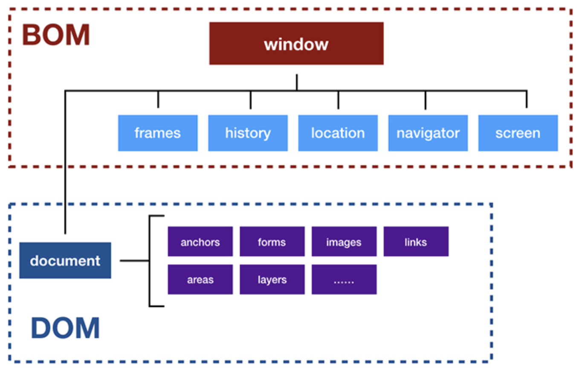
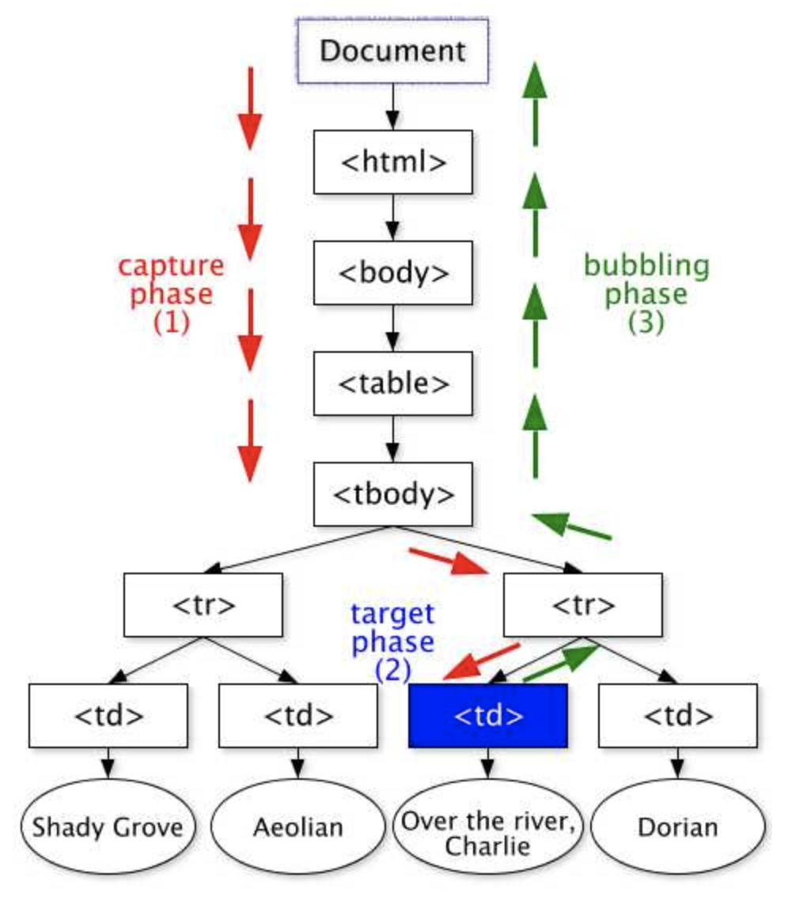

###### <!-- ref -->

[詳解 Canvas 優越效能與實際應用]: https://www.cnblogs.com/powertoolsteam/p/15179350.html
[ithome1]: https://ithelp.ithome.com.tw/articles/10191666
[w3c]: https://www.w3.org/TR/2003/NOTE-DOM-Level-3-Events-20031107/events.html#Events-phases
[非侵入式 javascript]: https://zh.wikipedia.org/wiki/%E9%9D%9E%E4%BE%B5%E5%85%A5%E5%BC%8FJavaScript
[keycode 對照表]: https://gist.github.com/tylerbuchea/8011573
[可用事件]: https://ithelp.ithome.com.tw/articles/10192175
[usesyncexternalstore]: https://betterprogramming.pub/5-new-hooks-in-react-18-300aa713cefe

 <!-- ref -->

# DOM

> DATE: 3 (2022)
> REF: [iThome1]

## 1. 基本介紹

<!-- WIINDOW -->

- <details close>
  <summary>WIINDOW</summary>

  - <details close>
    <summary>Global Object</summary>

    ECMAScript 標準裡的「全域物件」- 在「全域作用範圍」宣告的全域變數無法使用 delete 移除

    ```
    EX.
    var a = 10
    console.log( window.a )   // 10
    delete window.a           // false
    console.log( window.a )   // 10

    window.b = 10
    console.log( window.b )   // 10
    delete window.b           // true
    console.log( window.b )   // undefined
    ```

    </details>

  - JavaScript 與瀏覽器的溝通窗口

  - BOM (Browser Object Model，瀏覽器物件模型)

    - Level 0 DOM
    - 用來溝通瀏覽器(不涉及網頁內容)
    - 瀏覽器各自實作

  - DOM (Document Object Model，文件物件模型)
    - 用來控制網頁內容
    - W3C 制定規範

  <!-- WINDOW 大圖 -->

  

  </details>

<!-- EVENT -->

- <details close>
  <summary>EVENT</summary>

  > DATE: 3 (2022)
  > REF: [W3C]
  > React 18 參考 [useSyncExternalStore]

  1. Capturing Phase (事件捕獲)
  2. Target Phase
  3. Bubbling Phase (事件冒泡)

  ***

  <!-- 阻止事件方法 -->

  - <details close>
    <summary>阻止事件方法：</summary>

    - `event.preventDefault()`：取消元素的預設行為
      (EX. `<a>` 的轉址行為)
    - `event.stopPropagation()`：停止繼續傳遞事件
      (包含 Capture & Bubble)

    </details>

  <!-- 多種 Target -->

  - <details close>
    <summary>多種 Target：</summary>

    - `event.currentTarget` (this)：
      「監聽事件的元素」 --> 觸發「事件」，「事件流」所在元素
    - `event.target`：
      「觸發事件的元素」 --> 觸發「事件流」的元素

    </details>

  <!-- 可用事件 -->

  - <details close>
    <summary>可用事件：</summary>

    > REF: [可用事件]

    - `event.keyCode`：查詢鍵盤按鍵 ([keyCode 對照表])
    - `beforeunload`：跳出對話框詢問使用者是否要離開目前頁面 (關閉瀏覽器就沒用，沒方法阻止)
    - Composition Events：可以觀察使用者在輸入框內開啟輸入法 (Input Method Editor, IME) 時，組字或選字的狀態。(EX. 注音輸入法)

    </details>

  <!-- 事件流 大圖 -->

  

  </details>

## 2. 其他補充

<!-- 注意事項 -->

- 注意事項：

  <!-- HTMLCollection & NodeList -->

  - <details close>
     <summary>HTMLCollection & NodeList</summary>

    - **HTMLCollection：**`getElementsBy**`

      - HTML element 節點

    - **NodeList：**`querySelectorAll`

      - HTML element 節點、文字節點、屬性節點 等

    - 不能使用 Array method，但可以用 index 存取。

    - 內容時效性：

      - 動態：大部分情況下
      - 靜態：`querySelector` & `querySelectorAll`

  </details>

  <!-- Event -->

  - <details close>
     <summary>Event</summary>

    - 一些瀏覽器可能只支援 冒泡事件

    <!-- .addEventListener(click) & .onclick -->

    - <details close>
      <summary>.addEventListener(click) & .onclick</summary>

      - `.addEventListener(click)`：可以重複監聽多個 click
      - `.onclick`：onclick 會被覆蓋。

      </details>

    <!-- 非侵入式 JavaScript -->

    - <details close>
      <summary>非侵入式 JavaScript：</summary>

      > REF: [非侵入式 JavaScript]

      **_(建議這樣嗎？ React 一樣嗎？)_**

      - 將 Javascript 從 HTML 抽離，避免在 HTML 中夾雜一堆 onchange、onclick 等去掛載 Javascript 事件，讓 HTML 與 Javascript 分離

      ```
      // (建議這樣嗎？ React 一樣嗎？?)
      X:
      <button onclick="fn()">Click</button>

      O:
      <button id="btn">Click</button>

      var btn = document.getElementById('btn')
      btn.onclick = fn
      ```

      </details>

    <!-- addEventListener & removeEventListener -->

    - <details close>
      <summary>addEventListener & removeEventListener</summary>

      - 透過 `removeEventListener` 解除時，必須跟 `addEventListener` 綁定同一個 handler「實體」。

      ```
      X: 並未移除事件
      btn.addEventListener('click', ()=>console.log('HI'))
      btn.removeEventListener('click', ()=>console.log('HI'))

      O: 正確移除事件
      const fn = ()=>console.log('HI')
      btn.addEventListener('click', fn)
      btn.removeEventListener('click', fn)
      ```

      </details>

    <!-- onerror -->

    - <details close>
      <summary>onerror</summary>

      - error 事件最適合以 `onerror` 寫在 HTML
      - 原因：若在 load 完成後才註冊 error 事件的 handler，error 事件不會再次被觸發，後來掛上去的 handler 等於沒有一樣。

      ```
      EX.
      
      ```

      </details>

    <!-- Target Phase -->

    - <details close>
      <summary>Target Phase</summary>

      - 抵達 `Target Phase` 後，冒泡與捕抓監聽同時觸發，先監聽者先執行

      </details>

  </details>

<!-- 小工具 -->

- 小技巧：

  <!-- createDocumentFragment -->

  - <details close>
    <summary>createDocumentFragment：一次更改 DOM</summary>

    - 大量變動 DOM 時，使用 `createDocumentFragment`，先在 DocumentFragment 操作，最後再一次更改 DOM，節省 **reflow** 次數。

    </details>

  <!-- 事件指派 -->

  - <details close>
    <summary>事件指派 (Event Delegation)：在父層監聽處理所有子層事件</summary>

    - 避免產生過多監聽且忘記關，造成 memory leak
    - 不必每次新增子層都要再掛監聽
    - `event.target` 會是選中的子層

    </details>

<!-- 補充學習 -->

- <details close>
  <summary>補充學習</summary>

  - [詳解 Canvas 優越效能與實際應用]

  </details>
