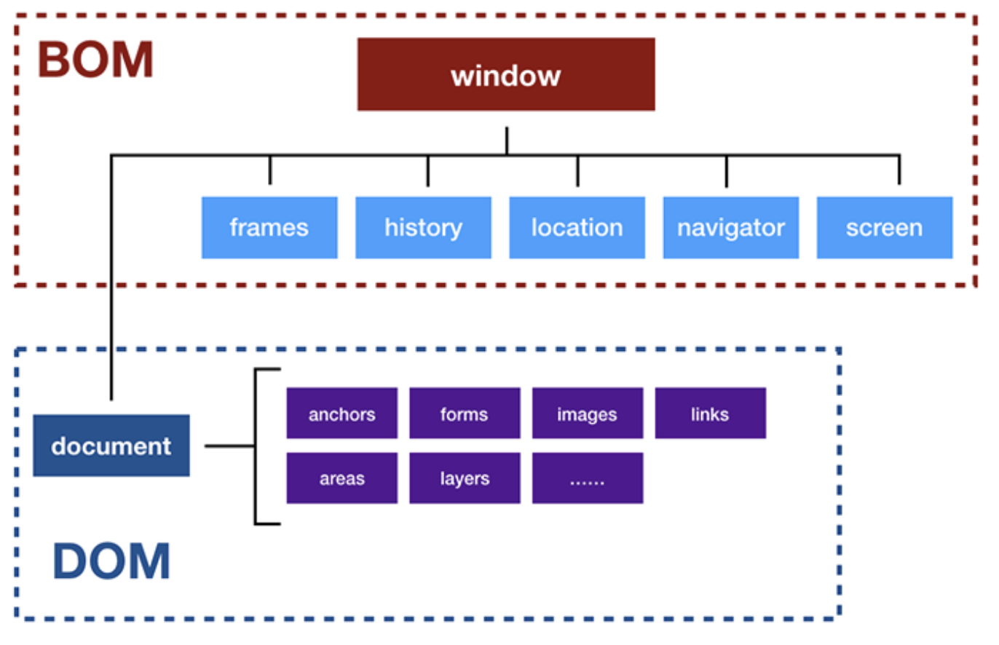

<style> 
.imgBox{
  display: flex; 
  flex-direction: column; 
  margin: 5%; 
  justify-content: center;
  border: 2px solid black;
}
</style>

<!--  style  -->

###### <!-- ref -->

[ithome1]: https://ithelp.ithome.com.tw/articles/10191666

 <!-- ref -->

# DOM

> DATE: 3.2022
> REF: [iThome1]

- WIINDOW

  - ECMAScript 標準裡的「全域物件」 (Global Object) - 在「全域作用範圍」宣告的全域變數無法使用 delete 移除

    ```
    EX.
    var a = 10
    console.log( window.a )   // 10
    delete window.a           // false
    console.log( window.a )   // 10

    window.b = 10
    console.log( window.b )   // 10
    delete window.b           // true
    console.log( window.b )   // undefined
    ```

  - JavaScript 與瀏覽器的溝通窗口

  - BOM (Browser Object Model，瀏覽器物件模型)

    - Level 0 DOM
    - 用來溝通瀏覽器(不涉及網頁內容)
    - 瀏覽器各自實作

  - DOM (Document Object Model，文件物件模型)
    - 用來控制網頁內容
    - W3C 制定規範

  <div class="imgBox" >
        
  </div>

- 注意事項：

  - HTMLCollection & NodeList

    - **HTMLCollection：**`getElementsBy**`

      - HTML element 節點

    - **NodeList：**`querySelectorAll`

      - HTML element 節點、文字節點、屬性節點 等

    - 不能使用 Array method，但可以用 index 存取。

    - 內容時效性：

      - 動態：大部分情況下
      - 靜態：`querySelector` & `querySelectorAll`
