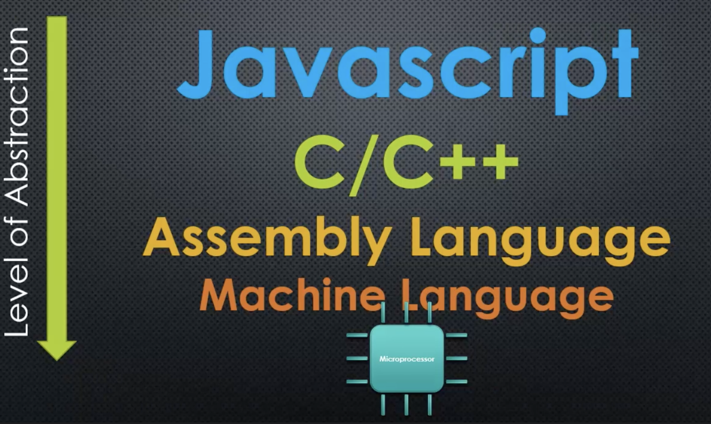

# Learn and Understand NodeJS

> DATE: 3.2022
> REF: [Learn and Understand NodeJS](https://www.udemy.com/course/understand-nodejs/)

## V8 Javascript Engine

#### 1. Processors, Machine Language, and C++

- microprocessor
  - 使用 Machine code (Machine language)
    - 現流行的有：IA-32 or x86-64 or ARM or MIPS
- JavaScript or Java were inspired by what's called **C syntax**
- **V8** (the Javascript engine) is written in C++
- **Node** (add onto V8) is also written in C++
- Level of Abstraction:
  - JS
  - C/C++ (feature-filled programming language)
  - Assembly language (組合語言)
  - Machine code
    (箭頭反過來？)
    [ref](https://www.udemy.com/course/understand-nodejs/learn/lecture/3453110)
- JS --> machine code
  - C++ is compiled into machine code by a C++ compiler.
  - V8 is written in C++. It converts JS directly to machine code.
  - NodeJS lets JS get access to extra functionality written in C++.

#### 2. Javascript Engines and The ECMAScript Specification

- ECMAScript is the standard specification that says how the JS should work.

#### 3. V8 Under The Hood

- V8 is used in Chrome and in Node.js, among others. It implements ECMAScript and WebAssembly, and runs on Windows 7 or later, macOS 10.12+, and Linux systems that use x64, IA-32, ARM, or MIPS processors.
- 可以將 V8 嵌入 C++ application，即可用 C++ 開發更多功能給 JS 使用。(ex. fs)
- [How to JIT(Just In Time)](https://eli.thegreenplace.net/2013/11/05/how-to-jit-an-introduction)

---

## Node Core

#### 1. Servers and Clients

#### 2. What Does Javascript Need to Manage a Server

- 操作 File
- 與 Database 溝通
- 連結其他網路
- 接收 Requests, 發送 Responses
- 處理需要花大量時間的工作 (async)

#### 3. C++ Core ([node/src](https://github.com/nodejs/node/tree/master/src))

#### 4. Javascript Core ([node/lib](https://github.com/nodejs/node/tree/master/lib))

1. 包含將 C++ feature 包裝成 JS
   - `process.binding()`
     - 用來連結 C++ feature，包裝成 JS feature
     - Node.js internal code only.
     - Deprecated. Please use public APIs instead. (DEP0111)
     - [Tracking Issue: process.binding to internalBinding](https://github.com/nodejs/node/issues/22160)
2. 用 JS 開發的更多功能 (也可自己用 JS 開發)

---

## Modules, Exports, and Require

#### 1. Modules

---

## More Reference

[Node 内部工作原理解析](https://www.jianshu.com/p/a8f5a8cdc6ab)
