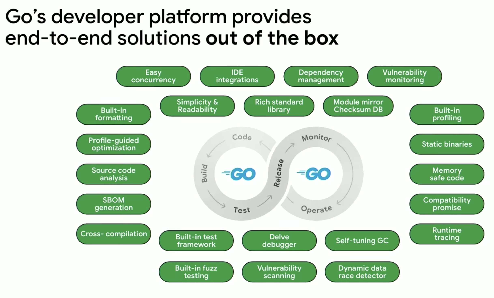

##### <!-- 收起 -->

<!----------- ref start ----------->

[struct 內 pointers 跟 values 差異]: https://blog.wu-boy.com/2019/05/what-is-different-between-pointer-and-value-in-golang/
[Go 語言編碼風格規範]: https://google.github.io/styleguide/go/index
[Effective Go]: https://go.dev/doc/effective_go
[Go 團隊：Go 是什麼]: https://tonybai.com/2024/05/19/what-the-go-team-think-go-is/
[Go Repo]: https://github.com/golang/go
[Golang 入門教學課程]: https://www.youtube.com/playlist?list=PL-g0fdC5RMbo9bdRzbKaCWYC2mXg2eEZE
[GoPlantUML]: https://github.com/jfeliu007/goplantuml
[Dumels]: https://www.dumels.com/diagram
[go Web 框架選擇]: https://learnku.com/articles/46853?order_by=vote_count&

<!------------ ref end ------------>

# Golang 基礎

> DATE: 7 (2024)
> REF: [Go Repo] | [Golang 入門教學課程] | [Go 語言編碼風格規範] | [Effective Go]

## # 環境設定

- 先簡單用 vagrant 開 vm，再用 docker 開 Go container，掛載到本機資料夾

---

## # 基本介紹

- [Go 團隊：Go 是什麼]

  - Go 不僅僅是一種程式語言，它是一個完整的端到端建構生產系統的平台
  - 當 Go 團隊將 Go 視為一個平台來考慮時，他們將考慮如何端到端地解決這整個過程，包括內部和外部循環
  - Go 編譯器本身會建置靜態獨立二進位文件，不依賴任何系統範圍的依賴項或單獨的執行時，這使得部署比其他語言更容易、更安全、更快
  - Profile Guided Optimization(PGO)、Goroutine

  

---

## # 基本概念

- 強型別，一定要宣告型別

- 宣告預設賦值

  - `int`: 0
  - `string`: ""

- pointer

  - 垃圾回收：自動回收記憶體機制，無需再手動處理
  - 有限化：不像 C 語言那樣隨意靈活，在一些細節做了限制提升 `安全性`
  - 簡單化：沒有如 C 語言那樣的 Pointer to Pointer 用法

    ```c
    char *name[] = {"Alice", "Bob", "Carol"};
    char **p = name;
    ```

    ```go
    var names []string = []string{"Alice", "Bob", "Carol"}
    var p *[]string = &names
    ```

---

## # 基本語法

- `package main`

  - 封包
  - 可執行的要用 main

- `func main{}`

  - 程式的進入點

- `:=`

  - 自動判斷型別，自動宣告型別
  - EX. 以下兩個相同，abc 會被自動宣告為 `int`，且賦值為 1

    ```go
    abc := 1
    var abc int = 1
    ```

- `struct`

  - 習慣命名大寫開頭
  - EX.

    ```go
    type Person struct {
      name string
      age int
    }

    func main {
      var p1 Person = Person{ "Ocup", 18 }
      var p2 Person = Person{ age: 20, name: "May" }
    }
    ```

  - pointers vs. values

    - REF: [struct 內 pointers 跟 values 差異]
    - 兩種寫法都可以用 `instance1.keyname` 形式來取得資料，但本質上在傳遞時，一個是 value 一個是 pointer，傳遞後就會有不同的效果產生
    - 若是傳遞 value，則會將整個 value 複製一份過去，通常若非特殊需求，以傳遞 pointer 的方式為主

- `import _ "package"`

  - Blank Import (空白導入、匿名導入)
  - 只會執行其內部的 `func init()`
  - 僅為了執行該 package 的初始化、註冊插件、驅動程序..等
  - package 內其他內容不被直接使用
  - 注意與 `import "package"` 的比較

- `sync.Pool`

---

## # 特殊用法

---

## # 設計模式

---

## # 其他補充

- 注意事項：

- 小工具：

  <!-- 視覺化工具 -->

  - <details close>
    <summary>視覺化工具</summary>

    - 將 GoLang 專案的 code 生成 UML class diagram

      - [Dumels]
      - [GoPlantUML]

    </details>

- 小技巧：

- 延伸閱讀：

  - [go Web 框架選擇]

## # 延伸討論

<!-- 宣告 function 寫法 -->

- <details close>
  <summary>宣告 function 寫法</summary>

  - 可能需要注意大小寫開頭
  - 探討宣告函式的位置

    - 如 utility 中

      - package 中，即便只有一個 parent function 使用到的 child function，也會將 child 寫在外頭
      - child 寫在上，parent 寫在下
      - 因為記憶體來說外部是靜態分配 (global static)，內部是動態分配

    - 但更多時候須考量狀態與生命週期的設計

      - EX. clone pattern / api handler
      - EX. struct 內部，也會是靜態分配，且跟著物件的生命週期
      - EX. pure 的沒有狀態問題
      - EX. xx pool，就會統一由 pool 物件去管理狀態

  </details>

<!--  -->

- <details close>
  <summary></summary>

  </details>

---

## <mark>TODO:</mark> 待整理

- 其他

  - Variadic Functions

    - 不用固定參數數量
