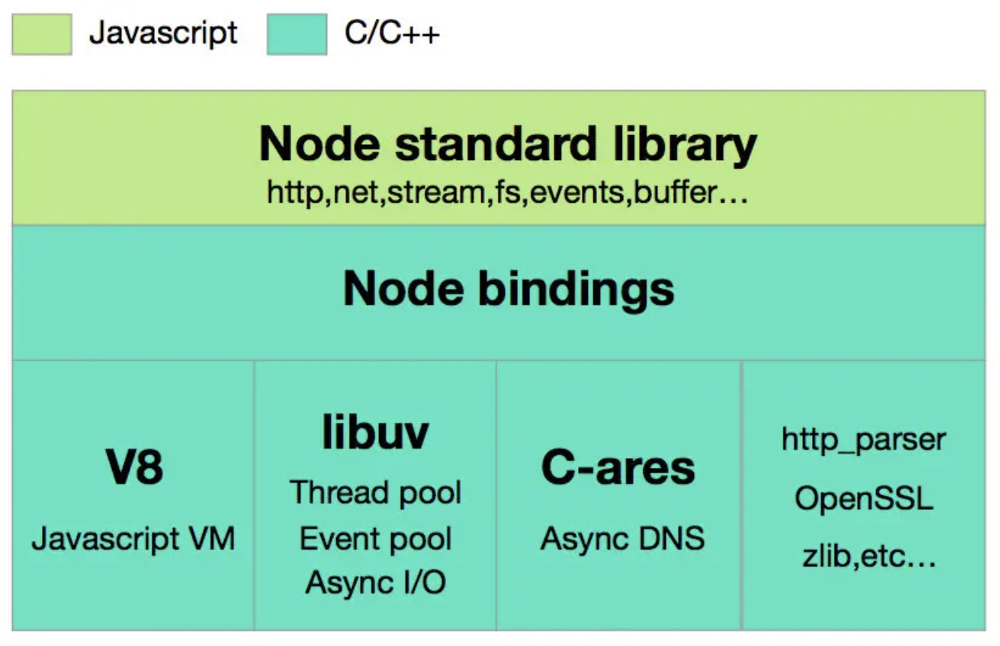
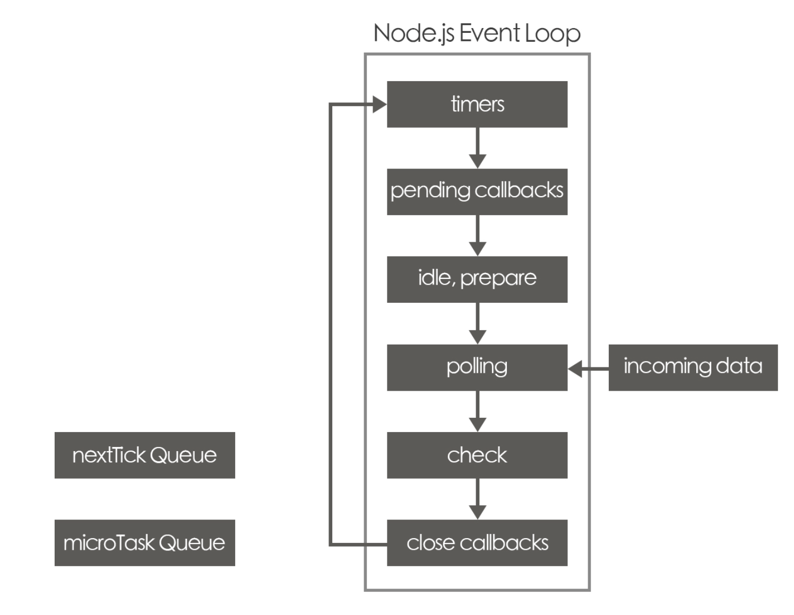
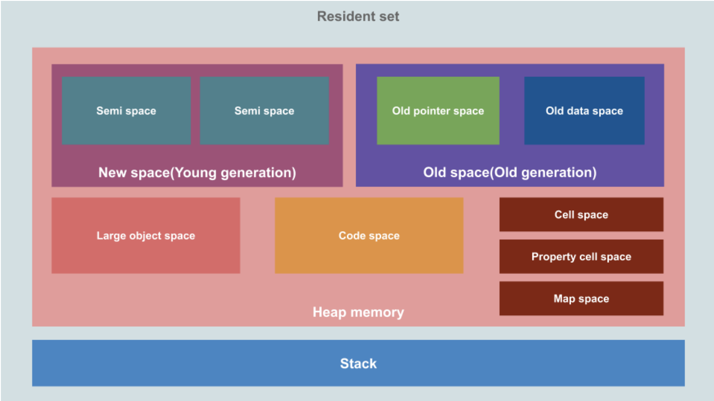

###### <!-- ref -->

[垃圾回收演算法系列文]: https://blog.csdn.net/mrliii/category_10772919.html
[BFS + DFS]: https://blog.csdn.net/MrLiii/article/details/113523770
[深度解析！JavaScript 中變量存儲在堆中還是棧中？]: https://mp.weixin.qq.com/s?__biz=MzkxMjI3MTA1Mg%3D%3D&mid=2247508506&idx=1&sn=2a376ee6f6a5a6d0b874f826ca659bab
[Golang GC 的 write barrier]: https://www.zhihu.com/question/62000722
[從硬件層面理解 memory barrier]: https://zhuanlan.zhihu.com/p/184912992
[What and where are the stack and heap?]: https://stackoverflow.com/questions/79923/what-and-where-are-the-stack-and-heap
[源碼解讀：mmap 原理和實現]: https://www.cnblogs.com/theseventhson/p/15925083.html
[認真分析 mmap]: https://www.cnblogs.com/huxiao-tee/p/4660352.html
[一文讀懂 mmap 原理]: https://juejin.cn/post/6956031662916534279
[Node DOC: Worker Threads]: https://nodejs.org/api/worker_threads.html
[V8: Oilpan library]: https://v8.dev/blog/oilpan-library
[追踪是否被 GC]: https://zhuanlan.zhihu.com/p/551005752
[記憶體管理鐵人]: https://ithelp.ithome.com.tw/articles/10287533
[記憶體管理 MDN]: https://developer.mozilla.org/zh-TW/docs/Web/JavaScript/Memory_management
[快速複習 JS Memory 影片]: https://youtu.be/95_CAUC9nvE
[Visualizing memory management in V8 Engine]: https://deepu.tech/memory-management-in-v8/
[A tour of V8: Garbage Collection]: https://jayconrod.com/posts/55/a-tour-of-v8-garbage-collection
[C 語言記憶體]: https://blog.gtwang.org/programming/memory-layout-of-c-program/
[V8 引擎與 JIT 原理]: https://juejin.cn/post/7179130165262286885
[從 Node.js 專案裡找出 Memory leak]: https://vocus.cc/article/61176c17fd89780001942f1c
[Guide: How To Inspect Memory Usage in Node.js]: https://www.valentinog.com/blog/node-usage/
[worker.cc]: https://github.com/nodejs/node/blob/921493e228/src/node_worker.cc
[深入理解 node.js worker threads]: https://zhuanlan.zhihu.com/p/167920353
[udemy]: https://www.udemy.com/course/understand-nodejs/
[level of abstraction]: ../src/image/Node/Level_of_Abstraction.png
[how to jit(just in time)]: https://eli.thegreenplace.net/2013/11/05/how-to-jit-an-introduction
[node/deps/v8/]: https://github.com/nodejs/node/tree/1aabfa8732fb438cdcee21e81d389bcab28d2460/deps/v8
[node/src]: https://github.com/nodejs/node/tree/master/src
[node/lib]: https://github.com/nodejs/node/tree/master/lib
[tracking issue: process.binding to internalbinding]: https://github.com/nodejs/node/issues/22160
[node 内部工作原理解析]: https://www.jianshu.com/p/a8f5a8cdc6ab
[REF1]: https://www.udemy.com/course/understand-nodejs/learn/lecture/3453110
[完整圖解 Node.js 的 Event Loop(事件迴圈)]: https://notes.andywu.tw/2020/%E5%AE%8C%E6%95%B4%E5%9C%96%E8%A7%A3node-js%E7%9A%84event-loop%E4%BA%8B%E4%BB%B6%E8%BF%B4%E5%9C%88/

<!-- ref -->

# Learn and Understand NodeJS

> DATE: 3 (2022), 7 (2023)
> REF: [Udemy]

## # V8 Javascript Engine

#### 1. Processors, Machine Language, and C++

<!-- Microprocessor 簡介 -->

- <details close>
  <summary>Microprocessor</summary>

  - 使用 Machine code (Machine language)
  - 現流行的有：IA-32 or x86-64 or ARM or MIPS

  </details>

<!-- 以 C syntax 設計 -->

- <details close>
  <summary>以 C syntax 設計</summary>

  - JS or JAVA were inspired by what's called <code>C syntax</code>

  </details>

<!-- 底層為 C++ 實作 -->

- <details close>
  <summary>底層為 C++ 實作</summary>

  - `V8`(the JS engine) 跟 `Node`(add onto V8) 都是由 C++ 實作

  </details>

<!-- Level of Abstraction -->

- <details close>
  <summary>Level of Abstraction</summary>

  - JS
  - C/C++ (feature-filled programming language)
  - Assembly language (組合語言)
  - Machine code
  - Microprocessor

  (圖註：箭頭應該反過來？) [REF1]
  ![Level of Abstraction]

  </details>

<!-- JS -> machine code -->

- <details close>
  <summary>JS --> machine code</summary>

  - C++ is compiled into machine code by a C++ compiler.
  - V8 is written in C++. It converts JS directly to machine code.
  - NodeJS lets JS get access to extra functionality written in C++.

  </details>

#### 2. Javascript Engines and The ECMAScript Specification

- ECMAScript is the standard specification that says how the JS should work.

#### 3. V8 Under The Hood

<!-- V8 is used in Chrome and in Node.js -->

- <details close>
  <summary>V8 用在 Chrome、Node.js ..等</summary>

  - 程式碼：[node/deps/v8/]
  - V8 is used in Chrome and in Node.js, among others. It implements ECMAScript and WebAssembly, and runs on Windows 7 or later, macOS 10.12+, and Linux systems that use x64, IA-32, ARM, or MIPS processors.

  </details>

<!-- V8 可嵌入 C++ application -->

- <details close>
  <summary>V8 可嵌入 C++ application</summary>

  - 可以將 V8 嵌入 C++ application，就可以用 C++ 開發更多功能給 JS 使用 (EX. fs)

  </details>

<!-- V8 實作 JIT(Just In Time) -->

- <details close>
  <summary>V8 實作 JIT(Just In Time)</summary>

  - V8 中，含有編譯器，達成 JIT

    - (1) 在 runtime 將程式碼轉成 machine code
    - (2) 在 runtime 執行 machine code

  - 常用的程式碼會被標記為 Hot，並以 Optimized Machine Code 保存在 memory，不常用後再降級

  - REF
    - [V8 引擎與 JIT 原理]
    - [How to JIT(Just In Time)]

  </details>

---

## # Node Core

<!-- Node Repo -->

- <details close>
  <summary>Node Repo</summary>

  - REF: [Node 内部工作原理解析]

  

  </details>

<!-- JS Server 所需要做的事 -->

- <details close>
  <summary>JS Server 所需要做的事</summary>

  - 操作 File
  - 與 Database 溝通
  - 連結其他網路
  - 接收 Requests, 發送 Responses
  - 處理需要花大量時間的工作 (async)

  </details>

<!-- C++ Core -->

- <details close>
  <summary>C++ Core</summary>

  - 程式碼：[node/src]

  </details>

<!-- JS Core -->

- <details close>
  <summary>JS Core</summary>

  - 程式碼：[node/lib]

  - 包含將 C++ feature 包裝成 JS

    - `process.binding()` (已棄用，改為 `internalBinding()`)

      - 用來連結，將 C++ feature，包裝成 JS feature
      - C++ 端以 `setMethod()` 導出，JS 端以 `internalBinding()` 調用
      - Node.js internal code only.
      - Deprecated. Please use public APIs instead. (DEP0111)
      - [Tracking Issue: process.binding to internalBinding]

  - 用 JS 開發的更多功能 (也可自己用 JS 開發)

  </details>

---

## # Modules, Exports, and Require

<!-- First Class Function -->

- <details close>
  <summary>First Class Function</summary>

  - 可被當作參數傳入、當作回傳值、賦值給變量、存儲在資料結構中
  - Functional programming 必備桃件

  </details>

<!-- Immediately Invoked Function Expressions (IIFEs) -->

- <details close>
  <summary>IIFEs</summary>

  - Immediately Invoked Function Expressions (IIFEs)
  - 可以立刻執行的 function

  ```javascript
  // EX.
  ;(() => {})()
  ```

  </details>

---

## # NPM

- Because the tool isn't installed globally we can't launch it from the command line (unless we add it to the path) but we can call it from an NPM script because NPM knows all about the installed packages.

---

## # 延伸閱讀 (基礎)

<!-- Worker Threads -->

- <details close>
  <summary>Worker Threads</summary>

  - REF: [深入理解 Node.js Worker Threads] | [Node DOC: Worker Threads]

  - Worker Threads 簡單說是，透過 [worker.cc]，再開一個 nodejs runtime 給他用

  </details>

<!-- Event Loop -->

- <details close>
  <summary>Event Loop</summary>

  - REF: [完整圖解 Node.js 的 Event Loop(事件迴圈)]

  - 需注意，v10.0.0 左右有改版，優先度略有不同
  - 非同步丟去 Queue，同步先執行完全部後，再依下述優先度查看執行，直到 Queue 清空
  - Sync --> microTask Queue --> nextTick Queue --> macrotask queue(Check --> Timers)

  

  </details>

<!-- Memory -->

- <details close>
  <summary>Memory</summary>

  <!-- 快速複習 JS Memory 影片 -->

  - [快速複習 JS Memory 影片]

  <!-- Resident Set -->

  - Resident Set

    <!-- Heap：dynamic -->

    - <details close>
      <summary>Heap：dynamic</summary>

      - `out of memory errors`

      - mmap page

        - 藉由 mmap 劃分成多個 page
        - Large object space 中，每個 object 由一個 page 組成
        - 其他 space 都是多個 1MB page 組成

        - mmap

          - REF: [一文讀懂 mmap 原理] | [認真分析 mmap] | [源碼解讀：mmap 原理和實現]

      - flag: `--min_semi_space_size`, `--max_semi_space_size`, `--initial_old_space_size`, `--max_old_space_size`

      </details>

    <!-- Stack：static -->

    - <details close>
      <summary>Stack：static</summary>

      - 每個 V8 process 有一個 stack
      - `stack overflow errors`
      - flag: `--stack_size`

      </details>

  <!-- 內建查看：`process.memoryUsage()` -->

  - 內建查看：`process.memoryUsage()`

  <!-- V8 基礎型別記憶體位置 -->

  - <details close>
    <summary><mark>TODO:</mark> V8 基礎型別記憶體位置</summary>

    - [深度解析！JavaScript 中變量存儲在堆中還是棧中？]

    - 我覺得 V8 的 stack 上應該只有存 frame + pointer 而已，不然「弱型別」特性不易處理
    - 也符合「call by sharing」特性
    - 但待研究那些基礎型別是存放在 Heap 的哪個區塊，應該會有特別區塊處理。目前猜測是在 cell space 或 map space。

    </details>

  <!-- REF -->

  - REF

    - [Visualizing memory management in V8 Engine]
    - [Guide: How To Inspect Memory Usage in Node.js]
    - 對照 [C 語言記憶體]
    - [What and where are the stack and heap?]

  

  </details>

<!-- Garbage Collection -->

- <details close>
  <summary>Garbage Collection</summary>

  <!-- Minor GC: Scavenger algorithm -->

  - <details close>
    <summary>Minor GC: Scavenger algorithm</summary>

    <!-- 實現 [Cheney's algorithm] -->

    - <details close>
      <summary>實現 Cheney's algorithm</summary>

      - 以 BFS 方式，將保留的資料，從 from-space 複製到 to-space
      - 優點：用 BFS，所以可以不用 recursion，避免 stack 負擔 (但現代電腦已較能負荷)
      - 缺點：引用的 object 可能無法在同一 page，以 [BFS + DFS] 改進

      </details>

    <!-- 適合小量資料 -->

    - 適合小量資料 (new space 約 1 ~ 8 MB)

    <!-- behavior heuristics -->

    - behavior heuristics：from-space 滿了就觸發

    <!-- write barriers -->

    - <details close>
      <summary>write barriers</summary>

      - 以 write barriers 機制，使用 register 記錄所有 old space object 引用 new space object 的 pointer，可快速判斷誰被引用

      - REF: [從硬件層面理解 memory barrier] | [Golang GC 的 write barrier]

      </details>

    </details>

  <!-- Major GC: Mark-Sweep-Compact algorithm -->

  - <details close>
    <summary>Major GC: Mark-Sweep-Compact algorithm</summary>

    - Mark 將可到達的標記 ＋ Sweep 將沒標記的設為可用 ＋ Compact 整理空間
    - Compact 為 fragmentation heuristic：太過零碎時，才觸發 Compact
    - Mark & Sweep 可以與 Main 並行，但 Compact 時，需要暫停 Main
    - 可從是否集中在同 page，來判斷零碎程度

    </details>

  <!-- GC 只能盡力，但問題已經小到可以忽略 -->

  - <details close>
    <summary>GC 只能盡力，但問題已經小到可以忽略</summary>

    - GC 只是「儘量」做到自動釋放記憶體空間，因為判斷記憶體空間是否要繼續使用，這件事是「不可判定的(undecidable)」
    - 問題已被限縮到很小，幾乎可以忽略

      - 演算法改為「標記和清理演算法」
      - 將「這個物件再也不會被使用」的定義縮減到「這個物件不可到達」

    </details>

  <!-- GC 也有時間成本 -->

  - <details close>
    <summary>GC 也有時間成本</summary>

    - 通常會是額外的 process，以固定時間間隔執行，因此會小段暫停
    - 有時間成本，應保有良好的 coding 習慣，減少 GC 負擔

    </details>

  <!-- 相關指令 -->

  - <details close>
    <summary>相關指令</summary>

    - `node --max-old-space-size=6000 index.js`

      - 設定可用的 heap memory

    - `node --expose-gc --inspect index.js`
      - 展示 Garbage Collector
      - 程式碼中呼叫 `gc()` 可以手動設定啟動垃圾回收時機 (<mark>TODO:</mark> 待確認?)

    </details>

  <!-- REF -->

  - REF:

    - [V8: Oilpan library]
    - [A tour of V8: Garbage Collection]
    - [記憶體管理 MDN] | [記憶體管理鐵人] | [追踪是否被 GC]
    - [垃圾回收演算法系列文]

    </details>

---

## # 延伸閱讀 (方法)

- <details close>
  <summary>處理 Memory leak</summary>

  - [從 Node.js 專案裡找出 Memory leak]

  </details>

---

- <details close>
  <summary></summary>

  </details>
