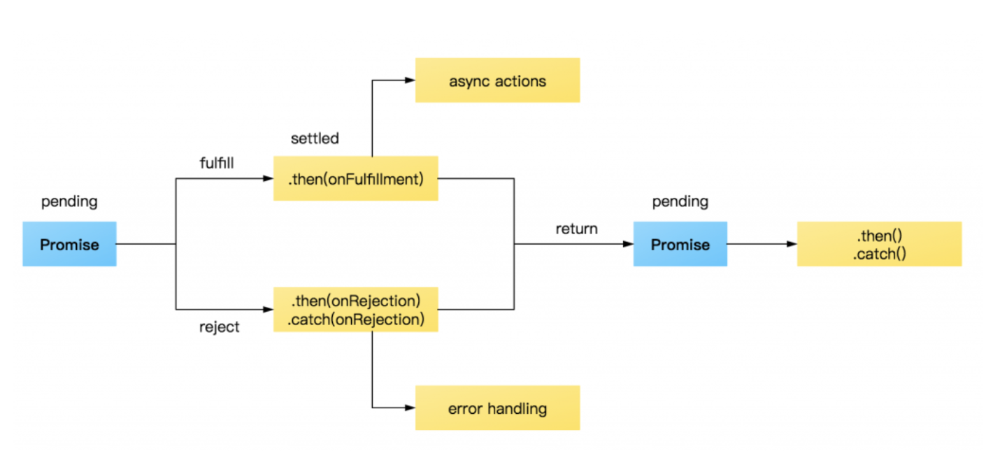
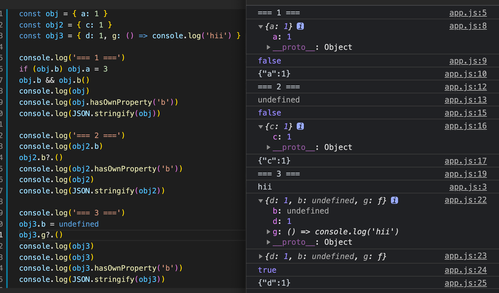

###### <!-- ref -->

[primitive wrapper]: https://www.javascripttutorial.net/javascript-primitive-wrapper-types/
[mdn]: https://developer.mozilla.org/en-US/docs/Web/JavaScript
[`__proto__`]: https://developer.mozilla.org/en-US/docs/Web/JavaScript/Reference/Global_Objects/Object/proto
[順序執行非同步]: https://medium.com/@mengweichen/%E8%AE%93js-array-reduce%E8%88%87async-await%E5%85%B1%E8%88%9E-157a66ea2dfb
[for await...of]: ./others.md#for-awaitof-vs-promiseallhttpsstackoverflowcomquestions59694309for-await-of-vs-promise-all
[all vs race]: https://alligator.io/js/promise-all-promise-race/
[not relevant anymore]: https://stackoverflow.com/questions/1098040/checking-if-a-key-exists-in-a-javascript-object#:~:text=EDIT%3A%2012/04/2018%20%2D%20NOT%20RELEVANT%20ANYMORE
[number-precision]: https://github.com/nefe/number-precision
[二進位浮點數]: https://www.itread01.com/content/1547654585.html
[class]: https://dmitripavlutin.com/javascript-classes-complete-guide/
[prototype pollution]: https://tech-blog.cymetrics.io/posts/huli/prototype-pollution/
[private class]: https://developer.mozilla.org/en-US/docs/Web/JavaScript/Guide/Working_With_Private_Class_Features

 <!-- ref -->

# JS 基礎

> DATE: 3, 4 (2022)
> REF: [MDN]

## 1. 基本介紹

<!-- Function -->

- <details close>
  <summary>Function</summary>

  <!-- First-Class Function (第一級函數) -->

  - <details close>
     <summary>First-Class Function (第一級函數)</summary>

    - 因為是 object，有其他語言並非如此
    - 可當參數傳

    </details>

  <!-- arguments -->

  - <details close>
     <summary>arguments</summary>

    - 有屬性 `callee`, `length`, etc.
    - Arrow Function 沒有 `arguments` 物件

    ```
    function fn(arg1, arg2) {
      console.log(arguments) // [object Arguments] {"0":1, "1":2}
      console.log([])        // [object Array] []
      console.log({})        // [object Object] {}

    }

    fn(1,2)
    ```

    </details>

  <!-- IIFE -->

  - <details close>
     <summary>IIFE</summary>

    - Immediately Invoked Function Expression
    - _過去使用 IIFE 最主要的原因就是為了避免變數污染造成的問題_

    ```
    EX.
    ;(() => {})()
    ```

    </details>

  <!-- Closure -->

  - <details close>
     <summary>Closure (閉包)</summary>

    - 隱藏 message

    ```
    EX.
    const outer = () => {
      const message = 'message'

      const inner = () => {
        return message
      }

      return inner
    }

    const myFn = outer()
    ```

    </details>

  </details>

<!-- this -->

- <details close>
  <summary>this</summary>

  > **ECMAScript**： The `this` keyword evaluates to the value of the ThisBinding of the current execution context.
  > **MDN**：In most cases, the value of `this` is determined by how a function is called.

  - `this` 代表的是 function **執行**時所屬的物件

  - Arrow Function：`this` 強制在定義時被綁定，無法更改

  - 綁定原則：

     <!-- 預設綁定 (Default Binding) -->

    - <details close>
      <summary>預設綁定 (Default Binding)</summary>

      - 預設綁定到 `global` (window)
      - 但使用 `"use strict"` 會禁止綁定 global (--> `undefined`)

      </details>

     <!-- 隱含式綁定 (Implicit Binding) -->

    - <details close>
      <summary>隱含式綁定 (Implicit Binding)</summary>

      - `function(){}` 專屬
      - 在「呼叫的時機點」為某物件的**參考屬性** (**reference property**) --> 綁定該物件

      ```
      EX.
      function fn() {console.log(this)}
      const obj = {fn1: fn}
      const fn2 = obj.fn1

      fn()       // Default Binding
      obj.fn1()  // obj
      fn2()      // Default Binding
      ```

      </details>

     <!-- 顯式綁定 (Explicit Binding) -->

    - <details close>
      <summary>顯式綁定 (Explicit Binding)</summary>

      - `.bind()` / `.call()` / `.apply()`，綁定指定的物件

      </details>

     <!-- 「new」關鍵字綁定 -->

    - <details close>
      <summary>「new」關鍵字綁定</summary>

      - 綁定被建構出來的物件

      </details>

  </details>

<!-- Primitive Wrapper -->

- <details close>
  <summary>Primitive Wrapper</summary>

  > REF: [Primitive Wrapper]

  - 基本型別使用一些屬性、方法時，短暫 new 一個物件，用完後刪除

  - EX.

  ```
  let str = language.substring(4)
  ```

  ↓ ↓ ↓

  ```
  // technically equivalent to:

  let tmp = new String(language)
  let str = temp.substring(4)
  temp = null
  ```

    </details>

<!-- Prototype -->

- <details close>
  <summary>Prototype</summary>

  > REF: [Prototype Pollution]

  <!-- new 建立實體 -->

  - <details close>
    <summary>new 建立實體後，prototype 自動指向</summary>

    - `物件 x` 的「prototype」會自動指向`建構式 Y`的「prototype 屬性」
    - 備註說明：
      - `Y.prototype`：Y 的 prototype property
      - `Y.__proto__`：Y 的 prototype
      - `x.__proto__`：x 的 prototype
      - `Object.getPrototypeOf(x)`：`x.__proto__`
        ([`__proto__`] 已棄用)

    ```
    EX.
    const x = new Y()

    // x 的 prototype 指向 Y.prototype
    Object.getPrototypeOf(x) === Y.prototype
    ```

    </details>

  <!-- js class -->

  - <details close>
    <summary>js class 即是用 prototype</summary>

    - [private class] (e.g. `#privateValue`)

    ```
    EX.
    class X { }
    class Y extends X { }

    Object.getPrototypeOf(Y) === X
    ```

    </details>

  <!-- Object.prototype -->

  - <details close>
    <summary>Object.prototype</summary>

    - 幾乎所有的物件 (環境宿主物件除外) 順著原型鏈找到最上層，都會找到 `Object.prototype` 才停止 (JavaScript 所有物件的起源)

      ```
      EX.
      const obj = {}
      obj.__proto__.__proto__ === Object.prototype
      ```

    <!-- 提供許多方法 -->

    - <details close>
      <summary>Object.prototype 提供許多方法：</summary>

      ```
      EX.
      Object.prototype.hasOwnProperty()
      Object.prototype.toString()
      Object.prototype.valueOf()
      ```

      </details>

    </details>

  <!-- 建議基本操作 -->

  - <details close>
    <summary>建議基本操作</summary>

    - `Object.setPrototypeOf(<obj>, <proto>)`：設定 obj 的 prototype 為 proto
    - `Object.create(<proto>)`：回傳一個物件，其 prototype 為 proto
    - `Object.getPrototypeOf(<obj>)`：回傳 obj 的 prototype

    </details>

  <!-- 小技巧 -->

  - <details close>
    <summary>小技巧</summary>

    <!-- Object.freeze() -->

    - <details close>
      <summary>Object.prototype.freeze()</summary>

      - 凍結 object，使其內容不得變更

      ```
      // EX1. with object -------------------
      const testObject = { x: 1, y: { z: 1 } }
      Object.freeze(testObject)

      // NO
      testObject.y = ''
      testObject.x = ''
      // OK
      testObject.y.z = ''

      // EX2. with class -------------------
      class TestClass {
        constructor(value) {
          this.value = value
        }
        testFn1() {}
      }
      Object.freeze(TestClass.prototype)

      const testInstance = new TestClass(1)

      // NO
      TestClass.prototype.testFn1 = ''
      TestClass.prototype.testFn2 = ''
      testInstance.testFn1 = ''
      // OK
      testInstance.value = ''
      testInstance.testFn2 = ''
      ```

      </details>

    </details>

  </details>

<!-- 非同步 -->

- <details close>
  <summary>非同步</summary>

  > REF: [順序執行非同步] | [for await...of] | [all vs race]

  <!-- 不會「同時」修改某個變數 -->

  - <details close>
    <summary>不會「同時」修改某個變數</summary>

    - 不論「同步」或「非同步」，在執行時一定有順序之分。只是「同步」任務的順序可以掌握，而「非同步」的任務會因執行時的各種狀況導致順序不同。不會出現「同時」修改某個變數的情況。

    </details>

  - `new Promise` 時，就已執行

  <!-- try ... catch -->

  - <details close>
    <summary>try ... catch</summary>

    - `try ... catch`：使其不直接 throw error，只停止該 async function，並作自定義後續

    </details>

  <!-- 常用方法比較： -->

  - <details close>
    <summary>常用方法比較：</summary>

    - `Promise.all`：全部 resolve 後，才下一步
    - `Promise.race`：第一個 resolve 後就下一步 (剩下的不一定會 resolve，就算 reject 也不管他)
    - `for await ... of`：resolve 後，照順序下一步。
    - [順序執行非同步] (`for( ){ await new Promise}`)

      

      [CODE](../src/code/base/promise.js)

    </details>

  

  </details>

<!-- class -->

- [class]

---

## 2. 其他補充

- 注意事項：

  <!-- x.prototype -->

  - <details close>
    <summary>x.prototype 不是 x 的 prototype</summary>

    - `x.prototype`：x 的 prototype property
    - `x.__proto__`：x 的 prototype

      - 已改用 `Object.getPrototypeOf(x)`

    </details>

  <!-- 0.1 + 0.2 -->

  - <details close>
    <summary>0.1 + 0.2</summary>

    > REF: [number-precision] | [二進位浮點數]

    - 二進位浮點數問題

      - 整數部分：除以 2 --> { 商數：繼續除, 餘數：結果 }
      - 小數部分：乘以 2 --> { 小數：繼續乘, 整數：結果 }

    ```
    EX.
    import NP from 'number-precision'

    NP.strip(0.09999999999999998); // = 0.1
    NP.plus(0.1, 0.2);             // = 0.3, not 0.30000000000000004
    NP.plus(2.3, 2.4);             // = 4.7, not 4.699999999999999
    NP.minus(1.0, 0.9);            // = 0.1, not 0.09999999999999998
    NP.times(3, 0.3);              // = 0.9, not 0.8999999999999999
    NP.times(0.362, 100);          // = 36.2, not 36.199999999999996
    NP.divide(1.21, 1.1);          // = 1.1, not 1.0999999999999999
    NP.round(0.105, 2);            // = 0.11, not 0.1
    ```

    ```
    EX. 套件 'number-precision' 作法：

    // iteratorOperation：使用 loop
    // digitLength：轉自串後計算
    // times：乘法

    const plus = (...nums) => {
      if (nums.length > 2) return iteratorOperation(nums, plus)

      const [num1, num2] = nums
      const baseNum = Math.pow(10, Math.max(digitLength(num1), digitLength(num2)))

      return (times(num1, baseNum) + times(num2, baseNum)) / baseNum
    }
    ```

    </details>

- 小技巧：

  <!-- Cascade -->

  - <details close>
    <summary>Cascade</summary>

    - 也稱作 Fluent Interface

    ```
    EX.
    const calNum = (initNum = 0) => {
      let value = initNum

      const N = {
        add: (num) => {
          value = value + num
          return N
        },

        result: () => value,
      }

      return N
    }

    console.log(calNum(10).add(1).add(2).result())
    ```

    </details>

- 改版：

  <!-- Object auto-assign undifined -->

  - <details close>
    <summary>Object auto-assign undifined --> NOT ANYMORE</summary>

    > REF: [NOT RELEVANT ANYMORE]

    - 使用 `obj.a` 來確認是否存在，已改方法，不會再 assign 一個值 undifined

    

    </details>

## 3. 延伸閱讀

- <details close>
  <summary></summary>

  </details>
