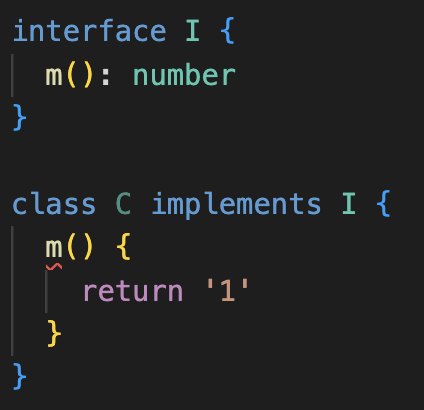
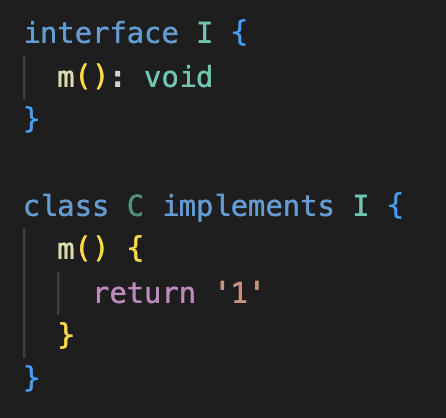

<style> 
.imgBox{
  display: flex; 
  flex-direction: column; 
  margin: 5%; 
  justify-content: center;
  border: 2px solid black;
}
</style>

<!--  style  -->

###### <!-- ref -->

[ts docs]: https://www.typescriptlang.org/docs/handbook/typescript-in-5-minutes.html
[google ts style guide]: https://google.github.io/styleguide/tsguide.html
[鐵人賽 1]: https://ithelp.ithome.com.tw/articles/10214714
[ecmascript 相容表]: https://kangax.github.io/compat-table/es6/
[tsconfig doc]: https://aka.ms/tsconfig
[鐵人賽 2]: https://ithelp.ithome.com.tw/articles/10214719#:~:text=%22strictNullChecks%22%3A%20true%2C
[ts 變數 name]: https://www.jianshu.com/p/78268bd9af0a
[function signature]: https://developer.mozilla.org/en-US/docs/Glossary/Signature/Function
[function 誤區注意]: https://ithelp.ithome.com.tw/articles/10215270
[never & unknown]: https://blog.logrocket.com/when-to-use-never-and-unknown-in-typescript-5e4d6c5799ad/
[typescript 新手指南]: https://willh.gitbook.io/typescript-tutorial/
[深入理解typescript]: https://jkchao.github.io/typescript-book-chinese/
[methods for typescript runtime type checking]: https://blog.logrocket.com/methods-for-typescript-runtime-type-checking/
[type guard1]: https://medium.com/onedegree-tech-blog/typescript-%E4%B8%80%E4%BA%9B%E4%BB%A4%E4%BA%BA%E5%8F%88%E6%84%9B%E5%8F%88%E6%81%A8%E7%9A%84%E5%85%A7%E5%AE%B9-type-guard-narrowing-1655a9ae2a4d
[type guard2]: https://blog.logrocket.com/how-to-use-type-guards-typescript/
[top 50 typescript interview questions explained]: https://betterprogramming.pub/top-50-typescript-interview-questions-explained-5e69b73eeab1
[type vs interface]: https://www.typescriptlang.org/docs/handbook/2/everyday-types.html#differences-between-type-aliases-and-interfaces
["void return" in interface doesn't trigger error in "implementation"]: https://stackoverflow.com/questions/70546619/why-typescript-return-type-void-in-interface-doesnt-trigger-error-in-implementa

 <!-- ref -->

# TS 基礎

> DATE: 7 ~ 10 (2022)
> REF: [TS Docs] | [google TS style guide] | [鐵人賽 1] | [typescript 新手指南] | [深入理解 TypeScript]

 <!-- 工具 -->

- <details close>
     <summary>工具：</summary>

  - [ECMAScript 相容表]

    </details>

    </details>

## 0. 環境

<!-- 安裝 TS -->

- <details close>
  <summary>安裝 TS</summary>

  ```shell
  $ npm install -g typescript
  ```

  </details>

<!-- 初始化 TS -->

- <details close>
  <summary>初始化 TS</summary>

  ```shell
  $ tsc --init
  ```

  - `tsc`：使用 **TS Compiler** 的指令
  - 生成設定檔 `tsconfig.json`
  - [tsconfig doc]

  </details>

<!-- 編譯 TS 成 JS -->

- <details close>
  <summary>編譯 TS 成 JS</summary>

  - 即便有 `error`，依然會編譯成一份 JS

  - ```shell
    $ tsc index.ts
    ```

    - 編譯 `index.ts`，並生成 `index.js`

  - ```shell
    $ tsc
    ```

    - 掃描專案底下所有的 `.ts` 編譯生成對應的 `.js`
    - 以一個 `tsconfig.json` 為一個專案

      ```txt
      EX.

      ＊ Directory Structure:
      ---------------------------------

      project
      └── test1
          └── test1.ts
          └── tsconfig.json
      └── test2
          └── test2.ts
      └── test3.ts
      └── tsconfig.json
      ---------------------------------

      ＊ 在三種不同位置執行 "tsc":

      1) /project/
      $ tsc
      --> 生成 test1.js, test2.js, test3.js

      2) /project/test1/
      $ tsc
      --> 只生成 test1.js

      3) /project/test2/
      $ tsc
      --> 生成 test1.js, test2.js, test3.js
      ```

  </details>

<!-- import module -->

- <details close>
  <summary>import module</summary>

  - 目的：

    - 使用 es6 up，且 `import` 時不需加副檔名，且可以使用 `index.js`

    ```typescript
    // EX. 自動 import from "./@class/TicketSystem/index.js"
    import { TrainTicketSystem } from './@class/TicketSystem'
    ```

  - 目前的解法：

    - 將 es6 up 編譯成 commonJS
    - `tsconfig.json` 中設定（從 es2016 編譯成 commonJS）

    ```typescript
    "target": "es2016",
    "module": "commonjs",
    ```

    - `package.json` 中設定（因為最後是編譯成 commonJS）

    ```typescript
    "type": "commonjs",
    ```

  - TODO: 是否有解法可以編譯成 es6 up 且達成目的？

  </details>

---

## 1. 基本介紹

<!-- 型別檢查 -->

- <details close>
  <summary>型別檢查</summary>

  - 程式碼中，使用錯誤型別，會有 `紅色波浪狀底線` 標明錯誤資訊

  <div class="imgBox" >
    
  </div>

  - 編譯時，也會拋出 error

  <div class="imgBox" >
    
  </div>

  </details>

<!-- Type Annotation -->

- <details close>
  <summary>Type Annotation (註記)</summary>

  <!-- 3 種 Type Annotation 方式： -->

  - 3 種 Type Annotation 方式：

    <div class="imgBox" >
      
    </div>

    <!-- 差異：`第一種`(x4, x7) 方式一定要完全符合 -->

    - <details close>
      <summary>差異：<code>第一種</code> 方式一定要完全符合</summary>

      1. 不能有多餘的，如 z。 (x4)
      2. 一定要有 y。 (x7)

      <div class="imgBox" >
        
      </div>

      </details>

    <!-- 不能：三種皆不可只有多餘的（z），卻沒有該有的（y） -->

    - <details close>
      <summary>不能：三種皆不可只有多餘的（z），卻沒有該有的（y）</summary>

      <div class="imgBox" >
        
      </div>

      </details>

  <!-- 沒 Annotation ＋ 沒 Assign -->

  - <details close>
    <summary>沒 Annotation ＋ 沒 Assign</summary>

    - 此情況下，`Type Inference` 的結果會不斷改變（X1）

    <div class="imgBox" >
      
    </div>

    </details>

  </details>

<!-- Type Inference -->

- <details close>
  <summary>Type Inference (推論)</summary>

  - 在未使用 Type Annotation 時，也會自動推論其 type
  - 如下圖，變數並未註記 type，但 hover 時，有自動推論 type 為 `(string | number)[ ]`

    <div class="imgBox" >
      
    </div>

  <!-- Nullable Types -->

  - <details close>
    <summary><code>Nullable Types</code> --> <code>any</code></summary>

    - Nullable Types: `null`, `undefined`.. 等等
      <div class="imgBox" >
        
        
      </div>

    - Delayed Initialization 可視為初始化指派為 `undefined` --> `any`
      <div class="imgBox" >
        
      </div>

      - 若有 `Type Annotation` 則會形成 Temporal Dead Zone
        <div class="imgBox" >
          
        </div>

    </details>

  <!-- 自動進行檢查 -->

  - <details close>
    <summary>Type Inference --> 自動進行檢查</summary>

    - 即使沒有 Type Annotation，TS 自動認定其為 Type Inference 後的型別

      - 因為 Nullable Types --> any，所以可以再指派為任何型別，而其他的則已固定型別

        <div class="imgBox" >
          
        </div>

    </details>

  - <mark>杯論：</mark>
    - 因為有 Type Inference 功能，所以可以只在 `未立刻賦值` 或 `特殊需求的型別` 時，才使用 Type Annotation？

  </details>

<!-- 型別介紹 -->

- <details close>
  <summary>型別介紹</summary>

  <!-- Any -->

  - <details close>
    <summary>Any</summary>

    - 可以將 `any` assign 給任何 type 的變數，而不會報錯
    - X11：請參考 _Type Annotation / 沒 Annotation ＋ 沒 Assign_

    <div class="imgBox" >
      
    </div>

    </details>

  <!-- Object -->

  - <details close>
    <summary>Object</summary>

    <!-- 當 key 值為 Nullable Types，其 Type Inference 會明確定義 type，而不是 any -->

    - <details close>
      <summary>當 key 值為 Nullable Types，其 Type Inference 會明確定義 type，而不是 any</summary>

        <div class="imgBox" >
          
        </div>

      </details>

    <!-- & vs | -->

    - <details close>
      <summary><code>&</code> vs <code>|</code></summary>

      - `&`：必須都有
      - `|`：至少需有其中一個，剩下的 key 也必須包含在其他的 type

        <div class="imgBox" >
          
        </div>

      </details>

    <!-- type object vs 自定義 object type vs Type Inference -->

    - <details close>
      <summary><code>type object</code> vs <code>自定義 object type</code> vs <code>Type Inference</code></summary>

      - `Type Inference` 較接近 `自定義 object type`
      - `type object`：可覆寫成任何 JS object (包含 [], new Number().. etc)，但不能對該 object 的內部做更動

        <div class="imgBox" >
          
        </div>

      </details>

    - <details close>
      <summary><code>type {}</code> 等同 <code>type object</code></summary>

        <div class="imgBox" >
          
        </div>

      </details>

    </details>

  <!-- Function -->

  - <details close>
    <summary>Function</summary>

    <!-- 提醒 Implicit Any -->

    - <details close>
      <summary>提醒 <code>Implicit Any</code></summary>

      - 如圖 1，參數未指定 type ，則會報錯 `Implicit Any`。
      - 例如於圖 2 中，將參數指定為 any 後，雖可以正常編譯，但是可能就會產生 bug ，如 str2 會得到 number ，而不是其指定的 string。
      - 因此 `Implicit Any` 警告，可以協助預防此問題。

        <div class="imgBox" >
          
        </div>

      </details>

    <!-- Function type 檢查 -->

    - <details close>
      <summary>Function type 檢查</summary>

      - 會報錯：

        - 1. 變數的 type 改變
        - 2. 變數一樣是 function 但 回傳 type 改變
        - 3. 變數一樣是 function 但 參數 type 改變

      - 不會報錯：

        - 4. 參數消失了，被 TS 忽略，不會報錯
        - 5. 變數一樣是 function，參數、回傳的 type 都正確

      <div class="imgBox" >
        
      </div>

      </details>

    <!-- Function signature -->

    - <details close>
      <summary><a href="https://developer.mozilla.org/en-US/docs/Glossary/Signature/Function">Function signature</a></summary>

      - 函式簽章，定義 function 的 input & output 的 type
      - 只包含 type，而不包含 命名（object 的 key 才會包含命名）
      - 但 vscode 的顯示，會包含命名的部分（而實際上不包含）
      - 所以命名順序亂了，但 type 順序不亂 --> 檢查不報錯

      <div class="imgBox" >
        
      </div>

      </details>

    - <mark>杯論：</mark>

      - 是否必要維持所有的 function `output` 都做 Type Annotation？

        - 正論（所有都明寫）：

          - 可確保其型別沒被誤改
          - 可清楚從 code 中閱讀

        - 反論（只特殊情況寫）：

          - 通常 Type Inference 都能正確給出其型別
          - vscode 的提示，也可以閱讀
          - 因 Type Inference 正確，則 TS 也會列入檢查。

    </details>

  <!-- Array -->

  - <details close>
    <summary>Array</summary>

    <!-- Homogeneous Type Array (同質性陣列) -->

    - <details close>
      <summary>Homogeneous Type Array (同質性陣列)</summary>

      - Array 中只有一種 type
      - vs `Heterogenous Type Array`: Array 中不只一種 type

      ```typescript
      // 全數字: number[]
      const numbers = [1, 2, 3, 4, 5]

      // 全字串: string[]
      const strings = ['hi', 'go', 'to']

      // 數字混字串: (string | number)[]
      const numbers_strings = [1, '21', 123, 'asdf']
      ```

      </details>

    <!-- Mix Nested Arrary Type Inference -->

    - <details close>
      <summary>Mix Nested Arrary Type Inference</summary>

      - Type Inference 為個別型別，而不是自動融合
      - 例如下圖情況不會變成：`(string | number | boolean | null | undefined)[][]`

      <div class="imgBox" >
        
      </div>

      </details>

    </details>

  <!-- Tuple -->

  - <details close>
    <summary>Tuple</summary>

    - 對 Array 的每個項目定義固定的 type

    ```typescript
    // Type Inference  -->  Array: (number | boolean)[]
    const array = [1, 2, 3, false]

    // Tuple: [number, number, number, boolean]
    const tuple: [number, number, number, boolean] = [1, 2, 3, false]
    ```

    - 常見用法：

      <!-- 1. input 與 output 保持一致 -->

      - <details close>
        <summary>1. input 與 output 保持一致</summary>

        - 優：Tuple 比 object 便宜

        ```typescript
        type Vector = [number, number]

        const move = (v1: Vector, v2: Vector): Vector => {
          const [x1, y1] = v1
          const [x2, y2] = v2
          return [x1 + x2, y1 + y2]
        }

        console.log(move([0, 0], [5, 10]))
        console.log(move([10, 0], [3, 7]))
        ```

        </details>

      <!-- 2. 模仿 Python 的 Tuple -->

      - <details close>
        <summary>2. 模仿 Python 的 Tuple</summary>

        - 使用 `Readonly` 讓內容物不得更改

        ```typescript
        type Tuple = Readonly<[number, string]>

        const x: Tuple = [1, 'yes']

        // 以下會發生錯誤
        x[0] = 10
        x[1] = 'No'
        ```

        </details>

    </details>

  <!-- Enum -->

  - <details close>
    <summary>Enum</summary>

    <!-- 型別 -->

    - <details close>
      <summary>型別</summary>

      ```typescript
      enum WeekDay {
        Sun,
        Mon,
      }

      const day = WeekDay[0] // type: string --> Sun
      const nthDay = WeekDay.Sun // type: WeekDay --> 0
      ```

      </details>

    <!-- 反射性 -->

    - <details close>
      <summary>反射性</summary>

      ```typescript
      enum WeekDay {
        Sun,
        Mon,
      }

      // WeekDay[0] === "Sun"
      // WeekDay["Sun"] === 0
      ```

      </details>

    <!-- 元素不重複 -->

    - <details close>
      <summary>元素不重複</summary>

      ```typescript
      // 以下會發生錯誤：不能有兩個 Sun
      enum WeekDay {
        Sun,
        Mon,
        Sun,
      }
      ```

      </details>

    <!-- 唯獨：建立 enum 之後，就不能再對他做更改 -->

    - <details close>
      <summary>唯獨：建立 enum 之後，就不能再對他做更改</summary>

      ```typescript
      enum WeekDay {
        Sun,
        Mon,
      }

      // 以下都會發生錯誤：
      WeekDay = { XXXX }
      WeekDay[5] = 'XXX'
      WeekDay.Sun = 2
      WeekDay.XXX = 3
      ```

      </details>

    <!-- 取值 ＆ 賦值 -->

    - <details close>
      <summary>取值 ＆ 賦值</summary>

      ```typescript
      enum WeekDay {
        Sun,
        Mon,
      }

      let day: string = WeekDay[0]
      console.log(WeekDay[day]) // 會發生錯誤，不可用 day 來當 key 取值
      day = 'lalala'

      let n: WeekDay = WeekDay.Fri
      console.log(WeekDay[n])
      n = 9
      ```

      </details>

    <!-- 用於參數 -->

    - <details close>
      <summary>用於參數</summary>

      ```typescript
      enum WeekDay {
        Sun,
        Mon,
      }

      const fn = (x: WeekDay) => {
        if (x !== WeekDay.Sun) fn(WeekDay.Sun)
        return
      }

      fn(WeekDay.Sun)
      fn(WeekDay.Mon)

      // 以下會發生錯誤： 只能傳 type 為 WeekDay 的參數
      fn(WeekDay.La)
      fn('s')
      ```

      </details>

    <!-- Enum 初始化 -->

    - <details close>
      <summary>Enum 初始化</summary>

      - 好習慣：要馬全部初始化，要馬全部沒有

      <div class="imgBox" >
        
      </div>

      </details>

    </details>

  <!-- never & unknown -->

  - <details close>
    <summary>never & unknown</summary>

    > REF: [never & unknown]

      <!-- never -->

    - <details close>
      <summary>never</summary>

      <!-- 為所有 type 的 subtype -->

      - <details close>
        <summary>為所有 type 的 subtype</summary>

        ```typescript
        // 等同於 let x: T
        // (T 可以是任何 type)
        let x: T | never
        ```

        - Type Inference 小差異（原因待查）

        <div class="imgBox" >
          
        </div>

        </details>

      <!-- 可以 assign 給任何其他 type -->

      - <details close>
        <summary>可以 assign 給任何其他 type</summary>

        <div class="imgBox" >
          
        </div>

        </details>

      <!-- Type Annotation 只能用在 compile 階段即確認是 never 的情況 -->

      - <details close>
        <summary>Type Annotation 只能用在 compile 階段即確認是 never 的情況</summary>

        <div class="imgBox" >
          
        </div>

        </details>

      </details>

      <!-- unknown -->

    - <details close>
      <summary>unknown</summary>

      <!-- `unknown` is the type-safe counterpart of `any`. -->

      - `unknown` is the type-safe counterpart of `any`.

      <!-- 為所有 type 的 supertype -->

      - <details close>
        <summary>為所有 type 的 supertype</summary>

        ```typescript
        // 等同於 let x: T
        // (T 可以是任何 type)
        let x: T & unknown
        ```

        - Type Inference 小差異（原因待查）

        <div class="imgBox" >
          
        </div>

        </details>

      <!-- 通過 `Type Guard` 後，才能使用 -->

      - <details close>
        <summary>通過 <code>Type Guard</code> 後，才能使用</summary>

        - 才能 assign 給其他 type 的變數

        <div class="imgBox" >
          
        </div>

        - 才能進行個別 type 的操作（ex.`+ - * /`）

        <div class="imgBox" >
          
        </div>

        </details>

      <!-- (X) 直接進行轉型 -->

      - <details close>
        <summary>(X) 直接進行轉型</summary>

        - 不建議使用
        - 直接轉型，不會進行檢查、提醒、報錯。
        - 只在很確定他的 type 時，才可使用 ( <-- 既然可以確定，那麼在更之前就應該註記成正確的 type，而不是用 unknown )

        ```typescript
        const UNKNOWN: unknown = ''
        const n1: number = UNKNOWN as number
        const n2: number = <number>UNKNOWN
        ```

        </details>

      <!-- unknown 使用情境範本 -->

      - <details close>
        <summary>unknown 使用情境範本</summary>

        <div class="imgBox" >
          
        </div>

        </details>

      </details>

      <!-- never VS any VS unknown -->

    - <details close>
      <summary>never VS any VS unknown</summary>

      - 暫時推論：

        - 右半部以 subtype 的形式，形成一個系統。而 `any` 包含 `never` 之外的所有。

        <div class="imgBox" >
          
        </div>

        - 以 (1)(2)(3) 規則按照優先順序遵守，`never` > `any` > `unknown`

        <div class="imgBox" >
          
        </div>

      </details>

    </details>

  <!-- class -->

  - <details close>
    <summary>class</summary>

    <!-- 需保證所有的 Member Variable (Property) 都有註記＆值 -->

    - <details close>
      <summary>需保證所有的 Member Variable (Property) 都有註記＆值</summary>

      - 必須有型別註記 ( line 6, 14, 21：未註記 `name` )
      - 必須 初始化 或是 從 constructor 賦值 ( line 10：`mobile` 未賦值 )
      - 必須傳值給 constructor 進行 賦值 ( line 27：`age` 未傳值且無預設值 )

      <div class="imgBox" >
        
      </div>

      </details>

    <!-- implements -->

    - <details close>
      <summary>implements</summary>

      - 實作 method 的 type 必須與 type 相符

      <div class="imgBox" >
        
      </div>

      - 實作未如 type 定義回傳 `void`，不會報錯
      - REF: ["void return" in interface doesn't trigger error in "implementation"]

      <div class="imgBox" >
        
      </div>

      - 必須實作所有已定義的 method type

      <div class="imgBox" >
        
      </div>

      - 實作可以多出 type 中未定義的 method

      <div class="imgBox" >
        
      </div>

      </details>

    <!-- Access Modifiers（存取修飾子） -->

    - <details close>
      <summary>Access Modifiers（存取修飾子）</summary>

      <!-- 三種 Access Modifiers -->

      - <details close>
        <summary>三種 Access Modifiers</summary>

        - `public`：公開（預設）
        - `private`：唯此 class 存取
        - `protected`：繼承 class 皆可存取

        </details>

      <!-- 若繼承至 interface，則只能為 public -->

      - <details close>
        <summary>若繼承至<code>interface</code>，則只能為 <code>public</code></summary>

        <div class="imgBox" >
          
        </div>

        </details>

      <!-- private ＆ protected 都只是 TS 在編譯時做檢查，依然可以被繞過存取 -->

      - <details close>
        <summary><code>private</code>＆<code>protected</code>都只是 TS 在編譯時做檢查，依然可以被繞過存取</summary>

        - 若要阻止被外部存取，得用 js class `#屬性`

        <div class="imgBox" >
          
        </div>

        </details>

      <!-- 自動綁定 `this` -->

      - <details close>
        <summary>參數自動綁定 <code>this</code> 屬性</summary>

        - 在`constructor`參數定義`Access Modifiers`，等同於定義`class`中的屬性，並自動綁定`this.a = a`
        - 以下兩段 code 編譯後，相等

        ```typescript
        class C {
          constructor(private a: string) {}
        }
        ```

        ```typescript
        class C {
          private a: string

          constructor(a: string) {
            this.a = a
          }
        }
        ```

        </details>

      </details>

    <!-- static -->

    - <details close>
      <summary>static</summary>

      - class 本身的屬性與方法，為「靜態」屬性與方法
      - 因為不管從 class 產生出任何 object，static 不變 --> 「靜態」

      ```typescript
      // 1. static（靜態）
      class CircleS {
        private static PI = 3.14

        static calArea(radius: number): number {
          return CircleS.PI * radius ** 2
        }
      }

      const circle1 = new CircleS()
      const area11 = circle1.calArea(100) // [error]
      const area12 = CircleS.calArea(100) // 31400

      // 2. 一般（動態）
      class Circle {
        private PI = 3.14

        constructor(public radius: number) {}

        public calArea(): number {
          return this.PI * this.radius ** 2
        }
      }

      const circle2 = new Circle(100)
      const area21 = circle2.calArea() // 31400
      const area22 = Circle.calArea(100) // [error]
      ```

      </details>

    </details>

  </details>

---

## 2. 基本方法

<!-- Literal Types -->

- <details close>
  <summary>Literal Types</summary>

  - 直接將 type 以明文方式註記

  ```typescript
  // EX.
  // Object Literal Type
  const obj: { x: number; y: string } = { x: 1, y: '' }

  // Function Literal Type
  const fn: (param: number) => number = (param) => param * 2
  ```

  </details>

<!-- Type Assertions -->

- <details close>
  <summary>Type Assertions (斷言)</summary>

  - 兩種方法：`<>`, `as`

  ```typescript
  // EX.
  const obj1 = { x: 1, y: '' } as { x: number; y: string }
  const obj2 = <{ x: number; y: string }>{ x: 1, y: '' }
  ```

  - 不管是否內容完全符合 type，直接斷定為該 type （可能是 未完成 或是 有多餘）

  ```typescript
  // 多餘 --> Pass
  const obj1 = { x: 1, y: '', z: 1 } as { x: number; y: string }
  // 未完成 --> Pass
  const obj2 = { x: 1 } as { x: number; y: string }
  // 錯誤 --> Error
  const obj3 = { x: '' } as { x: number; y: string }
  ```

  - `as` 串
    - 以最後一次為該變數的 type
    - 只在意相鄰的兩次 as，只需兩者有交集即可（前者包含後者 | 後者包含前者）

  <div class="imgBox" >
    
  </div>

  </details>

<!-- Type Alias -->

- <details close>
  <summary>Type Alias</summary>

  - 以變數形式，定義 `type`
  - 減少 code 畫面上的複雜度
  - 抽象化，重複使用

  ```typescript
  // EX.
  // Object Type Alias
  type OBJ = { x: number; y: string }
  const obj: OBJ = { x: 1, y: '' }

  // Function Type Alias
  type FN = (param: number) => number
  const fn: FN = (param) => param * 2
  ```

  - **[Function 誤區注意]**

    - 大部分情況下，input object 只需滿足 `有包含 function 定義的 param object 的所有 key`
    - 討論點正方：
      - 如此情況，照理說應該並無影響，只要該有的都有即可
      - 符合 js 的彈性使用特性
    - 討論點反方：
      - `type` 應該為 `靜態格式`，如此的彈性功能應該只在於 `interface`

  <div class="imgBox" >
    
  </div>

  </details>

<!-- Interface -->

- <details close>
  <summary>Interface</summary>

  <!-- 三種形式 -->

  - <details close>
    <summary>三種形式</summary>

    <!-- Object -->

    - <details close>
       <summary>Object</summary>

      </details>

    <!-- Function -->

    - <details close>
       <summary>Function</summary>

      </details>

    <!-- Index Signatures -->

    - <details close>
       <summary>Index Signatures (舊：Indexable Types)</summary>

      - index 只能是 number, string, symbol 三種
      - Index Signatures(array) VS type Array

        <div class="imgBox" >
          
        </div>

        <div class="imgBox" >
          
        </div>

      </details>

    ```typescript
    // Object
    interface OBJ1 {
      x: number
      y: (p1: string) => void
      z: string
    }

    // Function
    interface FN1 {
      (p1: number): void
    }

    // Index Signatures ( ex. ["a", "b"] )
    interface StringArray1 {
      [index: number]: string
    }
    ```

    </details>

  <!-- extends -->

  - <details close>
    <summary><code>extends</code></summary>

    - 基本用法

    ```typescript
    // interface newInterface extends I1, I2, ... In {}

    interface I1 {
      a: number
      b: string
    }

    interface I2 {
      c?: number
      d?: string
    }

    interface I3 extends I1, I2 {
      e?: number[]
    }

    const test: I3 = { a: 1, b: '', c: 1, e: [1, 2] }
    ```

    - extends 來源，不能有衝突

    ```typescript
    interface I1 {
      a: number
      b: string
    }

    interface I2 {
      a: number
    }

    interface I3 {
      a?: number
    }

    interface I4 {
      a: string
    }

    interface NI1 extends I1, I2 {}
    interface NI2 extends I1, I3 {} // error
    interface NI3 extends I1, I4 {} // error
    ```

    </details>

  <!-- interface VS type -->

  - <details close>
    <summary><code>interface</code> VS <code>type</code></summary>

    - `Type Inference` 的細部規則相似

    - 意義上：
      - `type` --> 獨立的靜態型別
      - `interface` --> 可擴充、組合的規格

    </details>

  <!-- Interface Merging -->

  - <details close>
    <summary>Interface Merging</summary>

    - `Declaration Merging` 的一種
    - 定義同名稱的 `interface`
      - 最後結果為所有的「交集」
      - 重複的屬性，型別必須不衝突
      - 不能參雜 `type`
    - <mark>杯論：</mark>學習到 `namespace` 後再回頭看 `Interface Merging` 的應用 (MiddleWare)

    ```typescript
    interface Box {
      height: number
      width: number
    }
    interface Box {
      scale: number
    }
    const box1: Box = { height: 5, width: 6, scale: 10 }
    const box2: Box = { height: 5, width: 6 } // Error，因為缺少 scale
    ```

    ```typescript
    interface Box {
      height: number
      width: number
    }
    interface Box {
      scale: number
      height: string // Error，因為前面已定義 height: number
    }
    ```

    ```typescript
    // Error: 不能參雜 type
    type Box = {
      height: number
      width: number
    }
    interface Box {
      scale: number
    }
    ```

    </details>

  <!-- Hybrid Type Interface -->

  - <details close>
    <summary>Hybrid Type Interface</summary>

    > [REF](https://stackoverflow.com/questions/32016275/create-class-from-hybrid-interface-type)

    - 看起來就是 js class 前身

    ```typescript
    // EX.
    interface Counter {
      (start: number): string

      interval: number
      reset(): void
    }

    function getCounter(): Counter {
      const counter = function (start: number) {} as Counter

      counter.interval = 123
      counter.reset = () => {}

      return counter
    }

    const c = getCounter()
    c(10)
    c.reset()
    c.interval = 5
    ```

    </details>

  </details>

<!-- Optional Property Annotation -->

- <details close>
  <summary>Optional Property Annotation (<code>?</code>)</summary>

  - 使用 `?` 記註為 `Optional Property`
  - 直接用 `undefined` ，依然需給他的值初始化為 `undefined` 才可

  <div class="imgBox" >
    
  </div>

  </details>

<!-- readonly -->

- <details close>
  <summary><code>readonly</code></summary>

  ```typescript
  type T = {
    readonly x: number
    readonly y: string
    readonly o1: { a: number }
    z: number
    u: string
    o2: { a: number }
  }

  const obj: T = {
    x: 1,
    y: 'y',
    o1: { a: 1 },
    z: 2,
    u: 'u',
    o2: { a: 9 },
  }
  obj.x = 2 // error
  obj.y = 'x' // error
  obj.o1 = { a: 2 } // error
  obj.o1.a = 2
  obj.z = 1
  obj.u = 'z'
  obj.o2 = { a: 8 }
  obj.o2.a = 7
  ```

  </details>

---

## 3. 特殊用法

<!-- Function Overload -->

- <details close>
  <summary>Function Overload</summary>

  - 可以在同一個 function 設定不同參數型別時，做不同動作
  - 使用時，必須符合其中一種設定 (EX. `add1(1, '2')` 會 Error)
  - 必須以 Type Guard 區分出所有設定的 function type
  - `type` & `interface` 皆可，但建議只在 `interface` 使用此方法

  <div class="imgBox" >
    
  </div>

  </details>

<!-- Declaration Merging -->

- <details close>
  <summary>Declaration Merging</summary>

  </details>

---

## 4. 其他補充

- 暫記：

  - TypeScript 擴充型別：即 Enum 與 Tuple，內建在 TypeScript

  <!-- 其他 -->

  - <details close>
    <summary>其他</summary>

    - union (聯集)

      - (string | number)

    - intersection（交集）

      - (string & number)

    - Generics 泛用型別

    - [Indexable Types](https://www.typescriptlang.org/docs/handbook/interfaces.html#indexable-types)

    </details>

- 注意事項：

  - `"strictNullChecks": true` 的優劣？

    - [鐵人賽 2] 建議 `true`
    - default `true`
    - `tru` 有什麼好處、什麼必要？

  - [TS 變數 name]

- 小技巧：

  - [Methods for TypeScript runtime type checking]

  - [Type Guard1] | [Type Guard2]

    - 碰到 union 過後的型別，多數狀況下我們必須主動使用 Type Guard

- 延伸閱讀：

  - [Top 50 TypeScript Interview Questions Explained]
