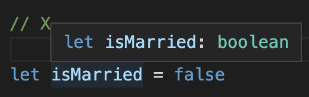
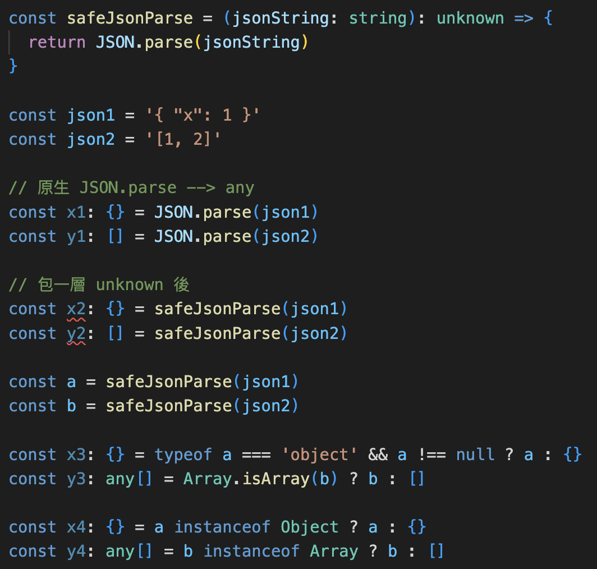
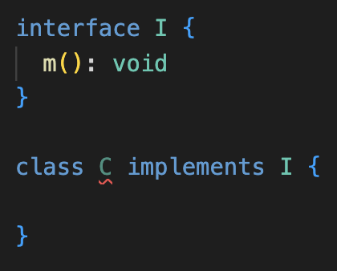

<style> 
.imgBox{
  display: flex; 
  flex-direction: column; 
  margin: 5%; 
  justify-content: center;
  border: 2px solid black;
}
</style>

<!--  style  -->

###### <!-- ref -->

[No BS TS]: https://youtu.be/LKVHFHJsiO0?list=PLNqp92_EXZBJYFrpEzdO2EapvU0GOJ09n
[generics best practice1]: https://javascript.plainenglish.io/mentor-typescript-is-a-virus-a8ed076f1de9
[Ts Config Helper]: https://tsconfiger.netlify.app/
[TS playground]: (https://www.typescriptlang.org/play)
[difference between typescript class and interface]: https://www.javatpoint.com/typescript-class-vs-interface
[what's the difference between 'extends' and 'implements' in typescript]: https://stackoverflow.com/questions/38834625/whats-the-difference-between-extends-and-implements-in-typescript
[鐵人賽片段 1]: https://ithelp.ithome.com.tw/articles/10218770#:~:text=%E5%96%AE%E4%BE%8B%E9%A1%9E%E5%88%A5%E7%9A%84%E7%B9%BC%E6%89%BF%20Singleton%20Class%20Inheritance
[can we inherit singleton class?]: https://stackoverflow.com/questions/3564758/can-we-inherit-singleton-class
[read-only properties in typescript]: https://mariusschulz.com/blog/read-only-properties-in-typescript
[zod]: https://github.com/colinhacks/zod
[ts docs]: https://www.typescriptlang.org/docs/handbook/typescript-in-5-minutes.html
[google ts style guide]: https://google.github.io/styleguide/tsguide.html
[鐵人賽 1]: https://ithelp.ithome.com.tw/articles/10214714
[ecmascript 相容表]: https://kangax.github.io/compat-table/es6/
[tsconfig doc]: https://aka.ms/tsconfig
[鐵人賽 2]: https://ithelp.ithome.com.tw/articles/10214719#:~:text=%22strictNullChecks%22%3A%20true%2C
[ts 變數 name]: https://www.jianshu.com/p/78268bd9af0a
[function signature]: https://developer.mozilla.org/en-US/docs/Glossary/Signature/Function
[function 誤區注意]: https://ithelp.ithome.com.tw/articles/10215270
[never & unknown]: https://blog.logrocket.com/when-to-use-never-and-unknown-in-typescript-5e4d6c5799ad/
[typescript 新手指南 (舊版 TS)]: https://willh.gitbook.io/typescript-tutorial/
[深入理解 typescript]: https://jkchao.github.io/typescript-book-chinese/
[methods for typescript runtime type checking]: https://blog.logrocket.com/methods-for-typescript-runtime-type-checking/
[type guard1]: https://medium.com/onedegree-tech-blog/typescript-%E4%B8%80%E4%BA%9B%E4%BB%A4%E4%BA%BA%E5%8F%88%E6%84%9B%E5%8F%88%E6%81%A8%E7%9A%84%E5%85%A7%E5%AE%B9-type-guard-narrowing-1655a9ae2a4d
[type guard2]: https://blog.logrocket.com/how-to-use-type-guards-typescript/
[top 50 typescript interview questions explained]: https://betterprogramming.pub/top-50-typescript-interview-questions-explained-5e69b73eeab1
[type vs interface]: https://www.typescriptlang.org/docs/handbook/2/everyday-types.html#differences-between-type-aliases-and-interfaces
["void return" in interface doesn't trigger error in "implementation"]: https://stackoverflow.com/questions/70546619/why-typescript-return-type-void-in-interface-doesnt-trigger-error-in-implementa
[C# Enum]: https://msdn.microsoft.com/zh-cn/library/sbbt4032.aspx
[In TypeScript an interface can extend a class, what for?]: https://stackoverflow.com/questions/39124915/in-typescript-an-interface-can-extend-a-class-what-for
[An Extended Class with All Members]: https://learn.microsoft.com/en-us/archive/msdn-magazine/2015/january/typescript-understanding-typescript#:~:text=Figure%206%20An%20Extended%20Class%20with%20All%20Members
[A Practical Guide to Use Extends in TypeScript]: https://www.becomebetterprogrammer.com/typescript-extends/

 <!-- ref -->

# TS 基礎

> DATE: 7 ~ 10 (2022) 、 5 (2023)
> REF: [TS Docs] | [google TS style guide] | [鐵人賽 1] | [typescript 新手指南 (舊版 TS)] | [深入理解 TypeScript] | [No BS TS]

 <!-- 工具 -->

- <details close>
  <summary>工具：</summary>

  - [ECMAScript 相容表]
  - [zod]：可協助檢查 API 回傳的 type
  - [TS playground]
  - [Ts Config Helper]

  </details>

## 0. 環境

<!-- 安裝 TS -->

- <details close>
  <summary>安裝 TS</summary>

  ```shell
  $ npm install -g typescript
  ```

  </details>

<!-- 初始化 TS -->

- <details close>
  <summary>初始化 TS</summary>

  ```shell
  $ tsc --init
  ```

  - `tsc`：使用 **TS Compiler** 的指令
  - 生成設定檔 `tsconfig.json`
  - [tsconfig doc]

  </details>

<!-- 編譯 TS 成 JS -->

- <details close>
  <summary>編譯 TS 成 JS</summary>

  - 即便有 `error`，依然會編譯成一份 JS

  - ```shell
    $ tsc index.ts
    ```

    - 編譯 `index.ts`，並生成 `index.js`

  - ```shell
    $ tsc
    ```

    - 掃描專案底下所有的 `.ts` 編譯生成對應的 `.js`
    - 以一個 `tsconfig.json` 為一個專案

      ```txt
      EX.

      ＊ Directory Structure:
      ---------------------------------

      project
      └── test1
          └── test1.ts
          └── tsconfig.json
      └── test2
          └── test2.ts
      └── test3.ts
      └── tsconfig.json
      ---------------------------------

      ＊ 在三種不同位置執行 "tsc":

      1) /project/
      $ tsc
      --> 生成 test1.js, test2.js, test3.js

      2) /project/test1/
      $ tsc
      --> 只生成 test1.js

      3) /project/test2/
      $ tsc
      --> 生成 test1.js, test2.js, test3.js
      ```

  </details>

<!-- import module -->

- <details close>
  <summary>import module</summary>

  - 目的：

    - 使用 es6 up，且 `import` 時不需加副檔名，且可以使用 `index.js`

    ```typescript
    // EX. 自動 import from "./@class/TicketSystem/index.js"
    import { TrainTicketSystem } from './@class/TicketSystem'
    ```

  - 目前的解法：

    - 將 es6 up 編譯成 commonJS
    - `tsconfig.json` 中設定（從 es2016 編譯成 commonJS）

    ```typescript
    "target": "es2016",
    "module": "commonjs",
    ```

    - `package.json` 中設定（因為最後是編譯成 commonJS）

    ```typescript
    "type": "commonjs",
    ```

  - TODO: 是否有解法可以編譯成 es6 up 且達成目的？

  </details>

<!-- tsconfig.json 常用設定 -->

- <details close>
  <summary><code>tsconfig.json</code> 常用設定</summary>

  - `"outDir": "./build"`：集中編譯後所有的 `.js` 在 "./build"

  </details>

<!-- 程式碼檢查 -->

- <details close>
  <summary>程式碼檢查工具</summary>

  - 因為程式碼檢查是專案的重要組成部分，所以我們一般會將 ESLint 安裝在當前專案中 (`--save-dev`)

  - TSC vs TSLint vs ESLint

  

  - TSLint & ESLint 的選擇

  

  </details>

---

## 1. 基本介紹

<!-- 型別檢查 -->

- <details close>
  <summary>型別檢查</summary>

  - 程式碼中，使用錯誤型別，會有 `紅色波浪狀底線` 標明錯誤資訊

  <div class="imgBox" >
    
  </div>

  - 編譯時，也會拋出 error

  <div class="imgBox" >
    
  </div>

  </details>

<!-- Type Annotation -->

- <details close>
  <summary>Type Annotation (註記)</summary>

  <!-- 3 種 Type Annotation 方式： -->

  - 3 種 Type Annotation 方式：

    <div class="imgBox" >
      
    </div>

    <!-- 差異：`第一種`(x4, x7) 方式一定要完全符合 -->

    - <details close>
      <summary>差異：<code>第一種</code> 方式一定要完全符合</summary>

      1. 不能有多餘的，如 z。 (x4)
      2. 一定要有 y。 (x7)

      <div class="imgBox" >
        
      </div>

      </details>

    <!-- 不能：三種皆不可只有多餘的（z），卻沒有該有的（y） -->

    - <details close>
      <summary>不能：三種皆不可只有多餘的（z），卻沒有該有的（y）</summary>

      <div class="imgBox" >
        
      </div>

      </details>

  <!-- 沒 Annotation ＋ 沒 Assign -->

  - <details close>
    <summary>沒 Annotation ＋ 沒 Assign</summary>

    - 此情況下，`Type Inference` 的結果會不斷改變（X1）

    <div class="imgBox" >
      
    </div>

    </details>

  </details>

<!-- Type Inference -->

- <details close>
  <summary>Type Inference (推論)</summary>

  - 在未使用 Type Annotation 時，也會自動推論其 type
  - 如下圖，變數並未註記 type，但 hover 時，有自動推論 type 為 `(string | number)[ ]`

    <div class="imgBox" >
      
    </div>

  <!-- Nullable Types -->

  - <details close>
    <summary><code>Nullable Types</code> --> <code>any</code></summary>

    - Nullable Types: `null`, `undefined`.. 等等
      <div class="imgBox" >
        
        
      </div>

    - Delayed Initialization 可視為初始化指派為 `undefined` --> `any`
      <div class="imgBox" >
        
      </div>

      - 若有 `Type Annotation` 則會形成 Temporal Dead Zone
        <div class="imgBox" >
          
        </div>

    </details>

  <!-- 自動進行檢查 -->

  - <details close>
    <summary>Type Inference --> 自動進行檢查</summary>

    - 即使沒有 Type Annotation，TS 自動認定其為 Type Inference 後的型別

      - 因為 Nullable Types --> any，所以可以再指派為任何型別，而其他的則已固定型別

        <div class="imgBox" >
          
        </div>

    </details>

  - <mark>杯論：</mark>
    - 因為有 Type Inference 功能，所以可以只在 `未立刻賦值` 或 `特殊需求的型別` 時，才使用 Type Annotation？

  </details>

<!-- 型別介紹 -->

- <details close>
  <summary>型別介紹</summary>

  <!-- Any -->

  - <details close>
    <summary>Any</summary>

    - 可以將 `any` assign 給任何 type 的變數，而不會報錯
    - X11：請參考 _Type Annotation / 沒 Annotation ＋ 沒 Assign_

    <div class="imgBox" >
      
    </div>

    </details>

  <!-- Object -->

  - <details close>
    <summary>Object</summary>

    <!-- 當 key 值為 Nullable Types，其 Type Inference 會明確定義 type，而不是 any -->

    - <details close>
      <summary>當 key 值為 Nullable Types，其 Type Inference 會明確定義 type，而不是 any</summary>

        <div class="imgBox" >
          
        </div>

      </details>

    <!-- & vs | -->

    - <details close>
      <summary><code>&</code> vs <code>|</code></summary>

      - `&`：必須都有
      - `|`：至少需有其中一個，剩下的 key 也必須包含在其他的 type

        <div class="imgBox" >
          
        </div>

      </details>

    <!-- type object vs 自定義 object type vs Type Inference -->

    - <details close>
      <summary><code>type object</code> vs <code>自定義 object type</code> vs <code>Type Inference</code></summary>

      - `Type Inference` 較接近 `自定義 object type`
      - `type object`：可覆寫成任何 JS object (包含 [], new Number().. etc)，但不能對該 object 的內部做更動

        <div class="imgBox" >
          
        </div>

      </details>

    - <details close>
      <summary><code>type {}</code> 等同 <code>type object</code></summary>

        <div class="imgBox" >
          
        </div>

      </details>

    </details>

  <!-- Function -->

  - <details close>
    <summary>Function</summary>

    <!-- 提醒 Implicit Any -->

    - <details close>
      <summary>提醒 <code>Implicit Any</code></summary>

      - 如圖 1，參數未指定 type ，則會報錯 `Implicit Any`。
      - 例如於圖 2 中，將參數指定為 any 後，雖可以正常編譯，但是可能就會產生 bug ，如 str2 會得到 number ，而不是其指定的 string。
      - 因此 `Implicit Any` 警告，可以協助預防此問題。

        <div class="imgBox" >
          
        </div>

      </details>

    <!-- Function type 檢查 -->

    - <details close>
      <summary>Function type 檢查</summary>

      - 會報錯：

        - 1. 變數的 type 改變
        - 2. 變數一樣是 function 但 回傳 type 改變
        - 3. 變數一樣是 function 但 參數 type 改變

      - 不會報錯：

        - 4. 參數消失了，被 TS 忽略，不會報錯
        - 5. 變數一樣是 function，參數、回傳的 type 都正確

      <div class="imgBox" >
        
      </div>

      </details>

    <!-- Function signature -->

    - <details close>
      <summary><a href="https://developer.mozilla.org/en-US/docs/Glossary/Signature/Function">Function signature</a></summary>

      - 函式簽章，定義 function 的 input & output 的 type
      - 只包含 type，而不包含 命名（object 的 key 才會包含命名）
      - 但 vscode 的顯示，會包含命名的部分（而實際上不包含）
      - 所以命名順序亂了，但 type 順序不亂 --> 檢查不報錯

      <div class="imgBox" >
        
      </div>

      </details>

    - <mark>杯論：</mark>

      - 是否必要維持所有的 function `output` 都做 Type Annotation？

        - 正論（所有都明寫）：

          - 可確保其型別沒被誤改
          - 可清楚從 code 中閱讀

        - 反論（只特殊情況寫）：

          - 通常 Type Inference 都能正確給出其型別
          - vscode 的提示，也可以閱讀
          - 因 Type Inference 正確，則 TS 也會列入檢查。

    </details>

  <!-- Array -->

  - <details close>
    <summary>Array</summary>

    <!-- Homogeneous Type Array (同質性陣列) -->

    - <details close>
      <summary>Homogeneous Type Array (同質性陣列)</summary>

      - Array 中只有一種 type
      - vs `Heterogenous Type Array`: Array 中不只一種 type

      ```typescript
      // 全數字: number[]
      const numbers = [1, 2, 3, 4, 5]

      // 全字串: string[]
      const strings = ['hi', 'go', 'to']

      // 數字混字串: (string | number)[]
      const numbers_strings = [1, '21', 123, 'asdf']
      ```

      </details>

    <!-- Mix Nested Arrary Type Inference -->

    - <details close>
      <summary>Mix Nested Arrary Type Inference</summary>

      - Type Inference 為個別型別，而不是自動融合
      - 例如下圖情況不會變成：`(string | number | boolean | null | undefined)[][]`

      <div class="imgBox" >
        
      </div>

      </details>

    </details>

  <!-- Tuple -->

  - <details close>
    <summary>Tuple</summary>

    - 對 Array 的每個項目定義固定的 type

    ```typescript
    // Type Inference  -->  Array: (number | boolean)[]
    const array = [1, 2, 3, false]

    // Tuple: [number, number, number, boolean]
    const tuple: [number, number, number, boolean] = [1, 2, 3, false]
    ```

    - 常見用法：

      <!-- 1. input 與 output 保持一致 -->

      - <details close>
        <summary>1. input 與 output 保持一致</summary>

        - 優：Tuple 比 object 便宜

        ```typescript
        type Vector = [number, number]

        const move = (v1: Vector, v2: Vector): Vector => {
          const [x1, y1] = v1
          const [x2, y2] = v2
          return [x1 + x2, y1 + y2]
        }

        console.log(move([0, 0], [5, 10]))
        console.log(move([10, 0], [3, 7]))
        ```

        </details>

      <!-- 2. 模仿 Python 的 Tuple -->

      - <details close>
        <summary>2. 模仿 Python 的 Tuple</summary>

        - 使用 `Readonly` 讓內容物不得更改

        ```typescript
        type Tuple = Readonly<[number, string]>

        const x: Tuple = [1, 'yes']

        // 以下會發生錯誤
        x[0] = 10
        x[1] = 'No'
        ```

        </details>

    </details>

  <!-- Enum -->

  - <details close>
    <summary>Enum</summary>

    - TypeScript Enum 的概念來源於 [C# Enum]

    <!-- 型別 -->

    - <details close>
      <summary>型別</summary>

      ```typescript
      enum WeekDay {
        Sun,
        Mon,
      }

      const day = WeekDay[0] // type: string --> Sun
      const nthDay = WeekDay.Sun // type: WeekDay --> 0
      ```

      </details>

    <!-- 反射性 -->

    - <details close>
      <summary>反射性</summary>

      ```typescript
      enum WeekDay {
        Sun,
        Mon,
      }

      // WeekDay[0] === "Sun"
      // WeekDay["Sun"] === 0
      ```

      </details>

    <!-- 元素不重複 -->

    - <details close>
      <summary>元素不重複</summary>

      ```typescript
      // 以下會發生錯誤：不能有兩個 Sun
      enum WeekDay {
        Sun,
        Mon,
        Sun,
      }
      ```

      </details>

    <!-- 唯讀：建立 enum 之後，就不能再對他做更改 -->

    - <details close>
      <summary>唯讀：建立 enum 之後，就不能再對他做更改</summary>

      ```typescript
      enum WeekDay {
        Sun,
        Mon,
      }

      // 以下都會發生錯誤：
      WeekDay = { XXXX }
      WeekDay[5] = 'XXX'
      WeekDay.Sun = 2
      WeekDay.XXX = 3
      ```

      </details>

    <!-- 取值 ＆ 賦值 -->

    - <details close>
      <summary>取值 ＆ 賦值</summary>

      ```typescript
      enum WeekDay {
        Sun,
        Mon,
      }

      let day: string = WeekDay[0]
      console.log(WeekDay[day]) // 會發生錯誤，不可用 day 來當 key 取值
      day = 'lalala'

      let n: WeekDay = WeekDay.Fri
      console.log(WeekDay[n])
      n = 9
      ```

      </details>

    <!-- 用於參數 -->

    - <details close>
      <summary>用於參數</summary>

      ```typescript
      enum WeekDay {
        Sun,
        Mon,
      }

      const fn = (x: WeekDay) => {
        if (x !== WeekDay.Sun) fn(WeekDay.Sun)
        return
      }

      fn(WeekDay.Sun)
      fn(WeekDay.Mon)

      // 以下會發生錯誤： 只能傳 type 為 WeekDay 的參數
      fn(WeekDay.La)
      fn('s')
      ```

      </details>

    <!-- Enum 初始化 -->

    - <details close>
      <summary>Enum 初始化</summary>

      - 好習慣：要馬全部初始化，要馬全部沒有

      <div class="imgBox" >
        
      </div>

      </details>

    <!-- const enum -->

    - <details close>
      <summary><code>const enum</code></summary>

      - `const enum`編譯後只留下常數
      - 賦值也只能給固定的 number 或 string

      ```typescript
      // EX.
      const enum E1 {
        X,
        Y,
        Z = 'zz',
      }
      enum E2 {
        X,
        Y,
        Z = 'zz',
      }

      const arr1 = [E1.X, E1.Y, E1.Z]
      const arr2 = [E2.X, E2.Y, E2.Z]
      ```

      ```js
      // EX.編譯結果：
      let E2
      ;(function (E2) {
        E2[(E2['X'] = 0)] = 'X'
        E2[(E2['Y'] = 1)] = 'Y'
        E2['Z'] = 'zz'
      })(E2 || (E2 = {}))
      const arr1 = [0 /* E1.X */, 1 /* E1.Y */, 'zz' /* E1.Z */]
      const arr2 = [E2.X, E2.Y, E2.Z]
      ```

      </details>

    </details>

  <!-- never & unknown -->

  - <details close>
    <summary>never & unknown</summary>

    > REF: [never & unknown]

      <!-- never -->

    - <details close>
      <summary>never</summary>

      <!-- 為所有 type 的 subtype -->

      - <details close>
        <summary>為所有 type 的 subtype</summary>

        ```typescript
        // 等同於 let x: T
        // (T 可以是任何 type)
        let x: T | never
        ```

        - Type Inference 小差異（原因待查）

        <div class="imgBox" >
          
        </div>

        </details>

      <!-- 可以 assign 給任何其他 type -->

      - <details close>
        <summary>可以 assign 給任何其他 type</summary>

        <div class="imgBox" >
          
        </div>

        </details>

      <!-- Type Annotation 只能用在 compile 階段即確認是 never 的情況 -->

      - <details close>
        <summary>Type Annotation 只能用在 compile 階段即確認是 never 的情況</summary>

        <div class="imgBox" >
          
        </div>

        </details>

      </details>

      <!-- unknown -->

    - <details close>
      <summary>unknown</summary>

      <!-- `unknown` is the type-safe counterpart of `any`. -->

      - `unknown` is the type-safe counterpart of `any`.

      <!-- 為所有 type 的 supertype -->

      - <details close>
        <summary>為所有 type 的 supertype</summary>

        ```typescript
        // 等同於 let x: T
        // (T 可以是任何 type)
        let x: T & unknown
        ```

        - Type Inference 小差異（原因待查）

        <div class="imgBox" >
          
        </div>

        </details>

      <!-- 通過 `Type Guard` 後，才能使用 -->

      - <details close>
        <summary>通過 <code>Type Guard</code> 後，才能使用</summary>

        - 才能 assign 給其他 type 的變數

        <div class="imgBox" >
          
        </div>

        - 才能進行個別 type 的操作（ex.`+ - * /`）

        <div class="imgBox" >
          
        </div>

        </details>

      <!-- (X) 直接進行轉型 -->

      - <details close>
        <summary>(X) 直接進行轉型</summary>

        - 不建議使用
        - 直接轉型，不會進行檢查、提醒、報錯。
        - 只在很確定他的 type 時，才可使用 ( <-- 既然可以確定，那麼在更之前就應該註記成正確的 type，而不是用 unknown )

        ```typescript
        const UNKNOWN: unknown = ''
        const n1: number = UNKNOWN as number
        const n2: number = <number>UNKNOWN
        ```

        </details>

      <!-- unknown 使用情境範本 -->

      - <details close>
        <summary>unknown 使用情境範本</summary>

        <div class="imgBox" >
          
        </div>

        </details>

      </details>

      <!-- never VS any VS unknown -->

    - <details close>
      <summary>never VS any VS unknown</summary>

      - 暫時推論：

        - 右半部以 subtype 的形式，形成一個系統。而 `any` 包含 `never` 之外的所有。

        <div class="imgBox" >
          
        </div>

        - 以 (1)(2)(3) 規則按照優先順序遵守，`never` > `any` > `unknown`

        <div class="imgBox" >
          
        </div>

      </details>

    </details>

  <!-- class -->

  - <details close>
    <summary>class</summary>

    <!-- 需保證所有的 Member Variable (Property) 都有註記＆值 -->

    - <details close>
      <summary>需保證所有的 Member Variable (Property) 都有註記＆值</summary>

      - 必須有型別註記 ( line 6, 14, 21：未註記 `name` )
      - 必須 初始化 或是 從 constructor 賦值 ( line 10：`mobile` 未賦值 )
      - 必須傳值給 constructor 進行 賦值 ( line 27：`age` 未傳值且無預設值 )

      <div class="imgBox" >
        
      </div>

      </details>

    <!-- class 的 Type 判定並非由「是誰的 instance」來比較，而是由「instance 的內容是否符合」來比較 -->

    - <details close>
      <summary>class 的 Type 判定並非由「是誰的 instance」來比較，而是由「instance 的內容是否符合」來比較</summary>

      > 1. 幾乎可將其視為 `object type` 來做比較
      > 2. `instance` 只需涵括 `class type` 的所有內容即可

      - 1. 只要由「完全相同的 class member（propery & method）」的 class 所產生的 instance，TS 將認定為相同 `type`

      <div class="imgBox" >
        
      </div>

      - 2. 可能 `instanceof` 不同，但 TS 認定相同 `type`

      <div class="imgBox" >
        
      </div>

      - 3. 只要擁有「完全相同的 propery & method」的 object，也會被 TS 認定與對應的 `class type` 為一樣的 `type`

      <div class="imgBox" >
        
      </div>

      - 4. 如果是各自定義的 `private` | `protected`，則視為不同

      <div class="imgBox" >
        
      </div>

      - 5. instance 比 class type 多出 member，也會被 TS 錯誤判定忽略

      <div class="imgBox" >
        
      </div>

      </details>

    <!-- implements -->

    - <details close>
      <summary>implements</summary>

      - 建議 implements `interface` 而不是 `type`

      - 實作 method 的 type 必須與定義的 type 相符

      <div class="imgBox" >
        
      </div>

      - 實作未如 type 定義回傳 `void`，不會報錯

        > REF: ["void return" in interface doesn't trigger error in "implementation"]

      <div class="imgBox" >
        
      </div>

      - 必須實作所有已定義的 method type

      <div class="imgBox" >
        
      </div>

      - 實作可以多出 type 中未定義的 method

      <div class="imgBox" >
        
      </div>

      </details>

    <!-- Access Modifiers（存取修飾子） -->

    - <details close>
      <summary>Access Modifiers（存取修飾子）</summary>

      <!-- 三種 Access Modifiers -->

      - <details close>
        <summary>三種 Access Modifiers</summary>

        - `public`：公開（預設）
        - `private`：唯此 class 存取
        - `protected`：繼承 class 皆可存取

        </details>

      <!-- 若繼承至 interface，則只能為 public -->

      - <details close>
        <summary>若繼承至<code>interface</code>，則只能為 <code>public</code></summary>

        <div class="imgBox" >
          
        </div>

        </details>

      <!-- private ＆ protected 都只是 TS 在編譯時做檢查，依然可以被繞過存取 -->

      - <details close>
        <summary><code>private</code>＆<code>protected</code>都只是 TS 在編譯時做檢查，依然可以被繞過存取</summary>

        - 若要阻止被外部存取，得用 js class `#屬性`

        <div class="imgBox" >
          
        </div>

        </details>

      <!-- 自動綁定 `this` -->

      - <details close>
        <summary>參數自動綁定 <code>this</code> 屬性</summary>

        - 在`constructor`參數定義`Access Modifiers`，等同於定義`class`中的屬性，並自動綁定`this.a = a`
        - 以下兩段 code 編譯後，相等

        ```typescript
        class C {
          constructor(private a: string) {}
        }
        ```

        ```typescript
        class C {
          private a: string

          constructor(a: string) {
            this.a = a
          }
        }
        ```

        </details>

      </details>

    <!-- static -->

    - <details close>
      <summary>static</summary>

      - class 本身的屬性與方法，為「靜態」屬性與方法
      - 因為不管從 class 產生出任何 object，static 不變 --> 「靜態」

      ```typescript
      // 1. static（靜態）
      class CircleS {
        private static readonly PI = 3.14

        static calArea(radius: number): number {
          return CircleS.PI * radius ** 2
        }
      }

      const circle1 = new CircleS()
      const area11 = circle1.calArea(100) // [error]
      const area12 = CircleS.calArea(100) // 31400

      // 2. 一般（動態）
      class Circle {
        private readonly PI = 3.14

        constructor(public radius: number) {}

        public calArea(): number {
          return this.PI * this.radius ** 2
        }
      }

      const circle2 = new Circle(100)
      const area21 = circle2.calArea() // 31400
      const area22 = Circle.calArea(100) // [error]
      ```

      - `this`:
        - 在 static method 中，`this` 為 class 本身
        - 在 method 中，`this` 為 instance 本身

      ```typescript
      class Test {
        constructor(private x: object) {}

        private static x: object = {}

        static staticMethod() {
          console.log(Test.x === this.x) // true
        }

        method() {
          console.log(Test.x === this.x) // false
        }
      }
      ```

      </details>

    <!-- Accessors (Getter / Setter) -->

    - <details close>
      <summary>Accessors (Getter / Setter)</summary>

      <!-- Getter -->

      - <details close>
        <summary>Getter</summary>

        - 只能讀取
        - 會隨著 property 變動
        - 不能有參數，必須有回傳值

        ```typescript
        class Circle1 {
          private readonly PI = 3.14

          constructor(public radius: number) {}

          get area(): number {
            return this.PI * this.radius ** 2
          }
        }

        const circle = new Circle1(100)
        const area11 = circle.area
        circle.radius = 200
        const area12 = circle.area
        console.log(area11, area12) // 31400, 125600

        circle.area = 123 // [error]
        ```

        </details>

      <!-- Setter -->

      - <details close>
        <summary>Setter</summary>

        - 可以使其 set 後產生 side effect (ex. 改變面積後，自動改變半徑)
        - 必須有唯一參數，即為 assign 到該屬性的值
        - 不能有回傳值
        - 直接用 `=` 賦值，且會做 type 檢查

        ```typescript
        class Circle2 {
          private readonly PI = 3.14

          constructor(public radius: number) {}

          get area(): number {
            return this.PI * this.radius ** 2
          }

          set area(value: number) {
            this.radius = (value / this.PI) ** 0.5
          }
        }

        const circle2 = new Circle2(100)
        const area21 = circle2.area
        circle2.area = 70650
        const area22 = circle2.area
        const radius = circle2.radius
        console.log(area21, area22, radius) // 31400, 70650, 150

        circle2.area = '70650' // [error]
        ```

        </details>

      <!-- Accessors 基本上可以使用 Type Inference 不會出錯 -->

      - <details close>
        <summary>Accessors 基本上可以使用 Type Inference 不會出錯</summary>

        ```typescript
        class Circle2 {
          private readonly PI = 3.14

          constructor(public radius: number) {}

          get area() {
            return this.PI * this.radius ** 2
          }

          set area(value) {
            this.radius = (value / this.PI) ** 0.5
          }
        }
        ```

        </details>

      </details>

    <!-- implements VS extends -->

    - <details close>
      <summary><code>implements</code> VS <code>extends</code></summary>

      > REF:
      >
      > 1. [What's the difference between 'extends' and 'implements' in TypeScript]
      > 2. [Difference between TypeScript Class and Interface]

      - `extends`: "inheritance", "child", 已擁有所有 parent 內容
      - `implements`: "polymorphism", "same shape", 須自己實作內容

      - 1. 只能 `implements` 只有 `public` 的 `class`

      <div class="imgBox" >
        
      </div>

      - 2. `extends` 已擁有 parent 的一切，可以不用再自己實作。而 `implements` 需要實作

      <div class="imgBox" >
        
      </div>

      - 3. 一次只能 `extends` 一個 class。而可以 `implements` 多個。

      <div class="imgBox" >
        
      </div>

      </details>

    <!-- abstract class -->

    - <details close>
      <summary><code>abstract class</code></summary>

      - 不能產生實例的 `class`

      ```typescript
      abstract class C {}

      // Error: 不能用來產生實例
      const instance = new C()
      ```

      - 可使用 `abstract` 方法 (只有 `abstract class` 可用)

      ```typescript
      abstract class C1 {
        abstract x: string
      }

      // Error: 必須實作 abstract member
      // (x: string)
      class C2 extends C1 {}
      ```

      - 不能同時是 `private` & `abstract`

      ```typescript
      // Error: 不能同時是 `private` & `abstract`
      abstract class C1 {
        private abstract x: string
      }
      ```

      </details>

    </details>

  </details>

---

## 2. 基本方法

<!-- Literal Types -->

- <details close>
  <summary>Literal Types</summary>

  - 直接將 type 以明文方式註記

  ```typescript
  // EX.
  // Object Literal Type
  const obj: { x: number; y: string } = { x: 1, y: '' }

  // Function Literal Type
  const fn: (param: number) => number = (param) => param * 2
  ```

  </details>

<!-- Type Assertions -->

- <details close>
  <summary>Type Assertions (斷言)</summary>

  - 兩種方法：`<>`, `as`

  ```typescript
  // EX.
  const obj1 = { x: 1, y: '' } as { x: number; y: string }
  const obj2 = <{ x: number; y: string }>{ x: 1, y: '' }
  ```

  - 不管是否內容完全符合 type，直接斷定為該 type （可能是 未完成 或是 有多餘）

  ```typescript
  // 多餘 --> Pass
  const obj1 = { x: 1, y: '', z: 1 } as { x: number; y: string }
  // 未完成 --> Pass
  const obj2 = { x: 1 } as { x: number; y: string }
  // 錯誤 --> Error
  const obj3 = { x: '' } as { x: number; y: string }
  ```

  - `as` 串
    - 以最後一次為該變數的 type
    - 只在意相鄰的兩次 as，只需兩者有交集即可（前者包含後者 | 後者包含前者）

  <div class="imgBox" >
    
  </div>

  </details>

<!-- Type Alias -->

- <details close>
  <summary>Type Alias</summary>

  - 以變數形式，定義 `type`
  - 減少 code 畫面上的複雜度
  - 抽象化，重複使用

  ```typescript
  // EX.
  // Object Type Alias
  type OBJ = { x: number; y: string }
  const obj: OBJ = { x: 1, y: '' }

  // Function Type Alias
  type FN = (param: number) => number
  const fn: FN = (param) => param * 2
  ```

  - **[Function 誤區注意]**

    - 大部分情況下，input object 只需滿足 `有包含 function 定義的 param object 的所有 key`
    - 討論點正方：
      - 如此情況，照理說應該並無影響，只要該有的都有即可
      - 符合 js 的彈性使用特性
    - 討論點反方：
      - `type` 應該為 `靜態格式`，如此的彈性功能應該只在於 `interface`

  <div class="imgBox" >
    
  </div>

  </details>

<!-- Interface -->

- <details close>
  <summary>Interface</summary>

  <!-- 三種形式 -->

  - <details close>
    <summary>三種形式</summary>

    <!-- Object -->

    - <details close>
       <summary>Object</summary>

      </details>

    <!-- Function -->

    - <details close>
       <summary>Function</summary>

      </details>

    <!-- Index Signatures -->

    - <details close>
       <summary>Index Signatures (舊：Indexable Types)</summary>

      - index 只能是 number, string, symbol 三種
      - Index Signatures(array) VS type Array

        <div class="imgBox" >
          
        </div>

        <div class="imgBox" >
          
        </div>

      </details>

    ```typescript
    // Object
    interface OBJ1 {
      x: number
      y: (p1: string) => void
      z: string
    }

    // Function
    interface FN1 {
      (p1: number): void
    }

    // Index Signatures ( ex. ["a", "b"] )
    interface StringArray1 {
      [index: number]: string
    }
    ```

    </details>

  <!-- extends -->

  - <details close>
    <summary><code>extends</code></summary>

    - 基本用法

    ```typescript
    // interface newInterface extends I1, I2, ... In {}

    interface I1 {
      a: number
      b: string
    }

    interface I2 {
      c?: number
      d?: string
    }

    interface I3 extends I1, I2 {
      e?: number[]
    }

    const test: I3 = { a: 1, b: '', c: 1, e: [1, 2] }
    ```

    - extends 來源，不能有衝突

    ```typescript
    interface I1 {
      a: number
      b: string
    }

    interface I2 {
      a: number
    }

    interface I3 {
      a?: number
    }

    interface I4 {
      a: string
    }

    interface NI1 extends I1, I2 {}
    interface NI2 extends I1, I3 {} // error
    interface NI3 extends I1, I4 {} // error
    ```

    </details>

  <!-- interface VS type -->

  - <details close>
    <summary><code>interface</code> VS <code>type</code></summary>

    - `Type Inference` 的細部規則相似

    - 意義上：
      - `type` --> 獨立的靜態型別
      - `interface` --> 可擴充、組合的規格

    </details>

  <!-- Interface Merging -->

  - <details close>
    <summary>Interface Merging</summary>

    - `Declaration Merging` 的一種
    - 定義同名稱的 `interface`
      - 最後結果為所有的「交集」
      - 重複的屬性，型別必須不衝突
      - 不能參雜 `type`
    - <mark>杯論：</mark>學習到 `namespace` 後再回頭看 `Interface Merging` 的應用 (MiddleWare)

    ```typescript
    interface Box {
      height: number
      width: number
    }
    interface Box {
      scale: number
    }
    const box1: Box = { height: 5, width: 6, scale: 10 }
    const box2: Box = { height: 5, width: 6 } // Error，因為缺少 scale
    ```

    ```typescript
    interface Box {
      height: number
      width: number
    }
    interface Box {
      scale: number
      height: string // Error，因為前面已定義 height: number
    }
    ```

    ```typescript
    // Error: 不能參雜 type
    type Box = {
      height: number
      width: number
    }
    interface Box {
      scale: number
    }
    ```

    </details>

  <!-- Hybrid Type Interface -->

  - <details close>
    <summary>Hybrid Type Interface</summary>

    > [REF](https://stackoverflow.com/questions/32016275/create-class-from-hybrid-interface-type)

    - 看起來就是 js class 前身

    ```typescript
    // EX.
    interface Counter {
      (start: number): string

      interval: number
      reset(): void
    }

    function getCounter(): Counter {
      const counter = function (start: number) {} as Counter

      counter.interval = 123
      counter.reset = () => {}

      return counter
    }

    const c = getCounter()
    c(10)
    c.reset()
    c.interval = 5
    ```

    </details>

  <!-- 介面繼承類別的用途 -->

  - <details close>
    <summary>interface 繼承 class 的用途</summary>

    - EX. Generics (泛型)

      ```typescript
      class Map<T> {
        private _items: { [key: string]: T }

        set(key: string, value: T) {}

        has(key: string): boolean {}

        get(key: string): T {}

        remove(key: string): T {}
      }

      interface NumberMap extends Map<number> {}
      interface StringMap extends Map<string> {}
      interface BooleanMap extends Map<boolean> {}

      function stringsHandler(map: StringMap) {}
      ```

    - EX. Factory (工廠模式) (GPT 所給，但我覺得這個舉例怪怪的)

      ```typescript
      abstract class Animal {
        abstract makeSound(): void
      }

      interface AnimalFactory extends Animal {
        createAnimal(): Animal
      }

      class Dog extends Animal {
        makeSound(): void {
          console.log('Woof!')
        }
      }

      class Cat extends Animal {
        makeSound(): void {
          console.log('Meow!')
        }
      }

      class AnimalFactoryImpl implements AnimalFactory {
        createAnimal(): Animal {
          // 根據某些邏輯返回不同的動物實例
          return new Dog()
        }

        makeSound(): void {
          console.log('Factory making sound...')
        }
      }

      const factory: AnimalFactory = new AnimalFactoryImpl()
      const animal: Animal = factory.createAnimal()
      animal.makeSound() // 輸出 "Woof!"
      ```

    </details>

  </details>

<!-- Optional Property Annotation -->

- <details close>
  <summary>Optional Property Annotation (<code>?</code>)</summary>

  - 使用 `?` 記註為 `Optional Property`
  - 直接用 `undefined` ，依然需給他的值初始化為 `undefined` 才可

  <div class="imgBox" >
    
  </div>

  </details>

<!-- readonly -->

- <details close>
  <summary><code>readonly</code></summary>

  ```typescript
  type T = {
    readonly x: number
    readonly y: string
    readonly o1: { a: number }
    z: number
    u: string
    o2: { a: number }
  }

  const obj: T = {
    x: 1,
    y: 'y',
    o1: { a: 1 },
    z: 2,
    u: 'u',
    o2: { a: 9 },
  }
  obj.x = 2 // error
  obj.y = 'x' // error
  obj.o1 = { a: 2 } // error
  obj.o1.a = 2
  obj.z = 1
  obj.u = 'z'
  obj.o2 = { a: 8 }
  obj.o2.a = 7
  ```

  </details>

<!-- Namespace(old) -->

- <details close>
  <summary>Namespace (old)</summary>

  - 用來隔離命名空間。
  - 在同 namespace 中，等於沒有用 namespace 隔離開 export 的內容
  - 舊時代產物，被 import/export 取代

    

  - 同一個 namespace，可以通用

    - 順序無差
    - 需要 export

    

  - 同一個 namespace，必須在 export / local 二選一

    

  - Triple Slash Directive 引用：`/// <reference path="" />`

  </details>

<!-- Declaration Files（宣告檔案） -->

- <details close>
  <summary>Declaration Files（宣告檔案）</summary>

  - 幫套件建立宣告檔案

    - 可以幫第三方 JS 套件加上 Declaration Files，使其成為有 type 的套件

    - 步驟：

      - 1. 先確認是否已有 Declaration Files (不需要額外安裝其他包)，可以檢查：

        - (1) `package.json` 是否有 `types` 屬性
        - (2) 是否有 `index.d.ts` 檔案

      - 2. 檢查：

        - (1) 是否有 `@types` 資料夾，是否有 Declaration Files

          - 可以透過 npm 下載 `@types`

            ```sh
            # EX. 下載 jquery 的 @types
            npm install @types/jquery --save-dev
            ```

        - (2) 是否有現成的 Declaration Files：[現成 1](https://www.npmjs.com/~types)、[現成 2](https://github.com/DefinitelyTyped/DefinitelyTyped)。

      - 3. 如果都沒有，就要自己建立，建議：

        - 建立一個資料夾為 `types` 或 `@types`
        - 並在 `tsconfig.json` 中設定 `typeRoots` 或 `paths ＋ baseUrl` 。

          - 範例：

            

        - (1) 直接發 PR 回第三方套件跟程式碼放在一起 (2) 提交到 @types

  - <mark>TODO:</mark> typeroot

  

  </details>

<!-- Generics (泛型) -->

- <details close>
  <summary>Generics (泛型)</summary>

  - REF: [generics best practice1]

    - It’s important to note that complex generics typically reside in utility code rather than throughout the entire project.

  <!-- Generics Constraints (泛型約束) -->

  - <details close>
    <summary>Generics Constraints (泛型約束)</summary>

    - 使用 `extends`

    - 使用場景

      - EX.1 使用 Lengthwise 限制傳入參數一定要有 `<number>length` 屬性

        ```typescript
        interface Lengthwise {
          length: number
        }

        function loggingIdentity<T extends Lengthwise>(arg: T): T {
          console.log(arg.length)
          return arg
        }
        ```

      - EX.2 讓兩個參數型別有依賴限制，T 一定要包含 U 的屬性

        ```typescript
        function copyFields<T extends U, U>(target: T, source: U): T {
          for (const id in source) {
            target[id] = (source as T)[id]
          }

          return target
        }

        const objX = { a: 1, b: 2, c: 3 }
        const objY = { b: 20, c: 30 }

        copyFields(objX, objY)
        ```

    </details>

  <!-- Generics & Interface -->

  - <details close>
    <summary>Generics & Interface</summary>

    - bad

      - 我認為不好的寫法
      - EX. 會生成 `any[]`

      

    - good

      - 我認為較好的寫法

      - 1. 將 generics 定義在 interface 的 function 上：

      

      - 2. 將 generics 定義在 interface 上，兩種做法：
           (1) 每個 function 是獨立的，只是共用 interface 的模樣 (沒寫範例)
           (2) function 可以只寫一次，但不同 type 則須分開定義，變成數個 function (如範例)

      

    </details>

  <!-- Constraints -->

  - <details close>
    <summary>Constraints</summary>

    - 看起來即便 `T extends U`，TS 也無法理解 T 一定會有 U 的所有屬性
    - 因為 `const id in source` 在執行階段才進行 (但是 `typeof` 有被列入靜態辨認，此處是否也應該可以列入？)

    

    </details>

  </details>

---

## 3. 特殊用法

<!-- Function Overload -->

- <details close>
  <summary>Function Overload</summary>

  - 可以在同一個 function 設定不同參數型別時，做不同動作
  - 使用時，必須符合其中一種設定 (EX. `add1(1, '2')` 會 Error)
  - 必須以 Type Guard 區分出所有設定的 function type
  - `type` & `interface` 皆可，但建議只在 `interface` 使用此方法

  <div class="imgBox" >
    
  </div>

  </details>

<!-- Declaration Merging -->

- <details close>
  <summary>Declaration Merging</summary>

  </details>

---

## 4. 設計模式

<!-- 設計原則 -->

- <details close>
  <summary>設計原則</summary>

  > REF：深入淺出設計模式

  - 找出應用程式中`會變的部分`，把他們和`不會變的部分`隔開 (p9)

  - 針對`介面`寫程式，而不是針對`實作`寫程式 (p11)

  - 多用`組合`，少用`繼承` (p23)

  - 努力為彼此互動的物件做出`低耦合`的設計 (p54)

  - `class` 應該歡迎擴展，但拒絕修改 (p86)

    - 開放/封閉原則
    - 並非將所有都做設計，而是選擇 `最可能改變的部分` 做設計

  - `Dependency Inversion Principle`：要依賴`抽象`，不要依賴`具體類別` (p139)

    - 依賴反轉原則
    - 高階的組件不該依賴低階的組件，而是兩者皆依賴`Abstract`
    - 遵守方法：
      - 任何變數都不應該保存具體類別的參考
      - 任何類別都不應該從具體類別衍生出來
      - 任何方法都不應該覆寫基底類別的任何已實作的方法

  </details>

<!-- Singleton (單例模式) -->

- <details close>
  <summary>Singleton (單例模式)</summary>

  <!-- 「直接使用 `instance`」 VS 「使用 `getInstance()`」 -->

  - <details close>
    <summary>「直接使用 `instance`」 VS 「使用 `getInstance()`」</summary>

    - TODO: 是否有優劣？

    - 方法 A：直接使用 `instance`

    ```typescript
    class Singleton {
      private constructor(
        public readonly name: string,
        public readonly age: number
      ) {}

      static readonly instance: Singleton = new Singleton('Ocup', 18)
    }

    const a = Singleton.instance
    const b = Singleton.instance
    console.log(a === b) // true
    ```

    - 方法 B：使用 `getInstance()`

    ```typescript
    class Singleton {
      private constructor(
        public readonly name: string,
        public readonly age: number
      ) {}

      private static instance: Singleton = new Singleton('Ocup', 18)

      static getInstance(): Singleton {
        return Singleton.instance
      }
    }

    const a = Singleton.getInstance()
    const b = Singleton.getInstance()
    console.log(a === b) // true
    ```

    </details>

  <!-- Lazy Initialization in Singleton -->

  - <details close>
    <summary>Lazy Initialization in Singleton</summary>

    - 當第一次 getInstance 時，再產生 instance，避免造成浪費

    ```typescript
    class LazySingleton {
      private constructor(
        public readonly name: string,
        public readonly age: number
      ) {}

      private static instance: LazySingleton

      static getInstance(): LazySingleton {
        if (!LazySingleton.instance) {
          LazySingleton.instance = new LazySingleton('Ocup', 18)
        }

        return LazySingleton.instance
      }
    }
    ```

    </details>

  - TODO: `inherit` Singleton 的問題

    - [鐵人賽片段 1]
    - [Can we inherit singleton class?]

  </details>

<!-- Strategy (策略模式) -->

- <details close>
  <summary>Strategy (策略模式)</summary>

  > 使能夠："Changing algorithm during runtime."
  > `策略模式`可以定義和封裝一系列的演算法，並且讓他們是可替換的。這個模式可以讓你在不影響用戶端的情況下獨立改變演算法。 (p24)

  - 利用 `interface` 可自行組合，重複使用邏輯

  </details>

<!-- Abstract (抽象模式) -->

- <details close>
  <summary>Abstract (抽象模式)</summary>

  </details>

<!-- Observer (觀察者模式) -->

- <details close>
  <summary>Observer (觀察者模式)</summary>

  - 「一對多」關係的解法（ 一個發布者 subject ＋ 多個訂閱者 observer ）
  - 定義物件之間的一對多依賴關係，當一個物件改變狀態時，依賴他的物件都會自動收到通知與更新

  </details>

<!-- Factory (工廠模式) -->

- <details close>
  <summary>Factory (工廠模式)</summary>

  - 使用時機：不直接使用 `new` 時，用工廠將其封裝起來
  - 「實例化 new」有時不該公開進行 --> 因為容易導致耦合

  - Static Factory

    - 優：使用時不需再實例化
    - 缺：不能被繼承擴充

  - Factory Method Pattern

    - 定義：工廠方法模式定義了一個創建物件的介面，但是他讓子類別決定想要實例化哪一個類別。工廠方法可讓一個類別將實例化的動作推遲到子類別。
    - 工廠方法可以處理物件的建立，並將這項工作封裝在子類別裡面。他可以將超類別裡面的用戶端程式碼和子類別裡面的建立物件程式碼解耦合。 (p125)
    - Creator(超類別) 中，有一個 Factory Method，用來生產產品。其他 method，都是用來處理該產品。而 Factory Method，是在 ConcreteCreator(子類別) 中實作

  </details>

## 5. 其他補充

- 暫記：

  - TypeScript 擴充型別：即 Enum 與 Tuple，內建在 TypeScript

  <!-- 其他 -->

  - <details close>
    <summary>其他</summary>

    - union (聯集)

      - (string | number)

    - intersection（交集）

      - (string & number)

    - Generics 泛用型別

    - [Indexable Types](https://www.typescriptlang.org/docs/handbook/interfaces.html#indexable-types)

    </details>

- 注意事項：

  <!-- `"strictNullChecks": true` 的優劣？ -->

  - <details close>
    <summary><code>"strictNullChecks": true</code> 的優劣？</summary>

    - [鐵人賽 2] 建議 `true`
    - default `true`
    - `true` 有什麼好處、什麼必要？

    </details>

  <!-- TS 變數 name -->

  - [TS 變數 name]

  <!-- 編譯成 JS 後，都不再具有功效 -->

  - 基本上 TS 的部分都是在 compile 階段使用，編譯成 JS 後，都不再具有功效

    > REF: [Read-Only Properties in TypeScript]

- 小技巧：

  - [Methods for TypeScript runtime type checking]

  - [Type Guard1] | [Type Guard2]

    - 碰到 union 過後的型別，多數狀況下我們必須主動使用 Type Guard

- 延伸閱讀：

  - [Top 50 TypeScript Interview Questions Explained]

    - What are decorators, and what can they be applied to?

## 5. 延伸討論

<!-- interface 繼承 class 的用途 -->

- <details close>
  <summary>interface 繼承 class 的用途</summary>

  > REF:
  >
  > 1. [In TypeScript an interface can extend a class, what for?]
  > 2. [An Extended Class with All Members]
  > 3. [A Practical Guide to Use Extends in TypeScript]

  - 有時不需要再多出一個中間 class (不需要藉由他 new instance)，因此可用 interface extend。<mark>TODO:Q</mark> 為何不用 abstract 代替？

  - java 不能： interface extend class。<mark>TODO:Q</mark> java 是以什麼方式達到 TS 這波操作一樣的效果？是否為較麻煩的不必要？還是更好的做法？

  - GPT (<mark>TODO:Q</mark> 舉例部分，合理性？)

    

  </details>
