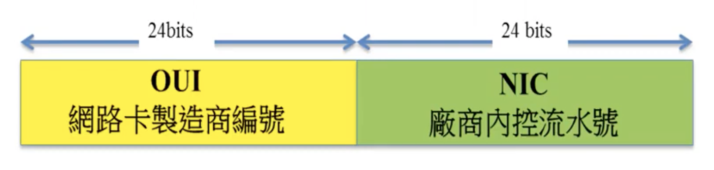

<style> 
.imgBox{
  display: flex; 
  flex-direction: column; 
  margin: 10%; 
  justify-content: center;
  border: 2px solid black;
}
</style>

<!-- --------------------- style --------------------- -->

##### <!-- ref -->

[ccna 教學]: https://youtu.be/gxbqIMqBgPc

<!-- ref -->

# CCNA 網路基本認識

> DATE: 6 (2022)
> REF: [CCNA 教學]

---

## ＄名詞介紹

<!-- 終端設備 -->

- <details close>
  <summary>終端設備</summary>

  - 如 手機、電腦、Hub..等

  </details>

<!-- 存取設備 -->

- <details close>
  <summary>存取設備</summary>

  - 終端機進入到網路的第一個網路設備

  - 如 Switch、Hub..等

  </details>

<!-- port -->

- <details close>
  <summary>port</summary>

  - 編號： 種類 ＋ slot/number
    (eg. fa0/1,fa0/2,fa0/3,e0/1,e0/2...)

    - fa(fe?): fast ethernet（快速乙太網路）為目前主流 (最快 100M)
    - e: ethernet（乙太網路）(最快 10M)
    - G: (最快 1G)

  </details>

<!-- MAC（實體位址） -->

- <details close>
  <summary>MAC</summary>

  - 實體位址

  - 電腦的「網路卡」的身分證

  - <details close>
    <summary>可以在電腦中修改</summary>

    - Linux

    ```
    // Linux:
    ifconfig eth0 down
    ifconfig eth0 hw ehter aa:aa:aa:aa:aa:aa
    ifconfig eth0 up
    ```

    - Windows

      - 可用 GUI 更改

    </details>

  - OUI + NIC

    - OUI 需跟協會申請

  - 編碼含義：

    <!-- 16 進位表示 -->

    - <details close>
      <summary>16 進位表示</summary>

      - `0123.4567.897e` (Cisco IOS)(網路設備)
      - `01-23-45-67-89-7e` (Windows)
      - `01:23:45:67:89:7e` (Linux)

      </details>

    <!-- 7th bit -->

    - <details close>
      <summary>7th bit</summary>

      - `0` = 全球唯一
      - `1` = 本地自己管理
      - 大部分是 `0`，有些協定會改成 `1` (eg. EUI-64)

      </details>

    <!-- 8th bit -->

    - <details close>
      <summary>8th bit</summary>

      - `0` = unicast
      - `1` = multicast | broadcast
      - 大部分是 `0`

      </details>

    <!-- Unicast | Multicast | Broadcast -->

    - <details close>
      <summary>Unicast | Multicast | Broadcast</summary>

      - Unicast：

        - 網卡上唯一性

      - Multicast：

        - 前半：固定 `01:00:5E`
        - 後半：由 Multicast IP 計算而得

      - Broadcast：

        - 固定：`FF:FF:FF:FF:FF:FF`

      </details>

    <!-- 查詢指令 -->

    - <details close>
      <summary>查詢指令</summary>

      - Windows: `ipconfig/all`
      - Mac OS: `/sbin/ifconfig`

      </details>

  <div class="imgBox" >
    
  </div>

  </details>

<!-- IP -->

- <details close>
  <summary>IP</summary>

  - 編碼含義：

    <!-- Unicast | Multicast | Broadcast -->

    - <details close>
      <summary>Unicast | Multicast | Broadcast</summary>

      - Unicast：

        - 於電腦中設定

      - Multicast：

      - Broadcast：

        - 通用：`255.255.255.255`
        - 本地

      </details>

  </details>

---

## ＄硬體設備

<!-- Hub（集線器） -->

- <details close>
  <summary>Hub（集線器）</summary>

  - 早期設備，已棄用，被 Switch 取代

  - 想像成是對資料放大傳送，但不會對資料進行處理

  - 共享匯流排(shared bus)

    - 資料傳輸時，連接 Hub 的所有終端設備都會接收到
      (共同存取 Multiple Access)

    - 乙太網路，都是 Multiple Access

      - EX. PC1 傳送給 PC3，則路徑為：
        - PC1 --> Hub --> 其他所有 PC
        - 所有 PC 檢查訊息的目的 MAC ID 是否為自己，不是則 drop
        - PC3 再傳 ping 回給 PC1

    - ping 封包，屬於 ICMP 協定

  </details>

<!-- Switch（交換器） -->

- <details close>
  <summary>Switch（交換器）</summary>

  - 會先比較 MAC ID，只將訊息傳送給 Target PC

  </details>

---

## ＄現象

<!-- 碰撞（collision） -->

- <details close>
  <summary>碰撞（collision）</summary>

  - 已成歷史

  - Hub 共享匯流排 + 共同存取 --> 一次只能一個人傳，否則碰撞後內容會混合亂掉，依然會傳送至所有電腦，但為無效傳送

  - 用再多 hub 也無法解決碰撞區問題，早期用 Switch 在規劃碰撞區，目標將碰撞區縮小

  - 現在都直接用 Switch 接電腦 --> 碰撞區規劃，已成歷史

  <!-- 解決方案 -->

  - <details close>
    <summary>解決方案</summary>

    <!-- CSMA/CD -->

    - <details close>
      <summary>CSMA/CD</summary>

      - 解決有線網路的碰撞

      <!-- CSMA -->

      - <details close>
        <summary>CSMA</summary>

        - Carrier Sense Multiple Access
        - 防止碰撞

        - <details close>
          <summary>步驟</summary>

          - 網卡上有 CS，送出前可先偵測訊號
          - 偵測到已有人正在傳輸則暫緩送出

          </details>

        </details>

      <!-- CD -->

      - <details close>
        <summary>CD</summary>

        - Collision Detection
        - 偵測碰撞 --> 不可避免碰撞 --> 加速碰撞 --> 快點結束

        - <details close>
          <summary>步驟</summary>

          - 若 PC1, PC2 同時傳送，則 CSMA 就破功，因為同時間都偵測到狀態為閒置，而同時送出
          - 第三者 PC3 偵測到此情形，則送出 JAM 訊號，將訊號全部清空 --> 加速碰撞
          - 使用後退演算法(Backoff Algorithm)，將兩台送出時間錯開，再重新發送

          </details>

        <!-- Early vs Late Collision -->

        - <details close>
          <summary>Early vs Late Collision</summary>

          - 越早偵測到，越早解決 (以 512 bits 區分)

          - Early Collision

            - 正常在傳送 512 bits 前，被 CD 偵測到

          - Late Collision

            - 可能有其他硬體問題，可再改善
            - 例如：Duplex 模式匹配有問題、網卡有問題、網路線不穩、接線太長、串接太多層.. 等等

          </details>

        </details>

      </details>

    <!-- CSMA/CA -->

    - <details close>
      <summary>CSMA/CA</summary>

      - 解決無線網路的碰撞

      - CSMA

        - Carrier Sense Multiple Access
        - 防止碰撞

      - CA

        - Collision Avoidance
        - 避免碰撞

      </details>

    </details>

  </details>

---

## ＄規格

- RJ45：網路線接頭規格統一
