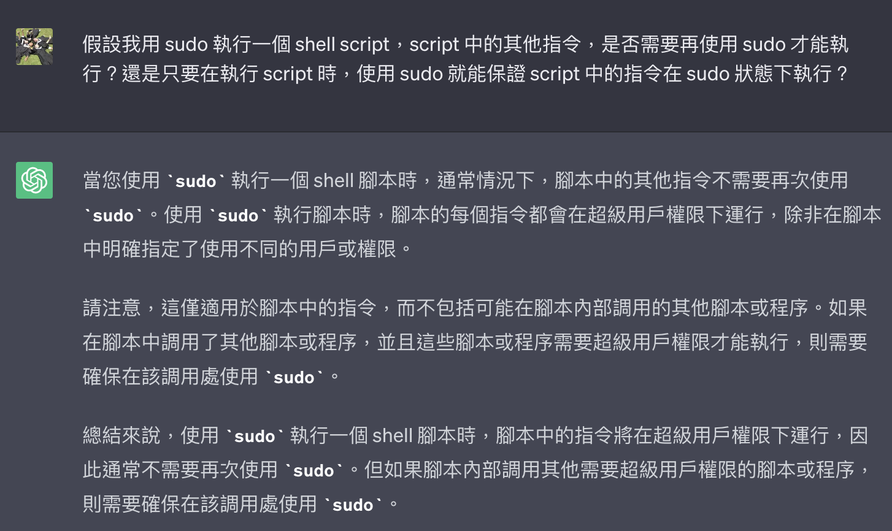
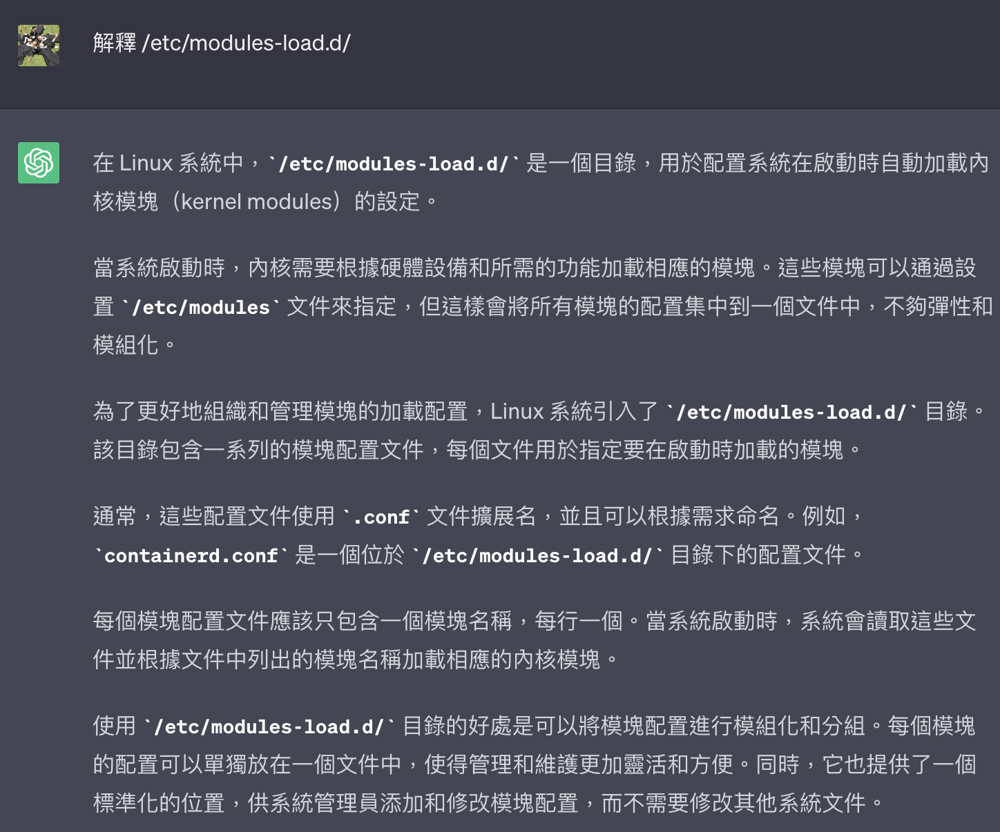

###### <!-- 收起來 -->

<style> 
.imgBox{
  display: flex; 
  flex-direction: column; 
  margin: 5%; 
  justify-content: center;
  border: 2px solid black;
}
</style>

<!--  style  -->

 <!-- ref -->

[SELinux 基礎與實務]: https://www.lijyyh.com/2012/11/selinux-security-enhanced-linux-basics.html
[Linux - 安全增強式 Linux ( SELinux )]: https://how64bit.com/posts/linux/2022/linux-selinux/
[透過 ip 切換的攻擊手法]: https://www.youtube.com/watch?v=it_V3ig1_4o&t=78s
[TTY 到底是什麼？]: https://www.kawabangga.com/posts/4515
[零基礎七天入門 Linux]: https://www.udemy.com/course/linux-zh/learn/lecture/8531918#content
[manjaro]: https://manjaro.org
[linux newbie: running manjaro on macbookpro]: https://medium.com/@pswoo/linux-newbie-running-manjaro-on-macbookpro-5db4672351c9
[classic sysadmin: how to securely transfer files between servers with scp]: https://www.linuxfoundation.org/blog/blog/classic-sysadmin-how-to-securely-transfer-files-between-servers-with-scp
[linux directory structure]: https://www.thegeekstuff.com/2010/09/linux-file-system-structure/
[vi/vim]: https://vim.rtorr.com/

 <!-- ref -->

# Linux

> DATE: 3, 4, 5 (2023)
> REF: [零基礎七天入門 Linux]

## 0. 環境設定

<!-- VM 安裝 -->

- <details close>
  <summary>使用 VirtualBox 安裝 Linux VM</summary>

  - 名詞

    - IDE Controller (Integrated Drive Electronics)
    - Optical (光碟)
    - Floppy (軟碟)

  - 調整

    - Storage/IDE 選擇剛剛下載的 ISO 檔 (EX. Manjaro)
    - System 開機順序調整：Optical -> Floppy -> Hard Disk。如此會從 Optical 啟動(也就上上面選的 IDE)
    - 顯示：調整 Scale Factor 比例放大，較舒服

  - Error

    - <mark>TODO:</mark> md5 檢查 ISO
    - manjaro 安裝： `rsync 失敗 錯誤碼：11`
      --> 空間不夠，約需要 9.5G 硬碟

  </details>

<!-- Ubuntua 的 terminal 打不開 -->

- <details close>
  <summary>Ubuntua 的 terminal 打不開</summary>

  - （同機器設定上，manjaro 可以正常開啟 terminal）

  ```txt
  On modern-day computers, we usually use the word terminal
  to refer to software programs known as terminal emulators.
  ```

  - 未知原因，無法在桌面打開 terminal emulator
  - 須注意是否有 focus 在 VM
  - 改成直接切換 tty 來使用
    - mac 須以 `command+shift+Fx` 分別切換到 F1 ~ F12 設定的內容
    - 組合快捷鍵也可以使用 Fn 方式來使用 F1 ~ F12
    - 我的機器上：`F1` 登入頁、`F2` 桌面、`F3 ~ F6` 為 tty3 ~ tty6、`F7 ~ F12` 沒反應

  </details>

---

## 1. 基本介紹

<!-- Linux Distribution (發行版) -->

- <details close>
  <summary>Linux Distribution (發行版)</summary>

  - Linux + 附加的 APP(如 命令列介面)

  - 分支

    - Debian

      - Ubuntua：新手友好。宇覺得太髒

    - Redhat：常見，商用需買 license

      - Centos：免費的 Redhat（source code 跟 Redhat 一模一樣？）

    - Arch

      - [Manjaro]：宇推薦，[Linux Newbie: Running Manjaro on MacBookPro]

    - SUSE

  - 桌面

    - GNOME：宇推薦，桌面潮

  <br>

  
  

  </details>

<!-- 管理套件 -->

- <details close>
  <summary>管理套件</summary>

  - Debian

    - `apt-get`
    - `.deb`(Debian)
    - Ubuntu..

  - RedHat

    - `yum`
    - `.rpm`(Red Hat Package Manager)
    - Centos..

  - Arch

    - `pacman`
    - `.pkg`(package file) `.tar`(tarball, tape archive) `.xz`
    - Manjaro..

  - Mac

    - `brew`

  </details>

<!-- Directory Structure -->

- <details close>
  <summary>Directory Structure</summary>

  - [Linux Directory Structure]

  - 參考大方向，不同發行版，都可能會有不同資料夾結構的使用方式

  

  </details>

---

## 2. 基本指令

<!-- 查當前使用的 shell -->

- <details close>
  <summary>查當前使用的 shell</summary>

  ```shell
  $ echo $SHELL
  /bin/zsh
  ```

  </details>

<!-- `cat`、`more`、`less`、`head`、`tail` -->

- <details close>
  <summary><code>cat</code>、<code>more</code>、<code>less</code>、<code>head</code>、<code>tail</code></summary>

  - `cat text1.txt text2.txt >> text3.txt`

    - 將 text1.txt text2.txt 合併產生 text3.txt

    ```sh
    # 輸出 text1.txt 到 stdout
    $ cat text1.txt

    # 輸出 text1.txt ＆ text2.txt 到 stdout
    $ cat text1.txt text2.txt

    # 輸出 text1.txt ＆ text2.txt 從 stdout redirect 到 text3.txt
    # 等於將 text1.txt text2.txt 合併到 text3.txt
    $ cat text1.txt text2.txt >> text3.txt
    ```

  - `cat`、`more`、`less`、`head`、`tail`

    - `cat`：一次輸出全部
    - `more`：可分次輸出
    - `less`：進階版`more`
    - `head`：頭十行
      - `head -13`：頭十三行
    - `tail`：末十行
      - `tail -f`：可以追蹤變化更新末端 (follow)

  </details>

<!-- ping -->

- <details close>
  <summary><code>ping</code></summary>

  - 可以用 ping 檢查是否可以正常連線 (但有時候結果不準確，因為對方可以設定不讓別人去 ping)

  </details>

---

## 3. vi/vim 操作

<!-- vi/vim -->

- <details close>
  <summary>vi/vim</summary>

  - [vi/vim]

  - Command Mode

    
    
    
    

  - Insert Mode
  - Visual Mode

  </details>

## 4. user

<!-- user 簡介 -->

- <details close>
  <summary>user 簡介</summary>

  - 可以多個 user 同時登入，同時執行自己的任務

  - 兩大類 user

    - system user

      - 系統內部自動建立
      - <mark>TODO:Q</mark> 不能用於登入？

        
        

    - regular users

      - `sudo`、superuser、root

        - ChatGPT 開示：

          
          
          

        - 總結：

          - root user 的權限即為 superuser 權限
          - 其他 user 透過 sudo，借用 superuser 權限
          - root user 設定：
            - 其他 user 透過 sudo 可使用的 superuser 權限
            - 使用 sudo 時所需的密碼（預設 user 密碼、root 密碼、無密碼）
          - 使用 sudo，輸入當前使用者自己的密碼的用意是，確保是本人正在使用

  - /etc/passwd

    - 可以查看系統中所有 user

    
    
    

  - /etc/group

    - 紀錄所有 group 的資訊，包含其所涵括的 user

    

  </details>

<!-- root user -->

- <details close>
  <summary>root user</summary>

  - 一般在系統安裝時自動創建，且沒有設定密碼
  - 一般不建議登入使用，而是需要時使用`sudo`來暫時取得 root 權限
  - 必要時，可使用指令來設定 root 密碼，以進行登入

  </details>

<!-- terminal head：`$`為普通使用者，`#`為 root 使用者 -->

- <details close>
  <summary>terminal head <code>$</code> <code>#</code></summary>

  - `$`為普通使用者，`#`為 root 使用者

  - 可使用`su`進行切換使用者

    ```js (因為要讓 # 不是註解顯色，隨便用一個 js)
    // EX.
    // 在 user1 的 terminal 輸入 su root 後，輸入密碼切換到 root
    $ su root
    Password:
    #
    // 也可直接輸入 su，輸入密碼切換到 root
    $ su
    Password:
    #

    // 輸入 exit 回到當前使用者
    # exit
    exit
    $
    ```

  </details>

<!-- 創建新使用者 -->

- <details close>
  <summary>創建新使用者</summary>

  - `useradd <name>`：只創建最基本的 user（一般 user 即可）
  - `adduser <name>`：同時自動建立許多預設內容（需要 sudo）

  </details>

<!-- sudo -->

- <details close>
  <summary>sudo</summary>

  - super user do

  - 以 sudo 做操作視同為 root，如`sudo touch`的檔案，為 root 所有

  - 以 sudo 執行 shell script 時，內部的指令也是在 sudo 權限下執行，大部分不需再添加 sudo

    ```sh
    # EX 1. 直接用指令執行 apt
    $ sudo apt install tldr

    # EX 2. 使用 sudo 執行 instal.sh
    $ sudo sh instal.sh

    # cat instal.sh
    apt install tldr
    ```

    

  <!-- 為 user 打開使用 sudo 的權限 -->

  - <details close>
    <summary>為 user 打開使用 sudo 的權限</summary>

    - 在`/etc/sudoers`中新增權限 (`sudo visudo`)
    - 也可以將該 user 加入 sudo group (`usermod -G sudo <username>`)

    
    
    
    

    </details>

  </details>

## 5. 權限

<!-- file 資訊釋讀 -->

- <details close>
  <summary>file 資訊釋讀</summary>

  - `rwx`：讀取 -- 寫入 -- 執行
  - `rw-r--r--`：檔案擁有者 -- 群組(group) -- 其他使用者

    

  

  </details>

<!-- chmod [options] [mode] <file_name> -->

- <details close>
  <summary><code>chmod [options] [mode] <file_name></code></summary>

  - EX1. `chmod g+rw test.md` 將該檔案加上 group 的 rw 權限
  - user(u), group(g), others(o), all(a)
  - EX2. `chmod 734` --> rwx-wxr-- ( r:1, w:2, x:4 )

  </details>

<!-- 速記小抄 (Cheat Sheet) -->

- <details close>
  <summary>速記小抄 (Cheat Sheet)</summary>

  - 權限順序：`rwx` (讀 - 寫 - 執行)
  - 使用者順序：`user-group-other` (檔案擁有者 -- 群組 -- 其他使用者)
  - 數字轉換：`r:1` `w:2` `x:4`

  </details>

## 6. Shell Script

<!-- #!/bin/fish -->

- <details close>
  <summary><code>#!/bin/fish</code></summary>

  - script.sh 中，在頂端加上 `#!/bin/fish` 的作用：

    - 以 `./script.sh` 方式執行時：

      - 電腦會選擇用 fish shell 來執行，與電腦中 terminal 預設的 shell 無關
      - 若電腦中未安裝 fish shell，則無法執行
      - (記得先設定可執行權限)

    - 也可以 `bash ./script.sh` 方式執行，則會使用 bash shell 來執行

  </details>

- <mark>TODO:</mark> `$((a + b))` vs `$(($a + $b))`

---

## 7. Host 以 ssh 連結 VM

<!-- VirtualBox 設定 -->

- <details close>
  <summary>VirtualBox 設定</summary>

  - Host-only Network

    - 欲讓 VM (EX. Ubuntua) 透過 Host-only Network 與主機連接，需先在 VirtualBox 的 tool 中建立一個 Host-only Network，讓 VM 可以跟他連接

      

    - Host-only Network VS Host-only Adapter

      - 都只能與主機相連
      - Host-only Adapter：模擬一個網卡給 VM 用
      - Host-only Network：模擬一個網路當成主機，給 VM 連

      

  

  </details>

<!-- ip addr 查詢網卡 -->

- <details close>
  <summary><code>ip addr</code>查詢網卡</summary>

  - `enp0s3`是 NAT 那張網卡、`enp0s8`是 Host-only Network 那張網卡
  - `link/ether 08:00:27:75:29:67`是`enp0s8`的 Mac Address
  - `inet 192.168.56.2`是`enp0s8`的 ip

  

  </details>

<!-- ssh 連接 VM -->

- <details close>
  <summary>ssh 連接 VM</summary>

  - EX. `ssh ocup@192.168.100.5`

    - 代表用 ssh 連結 192.168.100.5 VM，並且以 ocup user 登入

  </details>

<!-- VM 內部設定 -->

- <details close>
  <summary>VM 內部設定</summary>

  - VM 需要安裝並啟動 ssh-server

    
    
    

  - VM 需要在啟動狀態，才能連結

  </details>

<!-- 使用 ssh key 登入 -->

- <details close>
  <summary>使用 ssh key 登入</summary>

  - `ssh-keygen -t ed25519 -f ~/.ssh/my_ed25519_key`
  - 主機生成 ssh key (rsa, ed25519..)，將公鑰傳給 VM
  - 若有使用 SSH 代理，則需要`ssh-add`將私鑰加進去

  

  - ssh key 名稱可以輕易改，記得把 `~/.ssh/config` 設定檔也改即可

  - <mark>TODO:</mark> 研究 ssh -v 細節
    - Verbose mode: debugging messages

  </details>

<!-- 更嚴謹：研究使用 SSH Certificate -->

- <details close>
  <summary>更嚴謹：研究使用 SSH Certificate</summary>

  - 採取 SSH Certificate 取代 SSH Public Key

  </details>

<!-- 斷開 ssh remote 連線 -->

- <details close>
  <summary>斷開 ssh remote 連線</summary>

  - 可用 `exit` 指令退出
  - 想確保主機沒再連上任何 remote，可用 `pkill ssh` 清理
  - 連線的 remote 狀態不好，可用 `~.` 來強制斷開

  </details>

## 8. 資安

- SELinux

  REF:

  - [Linux - 安全增強式 Linux ( SELinux )]
  - [SELinux 基礎與實務]

## # 其他補充

- 注意事項：

  <!-- file 的製作日期＆修改日期，都可以隨意修改。 -->

  - <details close>
    <summary>file 的製作日期＆修改日期，都可以隨意修改</summary>

    </details>

- 小技巧：

  <!-- 資料夾 -->

  - <details close>
    <summary>資料夾</summary>

    <!-- /etc/resolv.conf -->

    - <details close>
      <summary><code>/etc/resolv.conf</code></summary>

      - DNS 解析

      </details>

    <!-- /etc/sudoers -->

    - <details close>
      <summary><code>/etc/sudoers</code></summary>

      - sudo 權限

      </details>

    <!-- /etc/passwd   -->

    - <details close>
      <summary><code>/etc/passwd</code></summary>

      - user

      </details>

    <!-- /etc/paths.d -->

    - <details close>
      <summary><code>/etc/paths.d</code></summary>

      - 系統 path 設定位置

      </details>

    <!-- /etc/modules-load.d/ -->

    - <details close>
      <summary><code>/etc/modules-load.d/</code></summary>

      - 設定作業系統啟動時，所需載入的 Kernel modules
      - 將載入該 folder 中所有 `.conf` 設定的 modules
      - 可自訂 `.conf`，用以檔案分類管理

      

      </details>

    <!-- /etc/sysctl.d/ -->

    - <details close>
      <summary><code>/etc/sysctl.d/</code></summary>

      - 設定 Kernel 參數
      - 可自訂 `.conf`，用以檔案分類管理
      - 順序為 `/etc/sysctl.conf` --> `/etc/sysctl.d/`
      - <mark>雷</mark> 將該 folder 中所有 `.conf` 的參數，<b>依照 filename 排序順序，進行設定</b>
        - EX. 在 a.conf 與 b.conf 中設定同一個參數，b.conf 會覆蓋掉 a.conf 對該參數的設定
      - 以 `sudo sysctl -a` 進行查詢當下的設定
      - 以 `sysctl --system` 重新載入設定檔

      </details>

    <!-- /var/log/syslog -->

    - <details close>
      <summary><code>/var/log/syslog</code></summary>

      - 系統 log 位置

      </details>

    </details>

  <!-- 指令 -->

  - <details close>
    <summary>指令</summary>

    <!-- grep -->

    - <details close>
      <summary><code>grep</code>></summary>

      - g/re/p (globally search a regular expression and print)
      - `grep xxxx`：過濾出 xxxx
      - `grep -v yyyy`：反向過濾 xxxx （去除 yyyy）
      - `grep -v grep`：去除掉 `grep` 本身產生的 `precess`

      </details>

    <!-- printenv -->

    - <details close>
      <summary><code>printenv</code></summary>

      - 查 shell 環境變數

      </details>

    <!-- >/dev/null 2>&1 -->

    - <details close>
      <summary><code>>/dev/null 2>&1</code></summary>

      - 捨棄掉所有輸出

        - `>/dev/null`：將輸出導向 null，也就沒輸出了
        - `2>&1`：將 stderr 導向 stdin，所以 stderr 也一同被導向 null

          ```sh
          # EX. 將 sysctl --system 的輸出
          $ sysctl --system >/dev/null 2>&1
          ```

      </details>

    <!-- 方便查 ip 上色 -->

    - <details close>
      <summary>方便查 ip 上色</summary>

      - `ip -c a`

      ```sh
      $ ip addr | awk '
      /inet/ { system("tput setaf 2"); print; system("tput sgr0"); next }
      /eth0/ { system("tput setaf 3"); print; system("tput sgr0"); next }
      { print }
      '

      $ ip addr | sed -r \
      -e 's/(inet [0-9.]+)/\x1b[32m\1\x1b[0m/g' \
      -e 's/(eth0)/\x1b[33m\1\x1b[0m/g'
      ```

      </details>

    </details>

- 小工具：

  <!-- scp -->

  - <details close>
    <summary>scp</summary>

    > REF: [Classic SysAdmin: How to Securely Transfer Files Between Servers with scp]

    - 只要知道 Ubuntu 的用戶名、密碼、ip，就可以 scp 複製文件進去 Ubuntu

    </details>

  <!-- pstree -->

  - <details close>
    <summary>pstree</summary>

    - `pstree -halps [PID]`
    - 易於查看與該 process 相關的 process

    </details>

---

## # 踩雷實錄

<!-- 無法設定多個 Network Adapter -->

- <details close>
  <summary>無法設定多個 Network Adapter</summary>

  - REF: [Virtualbox -> Can't add 2nd adapter to network for VM](https://superuser.com/questions/732999/virtualbox-cant-add-2nd-adapter-to-network-for-vm)
  - 需將 Linux 關機才能設定（即便只有將 VM 關閉儲存狀態也不能）

  </details>

---

## # 延伸討論

<!-- 延伸`tty` -->

- <details close>
  <summary>延伸<code>tty</code></summary>

  - REF: [TTY 到底是什麼？]

  - <mark>TODO: 《再研究》</mark> 不同 tty 是不同 process 層級
    

  - <mark>TODO: 《再研究》</mark> 桌面 terminal 與 tty 差異？
    

  - <mark>TODO: 《再研究》</mark> 是否可將桌面 terminal 分頁，模擬成不同 tty？
    

  </details>

<!-- 簡易網路概述 -->

- <details close>
  <summary>簡易網路概述</summary>

  - DNS

    - Domain Name System
    - 解析網址成 IP

  - Gateway

    - 網路中用於連接不同網路或子網路的設備或系統。它是數據流傳輸的接口，能夠將數據包從一個網路傳到另一個網路。

  - DHCP

    - Dynamic Host Configuration Protocol
    - 自動分配動態 IP 的協議
    - 現在許多 AP 或網路分享器都有內建 DHCP 伺服器

  - NAT

    - Network Address Translation
    - 將私有 IP 轉換成公共 IP，從而允許本地網路內的設備連接到互聯網

  - BGP

    - Border Gateway Protocol
    - 處理分析 IP 再轉去正確路線的協議

  - MAC address

    - Media Access Control address
    - Data link layer
    - 「理論上」這個 MAC address 必須是全球唯一的編號
    - 有時候也會稱為 LAN Address (區域網路位址)、Ethernet Address (乙太網路位址)、burned-in address (燒寫位址) 或 Hardware address (硬體位址)、Physical Address (實體位址)..

  - ARP

    - Address Resolution Protocol (位址解析協定)
    - Data link layer
    - MAC 與 IP 的配對

  - <mark>TODO:Q</mark> 浮動 ip 機制
  - <mark>TODO:Q</mark> 研究 mDNS：使用 ssh 時可以不用設定固定 IP
    - Avahi serveice
  - [透過 ip 切換的攻擊手法]

  </details>

---
