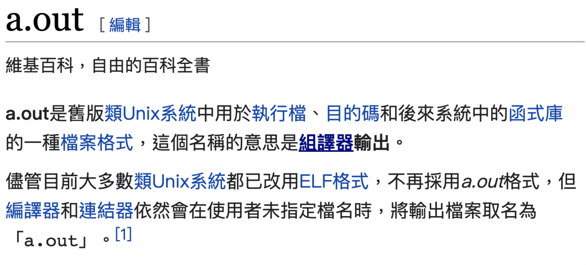

##### <!-- ref 放置區 -->

[第 1 週：c 语言]: https://www.bilibili.com/video/BV1DA411Y7jk?p=2
[cs50 sandbox]: https://sandbox.cs50.io/
[0:31:00]: https://www.bilibili.com/video/BV1DA411Y7jk?p=2&t=1856.3
[c float]: https://www.njarts.cn/a_jiaoyu/202109/515905.html
[int main(void) return 0, 1]: https://stackoverflow.com/questions/16610814/why-does-main-have-to-return-an-int

# [第 1 週：C 语言]

> MurMur:
>
> 1. bilibli 這集超級卡頓。
> 2. 似乎要用到課程的 lib。[CS50 Sandbox]
> 3. C 語言作業連結：https://docs.cs50.net/2019/x/psets/1/index.html

## 風格寫法

- 更快 vs 更好懂 ([0:31:00])
- 之後幾週會講到風格寫法問題，現在要求先照老師的方式寫。
- 現在手機電腦處理能力基本上都是一秒十億以上的任務，如果寫法會增加運算時間但卻能增加閱讀性，也沒關係。
  - 多安：認同概念但還是需要評估一下吧？
- C 習慣 main 放上面，所以在 main 底下的 function 要在 main 上面放原型，告訴電腦這個 function 存在。

## C 筆記：

> 1. [縮寫](#1-%E7%B8%AE%E5%AF%AB%EF%BC%9A)
> 2. [printf](#2-printf)
> 3. [編譯](#3-%E7%B7%A8%E8%AD%AF)
> 4. [浮點數](#4-%E6%B5%AE%E9%BB%9E%E6%95%B8)
> 5. [溢出](#5-%E6%BA%A2%E5%87%BA)
> 6. [Scope](#6-Scope)

### 1. 縮寫：

- printf: print with format
- clang: c language
- a.out: assembler output （組譯器輸出）

### 2. printf

- 名詞 **placeholder** --> 例如："%s"
- 不能 'string'，只能 "string"
- 全部都要寫 placeholder 也太累了吧
- char _ 待研究。為啥 int 不用像 char 分成 _ 與否？
- 只有第一個參數可以放 placeholder。可以想像成 printf 就是印出第一個參數，只是 placeholder，會用後面依序的參數替換。
- 以下兩者輸出一樣

  ```c
  #include <stdio.h>

  int main()
  {
      char * name = "BayChi";
      int age = 13;

      printf("%s%s%s%i","Hello World\n",name,"\n",age);

      return 0;
  }
  ```

  ```c
  #include <stdio.h>

  int main()
  {
      char * name = "BayChi";
      int age = 13;

      printf("Hello World\n%s\n%i",name,age);

      return 0;
  }
  ```

- :::spoiler 「補充」printf 的格式有四种 (Tingyu)：

  1. printf("字符串\n");

  ```c
  int main(void)
  {
      printf("Hello World!\n");  // \n表示换行
      return 0;
  }
  ```

  其中\n 表示换行的意思。它是一个转义字符，前面在讲字符常量的时候见过。其中 n 是“new line”的缩写，即“新的一行”。此外需要注意的是，printf 中的双引号和后面的分号必须是在英文输入法下。双引号内的字符串可以是英文，也可以是中文。

  2. printf("输出控制符"，输出参数);

  ```c
  int main(void)
  {
      int i = 10;
      printf("%d\n", i);  /*%d是输出控制符，d 表示十进制，后面的 i 是输出参数*/
      return 0;
  }
  ```

  这句话的意思是将变量 i 以十进制输出。那么现在有一个问题：i 本身就是十进制，为什么还要将 i 以十进制输出呢？因为程序中虽然写的是 i=10，但是在内存中并不是将 10 这个十进制数存放进去，而是将 10 的二进制代码存放进去了。计算机只能执行二进制 0、1 代码，而 0、1 代码本身并没有什么实际的含义，它可以表示任何类型的数据。所以输出的时候要强调是以哪种进制形式输出。所以就必须要有“输出控制符”，以告诉操作系统应该怎样解读二进制数据。如果是%x 就是以十六进制的形式输出，要是%o 就是以八进制的形式输出

  3. printf("输出控制符 1 输出控制符 2…", 输出参数 1, 输出参数 2, …);

  ```c
  int main(void)
  {
      int i = 10;
      int j = 3;
      printf("%d %d\n", i, j);
      return 0;
  }
  ```

  输出控制符 1 对应的是输出参数 1，输出控制符 2 对应的是输出参数 2……编译、链接、执行后我们看一下输出结果：10 3

  4. printf("输出控制符 非输出控制符"，输出参数);
     这实际上就是上面那个例子。这时候会有一个问题：到底什么是“输出控制符”，什么是“非输出控制符”？很简单，凡是以%开头的基本上都是输出控制符。
     :::

### 3. 編譯

- `clang test.c`：

  - 有編譯階段的 bug 會跳出錯誤訊息，編譯成功則沒有任何訊息
  - 編譯 test.c 檔案，未指定檔案名稱，則產生 a.out 檔案
  - 輸入指令 `./a.out` 即可執行
  - 現在編譯完是否是產生 a.out？

    

  - `clang -o <filename> test.c`
    - 指定輸出編譯檔案名稱為 `<filename>`
    - 輸入指令 `./<filename>` 執行
  - `make <filename>` 指令集合：

    - 課堂使用：

      ```shell
      $ clang -fsanitize=signed-integer-overflow -fsanitize=undefined -ggdb3 -O0 -std=c11 -Wall -Werror -Wextra -Wno-sign-compare -Wno-unused-parameter -Wno-unused-variable -Wshadow    test.c  -lcrypt -lcs50 -lm -o test
      ```

    - 朋友使用：
      `gcc`、`-O0 -std=c11`、`-j 9`

- 編譯時做哪些檢查，應該都是自己下指令設定的(如. 檢查是否有未使用的變數)

  - 待研究：下指令 `-Wno-unused-variable` ，卻沒有警告未使用的變數([1:06:00](https://www.bilibili.com/video/BV1DA411Y7jk?p=2&t=3960.1))

- 引用 library 編譯時也需要告知有引用

  ```c
  // EX. 引用 cs50.h
  // #:告知 clang 此部分須預先處理

  #include <cs50.h>
  ```

  ```shell
  # 編譯需加入 "-lcs50"

  $ clang test.c -lcs50 -o test
  ```

### 4. 浮點數

- `float` & `double`
- `printf("%f)`：印出浮點數
- `printf("%.3f)`：只取 3 位小數
- 注意精準需求：科學、金融 ..等
- REF：[C float]

### 5. 溢出

- int: 32 bit
- double: 64 bit
- 加法超過當初變數宣告的容量時，就會歸零後重計。

### 6. Scope

- C 的變數有 scope ，範圍就是宣告時外面第一個大括號。
- 在 scope 外，電腦就無法存取那個變數。

## 作業 [Problem Set 1](https://cs50.harvard.edu/x/2021/psets/1/)

- [cs50.h document](https://manual.cs50.io/)
- [int main(void) return 0, 1]
  - Here int contains two value either 0 or 1. 0 means your program successfully executed ,where 1 means termination of program with some error. And this value is returned to OS.
