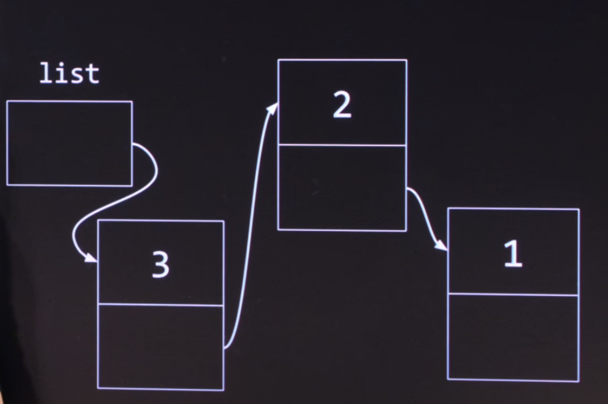

##### <!-- ref 放置區 -->

[第 5 週：data structure]: https://youtu.be/X8h4dq9Hzq8

# [第 5 週：Data Structure]

## 0. 問題集中地

- <mark>TODO:Q</mark> 如何知道某塊 mem 非垃圾？
- <mark>TODO:Q</mark> 連帶想釐清 OS 在 process 啟動後，會不會紀錄這個 process 所有用到的記憶體位置？ process exit 後，需要自己 free？那如果 kill 後怎麼辦？
- <mark>TODO:Q</mark> linked list 不能 binery search，是否能各種 sort？

## 1. C 語法

- list = tmp 之後，原本的 list 就不需要 free 了？(35:28)

  - 因為用 realloc，是重新分配

- `struct node` = `Node`

  - 為了在 struct 內部使用 self type

  ```c
  typedef struct node
  {
  int data;
  struct node *next;
  }
  Node;
  ```

- `node->next` = `(*node).next`

- `free` 是把該位址釋放出來，而不是把該變數釋放出來，所以只需 free 其中一個

  ```c
  x = y;
  free(x);  // 不必再 free(y)
  ```

- 陣列宣告及分配記憶體

  - 如果直接宣告，將無法再增加更多元素進陣列：

  ```c
  int list[3];
  ```

  - 用 malloc 可以動態分配記憶體 free ：

  ```c
  // --
  int *list = malloc(3 * sizeof(int)); // 使用 heap ，可以要求更多空間
  // 在C語言中，當使用malloc函數動態分配記憶體時，如果系統無法分配足夠的記憶體，就會返回一個null指針，表示分配失敗。
  if (list == NULL) {
      printf("Memory allocation failed\n");
      exit(1);
  }
  ```

  - 自己寫陣列新增元素，需要先宣告一個 tmp array ，再把原來的 list 一個個 copy 進 tmp。嫌麻煩可以直接使用 realloc:

  ```c
  int *list = malloc(3 * sizeof(int));
  list[0] = 1;
  list[1] = 2;
  list[2] = 3;

  // 使用 realloc 重新分配記憶體大小
  int *tmp = realloc(list, 5 * sizeof(int));
  if (tmp == NULL) {
      // 一樣需要 free(list)
      free(list);
      printf("Memory allocation failed\n");
      exit(1);
  }

  list = tmp;
  list[3] = 4;
  list[4] = 5;
  ```

## 2. 資料結構

### Linked List

- [新增 Linked List 的第一個 node](https://youtu.be/X8h4dq9Hzq8?t=3477)

  ```c
  // 1. 宣告一個 pointer 並清空原始裡面的值，當作 Linked List 的 head
  node *list = NULL;

  // 2. 宣告 pointer 、分配一個 node 大小的記憶體、將這個 node 記憶體位置寫進 pointer。
  node *n = malloc(sizeof(node));

  // 3. 找到 pointer 指的東西（node），進到 node 結構裡面找到 number ，並賦值 1 。
  n->number = 1;

  // 4. 補上結尾
  n->next = NULL;

  // 5. 將 n 指的東西給 list
  list = n;
  ```

- [新增第二個 node](https://youtu.be/X8h4dq9Hzq8?t=3783)

  ```c
  // 1. 宣告 pointer 、分配一個 node 大小的記憶體、將這個 node 記憶體位置寫進 pointer。
  node *n = malloc(sizeof(node));

  // 2. (DeRef)找到 pointer 指的東西（node），進到 node 結構裡面找到 number ，並賦值 2 。
  n->number = 2;

  // 3. 補上結尾 （必要性？）
  n->next = NULL;

  // 4. 賦值第二個 node 的 next，值是 list 所指的 node 位置。
  n->next = list;

  // 5. 再把 n 指的位置交給 list
  list = n;
  ```

- 上述實作 push 元素時，是將元素新增在最前面。

  

### Binary Search Tree

- 是否是 balance 的 tree 會決定 T(n)

### Dictionaries

- Key, value

- O(n/k), k 分出來的組數，上課的例子就是 k = 26(A ~ Z)
- 要根據 n 去設計 k 要多大，以及設計 hash function 讓 input 資料可以平均分派在 hash table 裡

### Tries

- 字典樹

- T(n) = O(n), n 為給定的字串長度

- S(n) 超高 , O(26^n)
