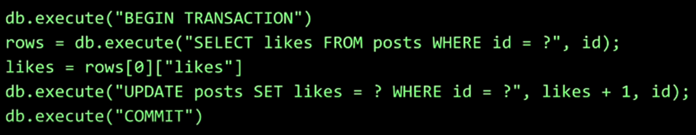
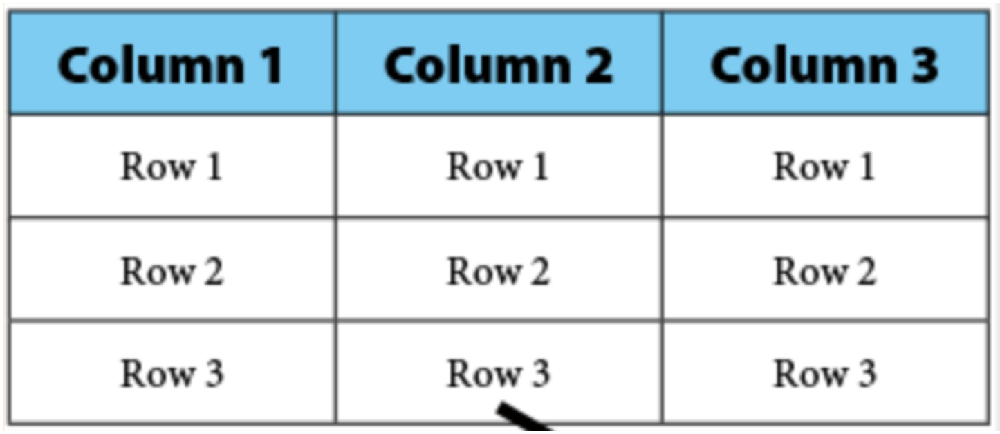
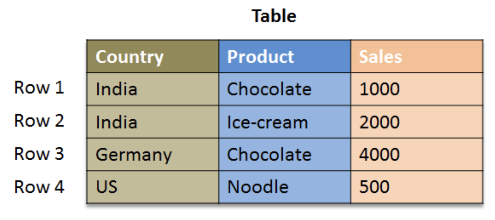
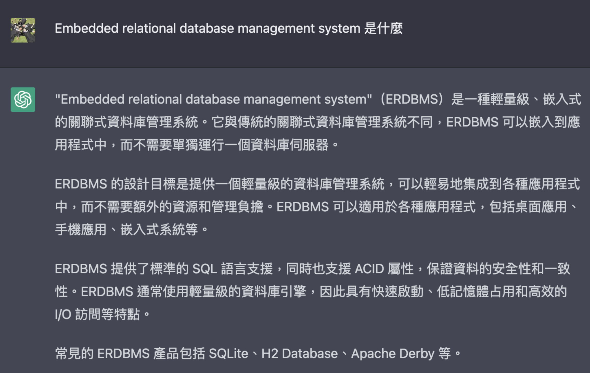
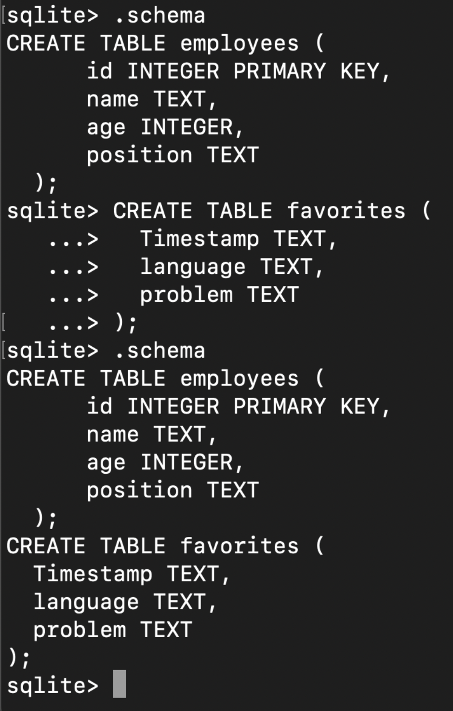
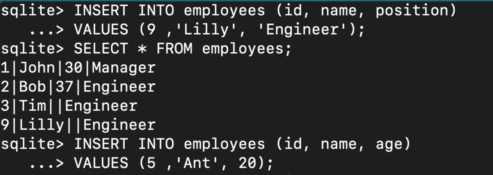
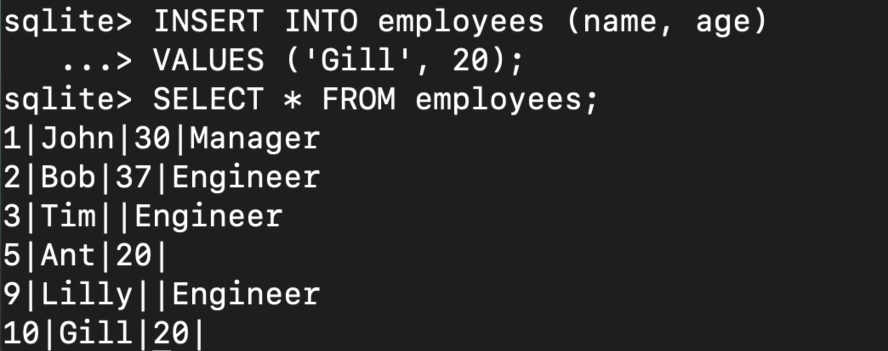

##### <!-- ref 放置區 -->

[第 7 週：sql]: https://youtu.be/zrCLRC3Ci1c
[多推薦 mysql gui]: http://sequelpro.com/
[sqlite data type]: https://www.sqlite.org/datatype3.html

# [第 7 週：SQL]

<!-- 工具 -->

- <details close>
  <summary>工具</summary>

  - [多推薦 MySQL GUI]

  </details>

<!-- Q & A -->

- <details close>
  <summary>Q & A</summary>

  - 為什麼不是在`sqlite3 dbName.db`的時候，而是輸入`sqlite> .schema`後，才出現`.db`檔案

  - 多個 Table 是什麼意思？(1:43:00)

    - 先將多個 Table 相乘展開，再於大表查詢

    ```sql
    SELECT title FROM people, stars, shows
    WHERE people.id = stars.person_id
    AND stars.show_id = shows.id
    AND name = 'Steve';
    ```

  - python 用 `f` 比用 `?` 更容易受到駭客攻擊？

    - <mark>TODO:</mark> 再研究 ? 的做法

  </details>

## 1. SQL

<!-- CREATE, INSERT, SELECT, UPDATE, DELETE, DROP -->

- <details close>
  <summary><code>CREATE</code>, <code>INSERT</code>, <code>SELECT</code>, <code>UPDATE</code>, <code>DELETE</code>, <code>DROP</code></summary>

  - C：`CREATE` `INSERT`

    <!-- 建立 TABLE -->

    - 建立 TABLE

      ```sql
      -- EX.
      CREATE TABLE employees (
          id INTEGER PRIMARY KEY,
          name TEXT,
          age INTEGER,
          position TEXT
      );

      CREATE TABLE favorites (
        Timestamp TEXT,
        language TEXT,
        problem TEXT
      );
      ```

    <!-- 新增 -->

    - 新增

      - 新增一筆資料到一個 Table

      ```sql
      -- EX. 新增 {name:'Bob', age:37, position:'Engineer'} 到 TABLE employees
      INSERT INTO employees (name, age, position)
      VALUES ('Bob', 37, 'Engineer');

      -- 如果允許 NULL 可以省略一些欄位
      -- EX. 新增 {name:'Bob', age:37} 到 TABLE employees
      INSERT INTO employees (name, age)
      VALUES ('Bob', 37);
      ```

    <!-- 查詢 -->

  - R：`SELECT`

    - 查詢

      - 查詢一個 Table 中所有資料 (`*`)

        ```sql
        SELECT * FROM employees;
        ```

      - 查詢一個 Table 中某個欄位的所有資料

        ```sql
        SELECT name FROM employees;
        ```

  - U：`UPDATE`
  - D：`DELETE` `DROP`

  </details>

<!-- AVG, COUNT, DISTINCT, LOWER, MAX, MIN, UPPER... -->

- <details close>
  <summary><code>AVG</code>, <code>COUNT</code>, <code>DISTINCT</code>, <code>LOWER</code>, <code>MAX</code>, <code>MIN</code>, <code>UPPER</code>...</summary>

  - `COUNT`

    ```sql
    -- EX. 查詢 employees 中，計算總共有幾筆資料
    sqlite> SELECT COUNT(*) FROM employees;
    6

    -- EX. 查詢 employees Table 中，計算有幾筆資料有 age 欄位
    sqlite> SELECT COUNT(age) FROM employees;
    4
    ```

  - `DISTINCT`

    ```sql
    -- EX. 查詢列出 employees Table 中，position 欄位的所有實例
    sqlite> SELECT DISTINCT(position) FROM employees;
    Manager
    Engineer
    ```

  </details>

<!-- WHERE, LIKE, ORDER BY, LIMIT, GROUP BY... -->

- <details close>
  <summary><code>WHERE</code>, <code>LIKE</code>, <code>ORDER BY</code>, <code>LIMIT</code>, <code>GROUP BY</code>...</summary>

  - `LIKE`

    - 可與`%`搭配使用，來做模糊匹配

    ```sql
    FROM people AS p WHERE p.name = 'Lauren Bacall'
    -- 查詢所有 Lauren B***
    FROM people AS p WHERE p.name LIKE 'Lauren B%'
    -- 查詢所有 L*** Bacall
    FROM people AS p WHERE p.name LIKE 'L% Bacall'
    -- 查詢所有 L*** B***
    FROM people AS p WHERE p.name LIKE 'L% B%'
    ```

  </details>

<!-- AS, JOIN -->

- <details close>
  <summary><code>AS</code>, <code>JOIN</code></summary>

  - 可以調整輸出時 Header 的暱稱

    ```sql
    -- EX. 將 COUNT(DISTINCT(position)) 取一個暱稱 n
    sqlite> SELECT COUNT(DISTINCT(position)) AS n FROM employees;
    + - +
    | n |
    + - +
    | 2 |
    + - +
    ```

  - `AS`

    - 可以設定暱稱以縮短查詢程式碼
    - 整段查詢一定得用暱稱，包含在 AS 之前的內容

      ```sql
      -- EX. 此處用 show.id (X) 會錯誤，必須用 s.id (O)
      SELECT s.id, title  # 改成 show.id (Error)
      FROM shows AS s
      JOIN stars AS t ON t.show_id = s.id
      JOIN people AS p ON t.person_id = p.id
      WHERE p.name = 'Lauren Bacall'
      ORDER BY s.id;
      ```

  - `JOIN`

    - 將兩個 Table 相乘，得到所有排列組合

    ```sql
    -- EX. shows = 3, genres = 3, shows JOIN genres = 9

    sqlite> SELECT * FROM shows;
    + ----- + ---------- + ---- + -------- +
    | id    | title      | year | episodes |
    + ----- + ---------- + ---- + -------- +
    | 62614 | Zeg ns Aaa | 1981 | 227      |
    | 63881 | Catweazle  | 1970 | 26       |
    | 63962 | UFO        | 1970 | 26       |
    + ----- + ---------- + ---- + -------- +
    sqlite> SELECT * FROM genres;
    + ------- + -------- +
    | show_id | genre    |
    + ------- + -------- +
    | 62614   | Comedy   |
    | 63881   | Adventure|
    | 63881   | Comedy   |
    + ------- + -------- +
    sqlite> SELECT * FROM shows JOIN genres;
    + ----- + ---------- + ---- + -------- + ------- + --------- +
    | id    | title      | year | episodes | show_id | genre     |
    + ----- + ---------- + ---- + -------- + ------- + --------- +
    | 62614 | Zeg ns Aaa | 1981 | 227      | 62614   | Comedy    |
    | 62614 | Zeg ns Aaa | 1981 | 227      | 63881   | Adventure |
    | 62614 | Zeg ns Aaa | 1981 | 227      | 63881   | Comedy    |
    | 63881 | Catweazle  | 1970 | 26       | 62614   | Comedy    |
    | 63881 | Catweazle  | 1970 | 26       | 63881   | Adventure |
    | 63881 | Catweazle  | 1970 | 26       | 63881   | Comedy    |
    | 63962 | UFO        | 1970 | 26       | 62614   | Comedy    |
    | 63962 | UFO        | 1970 | 26       | 63881   | Adventure |
    | 63962 | UFO        | 1970 | 26       | 63881   | Comedy    |
    + ----- + ---------- + ---- + -------- + ------- + --------- +
    sqlite> SELECT * FROM shows JOIN genres ON shows.id = show_id;
    + ----- + ---------- + ---- + -------- + ------- + --------- +
    | id    | title      | year | episodes | show_id | genre     |
    + ----- + ---------- + ---- + -------- + ------- + --------- +
    | 62614 | Zeg ns Aaa | 1981 | 227      | 62614   | Comedy    |
    | 63881 | Catweazle  | 1970 | 26       | 63881   | Adventure |
    | 63881 | Catweazle  | 1970 | 26       | 63881   | Comedy    |
    + ----- + ---------- + ---- + -------- + ------- + --------- +
    ```

  </details>

<!-- BEGIN TRANSACTION, COMMIT, ROLLBACK -->

- <details close>
  <summary><code>BEGIN TRANSACTION</code>, <code>COMMIT</code>, <code>ROLLBACK</code></summary>

  

  </details>

<!-- Table - Column - Row -->

- <details close>
  <summary>Table - Column - Row</summary>

  
  

  </details>

<!-- Index -->

- <details close>
  <summary>Index</summary>

  - 建立 index

    ```sql
    CREATE INDEX <index_name> ON <table_name> (<column_name>);
    CREATE INDEX title_index ON shows (title);
    ```

  - 建立 index 後，速度快很多，即便只有單一欄位(EX. title)的 index
    (MongoDB 比較，前陣子測試，只有單一 key 的 index，速度反而略慢)

    ```sql
    -- EX.
    SELECT * FROM shows WHERE title = 'The Office';
    Run Time: real 0.027 user 0.025929 sys 0.000510
    ...   ...
    CREATE INDEX title_index ON shows (title);
    Run Time: real 0.219 user 0.180030 sys 0.031364
    ...   ...
    SELECT * FROM shows WHERE title = 'The Office';
    Run Time: real 0.002 user 0.000327 sys 0.001302
    ```

  - `B-Tree` (1:49:00) (<mark>TODO:</mark> 再研究 B-Tree 的做法)

    

  </details>

<!-- 特性 -->

- <details close>
  <summary>特性</summary>

  - 可以結合使用

    ```sql
    -- EX. 查詢 employees Table 中，計算 position 欄位的所有實例數目
    sqlite> SELECT COUNT(DISTINCT(position)) FROM employees;
    + ------------------------- +
    | COUNT(DISTINCT(position)) |
    + ------------------------- +
    | 2                         |
    + ------------------------- +
    ```

  </details>

## 2. SQLite

<!-- 定義 -->

- <details close>
  <summary>輕量級的嵌入式關聯式資料庫管理系統</summary>

  

  </details>

<!-- 設定輸出格式 -->

- <details close>
  <summary>設定輸出格式</summary>

  - 可對以下進行設定

    ```shell
    sqlite> .mode column
    sqlite> .header on
    sqlite> .timer on
    sqlite> .width 10 20 10
    ```

  </details>

<!-- 簡易建立一個 SQLite -->

- <details close>
  <summary>簡易建立一個 SQLite</summary>

  ```shell
  # 建立 DB 並進入 sqlite 模式
  $ sqlite3 dbName.db
  sqlite>
  ```

  </details>

<!-- 查詢 schema -->

- <details close>
  <summary>查詢已存在的 schema</summary>

  ```shell
  # show 出所有已存在的 schema，包含空白縮排ＸＤ
  sqlite> .schema
  ```

  - 範例

    

  </details>

<!-- Data type -->

- <details close>
  <summary>Data type</summary>

  - [SQLite Data Type]
  - `BLOB`, `INTEGER`, `NUMERIC`, `REAL`, `TEXT`

  

  </details>

## 3. 注意

<!-- 末尾需分號 -->

- <details close>
  <summary>末尾需分號</summary>

  - 末尾需加上分號`;` (可能有些 DBMS 可以不加分號)

  </details>

<!-- 關鍵字大寫 -->

- <details close>
  <summary>關鍵字大寫</summary>

  - 如`SELECT`等 SQL 關鍵字，並不一定要大寫，但好習慣是保持大寫，以便做區分閱讀

  </details>

<!-- 手動與自動新增 ID -->

- <details close>
  <summary>手動與自動新增 ID</summary>

  - 有手動新增較大 id 的資料，下次自動產生 id，會在當前最大 id 的下一號

  - EX. 手動新增 id:9 ，下次自動生成的會排在 id:10，即使中間有空號

    
    

  </details>

<!-- UPDATE DELETE 慎用 -->

- <details close>
  <summary><code>UPDATE</code> <code>DELETE</code> 慎用</summary>

  - `UPDATE`, `DELETE`沒設定查詢條件時，會將整個 Table 的所有資料進行操作

  </details>

<!-- 多對多關係 -->

- <details close>
  <summary>多對多關係</summary>

  - SQL Table 若想要多對多關係，則需要一個中間 Table，因為沒有像是 array 這種 data type

  ```sql
  -- EX. 以 stars 來達成 shows ＆ people 的 "多對多" 關係
  CREATE TABLE shows (
      id INTEGER,
      title TEXT NOT NULL,
      year NUMERIC,
      PRIMARY KEY(id)
  );
  CREATE TABLE stars (
      show_id INTEGER NOT NULL,
      person_id INTEGER NOT NULL,
      FOREIGN KEY(show_id) REFERENCES shows(id),
      FOREIGN KEY(person_id) REFERENCES people(id),
  );
  CREATE TABLE people (
      id INTEGER,
      name TEXT NOT NULL,
      PRIMARY KEY(id)
  );
  ```

  </details>

## 4. Issue

<!-- JOIN VS 一次展開 -->

- <details close>
  <summary><code>JOIN</code> VS 一次展開</summary>

  - <mark>TODO:Q</mark> 機制分別是什麼，是否有不同？

  ```sql
  SELECT s.id, title
  FROM shows AS s
  JOIN stars AS t ON t.show_id = s.id
  JOIN people AS p ON t.person_id = p.id
  WHERE p.name = 'Lauren Bacall'
  ORDER BY s.id;
  -- Run Time: real 2.018 user 1.555556 sys 0.454638
  ```

  ```sql
  SELECT s.id, s.title
  FROM shows AS s, stars AS t, people AS p
  WHERE t.show_id = s.id
  AND t.person_id = p.id
  AND p.name = 'Lauren Bacall'
  ORDER BY s.id;
  -- Run Time: real 2.009 user 1.548762 sys 0.450785
  ```

  ```sql
  SELECT s.id, title
  FROM people AS p
  JOIN stars AS t ON t.person_id = p.id
  JOIN shows AS s ON t.show_id = s.id
  WHERE p.name = 'Lauren Bacall'
  ORDER BY s.id;
  -- Run Time: real 1.907 user 1.407524 sys 0.494768
  ```

  ```sql
  SELECT s.id, s.title
  FROM shows AS s, stars AS t, people AS p
  WHERE p.name = 'Lauren Bacall'
  AND t.person_id = p.id
  AND t.show_id = s.id
  ORDER BY s.id;
  -- Run Time: real 2.062 user 1.551195 sys 0.503851
  ```

  ```sql
  SELECT COUNT(*) FROM people;
  578548

  SELECT COUNT(*) FROM shows;
  201703

  SELECT COUNT(*) FROM people
  JOIN stars ON stars.person_id = people.id;
  1161286

  SELECT COUNT(*) FROM shows
  JOIN stars ON stars.show_id = shows.id;
  1161570
  ```

  - 更多測試

    ```sql
    SELECT s.id, title
    FROM shows AS s
    JOIN stars AS t ON s.id = 5124702 AND t.show_id = s.id
    JOIN people AS p ON t.person_id = p.id
    WHERE p.name = 'Lauren Bacall'
    ORDER BY s.id;
    -- Run Time: real 0.083 user 0.074701 sys 0.007376
    ```

    ```sql
    SELECT s.id, s.title
    FROM shows AS s, stars AS t, people AS p
    WHERE s.id = 5124702 AND t.show_id = s.id
    AND t.person_id = p.id
    AND p.name = 'Lauren Bacall'
    ORDER BY s.id;
    -- Run Time: real 0.083 user 0.075457 sys 0.007485
    ```

  </details>
