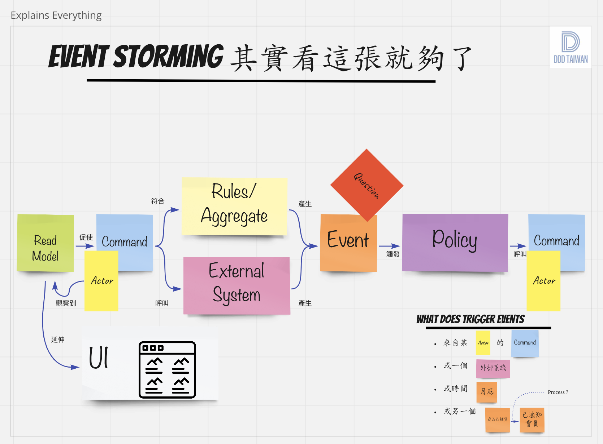
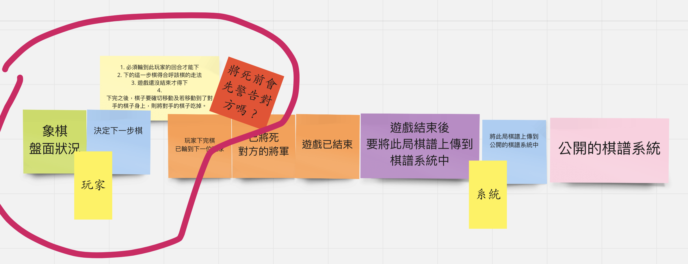
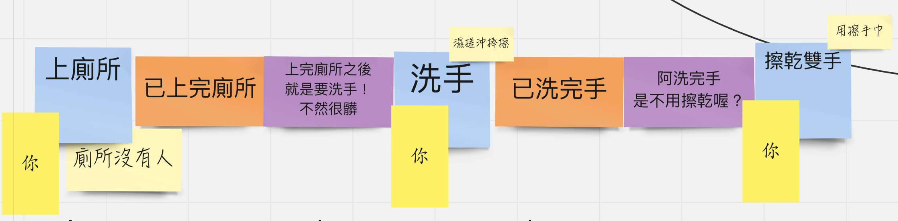

<!--  style  -->

###### <!-- ref -->

 <!-- ref -->

## Event Storming

- process modeling

  - 模型：

  

    
  

  - 範例：

    - EX1.
    

      
    

    - EX2.

    

      
    

  - 節點：

    - `actor`

      - 用戶

    - `command`

      - command follow rule -> trigger event

    - `rule`

      - 前置條件、後製條件、不變條件
      - 都遵守 `rule` 後，才會開始觸發 `event`
      - 所以可以對 `rule` 做「單元測試」

    - `event`

      - 收斂步驟：

        - 去除重複概念
        - enforce the timeline 順序
        - speak out loud

      - 必為過去式
      - 先發散後收斂
      - 收斂時，在同步共識
      - 同步共識很重要，才能知道有沒有人認知不同
      - 共識不同的話，請提出疑惑、想法
      - 再由 expert 決定哪個才對

    - `policy`

      - 處理 `event` 的方式
      - 常有 whenever 語句
      - 有「要求」的感覺
      - Whenever `event` then `command`

    - `command`

  - 描述：

    - `actor` `read model` 後，做出符合 `rule` 的 `command`，而觸發了 `event`。
    - 每個 `event` 有其對照的 `policy` 來做處理。`policy` 制定：每當 `event` 觸發，則執行 `command`
