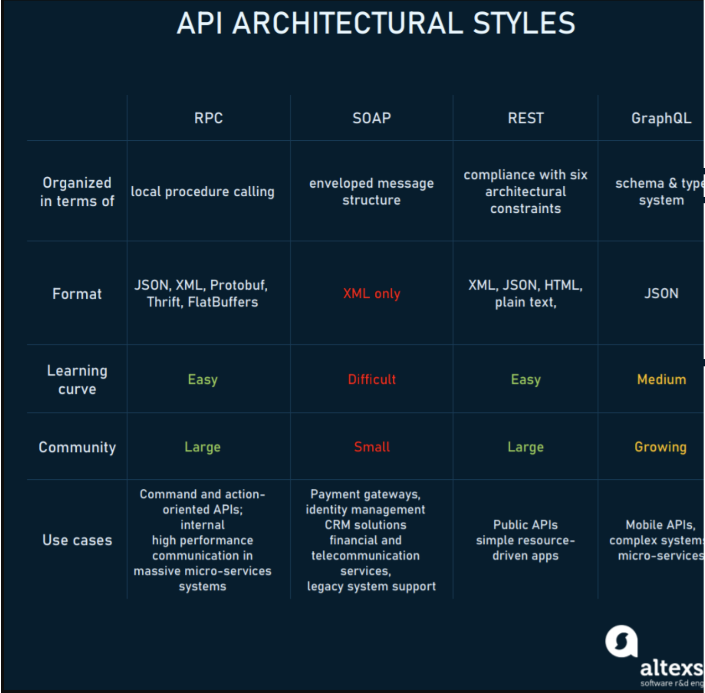
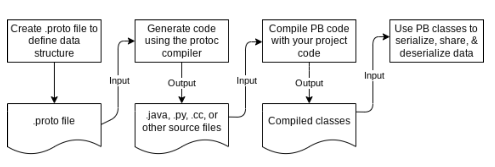

<!--  style  -->

# [水球軟體學院](https://discord.com/channels/937992003415838761/954189696521605130)

## 【Speedrun】挑戰在 45 分鐘內準備一場體面的 Java gRPC 的技術演講

> REF: [miro](https://miro.com/app/board/uXjVPC1IrQE=/)

- ？人力配置猜測：

  - 共 6 人
  - 1 人主持人負責收斂、指揮
  - 1 人負責狂找資訊貼到發散區
  - 1 人思考情緒主軸
  - 剩下負責整理發散區+機動
  - 每個人在整理時，想到哪個點不明朗需要補充的就跟大家提一下
  - 投影片分工做

- RPC

  - [API 架構風格對比：SOAP vs REST vs GraphQL vs RPC](https://www.twblogs.net/a/60e3f32ad7b86f43f4c53344)
  - [API 設計：瞭解 gRPC、OpenAPI 和 REST 以及使用它們的時機](https://ikala.cloud/grpc-openapi-and-rest-1/)

  

    
  

  

    
  

