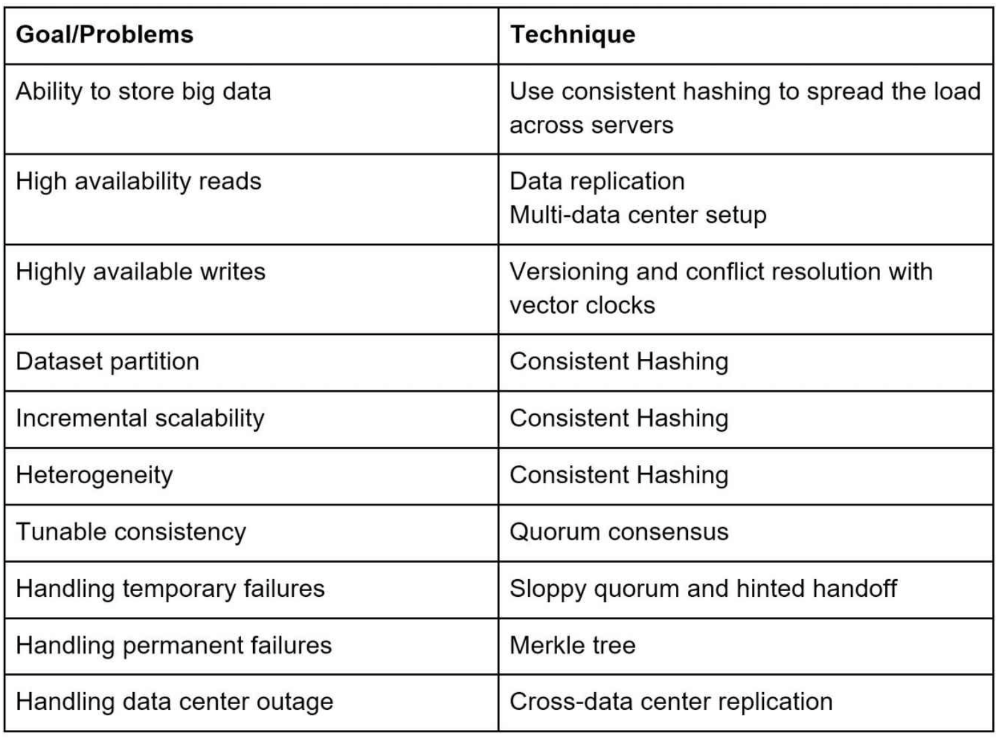
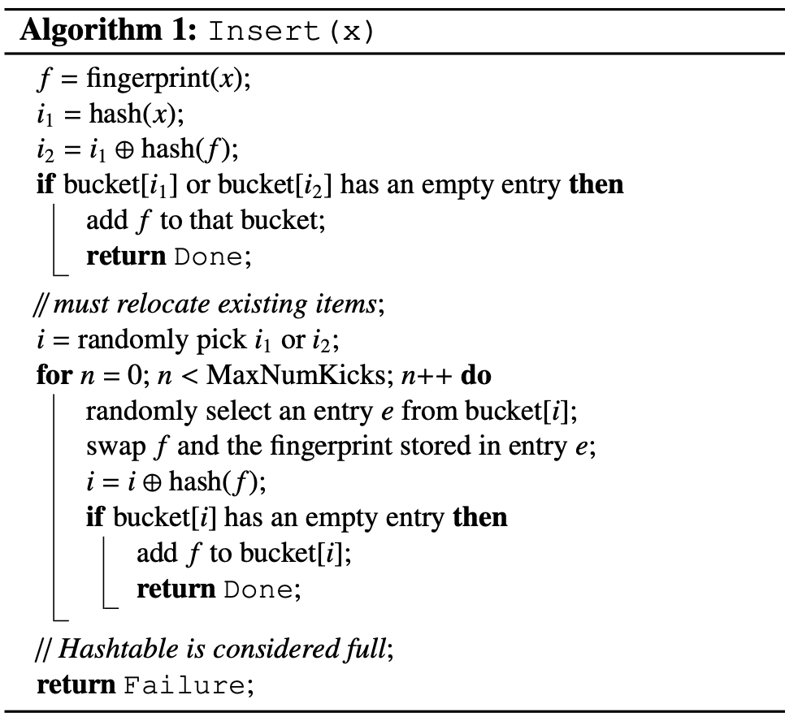
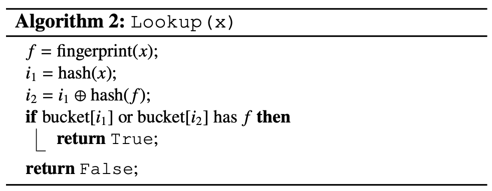
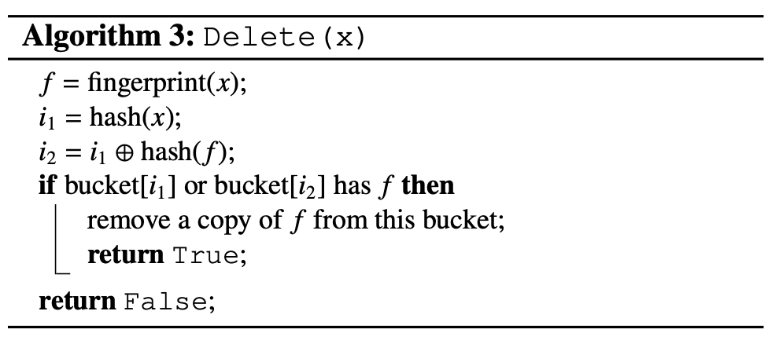
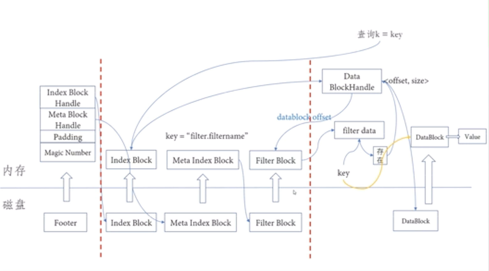

##### <!-- 收起 -->

<!----------- ref start ----------->

[深入淺出 Bloom Filter 原理]: https://zhuanlan.zhihu.com/p/140545941
[Github: SSTable]: https://github.com/WangTingZheng/SSTable
[Bigtable: A Distributed Storage System for Structured Data]: https://storage.googleapis.com/pub-tools-public-publication-data/pdf/68a74a85e1662fe02ff3967497f31fda7f32225c.pdf
[筆記：SSTable 結構研討會]: https://juejin.cn/post/7118029530534527006
[SSTable 結構研討會]: https://www.bilibili.com/video/BV18S4y187eH
[論文解讀： Cuckoo Filter]: https://blog.51cto.com/u_15060511/4014458
[比 Bloom filter 與 Cuckoo filter 再更進一步的 Xor filter]: https://blog.gslin.org/archives/2019/12/21/9348/%E6%AF%94-bloom-filter-%E8%88%87-cuckoo-filter-%E5%86%8D%E6%9B%B4%E9%80%B2%E4%B8%80%E6%AD%A5%E7%9A%84-xor-filter/
[Consule 系列:Consul 實現詳解]: https://www.jianshu.com/p/19e7e4420d79
[區塊鏈前哨戰 2：組織內共識機制首選 — Raft]: https://medium.com/bsos-taiwan/raft-the-best-choice-of-consensus-within-the-organization-1cc555d54d6d
[分佈式系統理論：Quorum 算法]: https://blog.csdn.net/NYfor2017/article/details/105558211
[DynamoDB 的 Consistency 與 Availability 的爭奪 - Quorum System]: https://ithelp.ithome.com.tw/articles/10218182
[論文：Cuckoo Filter: Practically Better Than Bloom]: https://www.cs.cmu.edu/~dga/papers/cuckoo-conext2014.pdf
[Cuckoo Hash]: https://zhuanlan.zhihu.com/p/543702080
[驚群問題 (Thundering herd problem)]: https://zhuanlan.zhihu.com/p/385410196
[CUCKOO FILTER - 酷殼]: https://coolshell.cn/articles/17225.html
[CAP 理論十二年回顧："規則"變了]: http://myblog-maurice.blogspot.com/2012/08/cap_21.html
[採用抖動的逾時、重試和退避]: https://aws.amazon.com/tw/builders-library/timeouts-retries-and-backoff-with-jitter/
[Exponential Backoff And Jitter]: https://aws.amazon.com/tw/blogs/architecture/exponential-backoff-and-jitter/
[How to caculate k, m, n and p for bloom filter]: https://hur.st/bloomfilter/
[論文解讀：深入討論 Bloom Filter]: https://www.evanlin.com/BloomFilter/
[SSTable (Sorted String Table)]: https://www.igvita.com/2012/02/06/sstable-and-log-structured-storage-leveldb/
[Architecture of Cassandra]: https://cassandra.apache.org/doc/latest/cassandra/architecture/
[Anti-Entropy 步驟]: http://www.360doc.com/content/12/0614/14/7936054_218097481.shtml
[Database Papers: Anti-Entropy without Merkle Trees, Deletes without Tombstones]: https://medium.com/@ifesdjeen/database-papers-anti-entropy-without-merkle-trees-deletes-without-tombstones-a47d2b1608f3
[向量時鐘]: https://zhuanlan.zhihu.com/p/56886156
[xid]: https://github.com/rs/xid
[UUID Versions Explained]: https://www.uuidtools.com/uuid-versions-explained
[UUID 原理與實作分析]: https://yuanchieh.page/posts/2020/2020-12-01-uuid-%E5%8E%9F%E7%90%86%E8%88%87%E5%AF%A6%E4%BD%9C%E5%88%86%E6%9E%90-%E8%A9%B2%E5%A6%82%E4%BD%95%E6%8C%91%E9%81%B8%E9%81%A9%E5%90%88%E7%9A%84-uuid-%E7%89%88%E6%9C%AC/
[Actor 模型和 CSP 模型的區別]: https://www.jdon.com/concurrent/actor-csp.html
[系統吞吐量（TPS）、使用者併發量、效能測試概念和公式]: https://www.796t.com/content/1542356104.html
[服務器性能測試中有哪些常用的性能指標？]: https://www.zhihu.com/question/50176445/answer/119975361
[常見性能測試指標]: https://zhuanlan.zhihu.com/p/38253500
[Moleculer]: https://moleculer.services/docs/0.14/balancing.html#Sharding-strategy
[Consistent Hashing]: https://tom-e-white.com/2007/11/consistent-hashing.html
[系統架構之 BASE 原則和 CAP 原則]: https://zhuanlan.zhihu.com/p/386699641
[P2P 網絡核心技術：Gossip 協議]: https://zhuanlan.zhihu.com/p/41228196
[Hash Slot vs. Consistent Hashing in Redis]: https://severalnines.com/blog/hash-slot-vs-consistent-hashing-redis/
[架構解密：從分散式到微服務（第 2 版）]: https://www.books.com.tw/products/CN11716142?loc=P_0001_085
[Deep dive into Redis Clustering]: https://medium.com/@pubuduboteju95/deep-dive-into-redis-clustering-1d71484578a9

<!------------ ref end ------------>

## <mark># TODO: 未整理</mark>

- Consistent hashing

  - 一般的 Consistent Hashing

    - 使用 Hash space and hash ring 解決 rehashing problem。使用 virtual nodes 達到平均分散
    - [Consistent Hashing]

  - Redis 使用另一種稱作 `Hash Slots`

    - 每個分區都是預先給定固定的 Hash 範圍，以 Master-Slave 方式來處理故障轉移
    - [Hash Slot vs. Consistent Hashing in Redis]
    - [Deep dive into Redis Clustering]

- BASE 原則

  - [系統架構之 BASE 原則和 CAP 原則]

---

- Throughput (吞吐量)

  - `TPS = U_concurrent / ( T_response + T_think )`
  - 將壓測數據，用以計算出目前系統承受的 TPS (觀察其他數據在增加 U_concurrent 時的變化)
  - 某一環節達到極限值，T_response 會指數上升，TPS 則會下降

  - REF

    - [系統吞吐量（TPS）、使用者併發量、效能測試概念和公式]
    - [服務器性能測試中有哪些常用的性能指標？]
    - [常見性能測試指標]

  - 工具

    - Loadrunner

---

- 並行運算

  - 前提條件

    - 多個邏輯 CPU
    - 任務需可拆分執行

  - process VS thread

    - process：「資源分配」的最小單位，並且是「操作單位」
    - thread：最小的「操作單位」，且包含在 process 中

  - thread 的共享資源，產生 Race condition

    - lock
    - 不共享模型：Do not communicate by sharing memory; instead, share memory by communicating.

      - Actor：EX. Java/Scala 的 Akka 庫
      - CSP （Communicating Sequential Processes）：EX. Golang
      - REF: [Actor 模型和 CSP 模型的區別]

---

- DISTRIBUTED UNIQUE ID

  - UUID v1 ~ v5

    - [UUID 原理與實作分析]、[UUID Versions Explained]

    - UUID 中，v1 ~ v5 都保留一段記錄 version

    - version 介紹

      - 1. v4: 完全隨機
      - 2. v1: timestamp + clock sequence + NodeID(IEEE 802 MAC address)

        - 當 timestamp 比之前的小，則產生新的 clock sequence 來使用，以減少碰撞

      - 3. v5: 加入 Namespace (16 byte) + Name 再以 SHA1 做 Hash
      - 4. v3: 加入 Namespace (16 byte) + Name 再以 MD5 做 Hash
      - 5. v2: 不被採用 (X) (只有 64 個 / 7 mins)

  - MongoDB ID (12 byte)

    - 4 btye，Unix 紀元以來的秒數
    - 3 btye 的 Machine ID
    - 2 btye 的 Process ID
    - 3 btye 的計數器，以隨機值開始

  - [xid] (12 byte)

    - 將 MongoID 再以 base32hex 編碼 (24 char -> 20 char)
    - 生成一個 ID 的效率很快

  - snowflake

    - Sequence number 的部分，會以 AtomicInteger 或 lock 來防止 process 競爭

    - UTC 時間

    - NTP (Network Time Protocol)

      - 解決「分散式時間同步」問題
      - Marzullo's algorithm
      - 階層的上限為 15

  - 用在 PK 的話，用 int 會比 string 好

    - 空間小
    - 有排序

---

- Trade-Off

  - Read vs Write vs Memory usage
  - Consistency vs Availability

- Distributed key-value store

  

  - 分散式系統 CAP theorem

    - [CAP 理論十二年回顧："規則"變了]
    - Consistency, Availability, Partition Tolerance
    - 目前為止，CAP 只能取其二
    - 目前為止，網路故障無法完全避免，所以一定無法捨棄 P，因此需在 C & A 上斟酌

  - Data partition

    - 需求：

      - 公平分配
      - Partition Tolerance 能有最小移動量

    - 解法：

      - Consistent hashing

        - 優點：

          - 解決 公平分配＋最小移動量
          - Automatic scaling
          - Heterogeneity
            - 指可以針對不同 node 有不同處理。例如某個 node 所使用的硬體較差，那麼就分配較少 virtual nodes 給他

        - 缺點：

          - 無法依照特殊條件分區

  - Data replication

    - 備份 --> 依照順時針存進 N 個 virtual nodes
    - 重複同個 node --> 順延直到 N 個不重複的 nodes
    - 單點故障 --> 放在不同 data centers 並以 high-speed networks 連結

  - Consistency

    - 名詞簡介

      - W/R 代表 coordinator 至少需要收到幾個 W/R 的回應後，認定已完成 W/R
      - 幾種分類：`R = 1 & W = N`, `W = 1 & R = N`, `W + R > N`, `W + R <= N`

    - Quorum consensus

      - 源自鴿巢理論
      - 可確保 W/R 的一致性
      - 定義
        - `W + R > N`：確保有同一筆資料，不會同時被 W/R
        - `W + W > N`：確保同一筆資料，不會同時進行兩種 W
      - REF: [分佈式系統理論：Quorum 算法]

    - Consistency models：Strong、Weak、Eventual

    - Eventual consistency (最終一致性)

      - 本次推薦
      - 需協調衝突

  - Inconsistency resolution: Versioning

    - Vector clocks ([向量時鐘])

      - 可以用來判斷事件順序，或是判斷出有衝突 (需另外想辦法解衝突)
      - 基於 Lamport Logical Clock

        - 初始：timestamp = 0
        - 做事：timestamp++
        - 發送：timestamp++ 並把 timestamp 附上
        - 接收：timestamp = Max(本地 timestamp, 接收 timestamp)+1

      - 分開記錄每個 server 的 Lamport Logical Clock

      - 缺點：

        - client 必須解衝突，使 client 變更複雜
        - `[server: version] pairs` 會增長太快，很佔空間
          - 解法是將舊的移除，很少因此造成問題

  - Handling failures

    - 偵測方法

      - Gossip protocol

        - [P2P 網絡核心技術：Gossip 協議]

        - 兩種方式傳遞：

          - Anti-Entropy（反熵）：定時傳遞所有資訊
          - Rumor-Mongering（謠言傳播）：只在更新時，傳遞新的資訊，並確認所有已更新

        - 問題：
          - 一般多久傳一次心跳？
          - 一般多久沒更新算失聯？

    - 處理方法

      - Gossip protocol 偵測到失聯，則開一台 new server 頂上 (只能寫入)
      - 若是使用 strict quorum，可能就會暫停等 new server 備好

      - 暫時失聯

        - Sloppy Quorum + Hinted handoff

        - Sloppy Quorum

          - 忽略 Offline servers，
          - 因為用 Strict Quorum 可能在有 Offline servers 時，導致無法達到限制
          - 因此 DynamoDB 文件中提到，只保證單一 Region 的 Replica 有 Strong Consistency。跨 Region 則是 Eventual Consistency

        - Hinted handoff

          - 當 down server 恢復後，再將 new server 新增的資料，同步回 down server

        - REF: [DynamoDB 的 Consistency 與 Availability 的爭奪 - Quorum System]

      - 永久失聯

        - Anti-Entropy protocol

          - 命名解釋：降低混亂程度 (增加一致性)
          - 兩種狀態：Suspective、Infective
          - 使用 Merkle tree 快速偵測 inconsistency

            - 樹的葉子是 buckets
            - 實作可能一棵：十億 keys / 百萬 buckets

          - REF: [Anti-Entropy 步驟]
          - 延伸：[Database Papers: Anti-Entropy without Merkle Trees, Deletes without Tombstones]

  - System architecture diagram

  - Write/Read path

    - 先寫 commit log -> 存在 memory -> 集中達閾值再一次存 disk

    - Filter

      - 可以快速判斷是否「不存在」某個 SSTable，快速找到所在的 SSTable
      - 可能會偽陽

      - Bloom filter

        - 原理：

          - 一般

            - 存入時將一個 key 做數個 hash，每個 hash 對應到的地方改為 1
            - 讀取時一樣做 hash，若其中一個是 0，則不存在
            - 不能從 Bloom filter 中刪除，所以用越久，失誤率越高

          - 改良版

            - 改用計數器
            - 但是存 int，所用空間大很多，進而影響到查詢速度

        - REF:
          - [論文解讀：深入討論 Bloom Filter]
          - [How to caculate k, m, n and p for bloom filter]
          - [深入淺出 Bloom Filter 原理]

      - Cuckoo filter

        - 使用的 Cuckoo Hash 改進 Bloom Filter
        - Cuckoo Hash

          - 用 N 個 hash function
          - 將 key (or fingerprint) 存入對應的 hash bucket 中
          - 當插入新的 key 時，對應的 hash bucket 已滿，則踢出舊的
          - 舊的再用下一個 hash function，存入對應的 hash bucket 中
          - 不斷重複，直到某個規定的上限次數，則認定進入循環，表示空間不夠
          - 空間不夠，則進行重新分配空間後 rehash

        - [論文：Cuckoo Filter: Practically Better Than Bloom]

          - 基本 Cuckoo Filter 的 Cuckoo Hash 配置

            - 使用 2 個有關聯的 hash function

              - `h1(x) = hash(x)`
              - `h2(x) = h1(x) OXR hash(x's fingerprint)`

            - 每個 bucket 有 4 entry
            - 每個 entry 為 8 bit
            - 每個 entry 放 1 個 fingerprint
            - 同一個 bucket 的 entry 放在連續的位址，增加 cache 使用效能

          - `h2(x) = h1(x) OXR hash(x's fingerprint)`

            - 透過公式，可使 i1 & i2 互轉
            - i2 = i1 OXR hash(f)
            - i1 = i2 OXR hash(f)

          - 只存 fingerprint 無法 rehash，所以遇到循環後，就會有「偽陽」問題

          - 假設剛好有兩筆資料的 fingerprint 相同，且在同一個 bucket，則該 bucket 中會存在兩個一樣的 fingerprint。所以在刪除後不會有「偽陰」問題。

          
          
          

        - REF
          - [Cuckoo Hash]
          - [CUCKOO FILTER - 酷殼]
          - [論文解讀： Cuckoo Filter]

      - Xor filter

        - REF: [比 Bloom filter 與 Cuckoo filter 再更進一步的 Xor filter]

    - SSTable

      - 是 LSM Tree (Log Structured Merge Tree) 的一種實作

      - Block 通常為 64KB

      - Compaction

        - 資料的新增＆更新都是在新的 Block 中，重複的 key 以最新一筆 value 為主
        - 許多 DB 會以 tombstone 標記軟刪除，再透過 GC 處理
        - 進行 Compaction 後，單一 key 保留最新的 value，形成新的 BLock
        - Minor Compaction
        - Major Compaction
        - <mark>TODO:</mark> 關鍵字：Bentley and McIlroy's 算法、快速壓縮算法

      - 優化

        - 在 memory 記錄 block 的 `key_` & `value_` 分別為上一次在該 block 查詢的結果，可優化

          - 可以縮小範圍，直接從 `key_` 開始查詢
          - 可以從 `key_` 獲取 完整 key，可以減少往前查到 完整 key 的動作

      - <mark>TODO: 問題</mark>

        - 關鍵字：tablet、Compaction、MemTable、tombstone、LSM Tree
        - 若不另外添加 secondary index，該如何依照 value 查詢？
        - filter_offset 為什麼不跟 filter data 一對一對應？多出來的 offset 有什麼用？
        - 當單一 key 有重複 value 時，查詢如何知道去哪裡抓最新 value？

          - 是否在生成新的 Block 時，就會同時 Compaction 該 SSTable？

      - REF

        - [SSTable (Sorted String Table)]
        - [筆記：SSTable 結構研討會] ([SSTable 結構研討會] | [Github: SSTable])
        - [Bigtable: A Distributed Storage System for Structured Data]

      

    - REF: [Architecture of Cassandra] 提供建議的 Write/Read path 設計

- 問題：

  - Consistent hashing 無法依照特殊條件分區？這個需求就要換其他方法嗎？

  - Fig. 6-5：

    - Consistent hashing 要怎麼讓 replica 可以按照不同資料區且高速網路連接？
    - 如果插入的資料的 hash 在 N 台 replica 的 hash 中間，怎麼辦？

  - 處理一致性是否有 `W + R <= N` 方案？通常會用多少比例的 W/R？

  - Vector clocks 呈現衝突後，怎麼解衝突？呈現給 client 後，就是業務問題了？

  - Gossip protocol

    - 一般多久傳一次心跳？
    - 一般多久沒更新算失聯？
    - 主動傳給所有機器，還是每台機器自己去輪詢？

  - 永久失聯使用 Anti-Entropy protocol 時，有沒有可能再拆成好幾棵 Merkle tree 傳遞？還是只會直接全部包成一棵？

---

- Backoff

  - 可用 指數成長
  - 可加入 Jitter，抖動使大家不會同時 retry (類似 [驚群問題 (Thundering herd problem)])
  - REF: [Exponential Backoff And Jitter] | [採用抖動的逾時、重試和退避]

---

- RAFT

  - [區塊鏈前哨戰 2：組織內共識機制首選 — Raft]
  - [Consule 系列:Consul 實現詳解]

---

- 可能的優化方式：

  - 如果把轉址跟分析分開，同時送兩個 request，並使用 301 呢？
  - 使用 base 61，0 用來補位

- 還需要 id 的好處？如果使用 key value storage (short:long pair) 存呢？
- 是否會對來源網址，先做惡意網址檢測？

---

-

## # 書籍

- [架構解密：從分散式到微服務（第 2 版）]

## # 工具

- [Moleculer]

  - 基於 Node.js 的分散式框架

## # 分享

- zeabur

  - github app
  - zbpack

- webhook: 用來通知 github 發生哪些事

[雷Ｎ分享：零知識證明](https://www.youtube.com/playlist?list=PLj80z0cJm8QErn3akRcqvxUsyXWC81OGq)

[水球 0811](https://excalidraw.com/#room=4a031337467436804f2a,nJBaEwkyn3K4zqCPZBoWpw)
