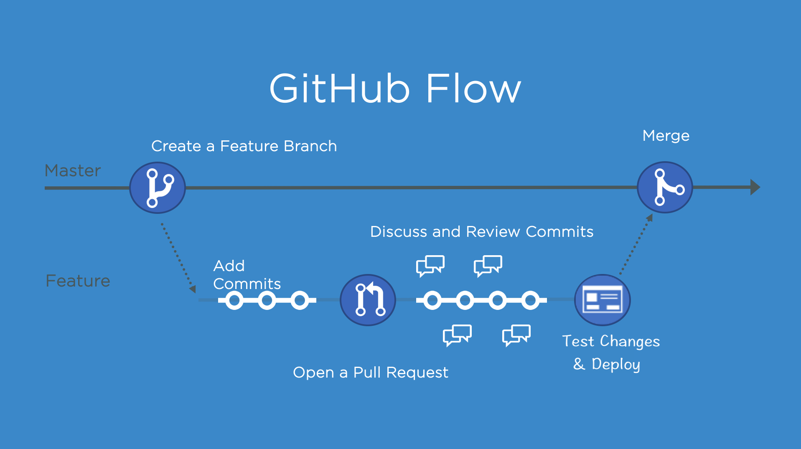

##### <!-- 收起 -->

<!----------- ref start ----------->

[Anyone can Access Deleted and Private Repository Data on GitHub]: https://trufflesecurity.com/blog/anyone-can-access-deleted-and-private-repo-data-github
[GitHub Doc: GitHub Flow]: https://docs.github.com/en/get-started/using-github/github-flow
[GitLab Flow - Jadson José dos Santos, PhD]: https://www.linkedin.com/pulse/gitlab-flow-jadson-santos/
[Contributing Guide when you fork a repository]: https://medium.com/@rishabhmittal200/contributing-guide-when-you-fork-a-repository-3b97657b01fb
[Choosing the Right Git Branching Strategy: A Comparative Analysis]: https://medium.com/@sreekanth.thummala/choosing-the-right-git-branching-strategy-a-comparative-analysis-f5e635443423
[What Are the Best Git Branching Strategies]: https://www.abtasty.com/blog/git-branching-strategies/
[TBD - TW]: https://tw.trunkbaseddevelopment.com/
[Day 24 ~ 26 - 191010 學習筆記 Git]: https://ithelp.ithome.com.tw/articles/10226733
[30 天精通 Git 版本控管]: https://ithelp.ithome.com.tw/users/20004901/ironman/525
[使用 git commit template 管理 git log]: https://medium.com/dev-chill/%E4%BD%BF%E7%94%A8-git-commit-template-%E7%AE%A1%E7%90%86-git-log-cb70f95fda2f
[.gitmessage.txt]: ../src/code/.gitmessage.txt
[Git Commit Message 這樣寫會更好]: https://wadehuanglearning.blogspot.com/2019/05/commit-commit-commit-why-what-commit.html
[git-commit-message]: https://github.com/joelparkerhenderson/git-commit-message
[gc 條件設定]: https://www.git-scm.com/docs/git-gc#_configuration
[Understanding git gc --auto]: https://stackoverflow.com/questions/16337498/understanding-git-gc-auto

<!------------ ref end ------------>

# Git

> DATE: 5, 6, 7 (2024)
> REF: [30 天精通 Git 版本控管]

## # 簡介

- 參考以前的筆記 [Day 24 ~ 26 - 191010 學習筆記 Git]

## # 基礎

<!-- 指令(研究學習用) -->

- <details close>
  <summary>指令(研究學習用)</summary>

  <!-- git cat-file -p [HASH ID] -->

  - <details close>
    <summary><code>git cat-file -p [HASH ID]</code></summary>

    - 查看該物件內容
    - hashID 會是該物件檔案名稱
    - 也可直接查看 ref，EX. `git cat-file -p HEAD`

    </details>

  <!-- git cat-file -t [HASH ID] -->

  - <details close>
    <summary><code>git cat-file -t [HASH ID]</code></summary>

    - 查看該物件種類 (commit、tree、blob、tag)

    </details>

  <!-- git show-ref [NAME] -->

  - <details close>
    <summary><code>git show-ref [NAME]</code></summary>

    - 查看符合 ref 所代表的所有 HASH ID 跟 path
    - 只會查詢 refs/ 中的內容

    - EX.

      ```sh
      $ git show-ref master

      c3bd002d4dcf4169512e94d66bf1db5d648cea17 refs/heads/master
      8gj3h4y38cc334d7060blm3c13jw748a3b75d9a8 refs/remotes/origin/master

      $ git show-ref HEAD

      8gj3h4y38cc334d7060blm3c13jw748a3b75d9a8 refs/remotes/origin/HEAD
      ```

    </details>

  <!-- git rev-parse [NAME] -->

  - <details close>
    <summary><code>git rev-parse [NAME]</code></summary>

    - 查看該名稱所代表的 HASH ID
    - EX.

      ```sh
      $ git rev-parse master
      c3bd002d4dcf4169512e94d66bf1db5d648cea17
      ```

    </details>

  </details>

<!-- 資料結構 -->

- <details close>
  <summary>資料結構</summary>

  <!-- 物件種類 -->

  - <details close>
    <summary>物件種類：commit、tree、blob、tag</summary>

    <!-- commit：包含 tree、parent、author、committer -->

    - <details close>
      <summary>commit：包含 tree、parent、author、committer</summary>

      <!-- stash -->

      - <details close>
        <summary>stash</summary>

        - stash，在 refs/ 中只會紀錄一個最新的 stash，也就是 stash@{0}。其他則是記錄在 logs/refs/stash

        </details>

      <!-- 什麼情況會造成合併三條以上分支？ -->

      - <details close>
        <summary>合併三個以上分支，就會有三個以上的 parent。那什麼情況會造成合併三條以上分支？</summary>

        - EX. `git stash save -u`

          - 這個做法會分別將 worktree、index(untracked)、tracked 存成一個 stash
          - 則此時的表現方式是該 stash 會有三個 parent，分別為那三個狀態

          ```sh
          $ git cat-file -p stash
          tree 6381dc317d7a3c2cac9fd0bf383b6b5427b633bb     # worktree  (unmodified/modified)
          parent d5301505f50aa16b1f12cc195897185334c4f044   # HEAD
          parent f07891d84a88efc08f3f305dc59d255a4c1bb68a   # index     (staged)
          parent 18f5efab303dbb7920ae15e71e5b3e62b0381d16   # untracked

          WIP on master: d530150 TEST git 1
          ```

        </details>

      </details>

    <!-- tree：包含 tree、blob -->

    - <details close>
      <summary>tree：包含 tree、blob</summary>

      - 像是一個資料夾

      </details>

    <!-- blob：包含完整一份 file 內容 -->

    - <details close>
      <summary>blob：包含完整一份 file 內容</summary>

      - 只對內容做 hash，檔案名稱等資訊都寫在 tree
      - EX. fileA.txt 與 fileB.txt，內容一模一樣，則只生成一個 blob

        ```txt
        # fileA.txt
        此部分為內文...ABC

        # fileB.txt
        此部分為內文...ABC
        ```

      </details>

    <!-- tag：包含 object、type、tag、tagger -->

    - <details close>
      <summary>tag：包含 object、type、tag、tagger</summary>

      -

      </details>

    </details>

  <!-- 儲存流程 -->

  - <details close>
    <summary>儲存流程</summary>

    - commit 後，會先將所有單一 file 以 zlib 演算法壓縮成 blob，包含整個完整的內容，而不只儲存檔案間的差異，存於 `.git/objects/` 中

    - 後面 commit 改回與更之前完全相同內容，也只有一份 blob ，因為 hash 一樣

    - 達到條件後，才利用 delta compression 演算法，封裝後存於 `.git/objects/pack/` 中，每個 pack 包含兩個檔案 `.idx` & `.pack`

    - 自動封裝以 `gc.auto` 設定條件啟動封裝鬆散的 object，以 `gc.autoPackLimit` 設定條件啟動合併 pack

      - [gc 條件設定]
      - [Understanding git gc --auto]

    - 用 `git gc` 手動執行，封裝鬆散的 object，並合併 pack

    </details>

  </details>

<!-- config -->

- <details close>
  <summary>config</summary>

  <!-- 順序：local -> global -> system -->

  - <details close>
    <summary>順序：local -> global -> system</summary>

    - 如果在多個地方設置同一屬性，則 `--local` 會蓋過 `--global` 再蓋過 `--system`

    ```sh
    ## EX.

    $ git config --list --system
    user.name=ocup1

    $ git config --list --global
    user.name=ocup2

    $ git config --list --local
    user.name=ocup3

    $ git config --list
    user.name=ocup1
    user.name=ocup2
    user.name=ocup3

    ## --> 則最後是 ocup3 生效
    ```

    </details>

  <!-- 常用設定 -->

  - <details close>
    <summary>常用設定</summary>

    - `git config --global core.editor "code --wait"` - 設定使用 vscode 編輯
    - `git config --local commit.template "./.gitmessage.txt"` - 設定 commit 模板
    - `git config --global commit.cleanup "strip"` - 設定 commit 依照哪個模式 cleanup。用 SourceTree 可能需要設定

    </details>

  <!-- 日期格式 -->

  - <details close>
    <summary>日期格式</summary>

    - [Git Date 原始碼](https://git.kernel.org/pub/scm/git/git.git/tree/date.c)
    - EX. "never"、"7 days"、"1 day"

    </details>

  <!-- 其他細節 -->

  - <details close>
    <summary>其他細節</summary>

    - windows 在設定 `--system` 時，可能需要切換成管理員權限，才能設定正確
    - macOS 中 `credential.helper=osxkeychain` 將你的憑證（如 GitHub、GitLab 的帳密）安全地存儲在 macOS 的鑰匙串中，以便進行身份驗證時自動填充，無需每次都手動輸入

    </details>

  </details>

<!-- commit template -->

- <details close>
  <summary>commit template</summary>

  - 模板：[.gitmessage.txt]

  - REF

    - [使用 git commit template 管理 git log]
    - [Git Commit Message 這樣寫會更好]
    - [git-commit-message]

  - 流程改善：

    - 設定使用 vscode 開啟編輯
    - 提供 template，註解中描述規則
    - 使用 hook 自動檢查 commit 是否符合規則

  </details>

<!-- reflog -->

- <details close>
  <summary>reflog</summary>

  <!-- 紀錄"使用指令"改變狀態的動作 -->

  - <details close>
    <summary>紀錄"使用指令"改變狀態的動作</summary>

    - 像是 `ORIG_HEAD` 那樣，只是它記錄了所有的動作
    - 包含：commit、checkout、pull、push、merge、reset、clone、branch、rebase、stash..etc

    </details>

  <!-- HEAD@{0} -->

  - <details close>
    <summary><code>HEAD@{0}</code></summary>

    - 可用 `git reflog` 查詢
    - 以 `HEAD@{0}` 來標記最新紀錄，也就是 `HEAD`
    - 依此類推 `HEAD@{1}`, `HEAD@{2}`..，數字越大越舊

    </details>

  <!-- 紀錄在 `.git\logs\` -->

  - <details close>
    <summary>紀錄在 <code>.git\logs\</code></summary>

    - 還分多種 EX. HEAD、master、remote..等等

    </details>

  <!-- 預設保留時間 -->

  - <details close>
    <summary>預設保留時間</summary>

    - 紀錄保留 90 天
    - 紀錄中已經不存在任何分支上的 commit 物件保留 30 天
    - `gc.reflogExpire "90 days"` & `gc.reflogExpireUnreachable "30 days"`

    </details>

  <!-- 常用指令 -->

  - <details close>
    <summary>常用指令</summary>

    - `git reflog`
    - `git reflog delete "ref@{specifier}"` (EX. HEAD@{0})
    - `git reflog expire --expire=now --all`
    - `git config --global gc.reflogExpire "never"`
    - `git config --global gc.reflogExpireUnreachable "never"`

    </details>

  </details>

<!-- tag -->

- <details close>
  <summary>tag</summary>

  - lightweight tag

    - `git tag`
    - 只會有一個 tag ref 指向 commit
    - 若加上 `-m` 也會自動升級為 annotated tag

  - annotated tag

    - `git tag -a`
    - 會新增一個 tag object，並有一個 tag ref 指向 tag
    - 才有 metadata 描述
    - 可以用 GnuPG 金鑰簽章
    - 通常使用此種

  </details>

<!-- 整理 commit 的方法 -->

- <details close>
  <summary>整理已存在 commit</summary>

  <!-- revert -->

  - <details close>
    <summary>revert</summary>

    - 定義：恢復所選 commit 所做的動作，合併到 HEAD

      - EX. 若 commit1 是「將 1 改成 2」，則 git revert commit1 是「將 2 改成 1」，合併到 HEAD

    - 時機：想恢復某次 commit 所做動作

    - 指令：

      - `git revert [commitID]`

      - `git revert -n`

        - revert 後不直接 commit
        - 執行完後，並不是用 `git commit` 建立版本，正確方式：
          - `git revert --continue`: 代替 git commit
          - `git revert --abort`: 放棄 revert

    </details>

  <!-- cherry-pick -->

  - <details close>
    <summary>cherry-pick</summary>

    - 定義：重新套用所選 commit 所做的動作，合併到 HEAD

    - 時機：只想將分支中，其中幾個 commit 合併到 master

    - 指令：

      - `git cherry-pick -x`: 在 commit 訊息中加入是從哪裡撿來

        - EX. `cherry picked from commit dc070...`
        - 需注意可能 pick 後，該分支刪除後也找不到反而困惑，所以不一定較好

      - `git cherry-pick -e`: 先編輯 commit 訊息
      - `git cherry-pick -n`: 不直接 commit

    </details>

  <!-- rebase -->

  - <details close>
    <summary>rebase</summary>

    - 定義：重新修改目前分支的「基礎版本」，把另外一個分支當成目前分支的 Base

      - EX. 處在 branch1，執行 `git rebase master`

        - 原本 branch1 有 branch1 自己的 Base，將 branch1 的 base 改成 master 的 Base

        ```
        原本：
          branch1:
            commit4
            commit3
            commit1

          master:
            commit2
            commit1

        使用後：
          branch1:
            commit4
            commit3
            commit2
            commit1

          master:
            commit2
            commit1
        ```

    - 時機：

    - 指令：

      - `git rebase [commitID] -i`

        - 可指定 Base 的起點 (rewinding head)，從 commitID 開始
        - `-i` 可選擇要對途中每個 commit 做哪些動作 (pick, reword, edit, squash, fixup, ...)
        - 有修改過的 commit(以及後續的 commit) 都會建立新的 commit 物件
        - EX. 舉例以 edit 來移除該 commit 中的某個異動的流程

          ```sh
          # 1. 列出該 commit 所有的異動檔案名稱
          $ git diff --name-only HEAD~

          # 2. 將想要移出掉的異動檔案移出 index
          $ git reset HEAD~ [path]

          # 3. 將現況存進此 commit
          $ git commit --amend

          # 4. 繼續 rebase 後續動作
          $ git rebase --continue
          ```

    </details>

  </details>

<!-- remote 觀念 -->

- <details close>
  <summary>remote</summary>

  <!-- 分支 -->

  - <details close>
    <summary>分支</summary>

    - 分支 & 追蹤分支

      - 分支：refs/heads/ 中的那些
      - 追蹤分支：refs/remotes/ 中的那些

        - EX. 本地的 refs/remotes/origin/master，用來追蹤 origin remote 的 master

    - 在本地有：本地分支 & 本地追蹤分支
    - 在遠端有：遠端分支 & 遠端追蹤分支

    </details>

  <!-- refspec -->

  - <details close>
    <summary>refspec</summary>

    - 定義：用來設定直接以 `git push` & `git fetch`，未指定 remote repo & branch 時，要執行的 repo、branch 組合 (設定檔：`.git/config`)

    - 範例：

      ```sh
      [branch "master"]
        remote = git@your/url.git
        merge = refs/heads/master
      [remote "origin"]
        url = git@your/url.git
        fetch = +refs/heads/master:refs/remotes/origin/master
        fetch = +refs/heads/test:refs/remotes/origin/test
      ```

    - 其他：

      - 沒設定也可以 `git push/fetch [remote_name] [branch_name]` 方式來 push/fetch

    - 指令：

      - 新增與移除 fetch 設定

        ```sh
        git config --add remote.origin.fetch +refs/heads/test:refs/remotes/origin/test
        git config --unset remote.origin.fetch +refs/heads/test:refs/remotes/origin/test
        ```

      - 用 `git push --set-upstream` 來設定 push 對應的 remote:branch

        - EX. 執行 `git push --set-upstream origin branchA`，會在 `.git\config` 增加以下內容：

        - 意義：當想將本地 branchA 推送到遠端，預設的遠端為 origin，推送的時候要將變更合併到遠端的 refs/heads/branchA

        ```sh
        [branch "branchA"]
        remote = origin
        merge = refs/heads/branchA
        ```

    </details>

  <!-- 初始化相關 -->

  - <details close>
    <summary>初始化相關</summary>

    - `git checkout [branch_name]` 可直接建立本地分支

      - EX. clone 之後，只有 remotes/origin/hotfix/test，可以 `git checkout hotfix/test` 建立本地 hotfix/test

      ```sh
      $ git branch -a
      * master
        remotes/origin/HEAD -> origin/master
        remotes/origin/hotfix/test
        remotes/origin/master

      $ git checkout hotfix/test
        Branch hotfix/test set up to track remote branch hotfix/test from origin.
        Switched to a new branch 'hotfix/test'

      $ git branch -a
      * hotfix/test
        master
        remotes/origin/HEAD -> origin/master
        remotes/origin/hotfix/test
        remotes/origin/master
      ```

    </details>

  </details>

## # Workflow

<!-- Git Flow -->

- <details close>
  <summary>Git Flow</summary>

  

  </details>

<!-- GitHub Flow -->

- <details close>
  <summary>GitHub Flow</summary>

  - REF: [GitHub Doc: GitHub Flow]
  - NOTE:

    - 簡單流程快速迭代
    - PR、code review 流程
    - 相較於 TBD，GitHub Flow 的 Feature 分支存活較久

  

  </details>

<!-- GitLab Flow -->

- <details close>
  <summary>GitLab Flow</summary>

  - REF: [GitLab Flow - Jadson José dos Santos, PhD]
  - NOTE:

    - 多開幾層做環境測試，一層層往上推
    - 有 bug 被拉回來後，再一層層往上推，不像 Git Flow 有 hotfix

  

  </details>

<!-- Forking Workflow -->

- <details close>
  <summary>Forking Workflow</summary>

  - REF: [Contributing Guide when you fork a repository]

  

  </details>

<!-- Trunk-Based Development (TBD) -->

- <details close>
  <summary>Trunk-Based Development (TBD)</summary>

  - REF: [TBD - TW]

  - NOTE:

    - 盡可能讓所有變動都能在一個 main 上看見

  

  </details>

<!-- Workflow 選擇與比較 -->

- <details close>
  <summary>VS. Workflow 選擇與比較</summary>

  <!-- REF: -->

  - REF:

    - [Choosing the Right Git Branching Strategy: A Comparative Analysis]
    - [What Are the Best Git Branching Strategies]

  <!-- GPT -->

  - <details close>
    <summary>GPT</summary>

    - 中心思想

      

    - 使用情境

      

    - 主要細節差異

      

    </details>

  </details>

## # 問題

<!-- 關鍵字 -->

- <details close>
  <summary>關鍵字</summary>

  - Social Coding
  -

  </details>

## # 補充

<!-- 注意事項 -->

- 注意事項：

  <!-- 關於指令選用 -->

  - <details close>
    <summary>關於指令選用</summary>

    - 我認為推薦使用的指令隨更新不斷在進化，所以有些相同公用的指令，可以參考 shell 上給的回饋來使用

      > EX. `git status` 後會顯示 (use "`git restore --staged <file>...`" to unstage)，以前的版本曾經是 (use "`git reset HEAD <file>...`" to unstage)，但可以盡量使用最新版本建議方式來完成

    - 或是在觀念非常清楚後，學習使用 GUI，指令改 GUI 也會跟著更新，而使用 GUI 需要的是清楚的概念

    </details>

<!-- 小技巧 -->

- 小技巧：

  <!-- git shortlog -->

  - <details close>
    <summary><code>git shortlog</code></summary>

    - 查看每個 user 的統計
    - `git shortlog -sne`

    </details>

  <!-- git clean -->

  - <details close>
    <summary>git clean</summary>

    - 清除未被 git 追蹤的檔案
    - `git clean -n`
    - `git clean -x`：會刪除包含被 .gitignore 的檔案

    </details>

  <!-- git blame -->

  - <details close>
    <summary><code>git blame</code></summary>

    - 查看特定檔案的 commit 紀錄

    </details>

<!-- 小工具 -->

- 小工具：

  <!--  -->

  - <details close>
    <summary></summary>

    -

    </details>

<!-- 補充學習 -->

- 補充學習：

  <!-- 指令文件：git help & git -h -->

  - <details close>
    <summary>指令文件：<code>git help</code> & <code>git -h</code></summary>

    - 指令簡易版文件參考 `git -h` (EX. `git commit -h`)
    - 指令更多細節可參考 `git help` (EX. `git help commit`)

    </details>

---

## # 踩雷實錄

<!--  -->

- <details close>
  <summary></summary>

  -

  </details>

---

## # 延伸討論

<!-- Github Fork 共用 <code>.git/objects</code>？ -->

- <details close>
  <summary>Github Fork 共用 <code>.git/objects</code>？</summary>

  - REF: [Anyone can Access Deleted and Private Repository Data on GitHub]
  - 可以在任何 Fork 以 commit hash 讀取所有 Fork 的 commit，不論是否設為 private 或是 delete
  - 因為可以用 Short SHA-1 value 讀取，因此可以暴力破解 commit hash

  </details>

---

## # TODO:

- 擬定一些 SOP
