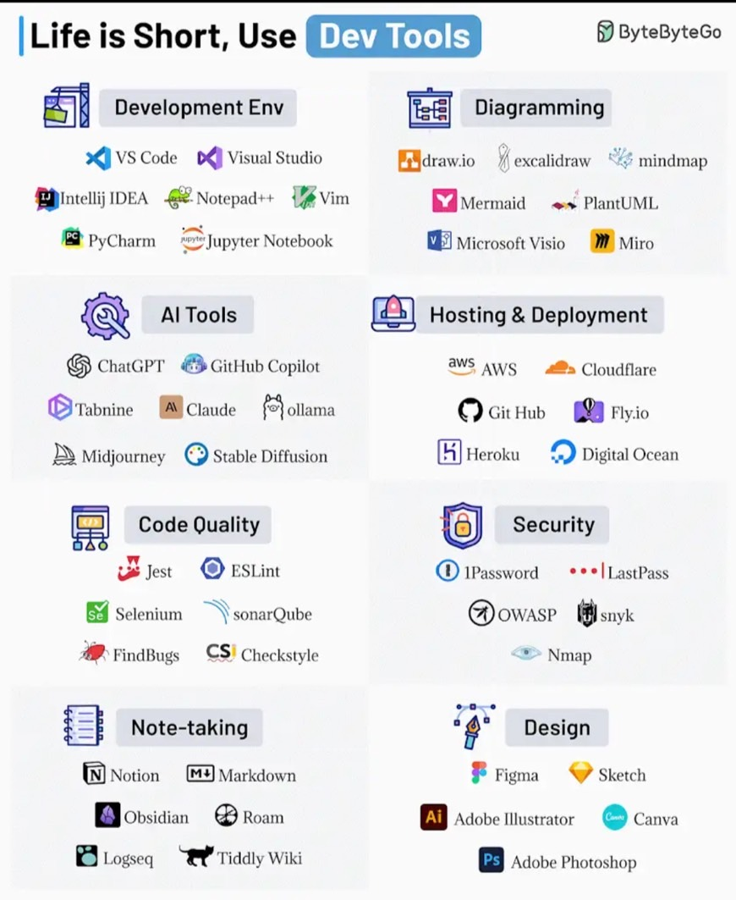

<!--  style  -->

###### <!-- ref -->

[cURL]: https://www.ruanyifeng.com/blog/2011/09/curl.html
[CVE]: https://cve.mitre.org/
[Snyk]: https://snyk.io/
[Trivy]: https://github.com/aquasecurity/trivy#how-to-pronounce-the-name-trivy
[Mixmax (多推)]: https://www.mixmax.com/demo
[Mixmax-介紹]: https://youtu.be/NXEDqzqnmRo

 <!-- ref -->

# 工具簡介

<!-- Linux -->

- 

  
Linux

  - [cURL]

    - `Command Line URL viewer`
    - 一種命令行工具，作用是發出網路請求，然後得到和提取數據，顯示在"標準輸出"（stdout）上面。

  

<!-- 程式碼安全性檢查 -->

- 

  
程式碼安全性檢查

  - 根據 [CVE] 檢查

    - 需留意 CVE 的更新

    - [Snyk]

      - 線上，需開放 github 讀取權限給他

    - [Trivy]

      - 安裝在電腦，用指令針對不同檔案進行檢查，也可檢查 image

  

<!-- 管理與溝通 -->

- 

  
管理與溝通

  - [Mixmax (多推)]

    - 約時間系統
    - [Mixmax-介紹]
    - EX. 可以把時間表嵌入在 email，對方點時間就會確定

  

# 工具列表

