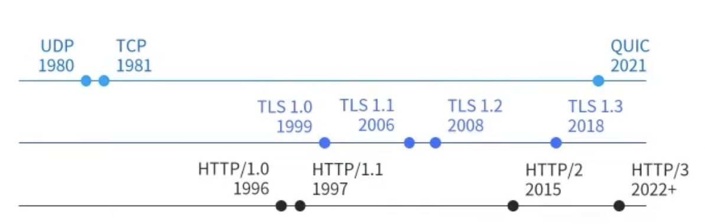
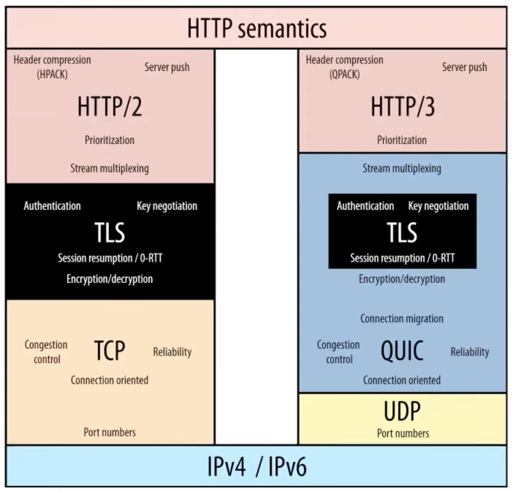

<!--  style  -->

###### <!-- ref -->

[rfc 2068]: https://www.rfc-editor.org/rfc/rfc2068
[rfc 2616]: https://www.rfc-editor.org/rfc/rfc2616
[rfc 7230]: https://www.rfc-editor.org/rfc/rfc7230
[rfc 7231]: https://www.rfc-editor.org/rfc/rfc7231
[rfc 7232]: https://www.rfc-editor.org/rfc/rfc7232
[rfc 7233]: https://www.rfc-editor.org/rfc/rfc7233
[rfc 7234]: https://www.rfc-editor.org/rfc/rfc7234
[rfc 7235]: https://www.rfc-editor.org/rfc/rfc7235
[rfc 7540]: https://www.rfc-editor.org/rfc/rfc7540
[rfc 8999]: https://datatracker.ietf.org/doc/html/rfc8999
[rfc 9000]: https://datatracker.ietf.org/doc/html/rfc9000
[rfc 9001]: https://datatracker.ietf.org/doc/html/rfc9001
[rfc 9002]: https://datatracker.ietf.org/doc/html/rfc9002
[http/1.1 (保)]: https://youtu.be/Taq5TV1K4XU
[http/2 (保)]: https://youtu.be/O62ufq-orfY
[http/3 (保)]: https://youtu.be/DnPrNiA-ZLE
[telnet]: https://formulae.brew.sh/formula/telnet
[chunk vs range]: https://developer.mozilla.org/en-US/docs/Web/HTTP/Range_Requests#comparison_to_Chunked_transfer-encoding
[head-of-line blocking]: https://www.gushiciku.cn/pl/gkVS/zh-tw
[graphql & http/2]: https://xuorig.medium.com/is-graphql-still-relevant-in-an-http2-world-64964f207b8
[nghttp2]: https://github.com/nghttp2/nghttp2
[quic]: https://zh.wikipedia.org/wiki/QUIC#%E4%BB%8B%E7%BB%8D
[capture network log]: brave://net-export/
[netlog-viewer]: https://netlog-viewer.appspot.com/

 <!-- ref -->

# HTTP

> DATE: 3.2022
> REF: [HTTP/1.1 (保)] | [HTTP/2 (保)] | [HTTP/3 (保)]

<!-- 工具 -->

- 

     
工具：

  - 使用 [TELNET] 連線
  - Postman
  - Fiddler free web debudding proxy
  - h2load in [nghttp2]: 分析 HTTP/2 的改變
  - 

    
Capture Network Log

    > [Capture Network Log] & [Netlog-Viewer]

    - 可紀錄瀏覽器的行為，輸出成 JSON
      (a. Start Logging to Disk --› Stop Logging)
    - 再到 [Netlog-Viewer] 上傳紀錄檔解析

    

    

<!-- 推薦書籍 -->

- 

  
推薦書籍：

  - HTTP/1.1
    - 高效能網站開發指南
    - 高效能網站建置指南
    - Web 效能優化日誌 Volume 2

  

### 版本歷史

  

<!-- HTTP/0.9 -->

- 

   
HTTP/0.9

  - 1991 **(已廢)**
  - 主要內容：
    - Client/Server & Request/Response
    - 跑在 TCP/IP 上的 ASCII 協定
    - Request 以單行 ASCII 命令為主
    - Response 以 ASCII 命令為主，回傳 HTML
    - 每次每次執行完自動斷掉連線

  

<!-- HTTP/1.0 -->

- 

   
HTTP/1

  - 一次發布：
    - 1996.5 (RFC 1945)
  - 1991~1995 瀏覽器出世
  - 主要內容：
    - 以 ASCII 為主，可多行命令 (含 Header)
      - Header 出現
      - 1.method 2.Header
    - 回傳以 ASCII 為主
      - 1.狀態列 2.Header 3.內文不限定 HTML
    - 每次結束斷開 TCP/IP 連線

  

<!-- HTTP/1.1 -->

- 

   
HTTP/1.1

  - 

      
三次發布：
      
      ([RFC 2068] & [RFC 2616])
      
      

    - 1997.1 ([RFC 2068])
      - 解決一些效率問題
    - 1999.6 ([RFC 2616])
    - 2014.6

    

  - 主要內容：

    <!-- persistent connection -->

    - 

      
persistent connection (維持 TCP/IP 連線)

      - Server 可以將 HTTP 的 TCP/IP 持續連線功能關閉。
      - HTTP 可自己設定 TCP/IP timeout，超過時間則自動斷開。(一般 30 s)
      - TCP/IP 數量上限 65535 個

      

    <!-- Chunked transfer encoding -->

    - 

      
Chunked transfer encoding (切塊編碼傳輸)

      - 陳立其: Chunked transfer encoding 在 HTTP/2 已經不支援。([chunk vs range])

      

    <!-- Byte Range Request -->

    - 

      
Byte Range Request

      

    <!-- Cache Control -->

    - 

      
Cache Control

      

    <!-- Request Pipelining -->

    - 

      
Request Pipelining (一次送出多個 Request)

      - [Head-of-Line Blocking]: 因為沒有標記 --> 只能照順序 Response --> 所以大部分瀏覽器預設關閉

      

  - 六大規格：

    <!-- pMessage Syntax and Routing -->

    - 

      
Message Syntax and Routing

      > [RFC 7230]

      - Routing --> 經過多層 proxy

      

    <!-- Semantics and Content -->

    - 

      
<b>Semantics and Content</b>

      > [RFC 7231]

      - 常見狀態碼：
        - 200：OK
        - 201：已新增成功
        - 202：已接受請求（例如可以多久後再來取得處理好的資料）
        - 3xx：轉向
        - 4xx：Client 錯誤 (400, 403, 404)
        - 5xx：Server 錯誤 (500, 502, 503)

      

    <!-- Conditional Requests -->

    - 

      
Conditional Requests

      > [RFC 7232]

      

    <!-- Range Request -->

    - 

      
Range Request

      > [RFC 7233]

      

    <!-- Caching -->

    - 

      
Caching

      > [RFC 7234]

      - 步驟：

        - Request 會加入 Header:
          `If-Modified-Since: Sat, 29 Oct 2020 19:30:39 GMT`
        - Server 檢查這時間的檔案是否最新
        - 是則回傳 304: Not Modified，直接使用 Cache

      

    <!-- Authentication -->

    - 

      
Authentication

      > [RFC 7235]

      

  

<!-- HTTP/2 -->

- 

   
HTTP/2

  - 一次發布：

    2015.5 ([RFC 7540])

  - 

      
主要內容：

    - 沿用 HTTP/1.1 ，只針對 Message Syntax 強化
      - 傳輸文件內容更有效率
        - 非同步多工
        - binery 傳輸

    

  - 目標：

    - 高度向下相容 HTTP/1.1
    <!-- 解決 Head-of-Line Blocking -->

    - 

      
解決 Head-of-Line Blocking

      - HTTP/2 解決了 HTTP 層，但 TCP 層依然會 Head-of-Line Blocking

      

    - 最小化 Protocol Overhead
    - 縮短網頁載入時間以及傳輸延遲
    - 減少網站 Connection 數量

  - 特色：
    - Binery Protocol
    - Multiplexing (多工，不按順序傳送多個 frame)
    - Header Compression (HPACK)
    - Server Push

  

<!-- HTTP/3 -->

- 

   
HTTP/3 (草案)

  - Transport layer: TCP --> [QUIC]

  <!-- Big Map -->

  

    
  

  - [QUIC] ([RFC 9000]) (2021.5)

    <!-- 簡介 -->

    - 

      
簡介：

      > ([RFC 9001] & [RFC 9002] & [RFC 8999])

      - ~~Quick UDP Internet Connections?~~
      - A UDP-Based Multiplexed and Secure Transport
      - 暱稱：TCP/2
      - 旨在提供幾乎等同於 TCP 連接的可靠性，但延遲大大減少
      - 使用 UDP 當底，再將 TCP 優點特性實作

      

    <!-- 特性 -->

    - 特性：

      - Connection (Session)
      - Reliability
      - Flow Control
      - Congestion Control
      - Stream

    <!-- 其他細節 -->

    - 

      
其他細節：

      - 漫遊時不需重新 connection (移動位置時)
        - 比較：
          TCP：來源與目的 之 IP/Port
          QUIC：Connection ID
      - 初始連線：1-RTT & 再次連線：0-RTT
      - 內建 TLS 1.3（強迫使用）
      - 第一次握手就直接把東西一次傳遞 (不像 TCP 握三次)
      - 把第一個互傳的封包塞到最滿，讓對方得知我的封包大小極限
        (因為 TCP 有機制了解極限，UDP 不行)

      

    <!-- 現況連線行為解析 -->

    - 

      
現況連線行為解析：

      - 第一次連線：
        - 瀏覽器會先用 HTTP/1 或 2
        - Server response 加上 Header
          `Alt-Svc: h3=":443"; ma=86400`
          (443 port 使用 h3, ma: Max-Age)
      - 若瀏覽器也支援，則開始可以嘗試用 HTTP/3
      - 第二次連線：
        - 依然用 HTTP/1 或 2，但另外嘗試發送 HTTP/3
      - 第三次連線：
        - 開始用 HTTP/3

      

  <!-- 注意事項 -->
  

    
  

  

### 其他

- 補充：

  - 

    
每次都要告知 Host，因為一個 ip 可能會有好多個 Host

    - HTTP 有支援 virtual hosting (虛擬主機)：一台 web server 可以提供多個網站 hosting 在 80 port

    

  - 

      
HEAD method：獲取該 Request 將得到的 response 的資訊

    - 例如可先用 HEAD 得知回傳檔案大小，再決定是否用 Range Request

      

        
      

    

  <!-- HTTP 特性 -->

  - 

    
HTTP 特性：

    - stateless(無狀態)
    - distributed(分散式架構)
      - 分散式架構，建議不用 Session，會出問題
    - collaborative(協作的架構)
    - hypertext

    

  - 

    
主流瀏覽器只開放 Https 使用 HTTP/2 的功能

    - Server 間的傳輸可自己用明文的 HTTP/2，增加效能
    - h2: Https + HTTP/2
    - h2c: Http + HTTP/2

    

- 延伸探討：

  - [GraphQl & HTTP/2]

- 

待釐清

  - [每次都要告知 host 的原因](https://youtu.be/Taq5TV1K4XU?t=1228)
  - HTTP/3 現況：第二次嘗試連線後，會回傳什麼告知可以正常使用？

  

