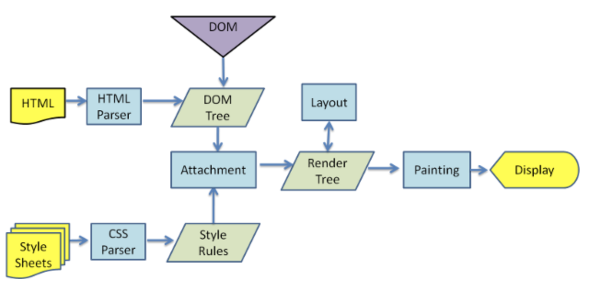

<style> 
.imgBox{
  display: flex; 
  flex-direction: column; 
  margin: 5%; 
  justify-content: center;
  border: 2px solid black;
}
</style>

<!--  style  -->

###### <!-- ref -->

[mdn]: https://developer.mozilla.org/en-US/docs/Learn/Getting_started_with_the_web
[web demystified]: https://www.youtube.com/playlist?list=PLo3w8EB99pqLEopnunz-dOOBJ8t-Wgt2g
[populating the page: how browsers work]: https://developer.mozilla.org/en-US/docs/Web/Performance/How_browsers_work#parsing
[https-ssl-ca]: https://progressbar.tw/posts/96
[web server & nginx]: https://medium.com/starbugs/web-server-nginx-1-cf5188459108
[syn, syn-ack, ack]: https://kknews.cc/zh-tw/code/kn23bzr.html
[tcp slow start]: https://developer.mozilla.org/en-US/docs/Glossary/TCP_slow_start
[rfc 5681]: https://datatracker.ietf.org/doc/html/rfc5681
[congestion control]: https://zh.wikipedia.org/wiki/TCP%E6%8B%A5%E5%A1%9E%E6%8E%A7%E5%88%B6
[async/defer script]: https://ithelp.ithome.com.tw/articles/10216858
[web accessibility]: https://blog.techbridge.cc/2019/10/13/web-accessibility-intro/
[first meaningful paint]: https://developer.mozilla.org/en-US/docs/Glossary/first_meaningful_paint
[time to interactive]: https://developer.mozilla.org/en-US/docs/Glossary/Time_to_interactive
[how does the internet work?]: https://developer.mozilla.org/en-US/docs/Learn/Common_questions/How_does_the_Internet_work
[域名]: https://www.nss.com.tw/top-level-domain/
[域名 .io]: https://www.fastcomet.com/blog/why-io-powerful-domain-choice
[time-to-live (ttl)]: https://www.quora.com/If-local-DNS-servers-keep-the-domain-name-IP-address-pairs-in-their-caches-for-a-week-do-they-encounter-any-problem-to-response-DNS-queries
[清除 dns cache]: https://www.wpbeginner.com/wp-tutorials/how-to-clear-your-dns-cache-mac-windows-chrome/
[web 預算]: https://developer.mozilla.org/en-US/docs/Learn/Common_questions/How_much_does_it_cost
[domain name]: https://developer.mozilla.org/en-US/docs/Learn/Common_questions/What_is_a_domain_name
[http]: ./HTTP.md
[application server vs web server]: https://vicxu.medium.com/web-server-and-application-server-5a6d9c940eff
[reflow & repaint]: https://ithelp.ithome.com.tw/articles/10217427
[environment]: https://developer.mozilla.org/en-US/docs/Learn/Common_questions/set_up_a_local_testing_server
[dom]: ../../JavaScript/note/DOM.md
[browsers]: http://taligarsiel.com/Projects/howbrowserswork1.htm

 <!-- ref -->

# Web

> DATE: 3.2022
> REF: [MDN] | [Web Demystified] | [Web 預算] | [Environment]

<!-- 工具 -->

- <details close>
     <summary>工具：</summary>

  </details>

---

### [Populating the page: how browsers work]

> DATE: 3.2022
> REF: [Reflow & Repaint] | [browsers]

<div class="imgBox" >
  
</div>

- 影響網頁效能主因

  - 等待資源加載時間 (Network latency)
  - 大多情況瀏覽器為單線程 (single threaded)

<!-- Navigation -->

- <details close>
     <summary>Navigation</summary>

  <div class="imgBox" >
      
  </div>

  - DNS Lookup

    - If you've never visited this site, a DNS lookup must happen.
    - Server 與其他圖片等資源的抉擇：
      - 資源放 Server？
      - 放 S3，client 直接去 S3 要圖片？
      - 放 S3，client 透過 Server proxy 要圖片？

  - TCP Handshake

    - [SYN, SYN-ACK, ACK]
      - Linux 檢測是否被 Syn 攻擊：`netstat -n -p TCP | grep SYN_RECV`

  - TLS Negotiation

    > 補充 [HTTPS-SSL-CA]

    - HTTPS 時提出 SSL
    - SSL：介於 application layer 與 transport layer 之間
    - SSL 改良為 TLS
    - HTTP/3 強迫使用 **TLS 1.3**

  </details>

<!-- Response -->

- <details close>
     <summary>Response</summary>

  <!-- TCP Slow Start -->

  - <details close>
     <summary>TCP Slow Start / 14kb rule (RFC 5681)</summary>

    > REF: [TCP Slow Start]

    (TTFB = responseStart - navigationStart)

    - The first chunk of content is usually **14kb** of data.
    - 名詞：

      - Time to First Byte (TTFB)：從 Navigation 開始到收到第一個 response 所花的時間

      - congestion window (cwnd)：由傳送方估算
        每次傳輸後，cwnd 以指數成長，直到**逾時**或**超過 ssthresh**。

        1. 達 ssthresh：改為線性成長
        2. 逾時：

        - ssthresh = cwnd/2
        - cwnd = MSS
        - 回到 Slow Start

      - Window Size：由接收方提供

      - slow start threshold (ssthresh)

      - acknowledgment (ACK)：TCP 接收後的回應

      - round-trip time (RTT)：發訊到收訊的時間

      - Maximum segment size (MSS)：預設 536，或是在 TCP SYN 時定義

    </details>

  <!-- Congestion control -->

  - <details close>
     <summary>Congestion control</summary>

    > REF: [Congestion control]

    </details>

  </details>

<!-- Parsing -->

- <details close>
  <summary>Parsing</summary>

  <!-- (1) Building the DOM tree -->

  - <details close>
     <summary>(1) Building the DOM tree</summary>

    > REF: [DOM]

    - 遇到 css file 時，可繼續解析 DOM，但遇到的 script (特別是 '非 async or defer')，可能會阻塞 (因為可能會用 js 選取 css)

    </details>

  <!-- Preload scanner -->

  - <details close>
     <summary>Preload scanner</summary>

    - 針對 image, css, [async/defer script] 等，在後台先行下載
      - async: 下載完立刻暫停其他動作執行 script

    </details>

  <!-- (2) Building the CSSOM -->

  - <details close>
     <summary>(2) Building the CSSOM</summary>

    - Building the CSSOM is very, very fast
    - The total time to create the CSSOM is generally less than the time it takes for one DNS lookup.

    </details>

  <!-- Other Processes -->

  - <details close>
     <summary>Other Processes</summary>

    - JavaScript Compilation

      - 解析成 Abstract Syntax Tree

    - Building the Accessibility Tree

      - [web accessibility]：身心障礙者使用

    </details>

  </details>

<!-- Render -->

- <details close>
     <summary>Render</summary>

  <!-- Style -->

  - <details close>
     <summary>Style</summary>

    - (3) DOM + CSSOM --> Render Tree

    </details>

  <!-- Layout -->

  - <details close>
     <summary>Layout</summary>

    - (4) 從 root 開始計算成幾何圖形
    - layout：第一次計算完成的圖形
    - reflows：layout 形成後，又再次做調整（回流）

    </details>

  <!-- Paint -->

  - <details close>
     <summary>Paint</summary>

    - (5) 將每個 Node 繪製到畫面
    - [First Meaningful Paint] (FMP)
    - 為確保 repainting 甚至可以比初始繪製還快
      --> 需要分層 --> 需要合成 (Compositing)

    </details>

  <!-- Compositing -->

  - <details close>
     <summary>Compositing</summary>

    - re-composite：只將需要的部分重繪

    </details>

  <!-- Interactivity -->

  - <details close>
     <summary>Interactivity</summary>

    - [Time to Interactive] (TTI)

    </details>

  - step:
    1. Building the DOM tree
    2. Building the CSSOM
    3. DOM + CSSOM --> Render Tree
    4. Run Layout on the Render Tree to compute the geometry of each Node
    5. Paint the individual nodes to the screen

  <div class="imgBox" >
    
  </div>

  </details>

---

### [How does the Internet work?]

<!-- SEE MORE -->

- <details close>
  <summary>SEE MORE</summary>

  > DATE: 3.2022
  > REF:

  <!-- 定義 -->

  - <details close>
      <summary>定義</summary>

    The **Internet** is an infrastructure, whereas the **Web** is a service built on top of the infrastructure.

    </details>

  - `Computer - Router - Modem - ISP (Modem-Router)`

    - Router (路由器)：用來分流網路 (本身也是 computer)
    - Modem (數據機)：用來轉換網路編碼＆電話編碼，始可透過電話線傳輸網路
    - ISP (Internet Service Provider)：如中華電信

  <div class="imgBox" >
    
  </div>

  <!-- Domain Name -->

  - <details close>
      <summary>Domain Name</summary>

    > REF: [域名] | [域名 .io] | [Domain Name]

    - TLD (Top-Level Domain)：頂級域名

      - max length is 63 characters

      - gTLD (Generic Top Level Domain)

        - 通用
        - `.com`, `.edu`, `.gov`, `.net`, `.org`, `.mil`, etc.

      - ccTLD (Country Code Top Level Domain)

        - 國家、地區

      - New gTLD (New Generic Top Level Domain)

        - 2012, ICANN 新增
        - `.book`, `.shoes`, `.food`, `.bike`, `.taipei`, etc.

      - 早期一般通用的，現已無限制：

        - `.com`：早期商業使用
        - `.org`：早期非營利使用
        - `.net`：早期網路服務供應商使用

      - 特殊的：(美國專用，其他國家通常將其設定為 **SLD**)

        - 商業使用：`.biz`
        - 政府使用：`.gov`
        - 教育使用：`.edu`

      - 指定地區：`.us`, `.fr`, `.se`, etc.

      - Google treats `.io` as a gTLD, and thus despite it actually being a ccTLD, you won’t be victim to geo-targeting.

    - Label (or component)

      - 1 ~ 63 字
      - A-Z | 0-9 | -

      - SLD (Second-level domain)：二級域名

        - TLD 的下一個
        - `EX. www.inf.ed.ac.uk --> SLD: ac, TLD: uk`

      - Subdomain (子域)

        - 你所擁有的 domain 都可以再自己建立 Subdomain

        ```
        EX.
        mail.example.com & calendar.example.com
        --> example.com 的 Subdomain

        example.com
        --> .com 的 Subdomain
        ```

    - DNS (Domain Name System)：查網域的地方 (如中華電信)

    - Registrar (註冊商)：

      - 負責記錄管理 domain 的公司
      - 並非購買 domain，而是租用，到期需再續約
      - 特例如 `.fire` 為 Amazon 專屬

    - 註冊步驟：

      - 查詢可用的 domain name：

        - 註冊商會提供 **whois** 服務來查詢
        - 也可用指令查詢 `$ whois xxx.com`

      - 註冊 domain name：

        - 註冊商官網仔細填表，確認資料無誤，送出付款無悔
        - 註冊成功後收到通知
        - 數小時內會通知所有 DNS

      - DNS 刷新

        - Authoritative name servers(top-level DNS servers)
          (權威 DNS)
        - 一般的 DNS 在有需要時，才會去向 Authoritative name servers 發送請求取的更新 (因此當新的 domain 啟用後，等到當地 DNS 有需求才會去向上詢問更新) (一般有快取，由下向上詢問)

    - DNS Cache

      - [清除 DNS Cache]：

        - windows: `ipconfig /flushdns`
        - mac: `sudo killall -HUP mDNSResponder`
        - chrome: `chrome://net-internals/#dns`

      - [time-to-live (ttl)]：

        - DNS Server 快取時間 (多久向上發請求更新)
        - 通常會設置在 1hr - 1day

    </details>

  </details>

<div class="imgBox" >
  
</div>

---

### 名詞：

<!-- Web Server -->

- <details close>
     <summary>Web Server：</summary>

  - [HTTP]
  - 託管必要條件：

    - 保持開機
    - 保持連接網路
    - 保持固定 IP (需申請)

  - Dedicated Web Server

    - 由第三方維護提供
    - EX. 架設在 AWS 的 Web Server

  - [Application Server vs Web Server]
    - Web Server：負責用 HTTP 溝通
    - Application Server：負責整理資料給 Web Server

  </details>

---

### 其他：

<!-- Web Server & Nginx -->

- <details close>
  <summary>Web Server & Nginx</summary>

  > REF: [Web Server & Nginx]

  - 其實透過 Node.js Golang 這類程式語言起的 Web Server 通常會被稱為 **Application Server**，而 Nginx、Apache 一般來說才會被稱為 **Web Server**。
  - 正向 proxy 隐藏真實 Client，反向 proxy 隱藏真實 Server

  </details>

<!-- 網路相關工具 -->

- 網路相關工具

  <!-- Nebula -->

  - <details close>
    <summary>Nebula</summary>

    - 教學：
      - [Mini VPN For All!](https://www.rootisgod.com/2019/Mini-VPN-For-All/)
      - [用 Nebula 創建私人局域網](https://tommy.net.cn/2021/09/12/build-your-own-sd-lan-by-nebula/)

    </details>

<!-- 概觀 -->

- 概觀

  - [The new wave of Javascript web frameworks](https://frontendmastery.com/posts/the-new-wave-of-javascript-web-frameworks/)

  -
